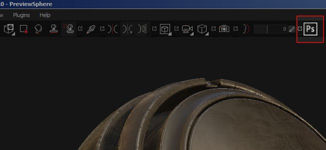

# Versione 2.3

**Substance Painter 2.3** migliora l&#39;API di scripting per rilasciare il suo primo plug-in ufficiale: un&#39;esportazione Photoshop con lo stack completo dei livelli disponibile.

Data di pubblicazione: *15 settembre 2016*

## Funzioni principali

### Nuovo plug-in di esportazione Photoshop

Con questa versione, ci siamo concentrati sull&#39;aggiunta di nuove possibilità nell&#39;API di scripting per implementare **un modulo di esportazione avanzato per Photoshop**. Per accedere a questa nuova esportazione, fai semplicemente clic sull&#39;icona di Photoshop disponibile nella barra degli strumenti principale (se il plug-in è attivato, che viene visualizzata per impostazione predefinita). Il plug-in consente di esportare l’intera pila di livelli disponibile in un set di texture e creare una struttura simile all’interno di un file PSD. Per poter generare il file PSD, questa funzionalità **richiede l&#39;installazione di Photoshop** nel computer.

Alcune opzioni sono disponibili tramite il pulsante di configurazione del menu del plug-in:

## Esercitazione

L’ultima esercitazione spiega il processo di esportazione con il nuovo plug-in:

## Note sulla versione

### 2.3.1

(Pubblicato il 7 ottobre 2016)

**Aggiunto:**

* [Plugin][Photoshop] Consente di specificare quale materiale/stack/canale esportare
* [Scripting] I nomi delle funzioni presentano alcune incongruenze

**Risolto:**

* L’Alpha [Esporta] può essere eliminato nei predefiniti di esportazione personalizzati
* [Export] L’Alpha ottiene una conversione gamma errata sui canali sRGB
* [Esporta] I documenti non quadrati vengono esportati come quadrati
* [Esporta] Impossibile esportare mappe aggiuntive se ne manca una
* [Iray] Alcuni parametri (come Intensità emissiva) non hanno alcun effetto
* [NVIDIA] Arresto anomalo all&#39;avvio con NVIDIA Quadro K2200/GTX 750/760
* [AMD] Set di colori non corretto per miniature e anteprime
* [AMD] Si blocca e si verifica un errore del driver all&#39;apertura di un nuovo file
* [Log] &quot;versione-software&quot; mancante nel file di log

### 2.3.0

(Pubblicato il 15 settembre 2016)

**Aggiunto:**

* [Plugin] Nuovo plug-in &quot;Esporta in Photoshop&quot; (esportazione dello stack di livelli completo)
* [Esporta] Consente di specificare la larghezza della spaziatura interna (in pixel o infinito)
* [Esporta] Consente di impostare il tipo di sfondo esterno agli UV
* [Shelf] Nuovo shader di stratificazione del materiale per fondere 10 materiali
* [Shelf] Nuovo shader argilla per visualizzare i dettagli con il canale height/normale
* [Shelf] Nuovo filtro di illuminazione cotta con input ambientale
* [Shelf] Sono stati aggiornati alcuni generatori di maschere per aggiungere trasformazioni non quadrate
* [Finestra vista] Aggiungere la mappa normale composta (normale+height+bake) alla modalità Solo
* [Scripting] Consente di esportare mappe aggiuntive
* [Scripting] Consente di eseguire query sulle mappe aggiuntive disponibili per set di texture
* [Scripting] Consente di recuperare il formato del canale
* [Scripting] Aggiungere esempi nella documentazione di cottura
* [Scripting] Consente di interrogare la visibilità di un livello
* [Scripting] Consente di interrogare il metodo di fusione e l’opacità del livello
* [Scripting] Consente di esportare le mappe convertite (mappe normali finali, AO misti, ecc.)
* [Substance] Lettura e connessione di utilizzi personalizzati
* [Scelte rapide] Aggiungi il tasto modificatore (MAIUSC) per tornare alla modalità Solo
* [Esporta] Predefinito di esportazione predefinito aggiornato per disattivare il canale alfa
* [UI] Le miniature ora vengono calcolate solo se il motore è disponibile
* [UI] Visualizza una menzione quando le miniature sono elaborate

**Risolto:**

* Arresto anomalo con alcuni vecchi progetti all’apertura
* Arresto anomalo con cache dei canali delle texture danneggiata
* Arresto anomalo durante la fusione di più di 4 materiali con il flusso di lavoro Livelli di materiale
* [UI] Le scelte rapide degli strumenti non funzionano se la barra degli strumenti è nascosta
* [UI] La barra degli strumenti Iray è etichettata &quot;Senza titolo&quot; nel menu Visualizza
* [UI] Le barre degli strumenti plug-in sono denominate &quot;Untilted&quot; nel menu Visualizza
* [Baker] Premendo Invio durante la modifica di un&#39;impostazione bake viene avviato il processo bake
* [Baker] Intervalli errati per alcuni parametri
* [Import] Impossibile importare mesh OBJ a causa di numeri molto grandi
* [Import] Alcuni file OBJ vengono importati con troppi sottooggetti
* Lo sfondo del canale [Esporta] viene riempito di nero al posto del colore predefinito al momento dell’esportazione
* [Strumento] Le particelle non funzionano correttamente se il valore FOV è troppo basso
* [Strumento] Il colore di anteprima del pennello non è corretto con le maschere nei sottoinsiemi
* [Finestra vista] Quando il pennello entra in aree vuote nella vista 2D, diventa gigantesco
* [Riquadro di visualizzazione] Anteprima pennello vuoto quando si colorano texture normali
* [Scripting] Documentazione errata: &quot;ao&quot; elencato invece di &quot;ambientocclusion&quot;
* [Scripting] Il processo avviato con subprocess() viene interrotto alla chiusura di Painter
* [Shelf] Il filtro per l&#39;illuminazione al forno utilizza un input AO errato
* [MacOS] Progetto rimosso dell&#39;idrante (incompatibile)
* Il progetto predefinito viene aperto quando si carica un file \*.spt (anziché \*.spp)
