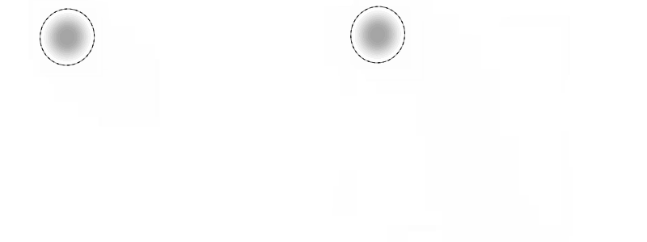
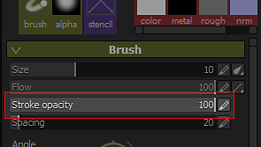

# Versione 2.5

**La Substance Painter 2.5** introduce molte nuove funzioni: dal supporto dell&#39;opacità nelle impostazioni del pennello (oltre al flusso) alla possibilità di eseguire ulteriori operazioni di mappatura in 8K e molto altro.

Data di pubblicazione: *21 febbraio 2017*

## Funzioni principali

### Nuova opacità pennello

{width="650px"}

Ora è presente una nuova impostazione nei **parametri del pennello** quando si utilizza Painting in Substance Painter, che corrisponde all&#39;**opacità**.\
L&#39;**opacità** controlla la **intensità complessiva di un tratto pennello**, contrariamente all&#39;impostazione **flusso** che controlla l&#39;intensità di **ogni singolo timbro** all&#39;interno di un tratto pennello. Ciò significa che ora è possibile colorare e aggiornare la stessa area **senza creare valori sovrapposti**. A tale scopo, imposta il flusso su 100 e il valore di opacità sull’intensità desiderata. A causa di come funziona l’opacità, non è possibile collegarla alla pressione della penna. Per questo tipo di controllo il flusso è ancora la scelta migliore.

È stato inoltre aggiunto un **nuovo modificatore** insieme a questo nuovo parametro che per impostazione predefinita si trova nella chiave **&quot;A&quot;**. Premendo questo tasto sarà possibile **continuare il tratto del pennello precedente** anziché crearne uno nuovo. Ciò significa che potete colorare un colore uniforme con l’opacità desiderata, mantenendo ad esempio la possibilità di spostare la fotocamera. Un altro esempio potrebbe essere quello di continuare la copia che si stava facendo con lo strumento Clona.

### Nuova cottura a risoluzioni 8K e non quadrate

Il baker è stato migliorato per supportare risoluzioni fino a **8192x8192** (8K più anti-alias), il che significa che ora puoi esportare a 8K con rapporto 1:1 con le mappe aggiuntive.\
È stato inoltre aggiunto il supporto per **risoluzioni non quadrate**. Ora è possibile cuocere una texture di **4096x2048** per esempio. Per farlo, fai clic sull&#39;icona &quot;**blocca**&quot; accanto al menu a discesa per selezionare la risoluzione.

### Nuovo supporto per Profilo colore nella finestra della vista

Abbiamo aggiunto il supporto di **LUT** (texture) per controllare il rendering del **viewport** in Substance Painter. Per applicare un profilo, è sufficiente abilitare l&#39;impostazione &quot;**Profilo colore**&quot; nella finestra &quot;**Impostazioni schermo**&quot; e caricare il LUT nello slot dedicato. Funziona sia con il viewport **OpenGL** (disegno) che con il renderer **IRay**. Per impostazione predefinita, sono disponibili alcuni esempi da **predefiniti fotocamera** comuni a più **effetti artistici**. Per ulteriori informazioni, consulta la pagina dedicata della documentazione: [Profilo colore](../../features/post-processing/color-profile.md)

### Nuovo motore di Substance compatibile con il Substance Designer 6

È stato aggiunto il supporto per **Substance Designer 6**. Ciò significa che le risorse create con **SD6** possono essere aperte e utilizzate nella **Substance Painter 2.5**!\
Un buon esempio è la possibilità di utilizzare il **nuovo nodo di testo** di SD6 e integrarlo in una sostanza. In questo modo è possibile creare **testo dinamico** e colorarli direttamente senza dover uscire dall&#39;applicazione. **Per impostazione predefinita, sono stati inclusi 10 font**, ognuno con uno stile diverso, per soddisfare le esigenze più comuni. Puoi trovarli nella sezione &quot;**procedurale**&quot; dello **scaffale**.

{width="400px"}

### Nuovo contenuto nello scaffale

Oltre ad alcune correzioni e miglioramenti con il nuovo scaffale, abbiamo aggiunto anche una serie di **nuovi filtri** per migliorare la pittura e la texture. Abbiamo anche **migliorato** il comportamento del filtro esistente (come &quot;**HSL**&quot;). Sono stati inoltre aggiunti nuovi **modelli** durante la creazione di **nuovi progetti** (ad esempio **Unity 5** e **Unreal Engine 4**).

### Nuovi miglioramenti per la creazione di script con supporto dell’interfaccia utente dello shader personalizzata

Con questa versione è stato aggiunto un modo per **creare script e controllare** i **parametri dello shader**. Abbiamo inoltre aggiunto il supporto per l&#39;utilizzo di una **interfaccia utente personalizzata** invece di quella predefinita, aprendo molte nuove possibilità come **uno shader animato**.\
Per ulteriori informazioni, consultate la documentazione sullo scripting disponibile nel menu Aiuto dell’applicazione.

## Esercitazione

Le nuove funzioni principali sono trattate nell&#39;ultimo flusso Twitch:

## Note sulla versione

### 2.5.3

(Pubblicato il 15 marzo 2017)

**Risolto:**

* [Baker] Arresto anomalo durante la cottura al forno con trame specifiche

**Problema noto:**

* [Mac] In alcuni casi, le particelle possono danneggiare le texture

### 2.5.2

(Pubblicato il 14 marzo 2017)

**Risolto:**

* [Tool] Il tablet Wacom non funziona su Linux
* [Strumento] Artefatti di nero quando si utilizza lo strumento sfumino
* [Panettieri] La cottura non riesce se si utilizza Corrispondenza per nome con una gabbia
* [Panettieri] Occlusione ambiente interrotta durante la cottura al forno solo con carta normale
* [Shelf] I filtri generici non gestiscono correttamente il canale alfa (Contrasto/Luminosità, Passa alto, ecc.)
* [Riquadro di visualizzazione] Problema di prestazioni durante il caricamento di un progetto con le ombre attivate
* [Riquadro di visualizzazione] Problema di dithering nella vista 3D su MacOS
* [Finestra vista] Le anteprime delle particelle non vengono visualizzate correttamente quando il profilo colore è attivato
* [Iray] Arresto anomalo quando si ritorna al progetto OpenGL se l’inizializzazione di Iray non riesce
* [IRay] La luminosità viene ignorata durante il rendering dello shader SpecGloss/mdl
* [Shader] Lo shader Spec/Gloss non corrisponde a Iray e SD
* [Shader] Conversione sRGB diversa dalla conversione LUT lineare in sRGB
* [Shader] Rendering errato durante il caricamento di un progetto con ombreggiature obsolete
* [Shader] Lo shader &quot;pbr-coated&quot; non funziona più
* [Esportazione] Alcuni canali vengono comunque esportati anche se non presenti nel set di texture
* [Livelli] Il metodo di fusione &quot;mappa normale, inverti dettagli&quot; non funziona sui canali in scala di grigio
* [UI] Problema nella &quot;Finestra di selezione del colore&quot; con monitor HDPI e zoom dello schermo al 150%

**Problema noto:**

* [Mac] In alcuni casi, le particelle possono danneggiare le texture

### 2.5.1

(Pubblicato il 27 febbraio 2017)

**Risolto:**

* [Mac] Input del tablet Wacom interrotto nella vista 3D e 2D
* [Panettieri] La corrispondenza per nome non funziona più
* [Panettieri] L’impostazione &quot;Normali medi&quot; non funziona più
* [Iray] Rendering non corretto con mappa normale inattiva
* [Iray] I profili colore si comportano in modo diverso rispetto al modulo di rendering OpenGL
* [Iray] L’esportazione del rendering come bitmap non include la correzione del profilo colore
* [Substance] I filtri del materiale non funzionano più
* [Strumento] L&#39;opacità del tratto non viene memorizzata nei predefiniti del pennello
* [Strumento] L’allineamento UV del pennello clone non funziona più
* [Esporta] Il canale di Spostamento deve essere centrato in 0,5 quando si esporta in numeri interi
* [Template] Il percorso assoluto è memorizzato in Templates
* [TextureSet] La texture del canale persiste dopo la rimozione del canale

**Problema noto:**

* [Linux] L&#39;input del tablet Wacom non funziona nella vista 3D e 2D
* [Mac] In alcuni casi, le particelle possono danneggiare le texture
* [Esportazione] In casi molto rari, possono apparire rettangoli neri sulle GPU AMD

### 2.5.0

(Pubblicato il 21 febbraio 2017)

**Aggiunto:**

* Aggiunta del supporto per le GPU AMD Radeon Pro e AMD FirePro
* [Tool] Aggiungi il supporto per l’opacità del tratto
* [Tool] Aggiungi un modificatore che consenta di continuare l’ultimo tratto del pennello
* [Iray] Aggiornamento per supportare le GPU Pascal
* [Finestra vista] Aggiungere il supporto per i profili colore (LUT)
* [Substance] Integrazione del nuovo framework (motore SD6)
* [UI] Aumenta l’elenco dei file recenti nel menu File
* [Importa] Utilizza la categoria da sostanze per riempire il prefisso nella finestra di dialogo di importazione
* [Panettieri] Consenti di cuocere texture 8K
* [Panettieri] Consenti di produrre risoluzioni non quadrate
* [Pannelli] Migliora il consumo di memoria durante la cottura di trame pesanti ad alto polio
* [Shelf] Bloccare gli scaffali (e i progetti) per impedire la modifica simultanea ed evitare corruzioni
* [Shelf] Leggi la categoria e le parole chiave delle sostanze per utilizzarle per filtrare
* [Shelf] Consente di escludere le risorse dal risultato di una query di ricerca
* [Shelf] Calcolo temporale delle miniature migliorato
* [Shelf] Consenti di incorporare predefiniti nei progetti
* [Shelf] Consente di comprimere/espandere rapidamente la vista struttura con MAIUSC
* [Shelf] Consente di salvare le miniature quando le risorse sono di sola lettura (cache locale)
* [Scaffale] Nuovo contenuto : nuovi filtri (trasformazione, specchio, triplanare, ecc.)
* [Shelf] Nuovo contenuto : nuovi profili LUT (classici e artistici, come Film Noir, Vintage, ecc.)
* [Shelf] Nuovo contenuto : 10 nuove Substance di font per generare rapidamente testi personalizzati
* [Shelf] Nuovi modelli: Unità 5 e motore irreale 4
* [Shelf] Il filtro HSL è stato migliorato per semplificare maggiormente l&#39;uso degli artisti
* [Shader] Aggiungi il supporto per il canale di specular level negli shader PBR
* [Shader] Aggiungere il supporto per il dithering nello shader di test di Alpha
* [Shader] Aggiungi il supporto per la mappatura delle occlusioni parallasse negli shader PBR
* [Shader] Consente di definire un&#39;interfaccia utente personalizzata per i parametri dello shader
* [MatLayering] Crea un nuovo canale maschera per il flusso di lavoro per la creazione di livelli di materiale
* [Scripting] Consenti la scrittura di metadati in un progetto SP
* [Scripting] Consente di esportare con un predefinito di esportazione specifico
* [Scripting] Consente di recuperare i parametri dello shader come JSON.
* [Scripting] Aggiunta del supporto per le connessioni WebSocket
* [Scripting] Aggiungi la possibilità di caricare istanze dello shader
* [Scripting] Aggiungi la possibilità di creare un nuovo progetto
* [Scripting] Consente di recuperare l’URL della trama importata in un progetto
* [Scripting] Consenti cottura al forno non quadrata
* [Scripting] Segnala errori durante l’impostazione dei dati tramite API di scripting
* [Substance] Aggiungi tag utente-dati per specificare il formato mappa normale

**Risolto:**

* Arresto anomalo durante la selezione del colore con le sostanze
* Arresto anomalo durante il caricamento di un&#39;immagine non RGBA32f come mappa dell&#39;ambiente
* Arresto anomalo relativo all’uso di colori su GPU AMD
* [Trama] L&#39;importazione OBJ non riconosce i materiali senza file mtl
* [Trama] La generazione del nome del set di texture UDIM può non essere corretta su alcune trame
* [UI] Pulsante Annulla/Ripeti nel visualizzatore Impostazione dello stato attivo e interruzione dello scorrimento del mouse
* [UI] Alcune etichette sono ritagliate in modo errato in High-DPI
* [Livello] La modalità Sostituisci per l’effetto disegno ha un comportamento errato su Maschera
* [Livello] Il metodo di fusione Sottrai ha un comportamento errato con il canale alfa
* [Strumento] La dimensione del pennello diventa enorme nella vista 2D quando si disegna sui bordi UV
* [Tool] La linea retta agganciata ha un comportamento irregolare con DPI alto
* [Strumento] La risoluzione dello stencil a volte non è corretta
* [Pannelli] I valori di &quot;Distanza max occlusione&quot; sono bloccati se &quot;relativa al rettangolo di selezione&quot; è &quot;Disattivato&quot;
* [Shader] Le definizioni di canale di stack e parametro automatico non corrispondono
* [Vista 3D] Visualizzazione incoerente del canale normale a seconda dell&#39;impostazione del progetto
* [Riquadro di visualizzazione] Alcune mappe normali presentano valori bloccati che appaiono come artefatti
* [Riquadro di visualizzazione] Gli effetti a posteriori sono sempre disattivati per impostazione predefinita
* [Esporta] L’impostazione di miscelazione normale non è corretta se manca il canale normale
* [Esportazione] Generazione di texture errata in alcuni casi su GPU AMD
* [Esporta] I parametri dello shader non vengono esportati correttamente se si trovano in un gruppo
* [Export] La modifica di un predefinito di esportazione in uno scaffale personalizzato genera un errore di registro
* [Shelf] Il filtro della visualizzazione a struttura non corrisponde esattamente al nome della cartella
* [Shelf] Ridenominare un predefinito di shelf è difficile da leggere
* [Shelf] La risorsa Shader importata nello Shelf non viene mantenuta dopo il riavvio
* [Shelf] Contenuto : Predefinito strumento saldatura mancante
* [Shelf] Contenuto: il Tile Generator non funziona correttamente
* [Scaffale] Contenuto : Corretta maschera errata su materiale intelligente sporco di gomma
* [Shelf] Contenuto : Corretto il nome del gruppo errato sul materiale del sacchetto in pelle
* [Iray] Metà delle maglie è mancante in Iray
* [Linux] Arresto anomalo quando si trascina una risorsa sopra la vista 3D
* [Mac] Le preferenze vengono reimpostate a ogni avvio su Sierra

**Problema noto:**

* [Esportazione] In casi molto rari, possono apparire rettangoli neri sulle GPU AMD
* [Iray] I profili colore a volte possono comportarsi in modo strano
