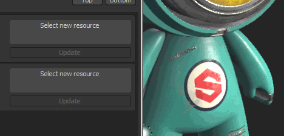

# Versione 2.6

Con **Substance Painter 2.6**, ci siamo concentrati su un modo per gestire i set di texture direttamente all&#39;interno di Substance Painter, senza la necessità di creare un nuovo progetto o reimportare la trama con nomi di materiale aggiornati. Volevamo anche fornire un modo per aggiornare le risorse utilizzate nei progetti, cosa che abbiamo visto richiedere molto in passato.

Data di pubblicazione: *27 aprile 2017*

## Caratteristiche principali

### Nuovo progetto di esempio &quot;Meet Mat&quot;

Questo nuovo progetto di esempio offre un nuovo carattere lucente e adorabile denominato &quot;**Mat**&quot;. Contiene tre set di texture pronti per essere dipinti.\
Partecipa al concorso **Incontra tappetino** per vincere alcuni premi fantastici: <https://www.allegorithmic.com/contest/meet-mat-2017-substance-3d-painting-contest>

### Nuova API di scripting con la possibilità di aggiornare le risorse nei progetti

L&#39;API di scripting di Substance Painter è stata migliorata per aggiungere nuove funzioni che consentono di **sostituire le risorse** nel progetto con altre versioni. Per dimostrare questa nuova funzionalità, è stato aggiunto un nuovo **plug-in** creato con l&#39;API di scripting che consente di sfogliare tutte le risorse contenute in un determinato progetto. Le risorse contrassegnate come rosse vengono rilevate come &quot;obsolete&quot; e possono essere sostituite automaticamente. Questa funzione non si limita alle risorse &quot;obsolete&quot;, poiché qualsiasi risorsa può essere sostituita con qualcos’altro. Questo offre molte nuove possibilità e mostra ancora di più come Substance Painter sia **uno strumento di pittura non distruttivo**!

Il **plug-in** è disponibile in GitHub. Non esitare ad aiutarti se riscontri potenziali miglioramenti: <https://github.com/AllegorithmicSAS/painter-plugin-resources-updater>

### Nuova possibilità di rinominare e riassegnare set di texture

Ora è possibile modificare il nome di un set di texture direttamente all’interno della Substance Painter. La ridenominazione di un set di texture influisce sul nome della texture esportata sul disco (a seconda del predefinito di esportazione utilizzato).\
Per rinominare un set di texture, fate doppio clic sul nome per modificarlo oppure usate il pulsante destro del mouse per aprire il menu di scelta rapida. È inoltre possibile aggiungere descrizioni personalizzate per fornire ulteriori informazioni sulle funzioni dei set di texture. Questo può essere molto utile quando si lavora su un [progetto UDIM](https://helpx.adobe.com/it/substance-3d/unlisted/documentation/spdoc/uv-tile-udim-legacy-144310352.html). Utilizzare il pulsante &quot;**impostazioni**&quot; per configurare la modalità di visualizzazione delle descrizioni nell&#39;elenco.

Gli insiemi di texture possono ora essere riassegnati a diversi materiali trama. Ciò significa che è possibile **recuperare** set di texture precedentemente disabilitati (perché mancavano nella trama) o persino **scambiarli**. È sufficiente fare clic sul nuovo pulsante &quot;**impostazioni**&quot; nella finestra Elenco set di texture e fare clic sulla voce &quot;**Riassegna set di texture**&quot;. Verrà aperta una nuova finestra dedicata alla gestione degli insiemi di texture e al modo in cui sono collegati ai materiali della trama. Per gestire il problema, **trascinate** un nome di set di texture nella posizione desiderata.

## Esercitazione

Le nuove funzioni principali sono descritte nell’ultima esercitazione video:

## Note sulla versione

### 2.6.2

(Pubblicato il 20 ottobre 2017)

**Aggiunto:**

* [Set di texture] Consente di eliminare i set di texture disattivati
* [Shelf] Consenti a più utenti di scrivere nella stessa cartella shelf
* [Scripting] Possibilità di ricaricare la cartella dei plug-in
* [Scripting] Aggiungi una versione API minima richiesta nei metadati del plug-in per garantire la compatibilità
* [IRay] Miglioramenti alla finestra di dialogo Esporta immagine

**Risolto:**

* [Engine] Problema di scomparsa dei tratti quando si modifica la risoluzione (4K>2K)
* [Bakers] La mappatura degli ID non riesce con l&#39;opzione Corrispondenza per nome abilitata
* [Bakers] I messaggi di errore non sono sufficientemente espliciti
* [Vista 3D] Lo spazio tangente non è sincronizzato con i forni
* [Strumento] Artefatti di nero quando si utilizza lo strumento sfumino
* [Shader] Lo shader non PBR non funziona più
* [Shader] &quot;pbr-coated&quot; è rotto
* [Shader] La rugosità del rivestimento dello shader &quot;pbr-coated&quot; non ha più alcun impatto
* [Shader] Lo shader lucido della specifica non corrisponde a Iray e SD
* [Shelf] Arresto anomalo durante il caricamento di due file con lo stesso nome ma estensioni diverse
* [Shelf] Impossibile modificare il predefinito negli scaffali
* [Shelf] Impossibile impostare un&#39;anteprima personalizzata per le risorse importate nello shelf
* Le risorse caricate dalla cache perdono il loro utilizzo
* Il salvataggio di un progetto prima della creazione di un modello restituisce errori di autorizzazione di scrittura
* Salvataggio del progetto errato se il nome del file contiene due punti
* Importazione di file con più punti (.) nel nome del file causa problemi

### 2.6.1

(Pubblicato il 12 maggio 2017)

**Aggiunto:**

* [TextureSet] Non consentire la riassegnazione di materiali mesh a nulla

**Risolto:**

* Arresto anomalo quando si cambia TextureSet dopo la sostituzione della mappa con baking
* Arresto anomalo quando si esegue &quot;Annulla e ripeti&quot; dopo aver modificato il metodo di fusione del livello
* Arresto anomalo o blocco quando si utilizza l’effetto &quot;Selezione colore&quot; con mappa ID grande
* [Esporta] I set di texture rinominati non sono ordinati alfabeticamente nella finestra di esportazione
* [TextureSet] Il ripristino del nome predefinito non verifica la presenza di unicità
* [TextureSet] Il set di texture rinominato viene disattivato dopo la riapertura del progetto
* [Shelf] Contenuto modelli predefiniti mancante
* [Ripiano] Le texture non quadrate vengono visualizzate come quadrate
* [Shader] Una volta disattivato un set di texture, lo shader associato viene eliminato
* [Script] alg.baking.setTextureSetBakingParameters() non funziona più
* [Scripting] Errore di battitura nell’esercitazione websocket
* [Scripting] Vari problemi in AlgWidgets
* [Log] Rilevamento errato della memoria virtuale disponibile in alcuni casi

### 2.6.0

(Pubblicato il 27 aprile 2017)

**Aggiunto**:

* Aggiungi nuovo progetto di esempio &quot;Meet Mat&quot;
* [Plugin] Nuovo plug-in &quot;Resources Updater&quot;
* [TextureSet] Consente di rinominare e aggiungere una descrizione ai set di texture
* [TextureSet] Consente di riassegnare i materiali
* [TextureSet] Pulsante Aggiungi impostazione nella finestra elenco set di texture
* [TextureSet] Mostra i set di texture &quot;disabilitati&quot; nella parte inferiore dell’elenco
* [Substance] Utilizzate mappe aggiuntive con la risoluzione del set di texture corrente per migliorare le prestazioni
* [Scripting] Consente di aggiornare una risorsa utilizzata in un progetto (materiale, generatore, ecc.)
* [Scripting] Aggiungere un modo per aggiungere/rimuovere uno scaffale
* [Scripting] Consente di eseguire query sulle informazioni dalla risorsa nei progetti
* [Scripting] Consente di recuperare un elenco di scaffali disponibili
* [Scripting] Esercitazione per migliorare la miniatura di AlgWidget
* [Esporta] Disattiva/attiva profondità di bit in base al supporto del formato di file
* [Log] Aggiungi il nome del plug-in per la stampa nella console
* [Log] Rimuovi errore sui set di texture nascosti
* Aggiornate la &quot;Schermata introduttiva&quot; con nuove icone e testo per gli esempi

**Risolto**:

* Arresto anomalo durante l’aggiornamento di una trama in progetti specifici
* [Finestra vista] Il colore interno del piano di simmetria non è più visibile
* [Riquadro di visualizzazione] Alcuni effetti di post-elaborazione sono attivati quando si utilizza la vista Solo
* [Ombreggiature] La fusione &quot;sopra\_predefinito&quot; non funziona correttamente
* [Shader] Avvertenza sul test alfa con lo shader predefinito
* [Shelf] Analisi errata dei tag dalle Substance
* [Shelf] MatFX Ruggine Weathering non funziona correttamente
* [Shelf] Per impostazione predefinita, il filtro HSL è attivato sui canali errati
* [Shelf] Per impostazione predefinita, l’opzione Nitidezza è abilitata nel canale Height/Normale
* [Esportazione] I predefiniti di esportazione Vray non utilizzano una mappa normale OpenGL
* [Tool] Problemi di imprecisione con lo strumento Clona/Sfumino per creare artefatti
