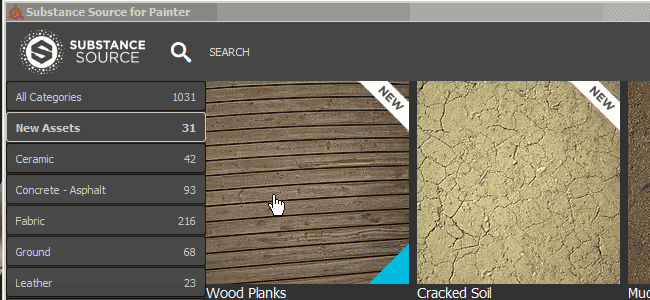

# Versione 2017.1

Substance Painter modifica il numero di versione in base alla nuova offerta Substance. Per ulteriori dettagli, controllare: <https://www.allegorithmic.com/welcome-to-substance>\
In questa nuova versione volevamo concentrarci sui contenuti fornendo un nuovo plug-in che consente di sfogliare la Substance Source e importare materiali direttamente nello scaffale. Abbiamo aggiunto anche molte nuove risorse per ampliare le tue possibilità creative.

Data di pubblicazione: *20 giugno 2017*

## Caratteristiche principali

### Nuovo plug-in: Substance Source

Con questo nuovo plug-in è ora possibile **sfogliare direttamente** il nostro database di materiali chiamato **Substance Source** e scaricarli **direttamente nello scaffale**, pronti per l&#39;uso e pronti per essere utilizzati nei tuoi progetti.\
Per aprire Substance Source, è sufficiente fare clic sul logo Substance Source **nella barra degli strumenti principale** dell&#39;applicazione. Viene aperta una nuova finestra che consente di sfogliare la libreria.

{width="650px"}

### Nuovo contenuto : Alpha, procedure, filtri e altro ancora

In questa nuova versione verranno aggiunte **oltre 300 nuove risorse**. Abbiamo aggiunto contenuti a tema **fantascienza**, **geometrici**, **medievali** o anche **celtici** nelle Alpha. Include anche molti **nuovi pennelli** e **impronte digitali/impronte digitali acquisite**. Sono inoltre disponibili alcuni utili nuovi filtri, ad esempio l&#39;**Edge Wear dettagliato MatFX**, che consentono di generare **graffi** direttamente **dalle normali informazioni** dipinte sulla trama.

Ecco l&#39;elenco dei nuovi contenuti:

* **4 Nuovi Font** (Giapponese, Cinese Semplificato, Macchina Da Scrivere, Segmento)
* **230 Nuovi Alpha** (combinazione di pattern e immagini acquisite)
* **50 Nuovi procedurali** (principalmente modello in tessuto per abbigliamento medievale e contemporaneo)
* **2 Mappe del nuovo ambiente** (via Mondarrain e Villa Nova)
* **9 Nuovi filtri** (Edge Wear dettagliato MatFX, Blocca, HBAO e così via)

Sono state inoltre aggiornate alcune risorse esistenti per migliorarne il funzionamento, ad esempio la **mappa dell&#39;ambiente predefinita** che ora è **meno gialla:**

## Esercitazione

Il nuovo contenuto è trattato nell&#39;ultima esercitazione video:

## Note sulla versione

### 2017.1

(Pubblicato il 20 giugno 2017)

**Aggiunto:**

* [Plugin] Nuovo plug-in Substance Source (consente di scaricare risorse nello scaffale)
* [Scaffale] 4 Nuovi Font (Giapponese + Cinese Semplificato, Macchina Da Scrivere, Segmento)
* [Shelf] 230 Nuovi Alpha (Mix di pattern, pennelli e scansioni di impronte digitali)
* [Scaffale] 50 Nuovi Procedurali (Tessuti di abbigliamento medievale e contemporaneo)
* [Scaffale] 2 Nuove mappe ambientali (Mondarrain e Villa Nova Street)
* [Shelf] 9 Nuovi filtri (MatFx Detail Edge Wear, Clamp, HBAO, ecc.)
* [Shelf] Mappa ambiente Panorama predefinita migliorata
* [Shelf] Nuovi predefiniti di esportazione Arnold 5
* [Scripting] Consente di importare la risorsa nello scaffale

**Problema noto:**

* [Esportazione] La modifica di un predefinito di esportazione è molto lenta
