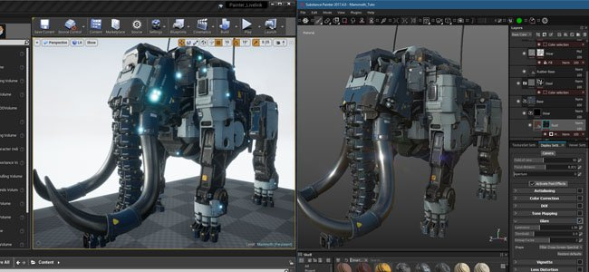
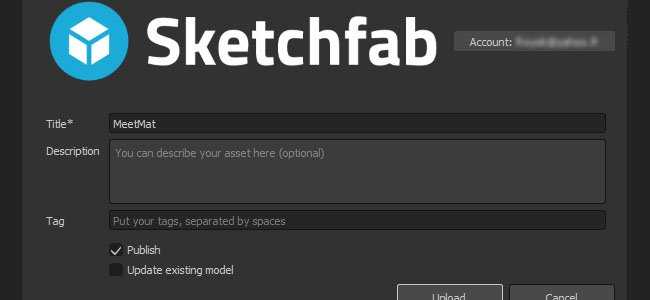

# Versione 2017.4

**Substance Painter 2017.4** aggiunge una nuova funzionalità del flusso di lavoro con **istanza dei livelli** che consente di sincronizzare facilmente i livelli tra diversi set di texture all&#39;interno di un progetto.

Data di pubblicazione: *23 novembre 2017*

## Caratteristiche principali

### Istanza dei livelli

La **istanza dei livelli** è un nuovo sistema che consente di mantenere **sincronizzati** i **parametri** del livello su **altri livelli e set di texture**. Quando si crea un&#39;istanza di livello, il livello originale diventa **sorgente** e le istanze **rimarranno aggiornate** a meno che il collegamento tra di esse non venga interrotto. I livelli istanziati sono un **ottimo** per **texture una risorsa con pochi clic** ed evitare di andare avanti e indietro per aggiornare i livelli. Per creare facilmente texture per una risorsa, è sufficiente **creare un&#39;istanza di una cartella** su altri set di texture e inserirvi un materiale avanzato o qualsiasi altro livello, **replicarla ovunque** all&#39;istante.

È possibile creare un&#39;istanza in due modi:

* Dopo aver copiato un livello, scegli &quot;**incolla come istanza**&quot; (o utilizza la scelta rapida da tastiera CTRL+MAIUSC+V)
* Dopo aver selezionato un livello, scegli &quot;**crea istanza tra set di texture**&quot; (o usa la scelta rapida da tastiera CTRL+MAIUSC+D)

>[!NOTE]
>
> Vi sono alcune limitazioni relative all&#39;istanza dei livelli:
> 
> * Qualsiasi azione di pittura sarà presente solo sul livello sorgente, i livelli istanziati non replicheranno i tratti del pennello.
> * I riferimenti dell&#39;ancoraggio devono avere il punto di ancoraggio allo stesso livello dell&#39;istanza, un punto di ancoraggio non può trovarsi all&#39;esterno di una cartella di istanze altrimenti verrà interrotto.
> * Se un materiale avanzato viene salvato con livelli istanziati, il livello di origine deve trovarsi nella cartella del materiale avanzato, altrimenti il collegamento dell’istanza non funzionerà.
> * A seconda dell’impostazione della Pila livelli, i livelli con istanza possono creare un ciclo, che non è supportato e interrompe il risultato dell’istanza. Eliminate o spostate l&#39;istanza per correggerla.

Per ulteriori dettagli ed esempi, vedere la pagina dedicata: [Istanza dei livelli](../../interface/layer-stack/layer-instancing.md)

### DCC Live-link con supporto Unreal Engine 4

La versione beta precedente del **plug-in live-link** è stata **integrata** in Substance Painter. Abbiamo colto l&#39;occasione per supportare l&#39;Unreal Engine 4 che ora permette di vedere il risultato di un progetto nel motore automaticamente.

Per connettere l&#39;applicazione con **Unreal Engine 4** (versione **4.18** minima richiesta), scaricare i plug-in di Substance qui: <https://www.unrealengine.com/marketplace/substance-plugin>

### Nuovo contenuto scaffale

Abbiamo aggiunto **20 nuovi materiali per la procedurali** e **40 nuove mappe per le grungi** (alcune delle quali sono procedurali). I nuovi materiali si trovano nella sezione &quot;**Materiali**&quot; dello **scaffale**, ad esempio i 6 nuovi metalli, le 8 nuove plastiche, alcuni tessuti e 2 nuove superfici in legno. Le nuove mappe delle grungi si trovano direttamente nella sezione &quot;**Grungi**&quot; dello **scaffale**.

Ringraziamo Clément Feuillet e Nicolas Longchamps per averci permesso di ottenere la licenza per i contenuti di questa nuova versione.

### Esportazione Sketchfab migliorata

Abbiamo aggiornato la nostra esportazione di Sketchfab e aggiunto la possibilità di pubblicare il tuo progetto come bozza e persino di aggiornare i progetti già caricati. Dovrebbe rendere molto più semplice eseguire le iterazioni del progetto.

### Miglioramenti delle prestazioni

Abbiamo continuato il nostro lavoro riguardante i miglioramenti delle esecuzioni. In questa nuova versione abbiamo rielaborato gran parte del rendering OpenGL nelle finestre delle viste, che dovrebbe aumentare notevolmente la velocità. Abbiamo anche migliorato il modo in cui vengono calcolati i tratti di pennello e dovrebbero richiedere calcoli texture molto meno grandi in memoria. Nel complesso darà risultati molto più veloci e migliori sensazioni di pittura.

## Esercitazione

Le nuove funzioni sono descritte dettagliatamente nei nostri video più recenti:

## Note sulla versione

### 2017.4.2

(Pubblicato il 24 gennaio 2018)

**Aggiunto:**

* [Esportazione] Ottieni lo stato di un’esportazione con avanzamento passaggio
* [Esportazione] Consenti l’annullamento di un’esportazione
* [Esporta] Esporta le texture in Sketchfab senza perdere la qualità della mappa normale
* [Esportazione] Esportazione in formato binario (glb) glTF
* [Esporta] Consente il ridimensionamento delle colonne nella scheda di configurazione della finestra di esportazione
* [Shader] Aggiungere un registro delle modifiche per l&#39;API shader
* [Scripting] Aggiungere le funzioni di richiamata prima e dopo l’esportazione delle texture
* [Iray] Aggiornamento a SDK 2017.1 (supporto di GPU Volta)

**&#x200B;**&#x200B;Corretto:**&#x200B;**

* Arresto anomalo quando si esce dall’applicazione prima della visualizzazione della finestra principale
* [MAC] Arresto anomalo durante il caricamento di mappe in scala di grigio con IRAY
* [MAC] Il rilevamento VRAM non è corretto con il nuovo sistema operativo High Sierra
* [Plugin] Il download delle risorse da Substance Source non funziona più
* [Scripting] Rilevamento minimo della versione del plug-in non corretto
* [Esporta] Impossibile salvare il predefinito di esportazione dopo l’esportazione delle texture
* [Istanza] Problema relativo ai generatori di cui è stata creata un’istanza in un TextureSet senza mappe aggiuntive
* [Finestra vista] Il dithering non funziona con una risoluzione superiore a 4k
* [Riquadro di visualizzazione] La visualizzazione del materiale 2D View è coperta da rumore
* [Shelf] Migliorare il tempo di caricamento per i predefiniti shelf
* [Motore] Fusione errata durante il disegno sotto la selezione colore

### 2017.4.1

(Pubblicato il 15 dicembre 2017)

**Aggiunto:**

* [Scripting] Esporta trama tramite API di scripting
* [Import] Disabilita l&#39;importazione di un formato di file mesh non supportato (consenti solo obj, fbx, dae, ply)
* [Log] Indica con maggiore precisione il problema TDR nel file di log

**Corretto:**

* Arresto anomalo se l&#39;applicazione viene chiusa prima del termine della ricerca per indicizzazione delle risorse
* Arresto anomalo all’apertura di progetti con lo strumento Sfumino/Clone
* Arresto anomalo quando si utilizza Ripeti dopo un annullamento di una modifica dello shader in Impostazioni visualizzatore
* [Engine] La creazione di texture differisce tra Painter 2017.2 e 2017.4
* [Finestra vista] Il prelievo su una mappa ID da un&#39;istanza consente di campionare il colore errato
* [Esporta] Arresto anomalo durante l’esportazione di una texture normale o di occlusione non valida
* I gruppi dei file PSD di [Esportazione] sono bloccati all’apertura in Photoshop CS6
* [Plugin] Il plug-in Photoshop ignora la selezione del canale ed esporta sempre tutto
* [Livelli] Gli ancoraggi si interrompono quando vengono copiati/incollati su set di texture
* [Livelli] Alcuni riferimenti di ancoraggio non possono essere ripristinati se sono interrotti
* [Shader] il parametro di rugosità secondaria rivestita con pbr è interrotto
* [Steam] La finestra a comparsa Controllo versione non deve essere visibile all’avvio

**Problemi noti:**

* [AMD] Arresti anomali/Blocchi quando si tenta di pittura su una trama. Può essere risolto con un aggiornamento del driver GPU.

### 2017.4

(Pubblicato il 23 novembre 2017)

**Aggiunto:**

* [Creazione istanza] Consente di creare un&#39;istanza dei parametri tra i livelli
* [Istanza] Consente di passare da un livello di origine a un&#39;istanza e viceversa
* [Creazione di istanze] Aggiungi un’azione &quot;Crea istanza tra set di texture&quot;
* [Istanza] Indica nella Pila livelli istanze di rientro (cicli)
* [Istanza] Elimina le istanze quando viene rimossa un&#39;origine
* [Istanza] Non consentire riferimenti di ancoraggio dall&#39;esterno di una cartella istanza
* [UI] Sposta lo stack di annullamento nella propria finestra denominata &quot;History&quot;
* [Plugin] Integrazione del plug-in DCC live-link
* [Engine] Migliora le prestazioni di pittura con Pittura sparsa
* [Esporta] Aggiungi le opzioni di bozza e riesporta in esportazione Sketchfab
* [Shelf] Aggiungi il controllo &quot;flip&quot; per le sostanze Font
* [Shelf] Aggiungi 20 nuovi materiali per le procedure
* [Shelf] Aggiungi 40 nuove mappe grunge (basate su bitmap e procedurali)
* [Finestra di visualizzazione] Attivare le collisioni di anteprima pennello su altri set di texture visibili
* Aggiornamento dei requisiti minimi dei driver della GPU AMD

**Corretto:**

* Arresto anomalo quando si elaborano Substance a risoluzioni eccessive
* Arresto anomalo quando si dipingono intensamente con particelle
* [Finestra vista] Riflesso di specular errato nella vista 2D con trame specifiche
* [UI] Alcune azioni indesiderate vengono visualizzate nella finestra Cronologia

**Problemi noti:**

* [Livelli] Alcuni riferimenti di ancoraggio non possono essere ripristinati se sono interrotti
* Arresto anomalo quando si utilizza Ripeti dopo un annullamento di una modifica dello shader in Impostazioni visualizzatore
