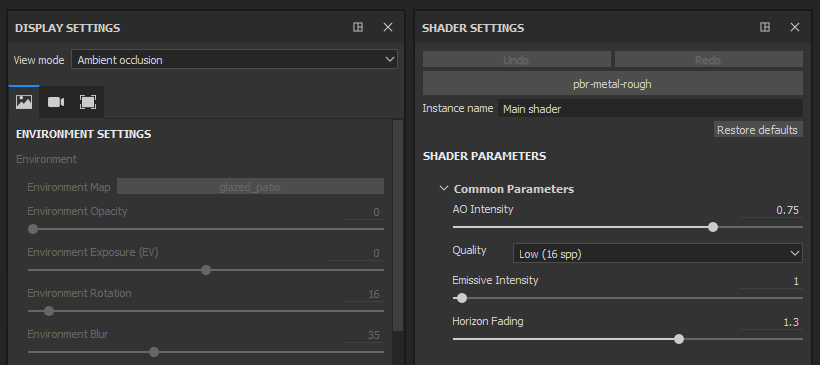
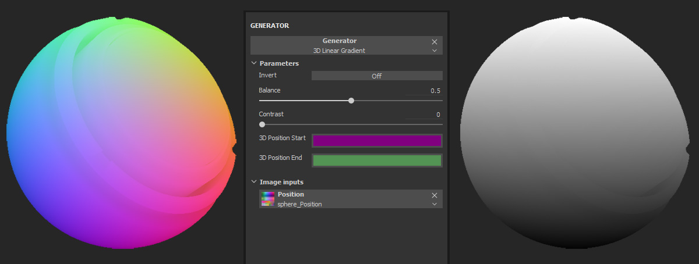

# Versione 2018.1

**Substance Painter 2018.1** introduce una nuova interfaccia con molti comportamenti migliorati. Le performance sono state migliorate anche in molte aree.

Data di pubblicazione: *15 marzo 2018*

## Caratteristiche principali

### Nuove interfacce e comportamenti

{width="650px"}

Substance Painter 2018.1 introduce una **rielaborazione completa dell&#39;interfaccia**, che va dal colore e dalle icone ai comportamenti del widget.

* La **nuova interfaccia** è incentrata sull&#39;aggiunta di un nuovo design che semplifica la lettura e la navigazione.\
  Abbiamo rielaborato tutte le nostre icone per renderle più esplicite. Abbiamo anche rielaborato la nostra combinazione di colori che ora dovrebbe essere più coerente.\
  
* Abbiamo migliorato molti widget, in particolare i **cursori**, in modo da renderli più **facili da usare** con una **penna per tablet**.\
  Puoi fare clic sulla barra per spostare il cursore oppure utilizzare il campo del valore per modificare con maggiore precisione i numeri.\
   
* Disponiamo di una **nuova barra degli strumenti** che consente di aprire **ancoraggi** al volo.\
  Facendo clic su uno dei pulsanti nella barra degli strumenti, il Dock viene visualizzato accanto al relativo pulsante e mobile sul resto dell’interfaccia. Facendo nuovamente clic sul pulsante, il Dock viene chiuso.\
  Se il dock si allontana dal relativo pulsante, diventa una normale finestra mobile che può essere ancorata nell’interfaccia. Se chiuso, il pulsante sarà nuovamente disponibile nella barra degli strumenti del Dock.\
  Questo nuovo sistema dock funziona più facilmente con schermo intero. Non è più necessario che ogni dock sia sempre presente nell’interfaccia.\
  
* I dock ora utilizzano il nuovo **layout di tabulazione** che consente di organizzare gli elementi in sezioni pur continuando a scorrere rapidamente all&#39;interno.\
  Questo layout di tabulazione consente **finestre grandi** e può presentare **tutte le informazioni** contemporaneamente, contrariamente ai normali sistemi di tabulazione che nascondono le informazioni.\
    
* Ora è disponibile un **menu rapido** che rende disponibili **proprietà degli strumenti** **direttamente nella finestra della vista**.\
  Per aprire il menu rapido, è sufficiente **fare clic con il pulsante destro del mouse nella finestra della vista**. Per **chiudere** il menu rapido, **fare di nuovo clic nella finestra della vista**.\
  Il menu si chiuderà solo quando si fa clic nella finestra della vista, consentendo il trascinamento delle risorse dallo scaffale direttamente nel menu rapido.\
  
* Nella parte superiore della finestra della vista è ora presente una nuova **barra degli strumenti contestuale**.\
  Questa barra degli strumenti ne modifica i parametri a seconda dello strumento corrente utilizzato. È un modo per accedere rapidamente alle funzionalità di base dello strumento (come la dimensione del pennello).\
  
* Ora è possibile **riordinare gli effetti** utilizzando **il trascinamento** nello **stack di livelli**.\
  
* Anche se le scelte rapide &quot;**C**&quot; e &quot;**B**&quot; consentono di visualizzare rapidamente **Canale** e **Texture al forno** nella **finestra della vista**, è ora possibile utilizzare il **menu a discesa unificato** per modificare la visualizzazione della finestra della vista.\
  Nella **parte superiore destra** della **finestra della vista** è ora disponibile un elenco a discesa che elenca **tutti i canali e le mappe trama** (in precedenza mappe aggiuntive). Questo menu a discesa unificato è disponibile anche nel dock **Impostazioni schermo**.\
  
* Le **impostazioni dello schermo** e le **impostazioni del visualizzatore** sono state **unite** in un singolo ancoraggio.\
  Le impostazioni **Ambiente**, **Fotocamera** e **Finestra di visualizzazione** sono ora raggruppate **insieme**, mentre i parametri **Ombreggiatori** sono stati **spostati** in un **dock dedicato**.\
  Le impostazioni dello schermo ora sfruttano il nuovo **layout di tabulazione** per spostarsi rapidamente nella finestra.\
  

### Trascinare e rilasciare Materiali e Smart-Materials nella finestra della vista

{width="650px"}

Ora potete **trascinare** materiali e materiali avanzati **direttamente nella finestra della vista**.\
Questa nuova azione **evidenzierà contemporaneamente la geometria** del **set di texture di destinazione**. I nuovi livelli verranno così creati nella parte superiore della pila di livelli del set di texture.

### Comportamento migliorato della penna

In questa versione è stato migliorato il modo in cui vengono gestiti i movimenti e gli input della penna grafica, specialmente quando la Substance Painter è sottoposta a un carico elevato.\
Non perdiamo più gli input mentre facciamo calcoli consecutivi. Ciò dovrebbe consentire tratti di pennello precisi in qualsiasi situazione.

### Spaziatura interna migliorata

Abbiamo rielaborato il modo in cui generiamo il riempimento al di fuori delle Isole UV. Invece di prendere il pixel corrente e dilatarlo a una certa distanza, ora cerchiamo il pixel adiacente sull&#39;altro lato della giuntura UV e interpoliamo i due valori.\
In questo modo si ottiene un risultato finale molto migliore e si riduce la visibilità della divisione tra le Isole UV anche quando le proporzioni del testo non corrispondono.

<table>
<tr style="border: 0;">
<td style="border: 0;" valign="top">

{width="200px"}

</td>
<td style="border: 0;" valign="top">

{width="200px"}

</td>
</tr>
</table>

Questa nuova spaziatura viene generata automaticamente dopo ogni tratto del pennello, modifica della risoluzione o modifica del livello.

### Prestazioni migliorate

{width="650px"}

In questa versione sono state migliorate anche le prestazioni su più livelli:

* L’apertura e il salvataggio del progetto dovrebbero essere un po’ più rapidi di prima.\
  Abbiamo rielaborato il modo in cui codifichiamo/decodifichiamo i nostri **dati di pittura**. Questo influisce in particolare sui progetti con molte informazioni pittoriche (tratti pennello).
* Ora supportiamo molti **sottooggetti** con trame.\
  Non è più obbligatorio unire una trama in un unico pezzo prima di caricarla in Substance Painter. Le prestazioni dovrebbero rimanere buone anche con **8000 sottooggetti** in un progetto.
* Abbiamo modificato il modo in cui **viewport** viene **aggiornato** per ridurre il carico sulla GPU durante il disegno.\
  Ciò significa che non si aggiorna più l&#39;intera immagine ma una piccola area in cui si sta attualmente lavorando.\
  Potete percepire la differenza su GPU meno potenti o quando si utilizza un numero elevato di campioni nello shader.
* Il sistema **shelf** è ora **più veloce per individuare** risorse all&#39;avvio dell&#39;applicazione.\
  I materiali Substance con bitmap incorporate sono **due volte più veloci** da scoprire (se cotti come non solidi). Anche **Predefiniti** dovrebbe presentare miglioramenti.

### Panettiere posizione scena globale

Ora abbiamo una nuova impostazione che consente di eseguire una mappa di posizione per set di texture, tenendo conto delle dimensioni complete della scena.\
Questo nuovo comportamento consente di utilizzare proiezioni triplanari nei generatori di maschere che corrisponderanno all’intera scena, invece di creare giunture come prima. Questo è molto utile con i progetti che hanno molti set di texture (come i progetti basati su UDIM).

Nelle impostazioni del panificatore di posizione, modifica il parametro &quot;**Scala di normalizzazione**&quot; da &quot;**Per Material**&quot; a &quot;**Scena completa**&quot; per abilitare questo nuovo comportamento.

### Nuovo contenuto

In questa versione sono stati inoltre aggiunti nuovi contenuti:

* Nuovi **rumori 3D.**\
  Importato direttamente da Substance Designer, sono stati aggiunti 4 nuovi rumori 3D e completamente senza interruzioni allo scaffale predefinito.\
  Questi nuovi rumori si basano sulla mappa di posizione del progetto per generare un risultato senza giunture.
* **Rumori non quadrati**\
  I rumori di base sono stati aggiornati alla versione più recente da Substance Designer.\
  Ciò significa che la funzione di espansione non quadrata è ora disponibile nei parametri di disturbo.
* Nuovo generatore di maschere **3D linear gradient.** Questo nuovo generatore di maschere consente di creare una sfumatura lineare in qualsiasi direzione nello spazio 3D.\
  La direzione può essere definita con due posizioni 3D, che possono essere selezionate direttamente sulla mappa posizione.\
  Esempio:

1. &#x200B;
   1. Crea il generatore di maschere **3D linear gradient** in uno dei tuoi livelli
   1. Imposta la visualizzazione della finestra della vista su &quot;**Posizione**&quot; (tramite il menu a discesa della finestra della vista o utilizzando la chiave &quot;**B**&quot;)
   1. Fai clic sul parametro &quot;**Inizio posizione 3D**&quot; per aprire la finestra a comparsa **Selettore colore**
   1. **Scegliete un colore** sulla trama **nella finestra della vista**
   1. Ripeti il processo per il secondo parametro &quot;**Fine posizione 3D**&quot;

      

* Nuovo modello **Lens-studio** (app Snap Chat 3D).\
  È disponibile un nuovo modello che consente di creare facilmente progetti destinati all&#39;applicazione Lens-Studio creata da Snap.\
  Sono disponibili anche uno shader dedicato e un predefinito di esportazione. Per ulteriori informazioni su Lens Studio, vedere: <https://lensstudio.snapchat.com/>
* **I materiali avanzati** e le **maschere intelligenti** sono stati aggiornati con la versione più recente dei nostri generatori di maschere.\
  Tutti i nostri predefiniti avanzati ora supportano la funzione **micro dettagli** che può essere utilizzata con **punti di ancoraggio**.

### Nuovo progetto di esempio

{width="650px"}

Ora è disponibile un nuovo progetto di esempio denominato &quot;**TilingMaterial**&quot; che puoi aprire tramite l&#39;azione di menu &quot;**File > Apri campione**&quot;.\
Questo progetto utilizza una semplice trama piana con UV sovrapposti che consente di **dipingere senza problemi** materiali e tratti di pennello per **creare materiali di affiancatura**.

{width="400px"}

## Esercitazione

Un nuovo corso di esercitazione è stato aggiunto a Substance Academy per coprire la nuova interfaccia: [Introduzione a substance painter 2018](https://academy.allegorithmic.com/courses/a97b433a5997fd800b5ed300d783cc41/youtube-e-zpEL0Wcqg)

## Note sulla versione

### 2018.1.3

(Pubblicato il 28 giugno 2018)

**Aggiunto:**

* Riepilogo: Hotfix
* [Preferenze] Proponi di salvare il progetto al riavvio di Painter

**Corretto:**

* [Plugin] La Substance Source di ricerca non funziona
* [Materiali intelligenti] L’importazione di materiali intelligenti in alcuni casi provoca un arresto anomalo
* [Materiali avanzati] L’eliminazione di materiali intelligenti causa in alcuni casi un arresto anomalo
* [Salva] Il salvataggio causa un arresto anomalo in alcuni rari casi
* [Shelf] Inverti non funziona su Celle 2 e Celle 3
* [Shelf] Errore di battitura in alcuni Alpha
* [Ripiano] Alcuni materiali Substance non vengono riprodotti correttamente

**Problemi noti:**

* Blocco del calcolo sulle GPU AMD VEGA

### 2018.1.2

(Pubblicato il 6 giugno 2018)

**Aggiunto:**

* Riepilogo: Velocità di cottura migliorata, Sistema di salvataggio migliorato, Cursori aggiornati, API di plug-in aggiornata, Traduzione cinese, Riempimento migliorato ora opzionale
* [Panettieri] Miglioramento delle prestazioni con la nuova versione per panettieri
* Forzare la finestra di dialogo di visualizzazione con la GPU incompatibile
* [Salva] Scopri la nuova funzionalità di progetto compatto (modalità di salvataggio completa/compatta)
* [Salva] Informa l&#39;utente in caso di errore di salvataggio
* [Clean] Salvataggio successivo in modalità completa/compatta
* [Cursori] Miglioramento della precisione delle barre e dei cursori dei colori/della scala di grigi
* [Cursori] Aggiunta di controlli freccia Su/Giù
* [Cursori] Stessa zona di rilevamento per i cursori a barre a colori e in scala di grigio
* [Plugin] Salvataggio automatico sempre in modalità incrementale
* [Plugin] Opzione per passare dai plug-in al nuovo stile di interfaccia
* [Lingua] Aggiungi traduzione cinese
* [Spaziatura interna] Opzione per passare dalla spaziatura UV a quella 3D adiacente per set di texture nelle impostazioni set di texture
* [Script] Modalità di salvataggio esposizione: completa/compatta o incrementale
* [Script] Aggiornamento della documentazione di scripting/QML
* [Registro] Indica la modalità di salvataggio nel registro (completo/compatto o incrementale)

**Corretto:**

* [Strumento] Lo slot del canale si trasforma in uno slot materiale su riempimenti a canale singolo
* Arresto anomalo durante il caricamento di una trama (FBX) con alcune facce non assegnate da un materiale
* Arresto anomalo di Iray con NVIDIA GRID 5.2 sulla macchina virtuale
* Arresto anomalo quando si annulla un&#39;eliminazione di materiali predefiniti
* Arresto anomalo durante il caricamento di alcuni progetti
* [Riga di comando] Nuova riga di comando per le trame UDIM suddivise per dim
* [Toolbar] Riduzione della barra degli strumenti
* [Istanza] Impossibile creare un&#39;istanza delle bitmap su più set di texture
* [Finestra vista] L’aggiornamento non è completo quando si dipinge su trama con UV in porzioni
* [Iray] La mappa normale viene applicata due volte per i dielettrici
* [Shelf] Errori di battitura in alcuni parametri di Substance (alpha, procedure e matfx)
* [Shelf] Errore ortografico per la bitmap &quot;Authorized Personnel Only&quot;
* [Script] La funzione alg.shaders.materials() non funziona più

**Problemi noti:**

* Blocco del calcolo sulle GPU AMD VEGA

### 2018.1.1

(Pubblicato il 3 aprile 2018)

**Corretto:**

* [Tablet] Problema durante la modifica delle scelte di interazione predefinite
* [Baker] Arresto anomalo con la libreria Assimp
* [Bakers] Regressione sulle prestazioni con A.O. map
* [Iray] La Distorsione obiettivo non viene applicata al canale Alpha
* [Driver] Aggiornamento dei requisiti minimi dei driver
* [3Dview] Normali non generate correttamente sulle trame UDIM senza informazioni sulle normali
* [Intel] Arresto anomalo con Substance Painter 2018.1.0
* [Intel][Viewport] Problema con la spaziatura interna (artefatti neri)

**Problemi noti:**

* Blocco del calcolo sulle GPU AMD VEGA

### 2018.1

(Pubblicato il 15 marzo 2018)

**Aggiunto:**

* Nuovo stile generale (icone, colore, comportamento)
* Nuovo layout predefinito
* [Tablet] Miglioramento dell&#39;esperienza utente durante la pittura
* [Menu principale] Ordinare prima gli elementi nativi nelle visualizzazioni e nelle barre degli strumenti
* [Menu principale] Spostare le azioni rapide della maschera nella sezione viewport
* [Menu principale] Spostare le azioni del clic con il pulsante destro del mouse nella sezione della finestra della vista
* [Menu principale] Rinominare &quot;Visualizza&quot; come &quot;Finestra&quot;
* [Menu rapido] Nuove proprietà dello strumento facendo clic con il pulsante destro del mouse nella finestra della vista
* [Widget dock] Nuova barra degli strumenti dock per ridurre/richiamare rapidamente
* [Impostazioni di visualizzazione] Finestra Impostazioni videocamera e visualizzatore unita
* [Serie di livelli] Menu contestuale di scelta rapida
* [Pila di livelli] Trascina e rilascia per spostare qualsiasi effetto all’interno dello stesso livello
* [Toolbar] Riorganizzazione della barra degli strumenti e nuova barra degli strumenti contestuale
* [Barra degli strumenti] Dividere lo strumento Clona in due strumenti separati
* [Proprietà Tools] Valore più chiaro della scala di grigi dello sfondo nell&#39;anteprima
* [Strumenti proprietà] Organizzazione nelle schede (riempimento e strumenti)
* [Strumento] Il risultato del disegno corrisponde allo stencil
* [Finestra vista] Nuovo cursore per il livello di riempimento
* [Finestra vista] Navigazione e pittura più fluida (frequenza fotogrammi più elevata)
* [Finestra vista] Casella combinata di selezione Materiale/Canale/Mappa nella finestra della vista
* [Riquadro di visualizzazione] Ridurre lo sfarfallio durante la rotazione (ombra attivata)
* [Shelf] Visualizza i materiali per impostazione predefinita all’apertura di Painter
* [Shelf] Miglioramento del tempo di caricamento di texture e materiali Substance (da 2 a 6 volte più veloce)
* [Shelf] Riorganizzare le cartelle dei materiali per adattarle alla struttura della Substance Source
* [Shelf] Trascina i materiali direttamente sulla trama nella finestra della vista
* [Shelf] Nuovi rumori 3D (Perlin, Perlin Fractal, Simplex e Worley)
* [Shelf] Nuovo generatore maschera 3D linear gradient con posizione mesh
* [Shelf] Disturbi di base aggiornati per supportare il non square expansion
* [Shelf] Aggiunto un nuovo modello ed esporta il predefinito per Lens Studio (applicazione Snap)
* [Shelf] Materiali avanzati e maschere intelligenti aggiornati per utilizzare la versione più recente di Editor maschera (micro dettagli)
* [Shelf] Nuovo progetto di esempio &quot;TilingMaterial&quot; per creare materiali per piastrelle senza giunture
* [Shelf] Nuovi predefiniti per i pennelli (Calligrafia, Bagnato, Tratteggio e così via)
* [Cursori] Nuovi cursori e stile e comportamento delle barre di grigio/colore
* [Baker] Consenti l&#39;uso del rettangolo di selezione della scena per calcolare la mappa di posizione
* [Shader] Rimuove il parametro della forza del height dai parametri dello shader di default
* Motore di Substance [Engine] aggiornato
* [Motore] Nessuna o meno discontinuità tra i blocchi UV (nuova imbottitura di cucitura)
* [Plugin] Importa più rapidamente i materiali scaricati da Substance Source
* [Plug-in] Aggiorna tutti i plug-in in base al nuovo stile generale
* [Preferenze] L’anteprima del colore di sfondo cambia automaticamente
* [Clean] Riduzione del rischio di danneggiamento dei progetti
* [Aperto] Apertura del progetto - Miglioramento orario
* [Nuovo progetto] Nuovo progetto - Miglioramento del tempo di aggiornamento mesh
* [Salva] Salvataggio del tempo del progetto migliorato
* [Log] Tipo di licenza segnalato nel log
* [TextureSet] Rinomina il pulsante &quot;Crea texture&quot; in &quot;Crea mappe trama&quot;
* Rinominare &quot;Mappe aggiuntive&quot; come &quot;Mesh maps&quot;

**Corretto:**

* [Finestra vista] Prestazioni errate con trame contenenti molti sottooggetti
* [Strumenti proprietà] Canale disattivato quando si trascina un’immagine nello slot del materiale
* [Proprietà Tools] L’anteprima del pennello non funziona con gli strumenti sfumino e clone
* [Set di texture] L’ordine dei canali non è corretto quando si utilizzano i modelli
* [Shelf] Icona mancante per il generatore di conversione in scala di grigi
* [Shelf] Sign Circle Number alpha è interrotto (font mancante)
* Rilevamento errato delle GPU integrate all’avvio
* [Arresto anomalo] Trascina una risorsa importata denominata con un carattere #
* [Engine] Problema di rilevamento Vram sulla GPU integrata
* [Engine] Risolti numerosi arresti anomali in Substance Engine Linker
* [Engine] Artefatti quadrati quando si modifica la risoluzione
* [Post Effects] Il ridimensionamento dell’interfaccia è lento quando gli effetti post sono attivi
* [Bakers] L’unità della scena non viene rispettata correttamente per i valori di distanza dei raggi
* [Panettieri] AO dalla distanza di occlusione della trama è fissato a 1 indipendentemente dal valore di input
* [Bakers] La corrispondenza per nome ignora alcune trame con nomi specifici
* [Pannelli] L’impostazione Colore da trama Poligruppo e ID trama restituisce sempre un’immagine nera
* [Bakers] ID Baking non riesce con trame FBX binarie da Blender
* [Shader] Disturbo nella vista 2D con dota-2 e non-pbr-spec-gloss
* [Linux] Durante il baking viene utilizzato un solo thread CPU
* [MacOS] Arresto anomalo con il cursore del pennello che si sposta sulla finestra della vista

**Problemi noti:**

* Blocco del calcolo sulle GPU AMD VEGA
* Processo di post-distorsione non preso in considerazione durante l&#39;esportazione in IRay (canale alfa)
