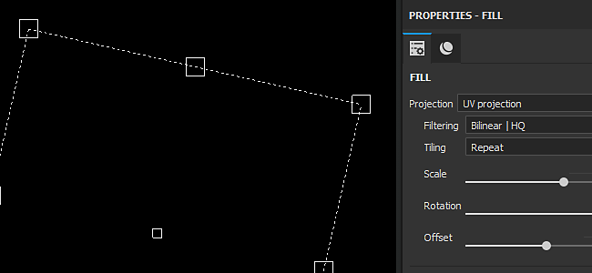
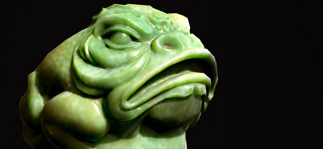

# Versione 2018.2

**Substance Painter 2018.2** aggiunge funzionalità attese da molto tempo, come la pittura a dispersione sottosuolo, che semplificano ulteriormente la creazione di texture.

Data di pubblicazione: *2 agosto 2018*

## Caratteristiche principali

### Dispersione sotto la superficie

**La dispersione sottosuperficiale** è ora supportata nella finestra della vista **in tempo reale** e con il **modulo di rendering Iray**.\
La dispersione sotto la superficie è un meccanismo di luce quando penetra un oggetto o una superficie. Invece di essere riflessa, come con le superfici metalliche, una parte della luce viene assorbita dal materiale e poi **dispersa all&#39;interno**. Molti materiali nella vita reale hanno dispersione sottosuperficiale come pelle o cera.

L’implementazione dell’effetto Subsurface di Adobe è molto simile a quella delle implementazioni in tempo reale di altri motori di gioco e di altri moduli di rendering offline. Semplificare l’authoring di texture a dispersione da utilizzare in altre applicazioni.

{width="650px"}

Sopra è riportato un esempio con la ben nota risorsa Digital Emily 2. Grazie all&#39;USC Institute for Creative Technologies e ai membri del progetto Wikihuman per averci permesso di dimostrare i nostri rendering con le risorse Digital Emily 2.\
(Si noti che questo confronto è stato fatto in condizioni di illuminazione simili ma non precise, il che potrebbe spiegare le differenze visive).

Per aggiungere la dispersione dei sottofondi in un progetto, effettuate le seguenti operazioni:

1. Passate alla finestra **Impostazioni schermo** e **attivate** l&#39;impostazione **Dispersione sottosuperficie**.
1. Aggiungi un canale &quot;**Dispersione**&quot; nel set di texture corrente
1. Usate un livello di riempimento o **colorate di bianco** nel nuovo canale per **rivelare** l&#39;effetto della superficie inferiore nella finestra della vista.

Una procedura più dettagliata è disponibile nella [documentazione sulla dispersione sottosuperficie](../../features/subsurface-scattering/subsurface-scattering.md).

>[!NOTE]
>
> Per supportare la dispersione dei sottofondi nella finestra della vista in tempo reale, gli **shader** nei progetti devono essere **aggiornati**.\
> Per gli shader personalizzati, consultare la documentazione disponibile nel **menu della guida** per sapere cosa è cambiato nell&#39;**API shader**.

### Manipolatori per i livelli di riempimento

I controlli dei livelli di riempimento sono stati migliorati per offrire manipolatori. Ora è più facile posizionare e controllare con precisione le proiezioni di riempimento.

Quando si utilizza la **Proiezione UV**, nella **vista 2D** verrà visualizzato un manipolatore:

* Facendo clic **all&#39;esterno**, il manipolatore **lo ruoterà**.
* Facendo clic sul **quadrato** alle **cornici**, verrà **ridimensionato**.
* Facendo clic su **all&#39;interno**, il manipolatore **tradurrà**.
* Usa **CTRL** per modificare più angoli in **simmetria**.
* Usate **MAIUSC** per **vincolare** una trasformazione (traslazione, rotazione o scala).\
  

Quando si utilizza la **proiezione triplanare**, nella **vista 3D** verrà visualizzato un manipolatore:

* Il cubo tratteggiato rappresenta la proiezione globale
* Utilizza la scelta rapida da tastiera **W**, **E** o **R** per passare dalla modalità **Traduci**, **Ruota** e **Scala**.
* Utilizza la scelta rapida da tastiera **T** per passare dall&#39;orientamento locale a quello globale per il manipolatore.
* Utilizzate **MAIUSC** per **vincolare** la trasformazione.
* La proiezione del cubo triplanare può essere modificata anche nelle proprietà avanzate del livello di riempimento:\
  \
  

Anche la barra degli strumenti contestuale nella parte superiore della finestra della vista verrà adattata in base alla modalità di proiezione corrente, offrendo strumenti e controlli aggiuntivi:

Per ulteriori informazioni, consulta la [documentazione del livello di riempimento](../../painting/fill-projections/fill-projections.md).

### Supporto non quadrato e non di fresatura per lo strumento Stencil e Proiezione

Il parametro dello stencil e lo strumento di proiezione sono stati migliorati per supportare risoluzioni non quadrate e comportamenti non di fresatura.\
Per impostazione predefinita, il parametro predefinito è ora impostato su non fatturazione. Questo parametro può essere modificato nelle proprietà dello strumento:

La modalità di fatturazione può essere impostata come segue:

* **Nessuna porzione** (impostazione predefinita)
* **Verticale in porzioni**
* **Porzione verticale**
* **Inclinazione orizzontale e verticale** (vecchio comportamento)

Questo nuovo parametro può essere salvato in uno strumento o in un pennello predefinito, per facilitarne la condivisione con contenuti personalizzati.

>[!NOTE]
>
> * Il rapporto di proiezione si adatterà anche con i file di Substance che producono risoluzioni non quadrate. Il rapporto verrà calcolato direttamente dal nodo di output.
> * Con lo strumento proiezione, se più canali hanno rapporti diversi, il primo rapporto trovato verrà applicato a tutti gli altri canali.

### Importazione e gestione delle telecamere

Ora è possibile **importare fotocamere personalizzate** all&#39;interno di Substance Painter insieme all&#39;importazione della trama.\
Le videocamere possono essere selezionate **per esaminarle** nella **finestra della vista 3D** e utilizzate **per eseguire il rendering in Iray**.

Per ulteriori informazioni, consultare la [documentazione sulla gestione della fotocamera](../../interface/viewport/camera-management.md).

Per **importare le fotocamere** in un progetto:

1. Esporta la trama per il progetto con fotocamere nello stesso file (con un formato supportato come FBX, Alembic o glTF)
1. Selezionare le impostazioni &quot;Importa fotocamere&quot; nella [finestra nuovo progetto](../../getting-started/project-creation.md) (o nella [configurazione progetto](../../interface/project-configuration.md)).\
   
1. Passare alla fotocamera desiderata con il menu a discesa nella finestra della vista o utilizzando le impostazioni in [Impostazioni schermo](../../interface/display-settings/camera-settings.md).\
   

Le impostazioni della fotocamera nella finestra Impostazioni schermo sono state estese per controllare le proprietà della fotocamera.\
È possibile **passare** da una videocamera all&#39;altra, visualizzarne le **proporzioni** e **bloccare** le proprietà per evitare di modificarle. È possibile utilizzare un pulsante di ripristino per ripristinare i valori iniziali della fotocamera.

Si prende in considerazione anche il telaio della fotocamera (e il suo cancello), rendendo possibile visualizzare e dipingere attraverso un punto di vista molto specifico. Il frame e il gate vengono visualizzati nel riquadro di visualizzazione 3D e la relativa opacità può essere controllata in **Impostazioni riquadro di visualizzazione** dalla finestra [Impostazioni schermo](../../interface/display-settings/camera-settings.md):

### Miglioramenti del comportamento dello stack di livelli

* **Trascinare e rilasciare materiali e materiali avanzati sulla mappa ID:**\
  È stato migliorato il trascinamento del contenuto dallo scaffale alla finestra della vista. Premendo **CTRL** durante il trascinamento di un materiale, è ora possibile scegliere il colore ID da utilizzare come maschera.\
  Una maschera nera con un effetto di selezione colore verrà aggiunta al nuovo livello creato nella pila di livelli. Se lo stesso materiale viene trascinato su un altro colore ID, il livello esistente viene aggiornato e i colori ID vengono combinati.\
  
* **Trascinamento dello scorrimento dello stack di livelli:**\
  Il trascinamento dei livelli attorno al gruppo di livelli ora presenta una piccola finestra.\
  Quando una risorsa o un livello viene trascinato vicino ai bordi della finestra del gruppo di livelli, inizierà automaticamente a scorrere il relativo contenuto.\
  

### Importazione mesh glTF e Alembic

Ora sono supportati nuovi formati di file per l’importazione di trame e la creazione di nuovi progetti:

* **glTF**: questo formato era già disponibile durante l&#39;esportazione delle texture e può essere utilizzato durante l&#39;importazione. Se un file glTF contiene texture, queste verranno importate e inserite nello stack di livelli (per il flusso di lavoro metallizzato/rugosità).
* **Alembic**: questo formato è ampiamente utilizzato nel settore VFX / Animazione per trasferire le trame.

>[!NOTE]
>
> Substance Painter non consente di controllare in quale fotogramma dell’animazione importare al momento.\
> Ciò significa che quando si esporta un file Alembic, il frame di riferimento da utilizzare per la pittura sulla risorsa deve essere già impostato.

### Miglioramenti dell’integrazione Substance

L&#39;integrazione di Substance in Substance Painter è stata migliorata con richieste attese da tempo:

* <b>Visibile Se:</b>\
  &quot;Visible if&quot; è un&#39;ottima funzione del formato di file di Substance che permette di nascondere i parametri in base alle condizioni.\
  Questa funzione fornisce un elenco più chiaro di parametri e impostazioni contestuali, fornendo in generale materiali e filtri più facili da usare.\
  Per ulteriori informazioni, consulta la [documentazione del Substance Designer](https://experienceleague.adobe.com/en/docs/substance-3d-designer/home).\
  
* I **predefiniti di Substance** predefiniti di Substance rappresentano un modo semplice per fornire modifiche avanzate e variazioni dei materiali. Molti materiali in [Substance Source](https://source.allegorithmic.com) sono predefiniti, quindi prova!\
  Se un file di Substance contiene uno o più predefiniti, sarà disponibile un nuovo menu a discesa nell’elenco dei parametri. Seleziona il predefinito da applicare per aggiornare i parametri.\
  
* **Substance attributi**\
  Gli attributi di Substance vengono ora visualizzati nell’interfaccia, per facilitare il recupero delle informazioni su un file specifico.\
  Gli attributi possono essere visualizzati in due posizioni diverse: sopra i parametri nella finestra delle proprietà o facendo clic con il pulsante destro del mouse su una risorsa nello scaffale.\
   

### Nuovo progetto di esempio &quot;Jade Toad&quot;

Un nuovo progetto di esempio denominato &quot;**JadeToad**&quot; è ora incluso in Substance Painter. Per impostazione predefinita, in questo progetto di esempio è attivato l&#39;effetto **Dispersione sottosuperficie**.\
Per trovare il progetto, utilizza la voce di menu **File** > **Apri campione...**.

## Note sulla versione

### 2018.2.3

(Pubblicato il 25 settembre 2018)

**&#x200B;**&#x200B;Corretto:**&#x200B;**

* [Vista 2D] La vista 2D è interrotta con alcune trame durante la creazione di un nuovo progetto
* [Arresto anomalo] Il passaggio dalla proiezione Proiezione UV a quella triplanare causa un arresto anomalo
* [RayCollider] Arresti anomali multipli dovuti a &quot;RayCollider&quot;
* [Strumento] Quando si cambia livello, le proprietà del pennello modificate vengono perse
* Le impostazioni del pennello vengono ripristinate quando si passa alla gomma

**Problemi noti:**

* Blocco del calcolo sulle GPU AMD VEGA
* Problema relativo al tablet Huion con scelte rapide nel sistema operativo Windows

### 2018.2.2

(Pubblicato l&#39;11 settembre 2018)

**Aggiunto:**

* Riepilogo: correzione rapida con aggiornamento dei contenuti, nuove funzionalità di scripting e possibilità di disattivare l&#39;aggiornamento automatico
* [Content][Shelf] Aggiungi un predefinito Ripiano incarnato
* [Content][shelf] Conversione di 19 normali cutanee in materiali per la dispersione sottosuperficiale
* [Scripting] Crea un modello di progetto da un progetto aperto
* [Scripting] Ottenere/impostare le impostazioni di esportazione di un progetto aperto
* [Updates] Consente di disattivare la finestra a comparsa Aggiornamento automatico da impostazioni e variabile di ambiente
* [Aggiornamenti] Non visualizzare fino alla versione successiva nella finestra a comparsa con aggiornamenti per la manutenzione

**Corretto:**

* [Fotocamera] Zoom errato passando da ortogonale a prospettico
* [Display] Alcune mappe vengono visualizzate in modalità lineare anziché sRGB
* [Finestre di visualizzazione] Lo stato attivo della trama non funziona correttamente
* [2D View] Progetto con fotocamera rotta ha sparito UVs Gusci
* [SSS][Tooltip] nel registro vengono visualizzate le descrizioni degli strumenti per la dispersione delle superfici
* Alcuni progetti non possono essere aperti in 2018.2 e il messaggio di errore non può salvare un pacchetto substance null
* [Maschera] Il colore dello strumento di pittura può bloccarsi in alcuni casi quando si lavora su una maschera
* [Materiale] Mappe non visualizzate in situazioni specifiche
* [Proj][Strumenti] Manipolatore attivo con un generatore
* [Substance] Gruppi di parametri Substance mancanti
* [Scripting] Nome software errato nella documentazione
* [UDIM] Nessuna informazione nel registro sui gusci UV su più riquadri UV

**Problemi noti:**

* Blocco del calcolo sulle GPU AMD VEGA
* Problema relativo al tablet Huion con scelte rapide nel sistema operativo Windows

### 2018.2.1

(Pubblicato il 3 agosto 2018)

**Corretto:**

* Parametri shader di dispersione sottosuperficie mancanti da progetti di aggiornamento

**Problemi noti:**

* Blocco del calcolo sulle GPU AMD VEGA
* Problema relativo al tablet Huion con scelte rapide nel sistema operativo Windows

### 2018.2

(Pubblicato il 2 agosto 2018)

**Aggiunto:**

* Riepilogo: Versione estate, Supporto per la dispersione sotto la superficie, miglioramenti a livello di proiezione e riempimento, importazione e selezione della fotocamera, supporto di Alembic/glTF, trascinamento sulla mappa ID, supporto migliorato del formato di Substance e nuovi contenuti
* [SSS][Viewport][Iray] Dispersione sottosuperficie generica
* [SSS] Sincronizza i parametri di dispersione MDL e subsuperficiale
* [SSS] È stato aggiunto un nuovo canale in scala di grigi denominato &quot;Scattering&quot;
* [SSS][Impostazioni shader] Parametro del tipo di dispersione per la dispersione del sottosuolo (incarnato o traslucido)
* [SSS][Impostazioni shader] Parametro della scala di dispersione per la dispersione sotto la superficie
* [SSS][Impostazioni shader] Parametro colore di dispersione per dispersione sottosuperficie
* [SSS][Impostazioni schermo] Conteggio dei campioni di dispersione per la dispersione sotto la superficie
* [Shader][Iray] Integrazione di MDL di dispersione sottosuperficiale per Iray
* [Shader] Aggiornamento di Shader tramite il programma di aggiornamento delle risorse
* [Shader] Aggiornamento dell&#39;API del log delle modifiche e della documentazione
* [Proprietà utensile][Proj] Nuovi parametri per la proiezione triplanare
* [Finestra vista][Proj] Controlla le proprietà del livello di riempimento nella vista 3D direttamente con i manipolatori (proiezione triplanare)
* [Shortcuts][Proj] Nuove scelte rapide Q, W, E, R, T per manipolatori di proiezione triplanari
* [Finestra vista][Proj] Controlla le proprietà del livello di riempimento nella vista 2D direttamente con i manipolatori (Proiezione UV)
* [Shortcuts][Proj] Nuova scelta rapida Q per i manipolatori di Proiezione UV
* [Barra degli strumenti contestuale][Proj] Controlla i manipolatori di proiezione triplanari
* [Barra degli strumenti contestuale][Proj] Manipolatori Proiezione UV di controllo
* [Proprietà strumento] Disattiva l&#39;affiancamento della texture con lo strumento proiezione e stencil
* [Stencil] Utilizzare immagini non quadrate con lo strumento di proiezione/stencil
* [Stencil] Consenti il controllo della modalità di suddivisione in porzioni nella finestra Proprietà
* [Stencil] Lo zoom non è centrato su uno stencil non affiancato
* [Fotocamere] Importa fotocamere da Maya, Max, Blender, Modo, DAE
* [Fotocamere][Finestra vista] Selezionare e controllare le videocamere importate nella finestra della vista
* [Fotocamere][Iray] Seleziona e controlla le videocamere importate in Iray
* [Fotocamere][UI][Nuovo progetto][Configurazione progetto] &quot;Importa fotocamere&quot; è selezionato per impostazione predefinita
* [Videocamere][Scelte rapide] Aggiungete le scelte rapide &quot;&lt;&quot; e &quot;>&quot; per passare da una videocamera all’altra
* [Fotocamere][Finestra vista] Aggiungi fotogramma nella finestra della vista
* [Fotocamere][Impostazioni finestra di visualizzazione] Controllo dell&#39;opacità dei fotogrammi
* [Fotocamere][Impostazioni fotocamera] lunghezza focale massima a 500 mm
* [Fotocamere][Impostazioni videocamera] Rapporto di esposizione
* [Fotocamere][Impostazioni fotocamera] Aggiungi un&#39;opzione di blocco
* [Fotocamere][Impostazioni fotocamera] Aggiungi un&#39;opzione di ripristino
* [Cameras][Impostazioni fotocamera] Aggiungi attributo distanza focale
* [glTF] Importazione di un file glTF
* [glTF] Importa mappa occlusione ambiente
* [Alembic] Importa fotogramma Alembic 1 con geometria statica
* [Ripiano] Trascina i materiali direttamente sulla trama utilizzando mappe ID con un modificatore (CTRL/Comando)
* [Pila di livelli] Creazione automatica di maschere ID con trascinamento di materiali sulla trama con mappe ID
* [Pila di livelli] Scorrimento automatico dei livelli con trascinamento sulla pila di livelli
* [UI][Proprietà strumento] Predefinito di Esposizione Substance
* [UI][Menu?] Miglioramento del menu?
* [UI][Nuovo progetto][Configurazione progetto] Riorganizzazione della finestra
* [UI][Nuovo progetto][Configurazione progetto] Sostituisci il termine &quot;Trama&quot; con &quot;File&quot;
* [UI][Substance] Visualizza gli attributi della Substance nell&#39;interfaccia utente
* [Scelte rapide] &quot;F4&quot; alterna la vista 2D e 3D
* [Scelte rapide] Nuove scelte rapide per Attiva/Disattiva stencil &quot;N&quot; e maschera rapida &quot;U&quot;
* [Integrazione Substance] Considera le istruzioni &#39;visible if&#39; nei parametri di Substance
* [Riquadro di visualizzazione] Le ombre non vengono calcolate dopo lo spostamento della videocamera
* [Content] Aggiorna MeetMat con le fotocamere importate
* [Content] Aggiungi un campione con la dispersione sottosuperficiale attivata - JadeToad
* [Content] Aggiungi un nuovo modello di progetto PBR con la dispersione sottosuperficie attivata
* [Content] Predefiniti di esportazione aggiornati per aggiungere un nuovo canale di diffusione
* [Content][Shelf] Aggiunto supporto per la dispersione sottosuperficiale per: pbr-metal-rough, pbr-metal-rough-alpha-test, pbr-coated, pbr-spec-gloss
* [Content][Shelf] Canale di dispersione aggiunto a 5 materiali intelligenti (marmi e pelli)
* [Content][Shelf] 1 nuovo materiale giada
* [Content][Shelf] 1 nuovo materiale cera

**Corretto:**

* [CMD] Risultati diversi utilizzando la stessa riga di comando con versioni diverse
* [TDR] Se TdrLevel è impostato, non ci sono errori nel registro
* [Baker] La mappa di occlusione ambientale è capovolta
* [ID Map] Arresto anomalo durante il prelievo al di fuori dell’intervallo 0-1
* [Iray] Arresto anomalo quando si cambia set di texture e si torna alla modalità Disegno
* [Finestra vista] Sincronizza le aree di rilascio tra le finestre della vista per il trascinamento
* [Motore] Artefatto moire quando si sovrappongono i livelli di riempimento o si dipinge un piccolo pennello
* [Licenza] Verifica versione software non valida del servizio di licenza
* [Licenza] Rielabora il modo in cui gestiamo l&#39;autenticazione
* [API] Chiama l&#39;evento API di scripting `onNewProjectCreated` anche durante la creazione con un modello
* [Shader] Lo shader compilato non viene caricato dalla cache quando il file shader non viene compilato
* [Shelf] L’esportazione di file HDR dallo shelf genera un file con valori bloccati
* [Esporta] L’esportazione EXR blocca i valori di colore RGB tra 0 e 1
* [Content] Il disturbo procedurale &quot;3D Perlin Noise Fractal&quot; è pixelato

**Problemi noti:**

* Blocco del calcolo sulle GPU AMD VEGA
* Problema relativo al tablet Huion con scelte rapide nel sistema operativo Windows
