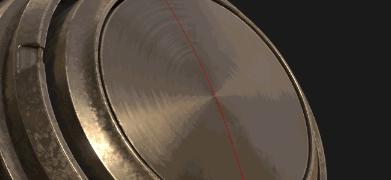
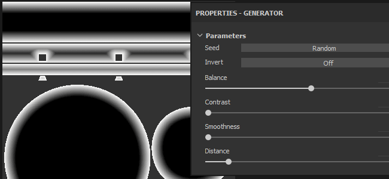

# Versione 2018.3

**Substance Painter 2018.3** è qui e offre molti nuovi flussi di lavoro e funzionalità di rendering!

Data di pubblicazione: *20 novembre 2018*

## Caratteristiche principali

### Esportazione vista 2D

È ora possibile **esportare la vista 2D** eseguendo il rendering di **come texture**. Questa funzione è stata richiesta da molti utenti e finalmente è stata resa disponibile! Il processo di esportazione assumerà lo stato corrente di **Vista 2D** per eseguire il rendering di una texture con le normali impostazioni di esportazione (spaziatura interna, formato file, profondità di bit). Ciò significa che se la modalità di visualizzazione è impostata su **Solo** invece della modalità **Materiale**, la visualizzazione 2D verrà esportata così com&#39;è.

Passa alla **finestra Esportazione** e scegli la nuova configurazione denominata &quot;**vista 2D**&quot;:\

Nella scheda **Configurazione** della finestra Esporta è disponibile anche una nuova **Mappa convertita** denominata &quot;**Visualizzazione 2D**&quot;, per creare un **predefinito di esportazione** personalizzato.

### Filtro illuminazione Eseguito i baking migliorato

Il filtro **Baked lighting environment** è stato notevolmente migliorato e ora supporta correttamente **mappe di ambiente HDR**.\
Ora è possibile replicare la luce della finestra della vista (come nella vista 2D) e infiltrarla nel canale del colore di base. Il nuovo filtro fornisce ulteriori controlli come **la rotazione** dell&#39;**ambiente** della mappa **verticale** e la modifica della **esposizione**.

### Riflessioni Specular anisotrope in tempo reale

In questa nuova versione viene introdotto un nuovo shader denominato &quot;**pbr-metal-rough-anisotropia-angle**&quot;. Questo shader supporta due canali denominati &quot;**Angolo di anisotropia**&quot; e &quot;**Livello di anisotropia**&quot; che possono essere utilizzati per creare riflessi di specular anisotropi. Questo shader si tradurrà anche in Iray as-is senza la necessità di alcuna conversione.

È possibile accedere a questo nuovo shader dalla [finestra Shader](../../interface/shader-settings/shader-settings.md) facendo clic sul pulsante shader e aprendo il ripiano inferiore:

Il progetto di esempio predefinito &quot;**Sfera di anteprima**&quot; è stato aggiornato per sfruttare il nuovo shader e illustrare come configurare i diversi canali.

>[!NOTE]
>
> Se compaiono **artefatti di riga** dall’aspetto strano quando si utilizzano le sfumature all’interno del canale **Angolo di Anisotropia**, provate a cambiare la modalità di filtro in &quot;**Più vicino**&quot; in caso di un livello di riempimento, in quanto questo potrebbe migliorare il campionamento per lo shader ed eliminare il problema.

### Aggiornato Clear Coat Shader

Lo shader **Clear Coat** (**pbr-coated**) è stato migliorato per offrire più controlli e possibilità di rendering. Abbiamo anche colto l&#39;occasione per renderlo compatibile con **Iray** con un **MDL** dedicato.

Di seguito è riportato un elenco delle modifiche:

* **Controlla** il livello secondario di **rugosità** (tramite il canale **Utente0**).
* **Maschera** del livello secondario (tramite il canale **Utente1**).
* Scegli il comportamento da applicare per il livello di superficie: **Mantieni dettagli normali** (originale) o **Superficie liscia** (nuova, ignora mappa normale trama)

Per praticità abbiamo anche aggiunto un nuovo modello di progetto pronto per la creazione di texture per questo nuovo shader denominato: **PBR - Rugosità metallica patinata**.

### Nuovo antialiasing del riquadro di visualizzazione

Il processo di post-Substance Painter di Adobe Anti-alias è stato rielaborato e modificato in un nuovo metodo denominato &quot;**Anti-alias temporale**&quot; (**TAA**).\
Questa nuova tecnica offre risultati molto migliori in ogni caso per un costo molto minimo. **TAA** funziona accumulando informazioni in più fotogrammi, consentendo di produrre bordi molto uniformi senza perdere dettagli.

Poiché non è più un effetto post-elaborazione, l&#39;impostazione è stata spostata leggermente all&#39;interno della finestra **Impostazioni di visualizzazione** ed è ora **inferiore** alla sezione **Post-elaborazione**.

Questo nuovo anti-alias offre anche nuove possibilità se combinato con la trasparenza. Se un progetto utilizza lo shader **Alpha-Test**, provare ad abilitare l&#39;impostazione &quot;**Dithering alfa**&quot;:

Il nuovo **TAA** filtrerà correttamente anche il pattern Disturbo blu visibile nei **riflessi Specular** e nei **campioni di dispersione sottosuperficiale**.

### SVT (Sparse Virtual Texturing)

Un grande cambiamento in questa nuova versione è l&#39;introduzione di **Texture virtuali sparse** o **SVT**.

Questo nuovo sistema cambia alcuni fondamenti della Substance Painter e il modo in cui funziona l&#39;applicazione. Substance Painter ora utilizza l&#39;SVT per mantenere un&#39;impronta di memoria specifica per la finestra della vista che consente di **effettuare lo streaming di texture in entrata e in uscita**. Il vantaggio principale è la possibilità di caricare progetti più grandi con maggiore facilità e ridurre la pressione sulla GPU per **migliorare le prestazioni**. Ciò significa che, se le cose iniziano a diventare troppo grandi, alcune texture verranno scaricate sul disco e recuperate in un secondo momento, se necessario. Questa è una **cache volatile** che viene eliminata alla chiusura dell&#39;applicazione.

Un altro vantaggio del sistema è l&#39;introduzione di **mipmap** all&#39;interno del **viewport** che migliorerà la qualità della texture e ridurrà l&#39;effetto Moire particolarmente visibile con i pattern Fabric.

Sono stati esposti alcuni controlli relativi al nuovo sistema che possono essere modificati nelle preferenze principali (**Modifica > Impostazioni**):

* **Directory cache**: questa impostazione controlla dove Substance Painter scriverà i file temporanei, inclusa la cache SVT.
* **Accelerazione supporto hardware**: se abilitata, Substance Painter utilizzerà il supporto nativo di Texture sparse da parte della GPU (se disabilitata, verrà eseguito il fallback su un&#39;implementazione software)

Per ulteriori informazioni sull&#39;SVT, consulta la pagina della documentazione: [Texture virtuali sparse](../../features/sparse-virtual-textures.md)

>[!NOTE]
>
> Si consiglia di impostare la **directory cache** su una **unità a stato solido (SSD)** per garantire prestazioni ottimali durante l&#39;utilizzo di Substance Painter.
> 
> Queste impostazioni possono essere sostituite tramite la variabile di ambiente: [Variabili di ambiente](../../pipeline-and-integration/configuration/environment-variables.md).

### Strumento Simmetria nuovo e migliorato

Lo strumento simmetria è stato rielaborato e ora consente di spostare il punto di origine. Quando un progetto è parzialmente simmetrico o decentrato, il piano può ora essere regolato. L’offset verrà salvato all’interno del progetto per asse.

Abbiamo anche colto l&#39;occasione per amare la funzionalità e ottenere ora un nuovo feedback visivo:

* Una **linea di intersezione** è ora disegnata da **default** sulla trama per mostrare dove si trova il piano della simmetria.
* Ora viene visualizzato un **punto specchiato** quando si sposta il **cursore** per mostrare dove verrà applicato il tratto del pennello speculare.

Tutti i nuovi elementi visivi possono essere modificati tramite il nuovo menu Simmetria nella barra degli strumenti contestuale:

* **Specchia X, Specchia Y, Specchia Z**: definire la direzione utilizzata per la simmetria
* **Scostamento**: controlla il valore di scostamento per asse. L’icona della freccia trasversale consente di ripristinare tutti gli scostamenti su 0.
* **Piano Simmetria**: Mostra piano consente di disegnare un piano che taglia la trama. Mostra intersezione disegna una linea sulla trama in cui il piano taglia la trama.
* **Simmetria cursore** :Show Il cursore disegnerà un cursore secondario del pennello nel punto in cui viene applicata la simmetria. Nascondi durante disegno visualizza il cursore solo quando non si disegna.
* **Manipolatore**: Mostra Manipolatore visualizzerà un manipolatore nella finestra della vista per spostare il piano della simmetria. **Dimensioni Manipolatori** controlla la dimensione del controller nella finestra della vista.

Per nascondere/mostrare il Manipolatore di Simmetrie è possibile utilizzare le stesse **scelte rapide** del manipolatore Tri-Planari e UV:

* **Q**: Mostra/Nascondi Manipolatore
* **Maiusc**: traduzione istantanea (scostamento discreto)
* **+ / -**: modifica dimensioni Manipolatore

### Manipolatore di Planari tripla migliorato

Oltre ai 3 assi originali per il controllo della rotazione, abbiamo anche aggiunto una nuova sfera di rotazione per il controllo del manipolatore di planari tripla. La sfera consente di provare rapidamente diverse angolazioni durante la proiezione dei pattern di disturbo, ad esempio.

### Esportazione di Texture con dithering a 8 bit

Quando si esportano le texture delle mappe Normale e Altezza in formati di file in modalità 8 bit, ora la Substance Painter applicherà automaticamente il **dithering** per ridurre **l&#39;effetto a strisce** **problemi**.

>[!NOTE]
>
> Nel caso in cui un predefinito di esportazione utilizzi una mappa normale ma qualcos&#39;altro nell&#39;alfa (come RGB = Normale, A = Rugosità), verrà ditherato solo il normale.

### Pila livelli miglioramenti comportamento

Sono stati apportati alcuni miglioramenti alla gestione delle Pile livelli e dei livelli:

* Assegna **colore** a **livelli** e **cartelle** all&#39;interno della Pila livelli tramite il menu **clic con il pulsante destro del mouse** per organizzare i livelli.\
  Tuttavia, i colori dei livelli Substance Painter si comportano in modo leggermente diverso rispetto ad altri pacchetti software:
  * I livelli all’interno di una cartella ereditano il colore della cartella (ma appaiono in grigio).
  * Lo spostamento di un livello senza un colore assegnato all&#39;interno di una cartella che ha un colore erediterà il colore della cartella.
  * Se un livello ha un colore dedicato, non verrà sovrascritto dalla cartella.Questo comportamento originale semplifica la colorazione e l’organizzazione della Pila livelli senza dover assegnare troppi colori a mano.

* **nascondi e scopri** rapidamente più **livelli** **facendo clic e facendo scorrere** il mouse.\
  Abbiamo anche colto l’occasione per rifinire un po’ il comportamento di non nascondere più i livelli all’interno delle cartelle nascoste, che ora rivelerà anche la cartella.

* **Passate rapidamente da un metodo di fusione all&#39;altro** con le **scelte rapide da tastiera** della **freccia**.\
  Dopo la **chiusura** del menu a comparsa per la fusione, l&#39;**elemento attivo** **rimarrà** sul livello che può essere modificato con la stessa scelta rapida da tastiera precedente.

### Nuovi ingressi Substance per filtri e generatori

Sono stati esposti nuovi input Substance per filtri e generatori personalizzati. Questi nuovi input di texture consentono la creazione di effetti più avanzati grazie a nuove informazioni relative alla trama.

I nuovi input disponibili sono:

* Posizione trama
* Spazio globale trama normale
* Mesh World Space Tangent
* Spazio globale trama bitangente
* Dimensione testello trama
* Maschera UV Trama

Per ulteriori informazioni, consultate la nuova documentazione: [Input basato su trama](../../content/creating-custom-effects/mesh-based-input.md)

Ad esempio, ora viene fornito un nuovo **generatore di maschere** denominato &quot;**Distanza bordo UV**&quot; per creare una maschera in bianco e nero dal bordo delle Isole UV del set di texture corrente.

>[!NOTE]
>
> Questi input vengono forniti direttamente dal motore di Substance Painter in base al progetto Trama e non utilizzano i [Baker](../../baking/baking.md).

### Contenuto nuovo e aggiornato

In questa nuova versione sono stati inclusi nuovi contenuti:

* Nuovi pattern **Sfumatura** procedurali da utilizzare con i nuovi shader **anisotropi**:

  * Radiale anisotropo
  * Sfumatura circolare
  * Sovrapposizione disco sfumatura
  * Disco sfumatura spostato
  * Fiocchi sfumati
  * Alternativa sfumatura
  * Controllo sfumatura
  * Controllo sfumatura doppio
  * Intreccio sfumato
  * Intreccio sfumato ruotato
  * Angolo intreccio sfumatura
  * Angolo intreccio sfumatura ruotato\
    
* Nuova mappa **ambiente**:

  * Studio Automotive Neutral\
    
* Nuovo **progetto** **modelli**:

  * PBR - ANGOLO DI ANISOTROPIA RUGOSITÀ METALLICA
  * PBR - Rivestimento Rugosità metallica
* Nuovo **materiale**:

  * Uomo Femmina 30s Face 06 (si può trovare rapidamente tramite il predefinito Pelle nello scaffale)\
    Questo nuovo materiale per la pelle è stato fornito da **Texturing.XYZ** e fornisce ottimi dettagli sulla superficie per pittura una pelle realistica.\
    

Abbiamo anche aggiornato alcuni contenuti per perfezionarli:

* Filtro Updater &quot;**Baked lighting environment**&quot;: vedi sopra.
* Filtro aggiornato &quot;**MatFx Shutline**&quot;: ora consente di nascondere l&#39;effetto materiale e mantenere solo il risultato height/normale.
* **Progetto di esempio** aggiornato: la sfera di anteprima può ora essere utilizzata con la simmetria e presenta un nuovo angolo di ripresa per i rendering personalizzati. Lo shader predefinito è ora &quot;Angolo di anisotropia&quot;.

## Note sulla versione

### 2018.3.3

(Pubblicato il 7 marzo 2019)

**Aggiunto:**

* [Content] Integrazione del nuovo modello di progetto: &quot;PBR - Rugosità metallica fusione Alpha&quot;
* L&#39;ordine di ricerca delle librerie dinamiche Linux è stato modificato per assegnare priorità alle librerie nella directory di installazione prima di ciò che è installato sul sistema

**Corretto:**

* La trama a volte scompare dalla finestra della vista 3D (premete F per reimpostare la videocamera)
* [glTF] Aggiorna Substance Painter caricatore Sketchfab con i nuovi tipi di licenza Sketchfab
* [Import]&#x200B;[glTF] Gestione errata della modulazione della texture di input come definita nei file glTF
* [Import]&#x200B;[glTF] In alcuni casi il piano terreno viene visualizzato in modo errato con l&#39;importazione glTF
* [Esporta]&#x200B;[USD] L’opacità non funziona in Arkit
* [Esportazione]&#x200B;[USD] arresti anomali di esportazione USDz in alcuni casi
* [Esportazione]&#x200B;[USD] L’esportazione nell’USD senza salvataggio comporta l’arresto anomalo
* [Esportazione]&#x200B;[USD] Modalità di Affiancamento errata per texture, modalità di suddivisione per trame e tipi di output per ombreggiatori
* [Esporta]&#x200B;[USD] Esportazioni sparse solo di alcuni set di texture con tutta la geometria
* [Istanza] Arresto anomalo di eliminazione di un livello di istanza interrotto
* [Regressione]&#x200B;[Esporta] Alcune mappe non vengono esportate nella profondità di bit scelta
* [Linux] Problema con la libreria libtbb.so.2

**Problemi noti:**

* In alcuni casi, il calcolo si blocca sulle GPU AMD VEGA
* Problema relativo al tablet Huion con scelte rapide nel sistema operativo Windows

### 2018.3.2

(Pubblicato il 24 gennaio 2019)

**Aggiunto:**

* Riepilogo: aggiornamento rapido con nuove funzioni
* [Esporta] Consente l’esportazione in USDZ
* [Finestra vista] Consenti di controllare la qualità della texture in Impostazioni schermo
* [Finestra vista] È stata aggiunta l&#39;impostazione di polarizzazione mip in Impostazioni schermo
* [Finestra vista] È stato aggiunto il filtro anisotropo in Impostazioni schermo
* [plug-in] Aggiorna i plug-in ufficiali per utilizzare lo stile di Substance Painter 2018
* [Licenza] Per impostazione predefinita, installa la licenza in una cartella utente

**Corretto:**

* Arresto anomalo collegato alla decompressione
* Aggiungi TAA sul materiale da solo
* Disturbo con ombreggiatura, prova di sensibilità TAA e alfa con dithering
* Rimuovere il dithering specular per tutti gli shader PBR classici
* In alcuni casi, arresto anomalo nelle impostazioni dello shader
* L’attivazione della dispersione non è sincronizzata tra i rendering OpenGL e Iray
* Gli strumenti Sfumino e Clona non funzionano più su trame specifiche
* Alcuni set di texture non possono essere visualizzati nel rendering dei raggi
* I set di texture rinominati non vengono salvati dopo la chiusura del progetto
* Wireframe gli artefatti durante il trascinamento dei materiali sulle mappe ID
* [Scripting] Creazione del percorso del file non forzata durante il salvataggio di un progetto
* [Scripting] Il callback &quot;onProjectAboutToSave()&quot; non funziona più
* Collegamenti al forum interrotti nella finestra di segnalazione dei bug

**Problemi noti:**

* In alcuni casi, il calcolo si blocca sulle GPU AMD VEGA
* Problema relativo al tablet Huion con scelte rapide nel sistema operativo Windows

### 2018.3.1

(Pubblicato il 6 dicembre 2018)

**Aggiunto:**

* Riepilogo: hotfix
* [Simmetria]&#x200B;[Finestra vista] La simmetria nella vista 2D è tornata ed ora presenta un&#39;anteprima del pennello clone fissa

**Corretto:**

* [Esporta] In alcuni casi, l’esportazione in vista 2D genera una texture nera
* [Iray] Le informazioni normali diventano errate in Iray dopo aver creato un&#39;istanza di un livello di materiale
* Gli insiemi di texture non quadrate possono causare in alcuni casi l’arresto anomalo
* [Annulla] Diversi Ctrl+Z possono causare in alcuni casi l&#39;arresto anomalo
* [QML] In alcuni casi AlgScrollView può creare un avviso nel registro (cicli di associazione)

**Problemi noti:**

* In alcuni casi, il calcolo si blocca sulle GPU AMD VEGA
* Problema relativo al tablet Huion con scelte rapide nel sistema operativo Windows
* L’anti-alias e le ombre quando sono attivi insieme possono dare risultati imprevisti

### 2018.3.0

(Pubblicato il 20 novembre 2018)

<b><b>Aggiunto:</b></b>

* Riepilogo: aggiornamenti della finestra della vista, corretta esportazione della vista 2D, nuovi helper dell&#39;interfaccia utente, uno strumento di simmetria migliorato, nuovi contenuti e un enorme miglioramento delle prestazioni
* [Anti-alias]&#x200B;[Finestra vista] Nuova anti-alias temporale di filtro per la finestra della vista 3D (tramite Impostazioni schermo)
* [Esporta] Esporta il contenuto della finestra della vista 2D come texture singola
* [Export]&#x200B;[Dithering] Esporta dithering all’esportazione
* [Pila livelli] Colori su livelli e cartelle
* [Pila livelli] Attivazione e disattivazione rapida di più livelli ed effetti
* [Pila livelli] Navigazione più semplice per i metodi di fusione con i tasti su e giù e lo scorrimento del mouse
* [Proj]&#x200B;[UI] manipolatore di rotazione aggiuntivo su tutti e tre gli assi per triplanare
* [Proj]&#x200B;[Scelte rapide] - e + per modificare le dimensioni del manipolatore della Proiezione UV
* [Shader] Controlla i parametri dei livelli rivestiti con canali nello shader rivestito con PBR
* [Substance] Esposizione di nuovi input di texture basati su mesh per filtri e generatori
* [Simmetrie]&#x200B;[Viewport]&#x200B;[UI] Controlla lo scostamento della simmetria con i manipolatori
* [Simmetrie]&#x200B;[Barra degli strumenti contestuale]&#x200B;[UI] Nuovo pannello simmetria con opzioni
* [Simmetria] Nuova modalità di intersezione linee simmetria
* [Simmetria] Nuovo cursore clone simmetria
* [Simmetria]&#x200B;[Scelte rapide] Q per nascondere e -, + per modificare le dimensioni e MAIUSC per agganciare
* [Log] Migliora i messaggi di errore quando non è possibile esportare texture
* [Scripting] Consente di modificare o aggiornare le risorse in Impostazioni di visualizzazione
* [Scripting] Consente di creare o rimuovere i canali nei set di texture
* [Content]&#x200B;[Shaders] Aggiungi il supporto per l&#39;anisotropia con uno shader dedicato (pbr-metal-rough-anisotropia-angle)
* [Contenuto] Aggiornamento della sfera di anteprima con anisotropia e angolo modificato
* [Content] Shutline matFx aggiornato
* [Content] Nuova creazione di texture.Scansione del volto senza interruzioni in XYZ
* [Contenuto] Nuove procedure anisotrope
* [Content] Nuovo filtro: baked lighting environment
* [Content] Mappa del nuovo ambiente: studio automobilistico neutro
* [Content] Nuovo modello di progetto: PBR - Angolo di anisotropia di rugosità metallica (con canali di anisotropia)
* [Contenuto] Nuovo modello di progetto: PBR - rugosità metallica Coated
* [SVT]&#x200B;[Engine]: Texture virtuali sparse (SVT)
* [SVT]&#x200B;[Preferenze]&#x200B;[UI] Opzione di accelerazione del supporto hardware SVT
* [SVT]&#x200B;[Registro] Ulteriori informazioni sulla funzionalità di creazione di texture virtuali sparse (ad esempio, disco di dimensioni)
* [SVT]&#x200B;[UI] Finestra del messaggio all&#39;avvio se le dimensioni del disco sono troppo basse per la cache
* [SVT]&#x200B;[Preferenze]&#x200B;[UI] Substance Painter posizione cache globale
* [SVT] Nuova variabile di ambiente per specificare il percorso della cache della Substance Painter
* [SVT] Nuova variabile di ambiente per attivare l&#39;accelerazione del supporto hardware SVT
* [SVT] Rileva supporto sparse per hardware
* [SVT]&#x200B;[Hardware Sparse] Aumento della versione minima del driver per la GPU Nvidia
* [SVT]&#x200B;[Shader]&#x200B;[Viewport]&#x200B;[UI] Avvisa l&#39;utente se all&#39;apertura del progetto sono presenti artefatti con texture virtuale sparsa

<b><b>Corretto:</b>\
</b>

* [Selettore colore] Viene visualizzato il cursore di disegno quando si tenta di selezionare un colore
* L’arresto anomalo quando si selezionano o deselezionano i livelli in un ordine specifico può causare l’arresto anomalo
* Arresto anomalo quando si incolla come istanza un livello con una maschera
* [Canale utente]&#x200B;[Regressione] Arresto anomalo durante la ridenominazione del canale utente
* [Canale utente] Anteprima pennello grigio
* [Alembic] Una sola texture impostata da diversi materiali dopo l’importazione
* [Engine] La texture esportata è diversa dalla finestra della vista per i timbri a pennello
* [Motore] L’inversione con un effetto livello non influisce completamente su una texture
* Il selettore materiale sta applicando un tratto di pennello durante il prelievo
* Il passaggio a una risoluzione di 128x128px causa un arresto anomalo
* I collegamenti delle mappe trama non vengono aggiornati correttamente quando si ridefiniscono o si creano istanze dei livelli
* [Substance] UserData ColorSpace non funziona su Baked Mesh Normal richiesto come input
* Associazione MDL non corrispondente quando si utilizzano più istanze di shader
* [Simmetria]&#x200B;[Livello riempimento] Piano di simmetria e relativo manipolatore attivo nel livello di riempimento
* [Viewport] Il punto pivot per la traduzione non viene sempre aggiornato dopo aver fatto clic su
* [UI] Icone fisse e rimozione dei segnaposto per i monitor HDPI

<b><b>Problemi noti:</b>\
</b>

* Blocco del calcolo sulle GPU AMD VEGA
* Problema relativo al tablet Huion con scelte rapide nel sistema operativo Windows
* L’anti-alias e le ombre quando sono attivi insieme possono dare risultati imprevisti

<b>  
</b>
