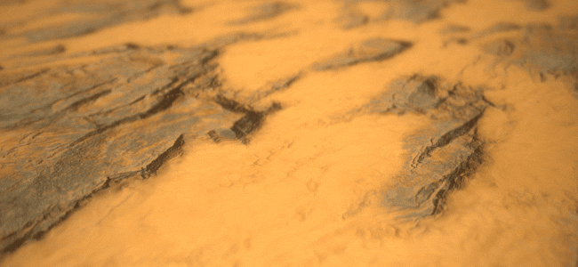
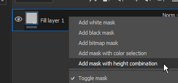

# Versione 2019.1

**Substance Painter 2019.1** amplia le funzionalità esistenti e introduce nuovi strumenti artistici. Questa versione è stata studiata per offrire nuovi contenuti.

Data di pubblicazione: *23 aprile 2019*

## Caratteristiche principali

### Tratti dinamici

Con questa versione, il nostro motore di pennelli ora supporta quelli che chiamiamo Tratti dinamici. Questi tipi di tratti creano variazioni e nuovi effetti grazie alla generazione immediata di nuove versioni di Substance. Ora è possibile avere un nuovo materiale Substance o alfa per ogni nuovo tratto del pennello dipinto sulla risorsa.

Quando una risorsa compatibile con Traccia dinamica viene caricata nello strumento Disegno (Disegno, Gomma, Sfumino o Clone), viene visualizzato un nuovo gruppo di parametri:

Tratti dinamici supporta le seguenti proprietà (se visualizzate nel grafico della Substance):

* **Indice timbro**: ID/numero di un timbro all&#39;interno di un tratto.
* **Numero casuale**: può cambiare per timbro o per tratto.
* **Tempo**: il tempo di colorazione trascorso di un tratto del pennello, il disegno veloce o più lento, produce risultati diversi.

L&#39;indice del timbro viene fornito con altri due parametri:

* **Inizio timbro**: *Dall&#39;inizio* (avviare sempre l&#39;indice da 0) o *Dall&#39;indice casuale* (scegliere una posizione casuale compresa tra 0 e il massimo definito da **Conteggio ciclo timbro**).
* **Totale cicli timbro**: questo parametro definisce la quantità totale di variazioni di Substance che verranno generate. Per ottimizzare le prestazioni, questo parametro funge da limite. Substance Painter usarlo per riciclare ciò che è già stato generato invece di creare qualcosa di nuovo.

Per trovare le risorse compatibili con questa nuova funzione, basta sfogliare il ripiano e osservare le nuove icone accanto alle quali si trovano le foto:

Le risorse compatibili con la funzione ricevono automaticamente anche un nuovo tag denominato &quot;**dynamicstroke**&quot; per semplificarne il filtraggio in base alle parole chiave nello scaffale.

Abbiamo aggiunto anche molti nuovi **strumenti predefiniti** con cui giocare:

{width="450px"}

>[!NOTE]
>
> Per ulteriori informazioni su questa funzione (e sul suo impatto sulle prestazioni), consulta la [documentazione dedicata](../../painting/dynamic-strokes/dynamic-strokes.md).

### Spostamento E Tassellatura

Substance Painter ora supporta **Spostamento** e **tesselazione trama** sia nella finestra della vista in tempo reale che in Iray. Entrambi possono essere controllati nella finestra **Impostazioni shader** sotto i parametri dello shader.

* **Canale di origine**: canale da cui è basata la deformazione della trama. Il valore predefinito è Height, ma può essere impostato anche su Spostamento.
* **Scala**: controlla la quantità di deformazione applicata alla trama nel progetto.

* **Modalità suddivisione**: uniforme o lunghezza bordo. Determina la modalità di calcolo della quantità di suddivisione.
* **Conteggio suddivisioni**: (Modalità uniforme) Da 1 a 32. Un valore elevato genera più poligoni, che forniscono maggiori dettagli ma possono introdurre problemi di prestazioni.
* **Lunghezza Massima**: (Lunghezza Bordo Modalità) 1 / Valore. Ogni bordo del poligono viene diviso fino a quando ogni segmento è uguale o inferiore a questo numero, 1/1 è la dimensione della scena.

Carica il progetto di esempio &quot;**Materiale da affiancare**&quot; (tramite **File > Carica campione**) per provare rapidamente questa nuova funzione:

{width="450px"}{width="450px"}

>[!NOTE]
>
> È stato aggiunto un nuovo filtro denominato &quot;**Height a normale**&quot; nello scaffale che può essere utilizzato per ottenere la mappa normale finale (nel caso in cui la conversione nativa per Substance Painter non sia sufficientemente forte).

### Confronta effetto maschera

La creazione e la fusione di materiali a volte può essere un po&#39; difficile ed è per questo che abbiamo creato un nuovo effetto denominato &quot;**Confronta maschera**&quot;. Questo effetto consente di confrontare rapidamente e facilmente due canali e di produrre di conseguenza una maschera.

L&#39;effetto Confronta maschera ha le seguenti proprietà:

* **Canale**: canale da confrontare tra l&#39;origine e la destinazione da cui creare una maschera.
* **Confronto**: in questa posizione sono disponibili tre parametri per scegliere come calcolare la maschera. Il menu a discesa al centro definisce l&#39;operazione di confronto (minore di, entro tolleranza, maggiore di).
* **Costante**: valore da confrontare quando l&#39;impostazione di confronto è impostata su &quot;costante&quot;.
* **Durezza**: controlla lo smoothness/la durezza del confronto di maschere risultante.
* **Istogramma**: fornire una visualizzazione istogramma dell&#39;origine e della destinazione. È utile sapere se si sovrappongono un po’ o non si sovrappongono affatto (se non si sovrappongono, la maschera sarà vuota).

Per semplificare ulteriormente la configurazione, puoi fare clic con il pulsante destro del mouse su un livello e scegliere la scelta rapida &quot;**Aggiungi maschera con combinazione di height**&quot; per aggiungere rapidamente questa nuova maschera al livello. Questa scelta rapida consente anche di impostare il metodo di fusione del canale di Height su &quot;Normale&quot; anziché sull’impostazione predefinita &quot;Scherma lineare (Aggiungi)&quot;.\

### Simmetria radiale

Abbiamo ampliato le capacità del nostro strumento di simmetria per gestire la simmetria radiale. Nel menu delle impostazioni di simmetria è ora disponibile una nuova modalità che consente di attivarla (disponibile nella barra degli strumenti contestuale).

Sono disponibili le impostazioni seguenti:

* **X / Y / Z**: controlla la direzione dell&#39;asse di simmetria utilizzato dalla simmetria radiale.
* **Conteggio**: numero di punti duplicati.
* **Estensione angolo**: posizione dei punti duplicati rispetto a quello originale. Questa impostazione può essere utilizzata per creare un cerchio completo o un quarto di esso, ecc.

È stata inoltre aggiunta una piccola anteprima per modificare più facilmente le impostazioni prima di iniziare a dipingere:

### Nuove modalità di proiezione del livello di riempimento

Sono state aggiunte due nuove modalità di proiezione con livelli di riempimento ed effetti di riempimento: **Planare** e **Sferico**. Abbiamo inoltre aggiunto molti nuovi parametri per controllare ulteriormente il comportamento delle proiezioni 3D.

* **Nuova modalità proiezione planare**\
  Con questa nuova modalità è ora possibile proiettare un piano. Può essere utile per la creazione di strisce sui veicoli o il posizionamento di decalcomanie in un punto specifico.

  
* **Strumento superficie per proiezione planare**\
  Per semplificare la manipolazione della proiezione planare, abbiamo aggiunto anche un nuovo controllo per il manipolatore 3D, chiamato **strumento superficie**, a cui è possibile accedere con la scelta rapida &quot;**Maiusc+W**&quot;. È inoltre possibile accedervi dalla barra degli strumenti contestuale. Questa nuova modalità è disponibile solo con Proiezione planare.

  

  
* **Abbattimento/dissolvenza della proiezione planare**\
  Sono disponibili più impostazioni per rendere la proiezione planare continua o finita. Quando è attivata un’impostazione di taglio, il riquadro punteggiato attorno al manipolatore indica il rettangolo di selezione per la proiezione e la linea centrale è il punto di inizio della proiezione. Il ridimensionamento della proiezione consente di controllare quanto va e quando inizia a sfumare.

  {width="500px"}

  
* **Nuova modalità Proiezione sferica**\
  Ora è possibile utilizzare la proiezione sferica in questa nuova modalità. Con esso è possibile ottenere serie avanzate o seguire più facilmente superfici curve.

  {width="350px"}
* **Nuove impostazioni di ritaglio forma**\
  Le proiezioni 3D sono ora configurate in modo da controllare la ripetizione della proiezione. Molto utile, ad esempio, perché una decalcomania si ripete solo su un’area specifica senza doverla mascherare manualmente.

  {width="500px"}
* **Impostazioni esistenti spostate e rinominate**\
  Grazie a queste nuove proiezioni abbiamo rielaborato il funzionamento di alcune impostazioni. &quot;**Tiling**&quot; è stato rinominato come &quot;**Involucro UV**&quot;. La suddivisione in porzioni ora può essere impostata solo in verticale o in orizzontale. Scala, Rotazione e Scostamento fanno ora parte di un nuovo gruppo di parametri denominato &quot;**Trasformazioni UV**&quot; per maggiore coerenza tra le modalità di proiezione.

  

  
* **Modalità a tutti gli assi del manipolatore di rotazione migliorata** Anziché disegnare una sfera esplicita, è ora nascosta per evitare di nascondere la texture sottostante. Facendo clic tra gli assi si seleziona la sfera che consente di ruotare tutti gli assi contemporaneamente.\
  

### Vari miglioramenti

* **Selezione multipla per set di texture**\
  Ora è possibile selezionare più set di texture per modificarne la risoluzione contemporaneamente tramite le impostazioni Set di texture.\
  Nella modalità di selezione multipla esiste ancora il concetto di set di texture &quot;principale&quot;, ed è per questo che gli elementi aggiuntivi vengono selezionati in grigio. Se dovete passare a un diverso set di texture mantenendo la selezione corrente, potete utilizzare il pulsante centrale del mouse per effettuare questa operazione.
* **Visualizzazione rapida nell&#39;elenco dei set di texture**\
  Ora potete fare clic e trascinare (come nella pila di livelli) per nascondere o mostrare i set di texture.
* **Interfaccia utente migliorata per lo stack di livelli**\
  Abbiamo modificato l’icona per rendere lo stato nascosto/visualizzato di un livello più coerente e comprensibile. Abbiamo inoltre modificato il modo in cui vengono visualizzati i livelli selezionati, in modo da poterli confrontare più facilmente con la selezione dei loro effetti e di altri livelli.\
  
* **Nuova posizione dell’effetto in base alla selezione corrente** Qualsiasi nuovo effetto aggiunto su un livello ora verrà posizionato appena sopra quello attualmente selezionato.\
  
* **Alternanza rapida dei pulsanti dei canali del materiale**\
  Ora è possibile premere ALT e fare clic su un pulsante di canale per isolarlo. Facendo nuovamente clic si riattiveranno tutti i canali.\
  
* **Il dithering durante l&#39;esportazione** è ora possibile disabilitare il dithering tramite un&#39;impostazione dedicata nella finestra di esportazione accanto al formato del file e alla profondità di bit. Per ulteriori informazioni su come e quando viene applicato il dithering [consultare la documentazione sull&#39;esportazione](../../export/export-window/export-window.md).\
  
* **Istogrammi migliori**\
  Abbiamo rielaborato il nostro generatore di istogramma. Gli istogrammi ora dovrebbero visualizzare informazioni più precise e essere aggiornati correttamente dopo una modifica nella pila dei livelli.\
  
* **Migliore creazione di istanze dei livelli**\
  Per i livelli istanziati ora il metodo di fusione è impostato su &quot;Attraversa&quot; invece del metodo di fusione predefinito. Questo metodo di fusione migliorerà la compatibilità di alcuni effetti quando i livelli vengono divisi in istanze tra set di texture.

### Nuovo contenuto

In questa versione abbiamo aggiunto anche molti contenuti nuovi: dai predefiniti alle Alpha e persino nuovi potenti filtri.

* **Nuovi pennelli e strumenti predefiniti**\
  Questa versione introduce la nuova funzione Tratti dinamici e con essa abbiamo aggiunto alcuni predefiniti Pennello e Strumento pronti all’uso.

  * 10 nuovi predefiniti pennello:
    * Inchiostro sporco
    * Inchiostro casuale
    * Foglia curva pesante
    * Curva foglia
    * Disordine foglia
    * Leaf Simple
    * Vortice foglia
    * Zigzag lungo
    * Corto a zig-zag
    * Passo a zig-zag
  * 11 nuovi strumenti predefiniti:
    * Foglie autunnali
    * Crepe
    * Impronte
    * Tonalità sfumatura
    * Unghia
    * Ciottoli
    * Graffi
    * Colorazione spray
    * Spray per la pelle
    * Spray cutaneo rosso
    * Cerniera
* **93 nuovi Alpha**\
  Ce ne sono troppe per enumerarle tutte, quindi dai un&#39;occhiata alla sezione &quot;Alpha&quot; della Mensola e vedrai tante nuove Frecce, Triangoli, Segni e altri tipi di forme.
* **13 nuovi filtri**\
  In questa nuova versione abbiamo molti nuovi filtri che possono essere molto utili in caso di perdita di situazioni:

  * **Sfocatura Pendenza**: è stato aggiunto un nuovo filtro di sfocatura. Questo filtro funziona in modo simile al filtro di alterazione: usate l’input esistente o uno personalizzato per sfocare il canale di destinazione.
  * **Smussato**: crea un bordo sfumato intorno a una forma, utile se ad esempio desideri espandere la maschera.
  * **Corrispondenza colori**: questo filtro tenta di confrontare un colore di origine con un colore di destinazione. Utile per la regolazione dei colori su un materiale.
  * **Curva di sfumatura**: questo filtro fornisce un elenco di predefiniti di curva che possono essere applicati a qualsiasi input in scala di grigio per modificarne l’aspetto.
  * **Dinamica sfumatura**: esegue il remapping di un input in scala di grigio in base a una nuova immagine di input (in scala di grigio o a colori).
  * **Regolazione Height**: questo filtro fornisce due impostazioni per manipolare facilmente il canale del height: Scostamento e Moltiplica.
  * **Da Height a normale**: questo filtro converte il canale del Height in un normale e lo invia al canale normale. I controlli di intensità variano a seconda delle esigenze.
  * **Contorno maschera**: questo filtro crea un bordo bianco su nero attorno a un input in scala di grigi. Questa funzione è particolarmente utile in Maschera per creare bordi intorno alle forme.
  * **PBR Validata**: è stato aggiunto questo filtro per verificare che i colori dei materiali PBR siano negli intervalli corretti. Per ulteriori informazioni, consulta la [Guida PBR](https://www.allegorithmic.com/pbr-guide)!
  * **MatFX Peeling Paint**: simula la sbucciatura della pittura precedente. Questo filtro produce raggi alfa che facilita la fusione con i materiali sottostanti.
  * **Gocce d&#39;acqua MatFx**: simula le gocce d&#39;acqua sulla superficie di un oggetto. Come l&#39;acqua su un&#39;auto dopo la pioggia.
* **7 nuovi generatori**\
  Con questa versione sono stati aggiunti alcuni nuovi generatori:

  * **Occlusione ambiente**: Generatore di maschere che offre controlli sulla mappa della trama dell&#39;Occlusione ambiente. In base all’Editor maschera.
  * **World Space Normals**: Generatore di maschere che offre controlli sulla mappa della trama World Space Normals. In base all’Editor maschera.
  * **Posizione**: Generatore di maschere che offre controlli sulla mappa della trama di posizione. In base all’Editor maschera.
  * **Curvatura**: Generatore maschera che offre controlli sulla mappa Trama curvatura. In base all’Editor maschera.
  * **Cucitura automatica**: Generatore maschera che crea punti vicino ai bordi UV, alla curvatura della trama o attorno a un input maschera personalizzato.
  * **Densità texel UV**: helper che genera una sfumatura colorata in base alla densità texel dei poligoni della trama.
  * **Colore casuale UV**: genera un colore casuale per Isola UV (o in base a un input sfumatura personalizzato).
* **2 nuove mappe di ambiente**

  * Foresta autunnale
  * Terreno Canopus

    
* **5 nuove procedure**

  * Tonalità sfumatura
  * Generatore sfumature
  * Variazione colore per indice
  * Variazione colore in base al valore di partenza
  * Sfumatura stilizzata

    

## Tutorial

Guarda il nostro tutorial sulle nostre funzioni più recenti:

È disponibile anche un&#39;esercitazione di Substance Academy sulla creazione di un tratto dinamico: [Creazione di un tratto dinamico personalizzato per Substance Painter](https://academy.allegorithmic.com/courses/Creating-a-custom-Dynamic-Stroke-for-Substance-Painter)

## Note sulla versione

### 2019.1.3

*(Rilasciato il 1° luglio 2019)*\
Riepilogo: **Correzione rapida con 2 nuove funzioni**

**Corretto:**

* &quot;Segui tracciato&quot; non funziona sempre
* La mappatura dei canali non funziona con SBSAR utilizzato negli slot a canale singolo
* [Serie di livelli] Prestazioni ridotte durante lo scorrimento con livelli nascosti
* Arresto anomalo di [TextureSet] quando si fa clic tra le maschere
* Lo Spostamento [SVT] non viene visualizzato correttamente e in alcuni casi sfarfalla
* [Alembic] Arresto anomalo con trama che utilizza le normali dei punti invece delle normali dei vertici
* [Alembic][Log] Segnala un errore nel log se il file Alembic non è supportato durante l&#39;importazione

### 2019.1.2

*(Rilasciato il 21 maggio 2019)*\
Riepilogo: **HotFix**

**Corretto:**

* Arresto anomalo quando si selezionano due risorse con un input di immagine

### 2019.1.1

*(Rilasciato Il 20 Maggio 2019)*\
Riepilogo: **HotFix**

**Aggiunto:**

* Aggiornamento alla versione più recente di Substance Engine con l’ultima versione di Substance Designer 2019.1

**Corretto:**

* [Substance] Visibile se non viene preso in considerazione per le immagini di input
* [SVT][Engine] La modifica della risoluzione del set di texture in alcuni casi causa un arresto anomalo
* [Engine] In alcuni casi vengono visualizzate texture di nero casuale
* [Serie di livelli][UI] Alternando una maschera con MAIUSC è possibile selezionare più livelli contemporaneamente
* [Serie di livelli] L’opacità non ha effetto sull’effetto Disegno con metodo di fusione Attraversa
* [Serie di livelli] L’input del filtro Da Height a normale non si aggiorna correttamente con il tratto del pennello gomma
* [LayersStack] Arresto anomalo quando si annulla la rilascio di una maschera avanzata
* Sfarfallio del wireframe con ombre e anti-alias temporale attivati
* [Spostamento] Ritardo su AMD con alcune trame pesanti
* [Windows] Arresto anomalo all&#39;apertura di alcuni progetti tramite Esplora file
* [Istogramma] Arresto anomalo durante la rimozione di una maschera con punto di ancoraggio in alcuni casi
* Arresto anomalo nella generazione dell’anteprima in alcuni rari casi
* [Arresto anomalo] Impossibile riaprire un progetto con troppi strumenti di clonazione e sfumino
* Nessuna trama visualizzata in modalità materiale dopo il salvataggio in alcuni casi
* [Scripting] alg.mapexport.documentStructure() restituisce valori errati per le cartelle

**Problemi noti:**

* Facendo doppio clic sul nome del set di texture, questo viene selezionato prima di passare alla modalità di ridenominazione

### 2019.1

*(Rilasciato il 23 aprile 2019)*\
Riepilogo : **Traccia dinamica con nuovi contenuti dedicati, Spostamento e tassellatura in tempo reale e irradiazione, effetto maschera di confronto, simmetria radiale, planare e Proiezione sferica**

**Aggiunto:**

* [Strumento] Tratto dinamico: Substance la variazione lungo il tratto di un pennello
* [Tratto dinamico] Esposizione del nuovo parametro indice del timbro con le opzioni
* [Tratto dinamico] Tieni conto del parametro $time
* [Tratto dinamico] Genera un nuovo parametro $randomseed per tratto e per timbro
* [Tratto dinamico] Avvia un indice di tratto dinamico da un numero casuale
* [Tratto dinamico][Scaffale] Aiuta a trovare una risorsa tratto dinamico con una nuova icona dedicata
* Spostamento e tassellatura nella finestra della vista in tempo reale
* Spostamento e tassellatura in Iray
* [Impostazioni shader][UI] Nuova scheda per il controllo dello spostamento e della tassellatura
* [Serie di livelli] Nuovo effetto Confronta maschera: genera una maschera confrontando due canali
* [Stack di livelli][UI] Nuova voce nel menu di scelta rapida &quot;Aggiungi maschera con combinazione di height&quot; per inserire un effetto CompareMask
* [Simmetria] Nuova modalità simmetria: pittura radiale
* [Impostazioni simmetria] Espandere entrambe le sezioni &quot;Impostazioni&quot; e &quot;Visualizzazione&quot;
* [Impostazioni simmetria][UI] Anteprima per pittura radiale
* Esporre due nuove modalità di proiezione: piana e sferica
* [Proj] Nuova modalità di ritaglio forma per tutte le proiezioni
* [Proj] Modalità Planare con nuovo manipolatore: strumento Superficie
* [Proj][Scelta rapida] Scelta rapida MAIUSC+W per lo strumento Superficie
* [Proj] Maschera di proiezione planare con taglio a sfoltimento profondità e sfondo
* [Manipolatore] Miglioramento del manipolatore di rotazione su tutti e tre gli assi per triplanare
* [Tool][UX] Se si fa clic su un canale tenendo premuto il tasto Alt, tale canale viene attivato o disattivato
* [Engine] Aggiornamento alla versione più recente di Substance Engine
* [Set di texture] Selezione multipla e modifica della risoluzione
* [Set di texture] Attivazione e disattivazione rapida dei set di texture
* [Set di texture] Combina solo e tutte le opzioni in un nuovo menu
* [Set di texture][Layer stack] Icona Nuova per attivazione e disattivazione
* [Layer stack][UX] Inserisci effetti sopra quelli già selezionati
* [Serie di livelli][UI] Rielaborare lo stile di selezione della visualizzazione della serie di livelli
* [Serie di livelli] Per impostazione predefinita, il metodo di fusione per i livelli istanziati è ora impostato sul metodo Attraversa
* Opzione [Esporta] per attivare e disattivare il dithering
* [Plugin] Supporta il modificatore di precisione per i cursori (SHIFT)
* [Plugin][UI] Nuova icona per il salvataggio automatico
* [Scripting] Elenca il contenuto di una cartella
* [Scripting] Consente l’eliminazione dei file
* [Scripting] Leggi tutte le informazioni sullo stack, incluse le risorse utilizzate
* [Contenuto][Tratto dinamico] Nuovi strumenti e pennelli predefiniti
* [Contenuto][Tratto dinamico] Due nuove sfumature procedurali: Tonalità sfumatura e Generatore sfumatura
* [Contenuto] 11 nuovi filtri: MatFx Peeling Paint, MatFx Water Drops e altro ancora
* [Content] 7 nuovi generatori: Cucitrice automatica, Colore casuale UV, Densità texel UV e altro ancora
* [Contenuto] 93 nuove alfa: nuovi testi, frecce e varie altre forme
* [Content] 2 nuove procedure: Tonalità sfumatura, Generatore sfumatura e altro ancora
* [Contenuto] 21 nuovi strumenti e pennelli predefiniti per Tratti dinamici : Ciottoli, Impronte, Spruzzo e altro ancora
* [Content] 2 Nuove HDR: terreno di Canopus e foresta autunnale
* [Content] Aggiorna il contenuto con la cura del seme casuale nello scaffale
* [Content] Nuova icona con parametro di inizializzazione casuale esposto nello scaffale

**Corretto:**

* [Pila livelli] La pila di livelli continua a trascinare per sempre
* [Mac] &quot;Mostra nel Finder&quot; può portare al blocco
* [Scripting] Le impostazioni salvate tramite l’interfaccia utente personalizzata vengono perse se il file dello shader viene spostato
* [Scripting] Il numero di versione dell’API non è corretto e non aggiornato
* [Effetto] Il contenuto dell’istogramma non viene visualizzato correttamente
* [Effetto] In alcuni casi l’effetto Istogramma non si aggiorna
* [Ripiano] I punti non sono allineati correttamente sul materiale &quot;Plastic Fabric Pyramid&quot;

**Problemi noti:**

* Facendo doppio clic sul nome del set di texture, questo viene selezionato prima di passare alla modalità di ridenominazione
* [Serie di livelli][UI] Alternando una maschera con MAIUSC è possibile selezionare più livelli contemporaneamente
