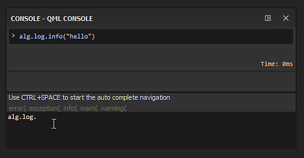
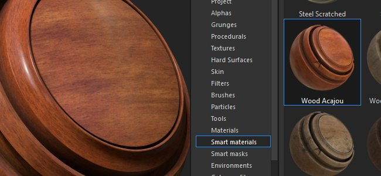

# Versione 2019.2

**Substance Painter 2019.2** introduce nuove potenti funzionalità nei suoi forni e offre un nuovo set di materiali intelligenti e maschere intelligenti nello scaffale.

Data di pubblicazione: *25 luglio 2019*

## Caratteristiche principali

### Miglioramenti del flusso di lavoro per i fornai

Il flusso di lavoro di cottura è stato migliorato con questa versione con alcune nuove funzioni. Questi miglioramenti velocizzeranno e semplificheranno il lavoro quotidiano con Substance Painter.

* **Visualizzazione del processo di cottura**\
  Per impostazione predefinita, con questa nuova versione qualsiasi processo di baking sarà ora visibile nella finestra della vista. Consente di visualizzare in anteprima il risultato dei fornai in tempo reale e persino di annullarlo se necessario senza attendere la fine del processo per offrire iterazioni più rapide. Questo comportamento può essere disattivato accedendo alle impostazioni principali e deselezionando l&#39;impostazione &quot;**Abilita processo di cottura in anteprima dal vivo**&quot; nella sezione &quot;**Opzioni di cottura**&quot;.

  

  {width="500px"}
* **Finestra di dialogo relativa alla cottura migliorata**\
  La finestra di dialogo relativa alla cottura al forno è stata rielaborata e presenta ora uno stato migliore del processo di cottura corrente. Ora è disponibile un contatore che indica quante texture verranno calcolate, nonché un elenco esplicito per panettiere e set di texture di ciò che viene calcolato. In caso di errore, accanto al nome del fornaio viene visualizzata una croce rossa. Al termine del processo un nuovo pulsante consente di aprire rapidamente la finestra di registro per saperne di più sul problema.\
  
* **Annullamento della cottura in corso** Il processo di cottura non blocca più l&#39;applicazione. La Substance Painter è ora più reattiva, il che significa che è possibile annullare un bake attualmente in corso senza attendere che finisca. L’annullamento non è tuttavia immediato e potrebbe richiedere alcuni secondi per avere effetto. Questo perché internamente il processo di cottura al forno funziona sulle texture nei blocchi e non può arrestarsi durante il calcolo di un blocco. Quando si annulla il processo di cottura al forno, la finestra di cottura si riapre automaticamente.\
  

### Miglioramenti delle prestazioni per i panettieri

Con il miglioramento del flusso di lavoro abbiamo anche colto l&#39;occasione per aggiornare i nostri fornai e migliorare le loro prestazioni. Abbiamo aggiunto anche il supporto di DXR e Optix per abilitare il Raytracing GPU che consente di cuocere molto più velocemente di prima. Tuttavia, il Raytracing GPU influisce solo sull’Occlusione ambiente e sul fornaio di Thickness.

* **Il Raytracing della CPU è stato migliorato**\
  Il calcolo del ray tracing sulla CPU è ora da 2 a 3 volte più veloce di prima. Pertanto, anche se la GPU non è compatibile con Raytracing GPU, in generale si ottengono comunque miglioramenti delle prestazioni.
* **Raytracing GPU supporto con DXR e Optix**\
  Grazie all&#39;hardware compatibile, i produttori possono ora elaborare direttamente i dati sulla GPU, riducendo drasticamente i tempi di calcolo, in particolare quando è attivato l&#39;anti-alias e vengono definiti molti raggi. DXR è l&#39;opzione predefinita quando disponibile, altrimenti verrà utilizzato Optix. È possibile disattivare il Raytracing GPU accedendo alle [impostazioni principali](../../interface/settings/settings.md) e cercando &quot;**Opzioni di cottura**&quot;:

  

>[!NOTE]
>
> Per abilitare la funzione Raytracing GPU, assicurati di eseguire l&#39;aggiornamento ai seguenti driver: **Driver Nvidia 430.86**.\
> DXR è disponibile su GPU RTX e [GPU GeForce GTX 10xx](https://www.nvidia.com/en-us/geforce/news/geforce-gtx-dxr-ray-tracing-available-now/). DXR richiede inoltre che Windows 10 sia aggiornato per essere accessibile (versione 1809). Per ulteriori informazioni, consultate questa pagina.

>[!WARNING]
>
> Quando si utilizza Raytracing GPU, il fornaio potrebbe non riuscire se la trama ad alto poli non può essere contenuta in VRam. Quando si verifica questo problema, è consigliabile accedere alle [impostazioni principali](../../interface/settings/settings.md) e disattivare l&#39;impostazione &quot;**Raytracing GPU**&quot; nella sezione &quot;**Opzioni di cottura**&quot;. Dopodiché, potete semplicemente riavviare il processo di cottura al forno.

### Nuove funzioni e miglioramenti vari

In questa versione abbiamo anche aggiunto e rielaborato alcune cose per migliorare la qualità della vita all’interno della Substance Painter.

* **Manipolatore di rotazione migliorato**\
  Il manipolatore di rotazione era un po&#39; lento in passato, rendendo le rotazioni a volte noiose da eseguire. La velocità di rotazione è ora collegata alla fotocamera e alle dimensioni della scena.
* **Prestazioni migliorate su schermi ad alto DPI con downscaling della finestra della vista**\
  Nelle [impostazioni principali](../../interface/settings/settings.md) è ora disponibile un nuovo parametro denominato &quot;Ridimensionamento finestra vista&quot; con il valore &quot;**Nessuno**&quot; e &quot;**Automatico**&quot; (impostazione predefinita). Quando Substance Painter rileva che uno schermo utilizza il ridimensionamento HDPI (ad esempio schermi Retina su MacOS), divide automaticamente la risoluzione della finestra della vista per 2. In questo modo si evita di ingrandire eccessivamente la finestra della vista e si migliorano le prestazioni generali senza alcuna perdita di qualità evidente.

  
* **Nuovo plug-in console per scripting**\
  Abbiamo creato un nuovo plug-in per eseguire facilmente i comandi dalla nostra API di scripting. Disponibile su Github: <https://github.com/AllegorithmicSAS/painter-plugin-console>. La console supporta anche il completamento automatico.

  

### Nuovo contenuto

Un nuovo set di materiali intelligenti e maschere intelligenti è stato aggiunto allo scaffale predefinito per coprire vari usi. Di seguito è riportato l&#39;elenco completo delle risorse aggiunte:

* **40 nuovi materiali avanzati**

  * Tessuto
    * Area di lavoro tessuto piegata
    * Tessuto composito rinforzato usato
    * Denim tessuto lavato
    * Tessuto Flannel Tartan
    * Tessuto lenzuola piegato
    * Tessuto lenzuola indossato
    * Punti sintetici tessuto
    * Tessuto sintetico sport usato
  * Pelle
    * Grana Di Vitello In Pelle
    * Leather Creased
    * Pelle di colore naturale
    * Pelle grezza scura
  * Marmo - Granito
    * Marmo Verde Alpi
  * Metallo
    * Oro danneggiato
    * Ferro Forgiato Vecchio
    * Sporco scheggiato verniciato in acciaio
    * Ruvido dipinto in acciaio danneggiato
    * Sporco avvolto in acciaio
    * Verniciato in acciaio verde raschiato
    * Verniciato in acciaio usurato
    * Acciaio in rovina
  * Organico
    * Creatura della pelle Alien blu
    * Crea incarnato verde liscio
    * Creare i denti
    * Creatura della lingua
  * Plastica - Gomma
    * Plastica Polverosa
    * Plastica lucida soffiata
    * Plastica lucida colorata
    * Plastica granulosa morbida
    * Graffiato grezzo in plastica
    * Plastica termoformata
    * Plastica spessa crepata
    * Strumento di plastica usurato
    * Plastica Usata Morbida
  * Pietra
    * Sapphire Corundum
  * Traslucido
    * Specchio sporco pellicola di vetro
  * Legno
    * Carboncino
    * Wood Acajou
    * Nave di legno scafo nordico
    * Nave Di Legno Scafo Vecchio
* **20 nuove maschere avanzate**

  * Grinze
  * Cavità dirt
  * Dirt terreno
  * Perdita dirt a secco
  * Dirt bordi sfumati
  * Schizzi dirt
  * Dirt macchie
  * Plastica dust
  * Dust bordi sfumati
  * Superficie dust
  * Dust bordi larghi
  * Crepe sporca bordo
  * Edge Stone Crepe
  * Bordi con graffi marcati
  * Thread infrastruttura
  * Dipinto danneggiato
  * Disegna graffio discreto
  * Cavità sabbia
  * Dust sabbia
  * Gocce d&#39;acqua

## Note sulla versione

### 2019.2.3

*(Rilasciato il 23 ottobre 2019)*\
Riepilogo: **Bugfix**

**Aggiunto:**

* Pulsante Aggiungi [Texture Set List] per attivare/disattivare rapidamente la modalità di attivazione
* [Log] Aggiungere il numero di versione di Windows 10 nel file di log
* Aggiornamento alla versione più recente di Substance Engine
* [MacOS] Ha autenticato il software per soddisfare i nuovi requisiti di distribuzione di MacOS Catalina

**Corretto:**

* [Plugin] L&#39;origine del plug-in non funziona
* [MacOS]&#x200B;[Shader] Mac OS 10.14.5 e AMD: la creazione di livelli di materiale non funziona come previsto

**Problemi noti:**

* Impossibile importare file alembici con suddivisioni
* Rari arresti anomali durante l’importazione di alcuni file Alembic
* L’interfaccia utente temporaneamente non risponde durante la cottura in forno con DXR su GPU Pascal

### 2019.2.2

*(Rilasciato Il 20 Settembre 2019)*\
Riepilogo: **Bugfix**

**Corretto:**

* L’importazione di risorse tramite script può causare un arresto anomalo
* [Plugin] Il download di materiale dall’origine può causare un arresto anomalo

### 2019.2.1

*(Rilasciato Il 17 Settembre 2019)*\
Riepilogo: **Bugfix**

**Corretto:**

* [Mac]&#x200B;[USD] Impossibile aprire i file USDZ esportati da MacOS
* [Set di texture] Impossibile isolare un set di texture con il modificatore ALT
* [Shelf] I predefiniti, i materiali avanzati e le maschere intelligenti vengono sempre modificati quando si esce dall’applicazione
* [Serie di livelli] Impossibile selezionare l’effetto dopo aver eliminato un altro effetto
* Sfarfallio quando si utilizza un cursore all’interno del pannello delle proprietà dello strumento
* Arresto anomalo durante l’esportazione dei predefiniti nello scaffale
* Arresto anomalo durante l’esportazione di un predefinito con spazio insufficiente
* Arresto anomalo durante la creazione di un predefinito con spazio insufficiente

**Problemi noti:**

* Impossibile importare file alembici con suddivisioni
* Rari arresti anomali durante l’importazione di alcuni file Alembic
* L’interfaccia utente temporaneamente non risponde durante la cottura in forno con DXR su GPU Pascal

### 2019.2

*(Rilasciato il 25 luglio 2019)*\
Riepilogo: **Versione principale con aggiornamenti dei forni in termini di prestazioni e una nuova modalità di previsualizzazione + nuovi contenuti**

**Aggiunto:**

* [Bakers] Aggiunto il supporto per Raytracing GPU con DXR e OptiX (Occlusione ambientale, Thickness)
* [Baker] Ottimizzazioni e accelerazioni per il Raytracing della CPU
* [Bakers]&#x200B;[Vis mode]&#x200B;[UI] Nuova modalità di visualizzazione baking nella finestra della vista
* [Bakers]&#x200B;[Preferenze]&#x200B;[UI] Nuova opzione baking per abilitare-disabilitare Raytracing GPU
* [Pannelli]&#x200B;[UI] Rielaborazione della finestra di dialogo barra di avanzamento
* [Bakers] Miglioramento dei messaggi di avviso e di errore
* [Panettieri] Consenti una cancellazione più reattiva del processo di cottura al forno
* [Bakers] Riapri la finestra del bake dopo aver fatto clic su Annulla
* [Proj]&#x200B;[UX] Miglioramento dell&#39;usabilità del manipolatore di rotazione
* [Settings] Opzione per migliorare le prestazioni riducendo la risoluzione del viewport per schermi HDPI
* [Scripting] Modificare la risoluzione del set di texture
* [Scripting] Ottieni set di texture selezionato
* [Scripting] Consente di selezionare un set di texture
* [Scripting] Funzione per sapere quando la selezione del set di texture è stata modificata
* [Shelf] Aggiunti 40 nuovi materiali intelligenti
* [Shelf] Aggiunte 20 nuove maschere avanzate

**Corretto:**

* [Serie di livelli] Blocco dell’interfaccia utente durante la selezione multipla dei livelli
* [Serie di livelli] Il raggruppamento di numerosi livelli blocca l’interfaccia utente per un tempo più lungo del solito
* [Pila di livelli] In alcuni casi è possibile selezionare contemporaneamente un livello e un effetto
* I grafici delle Substance utilizzati negli strumenti di pittura non vengono generati alla risoluzione giusta
* [Baker] Il pulsante &quot;Crea in forno tutti i set di texture&quot; non è disattivato quando non è selezionato alcun panettiere
* [MacOS] Disattiva il messaggio di avviso sulla tassellatura
* Lo strumento Proiezione non ha un’anteprima quando viene utilizzato con una maschera
* Arresto anomalo e danneggiamento dei progetti durante il tentativo di salvataggio con spazio su disco insufficiente
* [Shelf] Arresto anomalo durante l&#39;importazione di una risorsa su disco tramite shelf con spazio insufficiente
* [Shelf] Arresto anomalo durante il ripristino del predefinito di sessione
* [Shelf] L’importazione di un predefinito con un nome che termina con uno spazio causa un arresto anomalo
* [Shelf] L&#39;importazione di una risorsa con un prefisso che termina con uno spazio vuoto provoca un arresto anomalo

**Problemi noti:**

* Impossibile importare file alembici con suddivisioni
* Rari arresti anomali durante l’importazione di alcuni file Alembic
* L’interfaccia utente temporaneamente non risponde durante la cottura in forno con DXR su GPU Pascal
