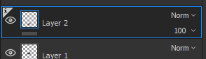
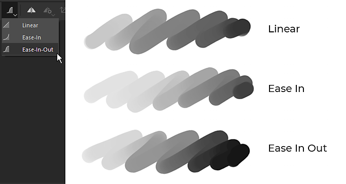
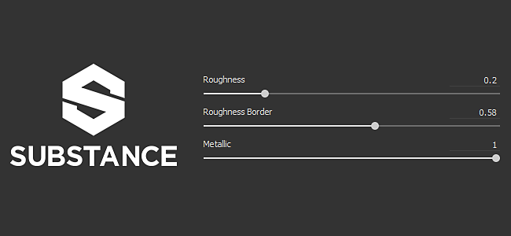
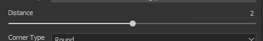
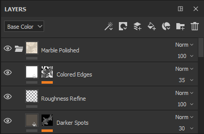
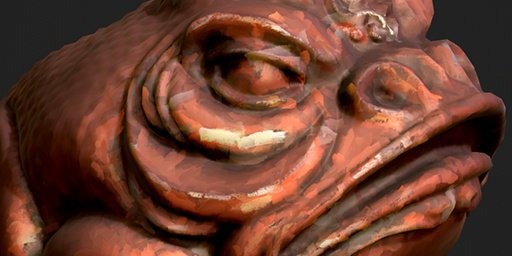

# Versione 2019.3

**Substance Painter 2019.3** introduce il supporto per i predefiniti dei pennelli di Photoshop e lo srotolamento automatico degli UV per le trame, oltre a offrire vari miglioramenti a livello di qualità della vita, come una migliore gestione delle tavolette grafiche.

Data di pubblicazione: *17 dicembre 2019*

## Caratteristiche principali

### Supporto per pennelli predefiniti Photoshop (ABR)

Ora puoi utilizzare i tuoi pennelli di Photoshop in Substance Painter. Esportando semplicemente i predefiniti come file ABR, ora potete importarli come normali pennelli predefiniti. I predefiniti contenuti all’interno di un file ABR verranno visualizzati nello scaffale come singoli pennelli predefiniti.

Se non avete file ABR da importare, potete trovarne molti online:

* [Predefiniti pennello di Kyle su Adobe](https://www.adobe.com/products/photoshop/brushes.html)
* [Pennelli predefiniti in ArtStation](https://www.artstation.com/marketplace?q=photoshop%20brush&sort_by=trending)
* [Predefiniti pennello su DeviantArt](https://www.deviantart.com/search?q=photoshop%20brush)
* [Pennelli predefiniti nel pennello cubo](https://cubebrush.co/marketplace?categories=354,57)

Per supportare i pennelli di Photoshop, sono state aggiunte diverse nuove funzioni alle proprietà dello strumento di pittura:

* **Nuovi parametri minimi di dimensioni e flusso**\
  Ora potete specificare la dimensione minima e il flusso minimo dello strumento quando è attivata la pressione della penna. Questo parametro funziona come percentuale in base alla dimensione/flusso massimo corrente definito. Queste impostazioni vengono calibrate automaticamente quando si utilizza un pennello predefinito di Photoshop.\
  
* **Nuovi parametri Variazione posizione**\
  Per adattarlo al comportamento del pennello di Photoshop, abbiamo aggiunto alcune nuove impostazioni. Ora è possibile definire l’asse a cui viene applicata la variazione e la distribuzione delle posizioni casuali (scegli **Uniforme** in base a Photoshop).\
  \
  
* **Nuovo metodo di fusione alfa**\
  Photoshop non compone i tratti di pennello allo stesso modo di Substance Painter, pertanto è stato aggiunto un nuovo metodo di fusione (Schiarisci) per una migliore corrispondenza con il risultato del disegno. Questo metodo di fusione non si accumula eccessivamente quando i timbri si sovrappongono, il che può migliorare la sensazione di pressione quando si dipinge con un valore di flusso/opacità basso.\
  \
  
* **Supporto per rotondità e capovolgimento**\
  È stato aggiunto un nuovo Alpha di Substance denominato **Brush Maker Photoshop** per supportare parametri quali Rotondità (ridimensiona il height dell&#39;Alpha) e Rifletti (rifletti un&#39;immagine su entrambi gli assi). Questo Alpha di Substance viene caricato automaticamente quando si fa clic su un pennello predefinito proveniente da un file ABR.\
  \
  
* **Nuova correzione gamma per canale alfa di livelli**\
  Photoshop non fonde i suoi tratti di pennello nello nello spazio gamma lineare; questo significa che la fusione e l’opacità potrebbero avere un aspetto errato quando si utilizza un pennello predefinito di Photoshop. È possibile attivare una nuova impostazione sui livelli in modo che corrisponda a tale comportamento e applicare una correzione gamma. Questo influirà sull’effetto alfa utilizzato per pittura i tratti del pennello e su come la maschera del livello viene utilizzata per fondersi con altri livelli. Tuttavia, i metodi di fusione del livello funzioneranno ancora nello spazio gamma lineare.\
  Per **attivare questa impostazione**, è sufficiente fare clic con il pulsante destro del mouse su un livello e scegliere **Alfa/maschera con correzione gamma**. Accanto al livello appare una nuova icona che indica quando questa impostazione è attivata.\
   \
  
* **Valore massimo aumentato per Spaziatura e Variazione posizione**\
  Per adattare correttamente i parametri predefiniti dei pennelli di Photoshop, è stato aumentato il valore massimo dei seguenti parametri:

  * **Spaziatura**: è ora possibile impostare un massimo di 1000.
  * **Variazione posizione**: è ora possibile impostare un massimo di 1000.

Per ulteriori informazioni, ad esempio su come esportare i file ABR e importarli, consultate la documentazione [Predefiniti pennello di Photoshop](../../painting/presets/photoshop-brush-presets/photoshop-brush-presets-abr.md).

>[!NOTE]
>
> Al momento non tutti i parametri dei pennelli di Photoshop sono supportati. Per ulteriori informazioni, consultare l&#39;[elenco di compatibilità](../../painting/presets/photoshop-brush-presets/photoshop-brush-parameters-compatibility.md).

### Miglioramenti nella pittura e nel supporto delle tavolette grafiche

Oltre al supporto dei predefiniti per i pennelli di Photoshop, sono stati apportati numerosi miglioramenti e correzioni all’uso dei tablet grafici.

* **Il primo timbro a linea retta non è più raddoppiato**\
  Quando disegnate una linea retta, il primo timbro non viene più duplicato (non è più necessario annullare il timbro solo per posizionare la linea retta in posizione).\
  
* **Interpolazione pressione linea retta**\
  Le linee rette ora supportano la pressione. Il valore della pressione verrà interpolato tra il primo e l’ultimo timbro.\
  
* **Nuove modalità anteprima pennello**\
  L’anteprima del pennello nella finestra della vista può ora essere modificata in diverse modalità di visualizzazione. Per cambiare modalità, fai clic sul pulsante a discesa Nuovo nella barra degli strumenti contestuale.

  
* **Curve di pressione della penna**\
  Nella barra degli strumenti contestuale è ora possibile definire come deve essere interpretata la pressione della penna. Queste nuove impostazioni consentono di controllare la velocità con cui si accumula la pressione, consentendo stili di pittura diversi.

  * **Lineare**: nessuna trasformazione. La pressione recuperata è quella fornita dalla penna della tavoletta grafica. Utilizzare questa impostazione nel caso in cui una curva di pressione della penna sia già definita nelle impostazioni dei driver del Tablet PC.
  * **Ingresso graduale** (impostazione predefinita): rallenta l&#39;inizio della pressione per facilitare la pittura di tratti sottili o deboli.
  * **Uscita graduale**: rallenta l’inizio della pressione e accelerane la fine, per rendere più facile la pittura di tratti morbidi o forti.

  
* **Il pulsante Pressione non è più un menu a discesa**\
  Abbiamo modificato i controlli della pressione della penna in semplici pulsanti di attivazione/disattivazione. In questo modo, l’attivazione e la disattivazione della pressione risultano molto più semplici e veloci.

  
* **Supporto migliorato dei tablet grafici e passaggio a Windows Ink**\
  Abbiamo rielaborato il modo in cui gestiamo i tablet grafici. Questo dovrebbe migliorare la compatibilità in generale con i modelli recenti di tavolette grafiche e ridurre il numero di problemi che avevamo in passato. Per migliorare la compatibilità, in Windows è stato inoltre impostato Windows Ink anziché Wintab.

  >[!NOTE]
  >
  > Verifica che i driver Wacom siano aggiornati e che &quot;Windows Ink&quot; sia abilitato nelle impostazioni del tablet.

### Srotolamento UV automatico (Beta)

La Substance Painter ora scompone automaticamente le trame con coordinate UV mancanti. In questo modo è possibile importare qualsiasi tipo di geometria e iniziare immediatamente la pittura. Il nostro sistema di srotolamento UV genererà un&#39;Isola UV per sottorete, pur continuando a seguire l&#39;assegnazione del materiale per creare set di texture. Questa funzione è attualmente in versione beta e si svilupperà nelle versioni future. Lo srotolamento automatico verrà applicato solo ai progetti che **non utilizzano il flusso di lavoro UDIM**.

* **Annullamento automatico del wrapping UV**\
  Per impostazione predefinita, la Substance Painter ora genera automaticamente le coordinate UV per le trame mancanti. Questo vale sia per la creazione del progetto che per la reimportazione della trama. Tuttavia, è possibile disabilitare questo comportamento accedendo alle [impostazioni principali](https://helpx.adobe.com/substance-3d/unlisted/documentation/spdoc/general-71008262.html) e disabilitando **Abilita lo srotolamento automatico degli UV** in **Opzioni di importazione**.

  
* **Annullamento del wrapping della barra di avanzamento UV**\
  Quando si importa una trama, ora è presente una barra di avanzamento che indica lo stato corrente del processo. Questo include anche il processo di srotolamento UV.

  
* **Problemi noti**\
  Poiché questa nuova funzione è attualmente in beta, sono previsti alcuni problemi. Consulta le note sulla versione di seguito per un elenco dei problemi attualmente noti. Se l’arresto anomalo dell’applicazione produce risultati errati, si consiglia di inviarci un arresto anomalo o una segnalazione di bug tramite l’applicazione per aiutarci a indagare sul problema e migliorare la procedura.

>[!NOTE]
>
> È stato aggiunto un nuovo **generatore** nello scaffale per visualizzare lo srotolamento automatico. Per utilizzarlo, è sufficiente creare un nuovo livello, aggiungere un effetto generatore e caricare la nuova risorsa **Controllo UV**.

### Miglioramenti all’integrazione Substance

Continuiamo a migliorare l&#39;integrazione del formato della Substance supportando alcune delle funzionalità a lungo attese, ma anche migliorando i sistemi esistenti come la funzione Dynamic Stroke.

* **Cursori non bloccati con intervalli morbidi**\
  Fino ad ora, i cursori esposti dal grafico delle Substance si comportavano sempre come se fossero bloccati. Significa che i valori che possono essere immessi non possono andare oltre i valori minimi e massimi predefiniti definiti dal parametro.

  
* **Supporto del passaggio definito nei parametri**\
  I grafici delle Substance con parametri con un passaggio definito verranno ora considerati quando si modifica il cursore.
* **Precisione delle cifre aumentata per i cursori a virgola mobile**\
  Il cursore Virgola mobile ora può avere valori di input che arrivano fino a 6 decimali. Ciò è tuttavia limitato dalla precisione in virgola mobile, il che significa che il valore immesso può essere arrotondato in alcuni casi.
* **Nuovo controllo Numero casuale con Tratti dinamici**\
  Ora è possibile richiedere più valori di inizializzazione casuali all’interno di un intervallo definito. Ciò consente di creare variazioni di Substance uniche e casuali pur ottenendo buone prestazioni grazie al riciclo della cache.\
  Nel gruppo Traccia dinamica, per accedere al nuovo parametro, passa dal parametro **Random Seed Type** a **Random Per Stroke** o **Random Per Stamp**. La **Quantità di campionamento casuale** definisce il numero di variazioni di Substance che verranno generate in totale. Una volta generata la quantità selezionata, verrà effettuata una selezione casuale all&#39;interno dell&#39;insieme.

  
* **Nuovi Tratti dinamici statici di dati utente**\
  È stata aggiunta una nuova ottimizzazione che consente di specificare quando una Substance può essere considerata un tratto dinamico. In modo simile a Visible If, ora è possibile aggiungere condizioni nel campo userdata per specificare sotto quale Substance Painter di condizioni generare nuove variazioni di Substance con la funzione Traccia dinamica. Per ulteriori informazioni, vedere la [documentazione di userdata](../../content/creating-custom-effects/user-data.md).
* **Nuovi dati utente per designare un nodo di output come maschera per tutti i canali**\
  È ora possibile aggiungere nuovi dati utente su un nodo di output per utilizzarli come maschera alfa per tutti gli altri canali. È simile al sistema **channel\_Alpha** esistente, ma non richiede la creazione di un nuovo output dedicato nel grafico della Substance. Per ulteriori informazioni, vedere la [documentazione di userdata](../../content/creating-custom-effects/user-data.md).

### Miglioramenti vari

Nel resto dell’applicazione sono stati apportati diversi miglioramenti che dovrebbero contribuire a migliorare le attività quotidiane nell’ambito della Substance Painter.

* **Visualizzazioni indipendenti attive**\
  La messa a fuoco 2D e 3D (scelta rapida da tastiera F) è stata modificata con il seguente comportamento:

  * **Passa il mouse sul Vista 2D**: premendo F viene attivato solo il Vista 2D.
  * **Passa il mouse sulla vista 3D**: premendo F viene attivata solo la vista 3D.
  * **Mouse all&#39;esterno delle finestre delle viste**: premendo F verrà attivata la vista 2D e 3D.

  {width="400px"}
* **Esegue i baking della tastiera e della scelta rapida da tastiera di menu della finestra**\
  La finestra di esegue i baking può essere aperta in due modi diversi:

  * Premendo **Ctrl+Maiusc+B**.
  * Accedete al menu Modifica e fate clic su **Crea mappe trama**.

  
* **Scorri i dock e le finestre con la scelta rapida Ctrl+Alt+Clic sinistro**\
  È stata aggiunta una nuova scelta rapida da tastiera che consente di scorrere finestre e banchine senza la rotella del mouse. Quale questa scelta rapida da tastiera è ora possibile scorrere con la penna della tavoletta grafica.

  
* **Miglioramenti delle prestazioni**\
  In background sono state messe in atto molte ottimizzazioni che dovrebbero migliorare le prestazioni generali della Substance Painter (dai progetti di aperture alla pittura).

### Nuovo contenuto

In questa versione sono stati aggiunti molti nuovi contenuti:

* **Progetto di esempio &quot;Meet Mat&quot; aggiornato**\
  Mat è stato aggiornato con una nuova topologia, rendendolo più facile con lo spostamento. La mappa ID è stata rielaborata per offrire maggiori possibilità di mascheratura ed è disponibile nel progetto una nuova serie di telecamere per offrire nuovi angoli di visione.

  {width="500px"}
* **Nuovi filtri**\
  Sono stati aggiunti 3 nuovi filtri per semplificare i contenuti stilizzati:

  * **Fumetto MatFx**\
    Questo filtro simula linee di tratteggio e di spigolo in base all&#39;input fornito (dal colore di base/diffusione alla curvatura).

    
  * **Acquerello MatFx**\
    Questo filtro simula la pittura con effetto acquerello con perdita di colore e assorbimento carta leggendo il colore di input.

    
  * **Dipinto a olio MatFx**\
    Ispirato al lavoro di [Emrecan Cubukcu](https://www.artstation.com/emrecancubukcu), questo filtro legge le informazioni sui colori dall’input e le traduce in tratti di pennello basati su vari parametri. Sono disponibili più predefiniti per provare facilmente le variazioni. Ti consigliamo di combinarlo con il filtro **Baked lighting environment** o di aggiungere manualmente ombre di baking/pittura nelle texture per massimizzarne l&#39;effetto.

    

    

    >[!NOTE]
    >
    > Questo è un filtro molto costoso che può richiedere del tempo per il calcolo. Durante l’iterazione, si consiglia di disattivare il livello che contiene l’effetto prima di modificare i livelli sottostanti.
* **Nuovi pennelli predefiniti**

  * **102 predefiniti pennello di Photoshop**\
    Con l’introduzione del supporto dei pennelli di Photoshop, è stato incluso un nuovo set di predefiniti per mostrarlo. Questi predefiniti sono stati selezionati dai pacchetti di Kyle T. Webster disponibili sul [sito Web di Adobe](https://www.adobe.com/products/photoshop/brushes.html).

    {width="500px"}
  * **18 nuovi pennelli predefiniti**\
    Oltre ai predefiniti per i pennelli di Photoshop, sono stati aggiunti nuovi predefiniti regolari:

    * Pressione rigida di base
    * Carboncino fine
    * Carboncino Fotogramma intero
    * Luce carboncino
    * Carboncino medio
    * Carboncino naturale
    * Carboncino
    * Densità tratto deformazione
    * Punti deformazioni
    * Tratto deformante con rottura
    * Tratti Deformazioni in movimento
    * Pittura freccia a rulli
    * Pittura graffette a rullo largo
    * Graffette a rullo
    * Pittura punti rullo
    * Pittura Stripe a rulli
    * Vernice a rullo vena lunga stretta
    * Pittura testo avviso rullo

    {width="500px"}
* **Nuovi strumenti predefiniti**\
  Sono stati aggiunti 2 nuovi strumenti predefiniti per simulare la pittura del guazzo.

  * Gouache Dense.
  * Il Gouache È Sbiadito.

  
* **Nuovi alfa**\
  Oltre agli alfa utilizzati per creare i nuovi pennelli predefiniti (vedere sopra), sono stati integrati due nuovi Alpha importanti:

  * **Brush Maker Photoshop**\
    Questo nuovo grafico a Substance replica alcuni parametri specifici del pennello disponibili in Photoshop tramite la funzione Traccia dinamica. Con è possibile controllare la rotondità e la riflessione o un’immagine di input. Alcuni parametri di variazione sono disponibili anche per creare più variazioni. Questo grafico a Substance viene inserito automaticamente nella sezione Alpha quando si fa clic su un pennello predefinito di Photoshop proveniente da un file ABR.

    
  * **Rullo Pittura del produttore di pennelli**\
    Questo nuovo grafico a Substance simula un rullo Pittura (o un semplice strumento a nastro) per pittura pattern continui con giri senza interruzioni. Per semplificare la configurazione, date un’occhiata ai predefiniti esistenti o fate riferimento alla descrizione del grafico. Si consiglia di abilitare [Mouse lento](../../painting/lazy-mouse.md) per disegnare correttamente il pennello a rotolamento senza creare interruzioni.

    

    {width="290px"}
* **Nuovo generatore &quot;Controllo UV&quot;**\
  È stato integrato un nuovo generatore chiamato &quot;UV checker&quot; per aiutare ad analizzare le coordinate UV della trama. Questo rende gli UV generati dal nostro Automatic UV Unwrapping più facile da capire.

  
* **Nuovo modello e predefiniti di esportazione**

  * **Keyshot 9+**\
    Questo predefinito di esportazione rende la texture esportata compatibile con la nuova funzione Keyshot 9 che semplifica il caricamento e l&#39;assegnazione di texture e materiali. Per ulteriori informazioni, consulta la [documentazione Keyshot](https://luxion.atlassian.net/wiki/spaces/K9M/pages/1124335675/Material+Importer).
  * **Spark AR Studio**\
    Il nuovo modello di progetto e il predefinito di esportazione semplificano l&#39;utilizzo di [Spark AR Studio](https://sparkar.facebook.com/ar-studio/).

>[!WARNING]
>
> * Questa versione non supporta più MacOS 10.11 (El Capitan).
> * Questa versione non supporta più CentOS 6.x.
> * In CentOS 7.5 (o versioni precedenti) l&#39;applicazione potrebbe non avviarsi a causa di alcuni problemi di dipendenza. Per risolvere il problema, aggiornare il sistema o copiare la [libreria seguente](https://centos.pkgs.org/7/centos-x86_64/freetype-2.8-12.el7.x86_64.rpm.html) nella cartella di installazione.

## Note sulla versione

### 2019.3.3

*(Rilasciato il 6 febbraio 2020)*\
Riepilogo: **Bugfix con aggiornamento a Iray 2019.3**

**Aggiunto:**

* Aggiornamento a Iray 2019.3
* [Log] Indica bios obsoleto per la CPU Ryzen che causa l&#39;arresto anomalo durante la cottura
* [ABR] Estrarre ABR alfa allo scaffale

**Corretto:**

* [Baker] La Esegue i baking non riesce se la trama High-Poly non ha UV
* [Linux] Le scelte rapide personalizzate del mouse non vengono salvate
* [Pennello] Il contorno scompare con alcune forme alfa
* [Tablet] Rilevamento errato durante lo spostamento dei cursori
* [Scelte rapide] Impossibile impostare una scelta rapida da tastiera con &quot;Ctrl+Alt+MouseClick&quot;
* [Shelf] Impossibile visualizzare la descrizione comando della risorsa quando si utilizza una tavoletta a penna
* [Vista 2D]&#x200B;[Esporta] Il predefinito Vista 2D non tiene conto delle informazioni normali
* Si verifica un blocco con quando si disegna in allineamento UV con determinati pennelli
* Colorare sotto un filtro crea un artefatto sul tratto in corso
* [Finestra vista] Cache delle texture errata nella finestra della vista dopo la reimportazione di una trama
* [Arresto anomalo] Errore durante il salvataggio dopo l’esportazione in Photoshop
* [Arresto anomalo] Scrittura di simboli speciali nel prefisso durante l’importazione delle risorse
* [Arresto anomalo] Fai clic sul riferimento in Proprietà punto di ancoraggio
* [Punti di ancoraggio] Il canale non si aggiorna quando è presente un filtro tra il punto di ancoraggio e il riferimento
* Il collegamento dell’URL del raggio nel menu Aiuto non funziona

**Problemi noti:**

* [Srotolamento UV] L&#39;elaborazione di maglie poly elevate può richiedere molto tempo
* [Srotolamento UV] Vertici con le stesse coordinate vengono uniti
* [Srotolamento UV] La generazione UV potrebbe non riuscire su alcune parti della trama in alcuni rari casi
* [Srotolamento UV] Rapporto testello non uniforme o altamente distorto in una singola Isola UV in alcuni casi
* [Srotolamento UV] Rapporto di testo non uniforme tra set di texture
* [Srotolamento UV] L&#39;Isola UV generata può essere molto allungata e in alcuni casi non si adatta allo spazio UV
* [Srotolamento UV] Le facce degenerate o non triangolari con bordi piccoli o sovrapposti potrebbero non ottenere lo srotolamento UV

### 2019.3.2

*(Rilasciato il 21 gennaio 2020)*\
Riepilogo: **Bugfix**

**Corretto:**

* L’apertura di un progetto che è stato salvato in modalità solo canale non visualizza la trama
* Il riquadro di visualizzazione non viene sempre aggiornato quando si disegna sotto il livello utilizzando lo strumento Clona

**Problemi noti:**

* [Baker] Arresto anomalo relativo al multithreading su CPU Ryzen
* [Srotolamento UV] L&#39;elaborazione di maglie poly elevate può richiedere molto tempo
* [Srotolamento UV] Vertici con le stesse coordinate vengono uniti
* [Srotolamento UV] La generazione UV potrebbe non riuscire su alcune parti della trama in alcuni rari casi
* [Srotolamento UV] Rapporto testello non uniforme o altamente distorto in una singola Isola UV in alcuni casi
* [Srotolamento UV] Rapporto di testo non uniforme tra set di texture
* [Srotolamento UV] L&#39;Isola UV generata può essere molto allungata e in alcuni casi non si adatta allo spazio UV
* [Srotolamento UV] Le facce degenerate o non triangolari con bordi piccoli o sovrapposti potrebbero non ottenere lo srotolamento UV

### 2019.3.1

*(Rilasciato il 20 dicembre 2019)*\
Riepilogo: **Hotfix**

**Corretto:**

* Arresto anomalo quando si lavora su trame con Proiezioni UV specifiche
* [ABR] Arresto anomalo quando si passa da un predefinito Photoshop a un altro
* [Linux] Impossibile avviare Substance Painter su CentOS 7.4 a causa di un problema di dipendenza libGLX
* [Bakers] Arresto anomalo durante la cottura al forno dopo aver utilizzato File > Pulisci
* [Bakers] La finestra di dialogo di avanzamento della cottura si blocca dopo l&#39;annullamento
* [fornai] La mesh di cottura al forno dopo l’esportazione delle texture non funziona
* [Panettieri] Utilizzo dei risultati &quot;Corrispondenza per nome&quot; con mappe trama nere
* [Panettieri] Gabbia non presa in considerazione
* [Shelf] L’importazione di file PSD genera immagini danneggiate
* [Sample] Il progetto di esempio &quot;Mat&quot; ha videocamere danneggiate e un predefinito di esportazione errato

**Problemi noti:**

* [Baker] Arresto anomalo relativo al multithreading su CPU Ryzen
* [Srotolamento UV] L&#39;elaborazione di maglie poly elevate può richiedere molto tempo
* [Srotolamento UV] Vertici con le stesse coordinate vengono uniti
* [Srotolamento UV] La generazione UV potrebbe non riuscire su alcune parti della trama in alcuni rari casi
* [Srotolamento UV] Rapporto testello non uniforme o altamente distorto in una singola Isola UV in alcuni casi
* [Srotolamento UV] Rapporto di testo non uniforme tra set di texture
* [Srotolamento UV] L&#39;Isola UV generata può essere molto allungata e in alcuni casi non si adatta allo spazio UV
* [Srotolamento UV] Le facce degenerate o non triangolari con bordi piccoli o sovrapposti potrebbero non ottenere lo srotolamento UV

### 2019.3.0

*(Rilasciato il 17 dicembre 2019)*\
Riepilogo: **Versione principale con miglioramento dell’esperienza utente di pittura a mano, utilizzo dei tablet, srotolamento automatico degli UV nella versione beta (0.3.0) e diversi nuovi contenuti per la pittura a mano**

**Aggiunto:**

* Integrazione dello srotolamento UV automatico della versione 0.3.0 in Substance Painter
* [Srotolamento UV] Srotolamento UV automatico nella Substance Painter quando non sono presenti UV o UV parziali
* [Srotolamento UV] Un&#39;impostazione globale per attivarla e disattivarla
* [Annullamento del wrapping UV] Versione riportata nel file di log
* [Annullamento UV]&#x200B;[UI] Indica l&#39;avanzamento dello srotolamento UV
* [UI] Nuove impostazioni nella barra degli strumenti contestuale per selezionare l&#39;anteprima del pennello: anteprima completa, contorno del pennello e mirino
* [Tool] Nuovo metodo di fusione avanzato nella sezione alfa: Schiarisci (Massimo) oltre a Normale
* [Serie di livelli] Opzione di correzione gamma per livello per canale alfa o maschera (menu di scelta rapida)
* [Layer Stack]&#x200B;[UI] Aggiungi icona &quot;i&quot; quando un livello alfa è corretto dal gamma
* [Tablet]&#x200B;[Strumento] Esporre la pressione minima per le dimensioni e il flusso
* [Tablet]&#x200B;[UI] Nuova impostazione nella barra degli strumenti contestuale per selezionare la pressione della curva: lineare, intuitivo, intuitivo
* [Tablet]&#x200B;[UX] Aggiungi Ctrl+Alt+clic per scorrere
* Importare pennelli predefiniti di Photoshop (formato ABR)
* [ABR] Supporta i parametri Shape
* [ABR] Supporta i parametri della dinamica delle forme
* [ABR] Parametri di trasferimento del supporto
* [ABR] Supporta i parametri di dispersione
* [ABR]&#x200B;[Tratti dinamici] Supporta rotondità e capovolgimento
* [ABR]&#x200B;[Shelf] Esporre la struttura di cartelle dei pennelli nell&#39;Editor filtri
* [ABR]&#x200B;[Ripiano] Aggiungere l’icona di Photoshop nelle miniature
* [ABR]&#x200B;[Shelf] Aggiungi un elenco di parametri non supportati nella miniatura dettagliata ABR
* [Strumento]&#x200B;[Tratti dinamici] Nuova impostazione del tratto dinamico per controllare il numero di inizializzazione casuale da generare
* [Tool]&#x200B;[UI] Aggiungi nuove impostazioni di distribuzione e asse per la variazione di dispersione
* [Scelta rapida] Aggiungi Ctrl+Maiusc+B per aprire la finestra Baking
* [UI]&#x200B;[Menu] Aggiungi voce nel menu &quot;Modifica&quot; per aprire la finestra Baking
* [UI]&#x200B;[Impostazioni] Miglioramento dell’allineamento dell’elenco delle scelte rapide
* [UI] Sostituire le icone dei controlli pressione (dimensioni e flusso) con i pulsanti di attivazione/disattivazione
* [Riquadro di visualizzazione] Consente di mettere a fuoco separatamente il riquadro di visualizzazione 2D e 3D
* Aggiornamento a QT 5.12.5
* [UI] Indica l&#39;avanzamento del caricamento della trama
* [Substance] Aggiungi il supporto per l&#39;intervallo non bloccato e morbido con i cursori
* [Substance] Aumenta la precisione dei parametri della Substance fino a 6 decimali
* [Substance] Tenere conto della fase definita da un parametro
* [Substance] Ottimizzazione della generazione di tratti dinamici con supporto delle condizioni nei dati utente
* [Substance] Consenti di designare un output del grafico come maschera per tutti i canali tramite dati utente
* [Content] Aggiorna il progetto di esempio &quot;Mat&quot; con topologia descrittiva per lo spostamento, nuova mappa ID e nuove fotocamere
* [Content] Integrare 3 nuovi filtri (MatFx): fumetto, acquerello, Dipinto a olio (ispirato al lavoro di Emrecan Cubukcu)
* [Contenuto] Integra 102 pennelli predefiniti di Photoshop dai pacchetti di Kyle T. Webster
* [Content] Integrate 18 nuovi predefiniti per i pennelli: Freccia del rullo di pittura, Testo di avvertenza del rullo di pittura, Carboncino fine e altri ancora
* [Contenuto] Integrazione di 9 nuove alfa: rullo di pittura del creatore di pennelli, Photoshop del creatore di pennelli, pattern di pennelli e altro ancora
* [Content] Integrate 2 nuovi strumenti predefiniti: Gouache Dense e Gouache Faded
* [Content] Integra 1 nuovo generatore : Controllo UV (Isole UV di evidenziazione e cuciture)
* [Content] Integra 2 nuovo predefinito di esportazione: Keyshot 9+ e Spark AR Studio
* [Content] Integra 1 nuovo modello di progetto : Spark AR Studio (Facebook)

**Corretto:**

* [Tablet] L&#39;annullamento dei tratti dello stilo (CTRL+Z) è più lento dell&#39;annullamento dei tratti del mouse
* [Tablet] Pressione iniziale e finale non considerate quando si disegna una linea retta
* [Tablet] Il primo timbro viene disegnato due volte quando si utilizza una linea retta
* [Tablet] Supporto migliorato per le scelte rapide da tastiera per Huion
* [Tablet] Supporto migliorato per i pulsanti penna Huion
* [Tablet] Scostamento tra l&#39;anteprima del pennello e il timbro disegnato
* [Tablet] In rari casi, le scelte rapide per modificare i pennelli a penna comportano prestazioni ridotte
* [Tablet] Ritardo quando si disegna su un livello specifico
* In rari casi, quando si cambia finestra, possono verificarsi texture sfocate
* [UI]&#x200B;[Substance] Gli input dell’immagine non vengono sempre visualizzati
* L’opzione Pulisci non rimuove dal ripiano i predefiniti importati in un progetto
* [Strumento]&#x200B;[Tratto dinamico] Problema di prestazioni durante l&#39;ottimizzazione del conteggio dei cicli del timbro
* In rari casi, problemi di aggiornamento durante l’uso della modalità finestra vista 3D/2D
* Colorare un tratto molto lungo può portare a un blocco
* [Tool] Problema di prestazioni quando si disegna con tratti dinamici specifici
* [UI] Nella barra degli strumenti contestuale vengono ancora visualizzate le proprietà del pennello durante la selezione di una cartella
* I valori dell&#39;asse delle simmetrie non vengono ripristinati
* L’importazione di texture EXR con valori a virgola mobile è completamente nera
* Alt + clic su un canale per isolare non funziona per filtro e generatore
* [Esporta] arresti anomali di progetto specifici all’esportazione
* [Substance] Valore predefinito errato nel menu a discesa se il parametro è nascosto da Visible If
* [Shader] I canali definiti tramite Livelli materiale non sono ordinati allo stesso modo nell’interfaccia utente
* [Shelf] I metadati dei predefiniti non vengono salvati sul disco

**Problemi noti:**

* [Srotolamento UV] L&#39;elaborazione di maglie poly elevate può richiedere molto tempo
* [Srotolamento UV] Vertici con le stesse coordinate vengono uniti
* [Srotolamento UV] La generazione UV potrebbe non riuscire su alcune parti della trama in alcuni rari casi
* [Srotolamento UV] Rapporto testello non uniforme o altamente distorto in una singola Isola UV in alcuni casi
* [Srotolamento UV] Rapporto di testo non uniforme tra set di texture
* [Srotolamento UV] L&#39;Isola UV generata può essere molto allungata e in alcuni casi non si adatta allo spazio UV
* [Srotolamento UV] Le facce degenerate o non triangolari con bordi piccoli o sovrapposti potrebbero non ottenere lo srotolamento UV
* L’esempio di riunione presenta alcuni problemi con le videocamere importate
