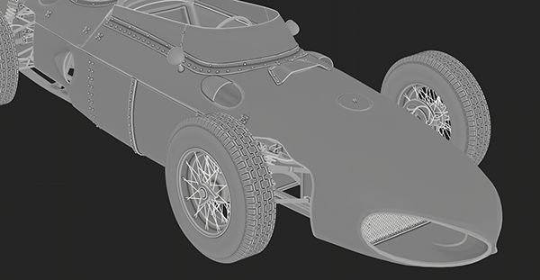
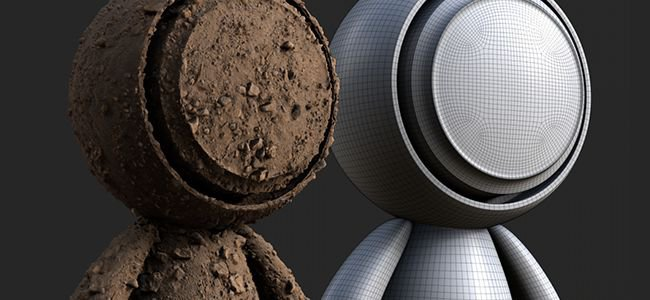
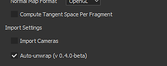

# Versione 2020.1 (6.1.0)

**Substance Painter 2020.1 (6.1.0)** offre un nuovo esportatore, lo scripting python, un nuovo fornello per curvatura, nuovi contenuti e molti altri miglioramenti del flusso di lavoro.

Data di pubblicazione: *22 aprile 2020*

>[!NOTE]
>
> A partire da questa versione, il numero di versione dell’applicazione inizierà a modificarne il formato. **2020.1** diventa **6.1.0**.

## Caratteristiche principali

### Nuova finestra Esporta texture

La finestra di esportazione è stata completamente rielaborata per offrire un modo più semplice per configurare ed esportare le texture da un progetto. Offre inoltre alcune nuove funzionalità che facilitano notevolmente l’esportazione. La nuova finestra di esportazione è ora divisa in tre schede:

**Impostazioni**

Questa scheda controlla le impostazioni generali e specifiche di ciascun set di texture.

* **Nuove impostazioni globali**\
  Le impostazioni globali sono un insieme di parametri condivisi tra tutti i set di texture. Possono essere utilizzati per assegnare o aggiornare rapidamente i parametri senza dover modificare manualmente ogni insieme di texture singolarmente. Le impostazioni globali presentano i seguenti parametri:

  * **Directory di output**: definisce la posizione di destinazione in cui verranno generate le texture.
  * **Modello di output**: definisce il predefinito da utilizzare per configurare la denominazione e l&#39;impacchettamento delle texture esportate.
  * **Tipo di file**: definisce il formato di file e la profondità di bit delle texture esportate.
  * **Dimensioni**: definisce la risoluzione massima della texture in cui verrà esportato un set di texture.
  * **Spaziatura interna**: definisce la modalità di generazione delle informazioni al di fuori delle Isole UV.
  * **Esporta parametri shader**: se abilitata, esporta un file json che memorizza le impostazioni dello shader e le relative assegnazioni del set di texture.

  
* **Impostazioni e parametri per set di texture ignorati**\
  Sotto a Impostazioni globali è riportato l’elenco dei set di texture del progetto aperto. La sezione Parametri di esportazione generali visualizza le impostazioni ereditate dai parametri globali. È possibile scegliere un **predefinito di esportazione diverso per set di texture**.

  

  Facendo clic sull’icona Penna è possibile ignorare un parametro specifico per modificarne il valore. Facendo di nuovo clic su di esso, l’esclusione verrà disabilitata e verrà ripristinato il valore predefinito (ereditato da Impostazioni globali).

  
* **Scegliere le texture da esportare**\
  Sotto ai parametri di esportazione degli insiemi di texture è riportato un elenco delle texture che verranno generate. Con questo elenco, è possibile scegliere con precisione quale file generare selezionandolo o deselezionandolo. L’elenco mostra anche il formato di file e la profondità di bit per ogni texture, ereditata dalla configurazione di esportazione o dal modello di output. Utilizzate l’icona della penna per ignorare il formato e la profondità di bit del file per una texture specifica.
* **Salvare le impostazioni senza esportarle**\
  È ora possibile salvare la configurazione di esportazione del progetto senza dover esportare le texture utilizzando il nuovo pulsante **Salva impostazioni**. Ciò è utile quando desiderate regolare un progetto senza rigenerare le texture, operazione che potrebbe richiedere del tempo.

  
* **Fai clic e trascina per abilitare/disabilitare rapidamente le esportazioni**\
  Fate clic con il pulsante del mouse e trascinate per attivare o disattivare rapidamente set di texture e texture:

  

  

**Modelli di output**

Questa scheda consente di creare predefiniti di configurazione per assegnare un nome alle texture esportate.

* <b>Creare predefiniti di esportazione</b>\
  La scheda <b>Modello di output</b> è identica alla scheda <b>Configurazione</b> del precedente modulo di esportazione. Può essere utilizzato per creare predefiniti di esportazione per denominare e comprimere rapidamente le texture. Per informazioni su come creare predefiniti di esportazione personalizzati, consulta la pagina della documentazione.
* **Imposta il formato e la profondità di bit del file nei predefiniti di esportazione**\
  Una nuova aggiunta ai predefiniti di esportazione è la possibilità di impostare il formato del file e la profondità di bit per texture, per rendere ancora più semplice la condivisione di una configurazione tra progetti.

  
* **Controlla le texture esportate dal modello di output**\
  Durante l’impostazione del processo di esportazione, utilizza la nuova opzione **Basata sul modello di output** per definire le proprietà della texture dal predefinito di esportazione.

  

**Elenco delle esportazioni**

In questa scheda viene visualizzato il processo di esportazione in corso e un riepilogo globale di tutte le texture esportate.

* **Elenco delle texture esportate**\
  La scheda elenca ogni singola texture da esportare per set di texture, tenendo conto dei parametri sostituiti e delle texture ignorate/escluse. Questo è un buon modo per verificare che tutto funzioni correttamente prima di avviare il processo di esportazione. L’interfaccia passa automaticamente a questa scheda all’avvio del processo di esportazione.

  
* **Processo di esportazione e registrazione**\
  Sulla destra della scheda si trova una console che genera i dettagli sul processo di esportazione in corso. Indica le texture esportate correttamente, nonché eventuali avvisi ed errori. Nella parte inferiore dell’interfaccia viene inoltre visualizzata una barra di avanzamento che indica lo stato corrente del processo:

  

  

### Nuova modalità livello decalcomania

È disponibile una nuova modalità **Decalcomania** quando si trascina un materiale dalle [Risorse](../../interface/assets/assets.md). Crea un nuovo livello di riempimento in modalità **Proiezione planare** che consente di posizionare più facilmente pattern e immagini. Per utilizzarlo, è sufficiente **trascinare** qualsiasi materiale dallo scaffale tenendo premuta la **scelta rapida da tastiera ALT** per visualizzare in anteprima il manipolatore e rilasciare il mouse una volta che la decalcomania si trova dove si desidera che sia. Al rilascio del pulsante del mouse, verrà creato un nuovo livello di riempimento.

Per questa occasione, abbiamo incluso anche 5 decalcomanie nello scaffale predefinito selezionato da Substance Source. Per ulteriori informazioni su questo nuovo flusso di lavoro decalcomanie, consulta [questo articolo](https://magazine.substance3d.com/effortless-grunge-look-with-new-substance-source-parametric-decals/).

>[!NOTE]
>
> Per rendere le decalcomanie più facili da usare, abbiamo implementato una nuova parola chiave [user-data](../../content/creating-custom-effects/user-data.md) che consente di specificare il metodo di fusione predefinito per ogni canale durante la creazione dei livelli.

### Nuovo script Python

È ora possibile scrivere ed eseguire script e moduli **Python** con Substance Painter. Abbiamo integrato Python 3.7 e PySide2 con Substance Painter e fornito anche un&#39;API Python personalizzata tramite il modulo **substance\_painter** dedicato. Inoltre, abbiamo colto l’occasione per ripensare le nostre API dalla versione JavaScript per renderle più chiare e facili da usare. Condividono analogie che dovrebbero rendere la creazione di plugin Python semplice per gli utenti esistenti.

Per ulteriori informazioni sull’API Python, consultate la documentazione accessibile dal menu Aiuto all’interno dell’applicazione.

* **Installazione di un modulo Python**\
  I moduli Python possono essere installati nella cartella Documenti dedicata sotto l’account utente, ma offriamo anche un modo per aggiungere percorsi aggiuntivi tramite una variabile di ambiente dedicata per semplificare la configurazione in uno studio.
* **Substance Painter sottomoduli Python**\
  Sono stati esposti i seguenti sottomoduli (altri saranno disponibili in seguito):

  * substance\_painter.display
  * substance\_painter.event
  * substance\_painter.exception
  * substance\_painter.export
  * substance\_painter.logging
  * substance\_painter.project
  * substance\_painter.resource
  * substance\_painter.textureset
  * substance\_painter.ui
* **Interprete Python**\
  È disponibile una nuova finestra della console Python per provare i moduli e/o eseguire gli script Python:

  {width="500px"}

### Panettieri migliorati

In questa versione il fornaio Curvatura è stato migliorato e il fornaio Occlusione ambiente ha ottenuto alcuni nuovi parametri.

* <b>Nuova curvatura dal fornello a trama</b>\
  Il vecchio fornaio curvatura è ora deprecato ed è stato sostituito dalla nuova versione &quot;da trama&quot; che è stato recentemente aggiunto al Substance Designer. Per ulteriori informazioni sulle nuove impostazioni del fornaio, consulta la pagina della documentazione.\
  Il nuovo fornaio ha le seguenti caratteristiche:

  * <b>Maggiore precisione</b>: la curvatura calcolata è molto più precisa e produce valori realistici.
  * <b>Contatto trama</b>: l&#39;interpenetrazione tra le trame ora produce informazioni di curvatura (che non era il caso del fornaio precedente).
  * <b>Trama High-Poly</b>: i dettagli vengono ora cotti direttamente dalla trama High-Poly invece di convertirli dalla mappa normale.
  * <b>Prestazioni</b>: il nuovo fornaio utilizza il ray tracing per calcolare i dettagli, il che significa che beneficia dell&#39;accelerazione del Raytracing GPU (RTX/Optix).

  {width="500px"}

  È ancora possibile accedere al vecchio fornaio curvatura per motivi di compatibilità tramite le impostazioni Fornello curvatura. Scegli l&#39;impostazione **Genera da mappa normale** per utilizzare il vecchio fornaio.

  
* <b>Occlusione ambiente migliorata</b>\
  Il fornello di Occlusione ambientale è stato migliorato per supportare le nuove impostazioni:

  * <b>Piano terreno</b>: simula un piano sotto la trama per creare un&#39;ombreggiatura dal suolo. Per ulteriori informazioni, consulta la documentazione di Occlusione ambientale.
  * <b>Ignora carattere di sfondo</b>: è presente un nuovo suffisso per il nome della trama che consente di ignorare un oggetto specifico durante la cottura nell&#39;Occlusione Ambiente. In questo modo, ad esempio, è possibile ignorare i dettagli della geometria mobile. Per ulteriori informazioni, consulta la documentazione Corrispondenza per nome

  {width="500px"}

### Esportazione della trama migliorata (con tassellatura)

La trama di esportazione è stata migliorata con nuove funzioni e impostazioni:

* **Esportare la topologia della trama originale o esportare la trama con tassellatura**\
  Durante l’esportazione della trama, è ora possibile scegliere di applicare la tassellatura generata per gli effetti di spostamento. Le impostazioni possibili sono:

  * **Senza spostamento/tassellatura**: esportate la trama di base senza suddivisioni della trama. Se **Applica triangolazione** è disattivato, verranno esportati i triangoli con trama, i quadrati o gli n-goni originali.
  * **Con spostamento/tassellatura**: esportate la trama con suddivisioni. Se **Ricalcola normali vertici è abilitato**, le normali mesh verranno regolate in modo da corrispondere agli offset di spostamento.

  
* **Nomi della gerarchia e della trama delle scene**\
  La gerarchia della scena originale e i nomi degli oggetti della trama importata vengono ora mantenuti e riapplicati alla trama esportata.
* **Esportazione con formato file FBX**\
  La trama del progetto può ora essere esportata in FBX, insieme ad altri formati di file.\
  **Nota**: i dati non compatibili con Substance Painter vengono comunque eliminati durante l&#39;importazione (ad esempio, skin, giunti).

### Miglioramento dello srotolamento UV automatico

L’opzione Automatico UV Unwrap può ora essere controllata più facilmente con l’aiuto di nuove impostazioni:

* **Usa lo srotolamento UV automatico durante la creazione del progetto**\
  Quando si crea un progetto, ora è disponibile una nuova impostazione che consente di abilitare o disabilitare il nuovo processo di srotolamento UV automatico. Questa impostazione è disponibile anche quando si reimporta una trama 3D in un progetto esistente.

  
* <b>Impostazioni di dewrapping avanzate</b>\
  Accanto alla casella di controllo per abilitare lo srotolamento UV automatico è disponibile un nuovo pulsante <b>Opzioni</b>. Viene aperta una nuova finestra con impostazioni avanzate per controllare il processo di srotolamento, consentendo di mantenere le informazioni sulla trama esistenti in diverse parti del processo invece di ricalcolare sempre tutto come prima. Per ulteriori informazioni, consulta la documentazione dedicata. Le impostazioni correnti sono:

  * <b>Cuciture</b>: definisce se le cuciture esistenti vengono conservate o rigenerate.
  * <b>Isole UV</b>: definisce se l&#39;apertura UV esistente viene mantenuta o rigenerata.
  * <b>Impacchettamento</b>: definisce se l&#39;impacchettamento di Isola UV viene conservato o rigenerato.
  * <b>Dimensioni margine</b>: definisce la spaziatura tra ogni Isola UV (percentuale).

  

### Nuovo contenuto

In questa versione abbiamo incluso alcuni materiali nuovi e aggiornato molti dei nostri predefiniti di esportazione in base alle nuove versioni software.

* **5 nuovi materiali decalcomanie**\
  Abbiamo aggiunto 5 nuovi materiali provenienti direttamente da Substance Source per provare la nuova funzione decalcomania:

  * Perdite da grandi Ruggini
  * Acarospora Lichen Media
  * Scarse Perdite Di Sangue
  * Piccolo Punto Impatto Sulla Parete In Cemento
  * Tag spray Paint

  
* <b>Nuovo shader Vray, modelli di progetto e predefiniti di esportazione</b>\
  In collaborazione con [Chaos Group](https://www.chaosgroup.com/) abbiamo integrato due nuovi shader che replicano i comportamenti VrayMtl. Dovrebbero fornire un aspetto più accurato quando si cerca di abbinare i rendering realizzati con Vray. Utilizza i modelli di progetto per configurare facilmente qualsiasi nuovo progetto per Vray. Per ulteriori informazioni, consultate la documentazione.

  
* <b>Nuovi modelli di progetto Maxwell e predefiniti di esportazione</b>\
  In collaborazione con [Limite successivo](http://www.nextlimit.com/), abbiamo integrato nuovi modelli di progetto ed esportato i predefiniti per il modulo di rendering Maxwell.
* **Predefiniti di esportazione aggiornati**\
  Molti predefiniti di esportazione sono stati aggiornati, principalmente per utilizzare il nuovo formato di file e le impostazioni di profondità di bit, ma anche per adattarsi alle nuove versioni software.

## Tutorial

Scopri le nostre nuove esercitazioni video sulle nuove funzioni:

## Note sulla versione

### 2020.1.3

*(Rilasciato Il 16 Giugno 2020)*\
Riepilogo: **Bugfix**

**Aggiunto:**

* [Esporta] Aggiungere le impostazioni di spostamento nel file json dei parametri Shader

**Corretto:**

* [Crash][Engine] Arresto anomalo quando si tenta di cancellare e sostituire i canali esistenti
* [Arresto anomalo] Modifica dello shader dopo aver colorato una maschera in livelli di materiale
* [Crash][Engine] Si arresta in modo anomalo con alcuni progetti pesanti
* [Bakers] La corrispondenza per nome non funziona con gli oggetti esportati da zBrush
* [Spostamento][SVT] Le texture non vengono visualizzate all’apertura del progetto quando lo spostamento è attivo
* [Esporta] Alcune texture vengono esportate in grigio uniforme
* [Esporta] I set di texture disabilitati non devono essere esportati per i predefiniti di esportazione Dimension e Sketchfab
* [Scripting][JavaScript] Arresto anomalo durante l’utilizzo dell’API JavaScript per accedere alla configurazione di esportazione nell’evento onProjectOpened
* [Scripting][Javascript] onExportFinished() non viene chiamato dopo un&#39;esportazione

### 2020.1.2

*(Rilasciato Il 28 Maggio 2020)*\
Riepilogo: **Aggiornamento di Bugfix con Substance Engine e Bakers**

**Aggiunto:**

* [Bakers] Esegui l’aggiornamento alla versione più recente
* [Panettieri] Nuovo metodo di campionamento in Occlusione ambiente, curvatura, panettieri Thickness
* Aggiornamento alla versione di Substance Engine più recente
* [Scripting][Python] Consente la creazione di ResourceID per le risorse del progetto
* [Scripting][Python] Consenti query sulle informazioni del canale
* [Scripting][Python] Aggiungi le funzioni di esecuzione a secco e di richiamata per simulare l’esportazione di texture

**Corretto:**

* [Panettieri] Normali non corrette in World Space Normals panettiere utilizzando una mappa normale tangente in casi specifici
* [Bakers] Errore di baking Occlusione ambiente con Optix quando non si verifica un poly elevato
* [Tratti dinamici] Ritardo durante il caricamento di un set di texture specifico
* [Export] Non deve esportare i set di texture disabilitati per USD, glTF
* [Scripting][JavaScript] Impossibile modificare le nuove impostazioni di Curvature Baker
* [Scripting][JavaScript] alg.texturesets.addChannel() in alcuni casi non restituisce un errore
* [Scripting][JavaScript] Errore di battitura nella documentazione delle API Javascript per setProjectExportOptions()
* [Scripting][JavaScript] Esporta sempre tutti i set di texture
* [Scripting][Python] l&#39;eseguibile sys.restituisce un percorso a python.exe anziché a Substance Painter
* Cache delle texture non compatibile tra i sistemi operativi Mac e Windows/Linux
* [Livelink UE4] Solo l&#39;ultimo materiale viene utilizzato per tutti i set di texture in una trama combinata

**Problemi noti:**

* [Export][Dimension][Skecthfab] Non deve esportare i set di texture disattivati
* [Arresto anomalo] Cambia lo shader dopo aver dipinto una maschera in livelli di materiale

### 2020.1.1

*(Rilasciato il 5 maggio 2020)*

**Aggiunto:**

* [Esporta] Feedback visivo sullo stato sostituito su TextureSet

**Corretto:**

* [Esporta] La dimensione della finestra del modulo di esportazione è troppo grande su un monitor con risoluzione speciale e non può essere ridimensionata
* Opzioni di esportazione non salvate dopo l’esportazione
* [Esporta] Arresto anomalo o impossibile esportare con il predefinito di esportazione &quot;dalla cache&quot;
* [Esportazione] L’annullamento dell’esportazione genera un’ulteriore mappa vuota imprevista
* [Esporta] Correggere le impostazioni predefinite di esportazione virtuale
* [Python] PYTHONPATH env var non è considerato
* [Python][Export] Se si annulla l’esportazione tramite Python, viene restituito un errore di eccezione
* [Python][Export] export\_project\_textures risultato errato con formato file psd

**Problemi noti:**

* [JavaScript] Impossibile modificare le nuove impostazioni di Curvature Baker
* [JavaScript][Esporta] Esporta sempre tutti i set di texture
* [Bakers] Arresto anomalo di Linux con Raytracing GPU
* [Export][USD] Non deve esportare i set di texture disattivati

### 2020.1.0

*(Rilasciato il 22 aprile 2020)*

**Aggiunto:**

* Nuovo modulo di esportazione texture e trama
* [Esporta] Nuova interfaccia di esportazione
* [Esportazione][Scheda Esportazione] Consente di selezionare i canali di mappe da esportare per set di texture
* [Esporta][Scheda Esporta] Consenti di modificare le dimensioni del set di texture per tutti i set di texture con un&#39;unica azione
* [Esportazione][Scheda Esportazione] Consente un modello diverso per set di texture (tranne USD, glTF, Sketchfab e Dimension)
* [Esportazione][Scheda Esportazione] Attivazione e disattivazione rapida di mappe e set di texture
* [Export][Export tab] La risoluzione di esportazione 8192x8192 non è più sperimentale
* [Export][Scheda Esportazione] Consente la modifica del formato del file e della profondità di bit per mappa
* [Esporta][Scheda Esporta] Consente di ripristinare i valori dei parametri predefiniti
* [Esporta][Scheda Esportazione] Consente di salvare le impostazioni senza esportare
* [Esporta][scheda Modelli di output] Rinomina la scheda &quot;Configurazione&quot; in &quot;Modelli di output&quot;
* [Esporta][scheda Modelli di output] Consenti la definizione del formato del file e della profondità di bit per mappa predefinita
* [Export][Scheda Elenco esportazioni] Nuova scheda di anteprima per riepilogare e visualizzare il processo di esportazione
* [Importa/Esporta trama] Ottimizzazione delle prestazioni in termini di tempo di importazione/esportazione
* [Trama di esportazione] Trama di esportazione in FBX
* [Esporta trama] Esporta trama con spostamento e tassellatura
* [Esporta trama][UI] Nuove impostazioni per il ricalcolo del vertice normale, applica la triangolazione
* [Esporta trama] Esporta la topologia di trama originale con i nuovi UV generati dallo srotolamento automatico
* Aggiornamento dello srotolamento UV automatico con più controlli
* [Srotolamento UV][UI] Aggiungi impostazione per attivare lo srotolamento UV automatico nella nuova finestra del progetto
* [Srotolamento UV][UI] Nuove opzioni per controllare i passaggi di srotolamento (cuciture, srotolamento, impacchettamento)
* [Srotolamento UV][UI] Consente la conservazione delle giunture di srotolamento esistenti/srotolamento/impacchettamento
* [Srotolamento UV][UI] Nuove opzioni per ricalcolare completamente i passaggi di srotolamento
* [Srotolamento UV][UI] Nuova opzione per controllare le dimensioni del margine (nessuno, piccolo, medio e grande)
* Nuovi fornai
* [Pannelli] Sostituisci la vecchia curvatura con la nuova curvatura dalla trama
* [Panettieri] Aggiungi l&#39;opzione Corrispondenza per nome per ignorare il backface nel panettiere &quot;Occlusione ambientale&quot;
* [Panettieri] Aggiungi opzione piano terreno nel fornaio &quot;Occlusione ambiente&quot;
* Nuova API Python per scripting (3.7.6)
* [Python][UI] Nuovo menu di script per Python
* [Python][UI] Nuova documentazione Python nel menu Aiuto
* [Python] Esposizione dei moduli pitone delle Substance Painter: substance\_painter, alg, display, project.setting, project, texturesets, ui
* [Python] Esporre il nuovo modulo Python &quot;substance\_painter&quot;
* [Python] Esporre il nuovo sottomodulo Python: alg, display, log, project, resource, texturesets, ui
* [Python] Listener per modifiche al progetto
* [Python] Nuovi esempi nella documentazione Python
* Menu dei plug-in [JavaScript][UI] sostituito da JavaScript
* [Finestra vista] Consente la creazione di una proiezione decalcomania &quot;trascinando/rilasciando + ALT&quot; una risorsa dallo scaffale
* Nuovo contenuto
* [Content] 5 nuovi materiali decalcomanie da Substance Source
* [Content] Aggiungi nuovi modelli di progetto ed esporta predefiniti per il modulo di rendering Maxwell
* [Content] Aggiungi modello di progetto per esportazione Keyshot 9
* [Content] Aggiorna il predefinito di esportazione Keyshot 9 per supportare lo spostamento e l&#39;emissione
* [Content][Exporter] Aggiornamento di tutti i predefiniti di esportazione in base alle versioni più recenti dei motori grafici e dei moduli di rendering per giochi
* [Content][Exporter] Aggiorna i file dei predefiniti di esportazione per utilizzare il nuovo formato e le nuove impostazioni di dithering
* [Content] Nuovi modelli e shader per supportare il materiale VRay (VRayMtl)
* [Serie di livelli] Consente l’eliminazione degli effetti di livello mediante l’icona del cestino o la scelta rapida da tastiera Elimina
* Rimuovere la Substance Source del plug-in (utilizzare il modulo di avvio con la funzionalità &quot;Invia a&quot;)
* [Windows] Non visualizzare l&#39;avviso TDR sulle GPU di fascia alta

**Corretto:**

* Problemi di traduzione nella finestra di dialogo Nuovo file di progetto
* [Bakers] L’impostazione &quot;Salva file di scena preelaborato&quot; non funziona più
* [Panettieri] Arresto anomalo durante la cottura al forno con Optix quando non è presente poly elevato
* [Proiezione planare] La proiezione non funziona su trame con UV ripetuti
* [Decal] Differenza di comportamento nel canale normale quando si utilizzano diverse modalità di proiezione del livello di riempimento
* [Sfumino][Clona] È possibile che si verifichi un artefatto quando si disegna in una maschera
* [Engine] Arresto anomalo con contenuti di livello specifici
* [Engine] Arresto anomalo casuale quando si disegna in alcuni casi
* [Punto di ancoraggio] Il riferimento a una maschera vuota restituisce sempre il bianco
* [Esporta] Livello non preso in considerazione in alcune particolari configurazioni dello stack
* [Trama di esportazione] Impossibile esportare con un percorso contenente caratteri speciali
* [Esporta mesh] Impossibile leggere i file glTF quando esportati da Linux o MacOS
* [Importa trama] La reimportazione di DAE, PLY o glTF non funziona come previsto
* [Arresto anomalo] Cambia lo shader dopo aver dipinto una maschera in livelli di materiale

**Problemi noti:**

* [Scripting][JavaScript] Impossibile modificare le nuove impostazioni di Curvature Baker
* [Bakers] Arresto anomalo di Linux con Raytracing GPU
* [Export][USD] Non deve esportare i set di texture disattivati
