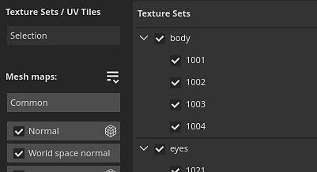
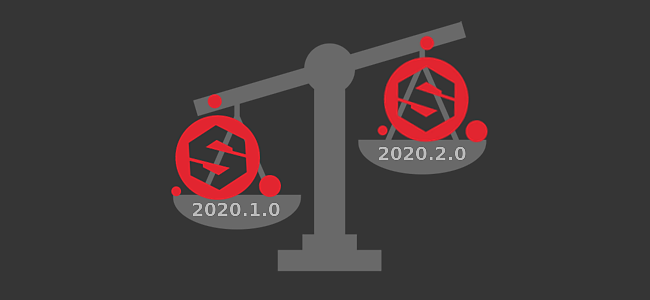
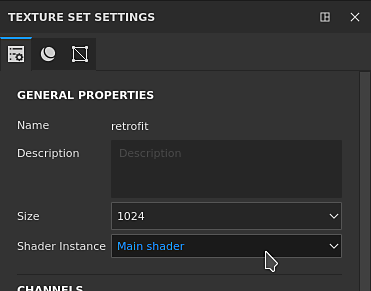

# Versione 2020.2 (6.2.0)

**Substance Painter 2020.2.0 (6.2.0)** introduce il nuovo flusso di lavoro Porzione UV che consente la pittura tra UDIM. Include inoltre diversi miglioramenti a livello di prestazioni e dimensioni dei progetti per qualsiasi tipo di progetto.

Data di pubblicazione: *23 luglio 2020*

>> 

Crediti d&#39;artista: Dragon di [Damien Guimoneau](https://www.artstation.com/damz) e Robot di [Jason Huang](https://www.artstation.com/jasonhuang).

## Caratteristiche principali

### Nuovo flusso di lavoro Porzione UV con disegno tra UDIM

In questa versione viene introdotto il nuovo flusso di lavoro Substance Painter porzioni UV che consente di dipingere su porzioni UDIM.

Con il nuovo flusso di lavoro, gli **UV non vengono più divisi in singoli set di texture**. Al contrario, le Porzioni UV sono contenute all&#39;interno di un unico insieme di texture in base all&#39;assegnazione del materiale della trama. Le porzioni UV che si trovano nello stesso set di texture possono essere **colorate senza giunture**, sia nella finestra 2D che in quella 3D.

Porzione UV è il termine utilizzato per descrivere in modo generico questo nuovo flusso di lavoro, poiché l&#39;UDIM è principalmente una convenzione di denominazione. Sebbene UDIM sia attualmente l&#39;unica convenzione disponibile, abbiamo in programma di espanderla in futuro (ad esempio per supportare la denominazione Mudbox o ZBrush). Stiamo anche pensando di supportare le porzioni con coordinate negative, cosa che non è possibile con lo schema UDIM. Ecco perché abbiamo scelto un termine più ampio per questo flusso di lavoro.

Ecco una panoramica delle modifiche introdotte con questo nuovo flusso di lavoro:

* **Creazione di un progetto porzione UV**\
  Quando si crea un nuovo progetto, è disponibile una nuova impostazione che consente di specificare se il nuovo flusso di lavoro deve essere utilizzato o meno.

  Una volta stabilito il flusso di lavoro e creato il progetto, non è possibile modificarlo in un secondo momento, a differenza di altre impostazioni.

  
* Porzioni UV nel viewport 2D

  Quando si utilizza il nuovo flusso di lavoro Porzione UV, la vista 2D visualizzerà ora una nuova griglia in cui ogni porzione UV ha un numero UDIM dedicato. Ogni piastrella può essere dipinta singolarmente.

  
* Colorare su più Porzioni UV

  Porzioni UV

  che si trovano all&#39;interno dello stesso set di texture possono essere colorati in modo uniforme. Ciò consente di aumentare la risoluzione e la qualità generale di una risorsa semplicemente moltiplicando il numero di porzioni UV.
* Porzioni UV nella finestra Elenco serie texture

  La

  L&#39;elenco di set di texture ha

  sono state aggiornate per elencare le porzioni UV relative al materiale trovato sulla trama importata. Ogni Porzione UV viene visualizzata con il nome in base alla convenzione UDIM.

  
* Modifica della risoluzione per Porzione UV

  Anche se la risoluzione predefinita di ogni porzione UV è basata sull&#39;insieme di texture principale, è possibile ignorarla per ogni porzione. È sufficiente selezionare le porzioni nell’elenco Set di texture, quindi passare alla finestra Impostazioni set di texture per modificare la risoluzione. Quando la risoluzione di una porzione viene ignorata, la nuova risoluzione viene visualizzata nel vista 2D accanto al numero corrispondente.

  
* Nuove icone Pila livelli

  La Pila livelli presenta nuove icone per i livelli di pittura e riempimento. Poiché le Porzioni UV contengono molte più serie di texture, non è stato possibile visualizzarle tutte in questa piccola area. Questo consente di ottenere prestazioni di aiuto poiché non è più necessario calcolare miniature specifiche. Questo nuovo set di icone può essere utilizzato anche per i normali progetti abilitando le impostazioni nelle impostazioni principali (vedi di seguito).

  
* Nuova maschera Porzione UV sui livelli

  La Maschera Porzione UV è un nuovo modo per mascherare i livelli di attacco/stacco, più efficiente della normale mascheratura. Offre prestazioni migliori in quanto consente di scartare completamente il calcolo di Porzioni UV specifiche. Questo è uno strumento che consigliamo di utilizzare per ottenere un&#39;esperienza confortevole quando si lavora in un progetto con molte porzioni UV. Per ulteriori informazioni, consulta la [pagina dedicata](../../interface/layer-stack/geometry-mask.md) nella documentazione.

  {width="550px"}
* **Porzione UV mascherata**\
  Poiché più porzioni UV si trovano nello stesso insieme di texture, potrebbe essere difficile colorare alcune aree di una trama a causa di altre parti della geometria che si trovano in mezzo. Per ovviare a questa situazione, è stata aggiunta una nuova impostazione di pittura nella barra degli strumenti contestuale denominata **I tratti Pittura ignorano le Porzioni UV mascherate**. Quando questa impostazione è attivata, tutte le Porzioni UV escluse dalla maschera Porzione UV sono nascoste nella finestra della vista, in modo da consentire l’accesso e l’ignoramento dei tratti pittura. Modificando la maschera Porzione UV, i tratti del pennello vengono ricalcolati in quanto è possibile reimportare una trama che potrebbe aver modificato la Porzione UV o una nuova geometria da escludere. In questo modo si evita di ripetere i tratti della pittura.

  

  
* Eseguire i baking Porzione UV

  I baker supportano anche la Porzione UV e ora è disponibile un elenco di selezione nella finestra di esegue i baking

  per specificare quali porzioni e set di texture eseguire i baking. La selezione può essere modificata rapidamente facendo clic e trascinando sulla casella di controllo o utilizzando i nuovi menu a discesa.

  

  
* Esportazione di texture Porzione UV con il nuovo tag $udim

  Ai modelli di output è stato aggiunto un nuovo tag che consente di esportare i file il cui nome contiene il numero di Porzione UV. Attualmente è disponibile solo la convenzione UDIM. È inoltre possibile utilizzare le parentesi per definire gli elementi facoltativi in un nome di file quando un tag non è disponibile. Questo consente, ad esempio, di creare nomi di file che aggiungono il numero UDIM solo se disponibili con i progetti Porzione UV, rendendo i predefiniti di esportazione compatibili con qualsiasi tipo di progetto.

  
* **Importazione di sequenze di immagini** Una sequenza di immagini è una serie di texture in cui ciascuna di esse corrisponde a una Porzione UV specifica. Per importare una sequenza di immagini, trascinate il primo file della sequenza sullo scaffale o utilizzate la finestra Importa risorse. Anche i file rimanenti nella sequenza verranno importati automaticamente. Le sequenze verranno visualizzate nello scaffale come una singola risorsa con un numero che indica quanti file contengono. Per usare la sequenza, trascinala e rilasciala in un livello di riempimento. La modalità di proiezione verrà impostata automaticamente su **Riempi (corrispondenza per Porzione UV)**.

  {width="600px"}

  
* Supporto di sfaccettature con trame alembiche

  Le sfaccettature alembiche vengono ora importate come materiali da suddividere in set di texture. Questa modifica rende le trame alembiche compatibili con il nuovo flusso di lavoro Porzione UV. Se una trama alembica contiene facce che non si trovano in una serie di facce, queste verranno automaticamente inserite in un set di texture denominato DefaultMaterial.

Per ulteriori informazioni sul nuovo flusso di lavoro di Porzione UV, consulta la [documentazione dedicata](../../features/uv-tiles/uv-tiles.md).

>[!NOTE]
>
> Il flusso di lavoro di Porzione UV può essere molto impegnativo, consigliamo di lavorare con le unità SSD per memorizzare sia la cache che un file di progetto, al fine di ridurre i tempi di caricamento e ottenere un&#39;esperienza ottimale.

### Nuovo motore di pausa

È ora possibile mettere in pausa il motore di Substance Painter mentre si lavora. Con il motore in pausa, tutti i calcoli, gli aggiornamenti della finestra della vista o i tratti della texture vengono registrati ma non calcolati.

Questa nuova azione consente di impostare e modificare Pile livelli complesse e ritardare il calcolo all&#39;ultimo momento. Il vantaggio principale di mettere in pausa il motore è quello di evitare calcoli intermedi e calcolare invece solo il risultato finale. In questo modo l’applicazione diventa più reattiva e l’aggiornamento nel complesso più rapido. Il compromesso è che non c&#39;è alcun riscontro visivo finché il motore non è in pausa.

Per mettere in pausa il motore, è sufficiente fare clic sul pulsante **nella barra degli strumenti contestuale** sopra la finestra della vista oppure utilizzare il **tasto Maiusc scelta rapida da tastiera + Esc** (modificabile nelle impostazioni). Per rimettere in pausa il motore, disattiva il pulsante o riutilizza la scelta rapida da tastiera.

### Miglioramenti alle prestazioni

* **Esportazione di texture più rapida**\
  L’esportazione di texture dovrebbe essere notevolmente più veloce, specialmente con progetti pesanti che generano molte texture. Sono stati apportati diversi miglioramenti al modo in cui le texture vengono generate e scritte. Nei nostri test interni su progetti con molti set di Texture o Pile livelli complesse, abbiamo osservato che il processo di esportazione era generalmente fino a **4 o 5 volte più veloce**.
* **Calcolo della cache ritardato durante l’apertura dei progetti** Substance Painter utilizza un sistema di cache per consentire l’ottimizzazione e la fusione rapida dei livelli. Nelle versioni precedenti questa cache veniva calcolata ogni volta che veniva aperto un progetto (visibile dalla barra di caricamento verde nella parte inferiore della finestra della vista). Ora il calcolo della cache viene attivato solo quando si tenta di modificare un livello (ad esempio colorando o modificando un parametro del livello di riempimento). Questa modifica consente di aprire i progetti senza attendere e senza passare agli insiemi di texture desiderati prima di iniziare a lavorare. Il calcolo è anche più granulare, il che permette di calcolare solo ciò che è necessario. Nel caso di un progetto che contiene Porzioni UV, ad esempio, vengono calcolate solo le porzioni che devono essere modificate.
* **Il caricamento asincrono delle mappe trama** Le mappe trama sono ora caricate in modo asincrono. Ciò significa che l&#39;applicazione non verrà più bloccata durante l&#39;attesa del caricamento delle mappe mesh. Ciò è particolarmente visibile quando si visualizza la mappa della trama nella finestra della vista (come nell&#39;immagine seguente). Inoltre, l’apertura dei progetti è più rapida, in quanto non ci sono più attese per le mappe con trama.

  
* **Modifica della modalità di visualizzazione maschera migliorata**\
  Quando si utilizza ALT+clic su una maschera (o la modalità di visualizzazione dedicata) per visualizzarla nella finestra della vista, gli aggiornamenti delle texture vengono ora eseguiti solo per la maschera. Questo significa che gli effetti di pittura e modifica sono molto più fluidi utilizzando questa modalità di visualizzazione, come qualsiasi altro calcolo viene ritardato fino a quando la finestra della vista non viene impostata nuovamente sulla modalità materiale.

  
* **Nuove miniature di Pila livelli**\
  Come accennato in precedenza, la Pila livelli ora può utilizzare un nuovo set di icone. L’utilizzo di queste icone può migliorare le prestazioni generali, in quanto non è necessario calcolare alcuna miniatura. Anche se questa operazione è automatica per i progetti Porzione UV, i progetti normali possono scegliere di utilizzare anche queste icone andando su **Modifica > Impostazioni** e abilitando **Sostituisci le miniature delle Pile livelli con le icone**.

  
* **Salvataggio incrementale più rapido** Poiché il progetto può essere più piccolo e il processo di salvataggio è più granulare per quanto riguarda i dati modificati, il salvataggio incrementale (premendo CTRL+S) è ora molto più rapido. Ciò è particolarmente evidente nei progetti pesanti.
* **Prestazioni di avvio Iray migliorate**\
  Il passaggio alla modalità di rendering con Iray dovrebbe essere più rapido poiché è stato migliorato il modo in cui gestiamo la memoria condivisa all’interno dell’applicazione.

### Miglioramenti alle dimensioni del progetto

I file di progetto hanno notoriamente un [ingombro elevato](../../technical-support/workflow-issues/project-issues/projects-are-really-big.md). Ci siamo presi il tempo di indagare la causa principale di questo problema e di progettare alcune soluzioni. Questa versione introduce un primo set di modifiche:

* **Conversione degli output dei baker in immagini in scala di grigio**\
  Nelle versioni precedenti, i baker generavano immagini RGB in ogni caso. Ora i baker in scala di grigio (curvatura, occlusione ambientale) generano solo immagini in scala di grigio. Questa semplice modifica può ridurre le dimensioni dei progetti dal 20% al 60% in meno. Per sfruttare questa modifica, è necessario rigenerare le mappe mesh nei progetti esistenti.
* **Modifica delle impostazioni predefinite di diffusione e dilatazione per i baker**\
  In precedenza, i baker generavano una dilatazione di 1 pixel e quindi un pattern di diffusione (pixel sfocati al di fuori delle Isole UV). Questa configurazione genera texture piuttosto pesanti in quanto le sfumature sono difficili da comprimere. Le impostazioni predefinite sono state quindi modificate per ridurre questo problema. Per impostazione predefinita, la diffusione è ora disattivata e la dilatazione è stata impostata su 32 pixel (che dovrebbero corrispondere alle risoluzioni 4K). Si consiglia di cambiare il progetto esistente con queste nuove impostazioni e di riavviare per sfruttare questo miglioramento.

### Miglioramenti vari

Questa nuova versione include alcune modifiche aggiuntive:

* **Selezione Eseguita i baking**\
  Per semplificare il nuovo flusso di lavoro di Porzione UV, la finestra di esegue i baking è stata leggermente modificata per includere un nuovo elenco di selezione, che include l’elenco delle Porzioni UV per set di texture. Il pulsante &quot;esegue i baking set di texture corrente&quot; è stato quindi rimosso. Per mantenere la selezione degli elementi da eseguire i baking, nei menu a discesa sono state aggiunte diverse opzioni:

  

  
* **Istanza shader nelle impostazioni del set di texture**\
  Con la rielaborazione dell’elenco Set di texture per includere la Porzione UV, sono state apportate alcune piccole modifiche per rendere l’interfaccia utente meno disordinata. La funzionalità che in precedenza consentiva la creazione e il passaggio a istanze shader diverse è ora stata spostata nelle impostazioni del set di texture.

  

## Tutorial

Di seguito sono riportate le nostre nuove esercitazioni video sulle nuove funzioni. Su [Substance Academy](https://www.youtube.com/playlist?list=PLB0wXHrWAmCx1fWbUyBFcjtfL8xhxZFnv) sono disponibili altri video sul nuovo flusso di lavoro di Porzione UV.

## Note sulla versione

### 2020.2.0

*(Rilasciato il 23 luglio 2020)*

**Aggiunto:**

* Riquadri UV (UDIM)
* [Porzioni UV] Dipingi su porzioni UV
* [Riquadri UV] Consente di scegliere tra il flusso di lavoro nuovo e precedente per i riquadri UV
* [Riquadri UV] Importa sequenze di immagini UDIM/Riquadro UV come risorsa
* [Riquadri UV] Aggiungi elenco di riquadri UV per set di texture nella finestra Elenco set di texture
* [Porzioni UV] Consenti di modificare contemporaneamente la risoluzione di più porzioni UV nelle impostazioni del set di texture
* [Porzioni UV][Vista 2D] Visualizza le porzioni UV come griglia
* [Riquadri UV][Vista 2D] Pulsante Nuova finestra della vista per visualizzare o nascondere le informazioni sui riquadri UV
* [Porzioni UV] Per impostazione predefinita, imposta lo strumento di pittura su un singolo canale per i progetti con porzioni UV
* [Riquadri UV] Nuovo pulsante nella barra degli strumenti contestuale per ignorare i riquadri UV mascherati durante il disegno
* [Porzioni UV][Serie di livelli] Icone nuove serie di livelli per migliorare le prestazioni
* [Riquadri UV][Pila di livelli] Migliorare le icone di disegno e riempimento nella barra degli strumenti
* [Maschera porzione UV][Vista 2D] Consente di includere o escludere più porzioni UV contemporaneamente (clic sinistro, CTRL+clic sinistro)
* [Maschera porzione UV] Nuova maschera porzione UV da includere, escludere porzioni per livello con una nuova icona
* [Maschera porzione UV][Pila di livelli] Visualizza il numero di porzioni UV nell&#39;icona della maschera Porzioni UV quando non tutte sono incluse
* [Maschera porzione UV][Vista 2D/3D] Aggiungi effetto al passaggio del mouse per visualizzare le porzioni UV sotto il cursore
* [Porzioni UV][Pannelli] Consenti di selezionare e cuocere porzioni UV specifiche
* [Porzioni UV][Pannelli] Aggiungete opzioni di selezione per set di texture/porzioni UV
* [Porzioni UV][Pannelli] Opzione del menu di scelta rapida per selezionare Porzioni UV all&#39;interno di un set di texture
* [Porzioni UV][Pannelli] Consente la selezione rapida in Set di texture/Porzioni UV trascinando
* [Porzioni UV][Pannelli] Sostituite i pulsanti &quot;Tutto&quot; e &quot;Nessuno&quot; nelle mappe trama con opzioni di selezione più esplicite
* [Riquadri UV][Pannelli] Visualizza il numero di texture da produrre
* [Porzioni UV][Esporta] Consente di selezionare ed esportare porzioni UV specifiche
* [Porzioni UV][Esporta] Consente la selezione rapida di porzioni UV mediante trascinamento
* [Porzioni UV][Esporta] Aggiungi opzioni del menu a discesa per le porzioni UV
* [Riquadri UV][Esporta] Rendi non disponibili alcuni predefiniti di esportazione se non funzionano con i riquadri UV (Adobe Dimension, Sketchfab, glTF, USD)
* [Porzioni UV][Contenuto] Aggiornate i predefiniti di esportazione per utilizzare il nuovo tag $udim
* [Riquadri UV] Miglioramento della segnalazione degli errori durante l’importazione di trame con Isole UV sovrapposte
* [Riquadri UV] Riquadri UV compatibili in Iray
* [UV Tiles][Scripting] Aggiungere la documentazione di esportazione delle porzioni UV al documento Python
* Prestazioni
* [Prestazioni] Nuovo pulsante nella barra degli strumenti contestuale per sospendere il calcolo del motore durante il lavoro (MAIUSC+ESC)
* [Prestazioni] Apertura più rapida del progetto ritardando il calcolo della cache del set di texture
* [Prestazioni] Non aspettare che le mappe mesh vengano caricate all’apertura del progetto
* [Prestazioni][Vista 2D/3D] Non calcolare il canale maschera nella finestra della vista quando non viene utilizzato
* [Prestazioni] Non bloccare l&#39;applicazione durante il caricamento delle mappe mesh visualizzate nelle finestre delle viste
* [Prestazioni] Migliorare la velocità di salvataggio incrementale durante il salvataggio di un progetto
* [Prestazioni][Panettieri] Modifica le impostazioni di dilatazione predefinite per migliorare il risparmio di tempo e dimensioni del progetto
* [Prestazioni][Baker] Passa alla scala di grigi su Baker specifici per risparmiare tempo e ridurre le dimensioni del progetto
* [Prestazioni][Esporta] Migliora le prestazioni del motore per esportare texture più velocemente
* [Prestazioni][Esporta] Migliora la reattività quando si apre la finestra di dialogo di esportazione con molti set di texture
* [Prestazioni][Esporta] Migliora le prestazioni quando si passa alla scheda &quot;Elenco esportazioni&quot;
* [Performance][Iray] Ridurre il tempo di avvio di Iray
* Altro
* [Baker] Aggiungete opzioni di selezione per gli insiemi di texture
* Sposta la gestione delle istanze shader nelle impostazioni del set di texture
* [2D/vista 3D] Aggiungere un messaggio nella parte inferiore della finestra della vista per indicare quale tipo di maschera è stato modificato
* [Pila livelli] Nuova opzione nelle impostazioni per passare dalla miniatura precedente a quella nuova
* [Pila livelli] Aggiungi un feedback visivo per indicare lo stato di caricamento delle miniature
* [Proj] Nuova modalità di proiezione &quot;Riempimento (Corrispondenza per porzione UV)&quot; per caricare le sequenze di immagini
* [Proj] Modifica la modalità di proiezione dei livelli di riempimento su &quot;Riempi (come per porzione UV)&quot; in casi specifici
* [Contenuto] Ottimizzare i predefiniti per i pennelli Carboncino per migliorare le prestazioni
* Aggiornamento di Iray alla versione 2020.0.0
* [Esporta] Disattiva la scheda Elenco esportazioni se non è selezionato nulla
* Annulla contornamento automatico
* [Scorrimento automatico] Migliora la qualità del posizionamento delle giunture
* [Auto Unwrap] Parametrizzazione migliorata per aumentare la velocità e la stabilità

**Corretto:**

* [Alembic] Gli insiemi di facce vengono ignorati durante l&#39;importazione dei file
* [Alembic] Tempo di caricamento infinito con file specifici
* [Importa] Una sequenza di immagini UDIM errata viene importata quando differisce solo l’estensione del file
* [Arresto anomalo] Se si tenta di aprire un progetto bloccato da un altro processo, viene generato un arresto anomalo
* [Esporta] Il canale Emissivo non viene esportato con il formato USD
* [Content] Il Materiale avanzato &quot;Charcoal&quot; contiene tracce pittura

**Problemi noti:**

* [Elenco set di texture] Impossibile nascondere la descrizione
* Problemi dell&#39;interfaccia utente di [Texture Set List]
