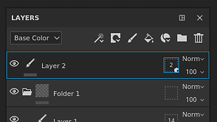
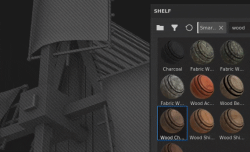
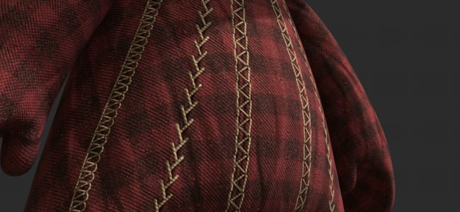

# Versione 2021.1 (7.1.0)

**Substance Painter 2021.1 (7.1.0)** introduce diverse nuove funzioni e miglioramenti, quali la maschera di geometria e la copia e incolla degli effetti nella pila dei livelli.

Dati della versione: *28 gennaio 2021*

>[!NOTE]
>
> Questa versione aumenta la versione minima supportata di Ubuntu alla 18.04 e di MacOS alla 10.14. Per ulteriori dettagli, consulta i [requisiti tecnici](../../getting-started/system-requirements.md).

## Caratteristiche principali

### Nuova maschera di geometria

La maschera Geometria è un nuovo strumento di mascheratura nella pila di livelli che consente di nascondere la geometria in base ai nomi delle trame o alle porzioni UV. Si tratta di un&#39;evoluzione della maschera per porzioni UV precedentemente denominata che ha mascherato la geometria in base ai numeri UDIM.

Questo nuovo strumento è un modo migliore di mascherare la geometria rispetto alla pittura regolare (o quando si utilizza [Riempimento poligonale](../../painting/tool-list/polygon-fill.md)) perché beneficia di diverse ottimizzazioni del motore. Inoltre, non è distruttivo in quanto non memorizza informazioni sulla geometria (come facce o vertici) ma solo il nome della trama o il numero di porzione UV, quindi la reimportazione di una trama non interromperà la maschera. Un altro vantaggio è che quando si nasconde la geometria è possibile disegnare su superfici non accessibili in precedenza all&#39;interno di un insieme di texture. In questo modo si evita, ad esempio, di dividere un oggetto in più insiemi di texture.

* **Nuova maschera di geometria sui livelli**\
  La maschera di geometria è automaticamente disponibile su qualsiasi livello nella [pila di livelli](../../interface/layer-stack/layer-stack.md). Per impostazione predefinita non ha alcun effetto, ovvero il livello è completamente visibile.\
  La maschera Geometria dispone di un menu di scelta rapida che consente di selezionare o deselezionare rapidamente tutti gli elementi, ma anche di copiare i valori in un altro livello.

  

  

* **Modifica delle proprietà della maschera di geometria** La maschera di geometria segue la stessa logica dei contesti degli altri livelli (come la modifica di una maschera o di proprietà di istanza). Per attivare la modalità di edizione della maschera di geometria, è sufficiente fare clic sul quadrato punteggiato a destra di un livello. Per uscire dalla maschera di geometria, fate clic sul contenuto o sulla maschera di disegno dello stesso livello.

  

* **Mascheratura in base ai nomi delle trame o ai riquadri UV**\
  Nella parte superiore delle proprietà della maschera di geometria è presente un menu a discesa che controlla la modalità di mascheratura. È possibile scegliere tra la mascheratura in base al numero di porzioni UV o al nome della trama. Questo menu a discesa è disattivato e impostato sul nome della trama solo nel caso in cui un progetto non utilizzi il flusso di lavoro Affianca UV.

  

* **Mascheratura della geometria tramite le proprietà**\
  Quando modificate la maschera di geometria, nella finestra delle proprietà vengono elencati i nomi delle trame (o porzioni UV) in base alla geometria correlata all&#39;insieme di texture corrente.

  * Il numero sopra l’elenco indica quante trame/porzioni UV vengono smascherate sul totale disponibile.
  * Il menu accanto al numero fornisce controlli rapidi per selezionare tutte o nessuna delle voci e persino invertire la selezione corrente.
  * L’elenco seguente definisce gli elementi mascherati o meno. Come per altri elenchi dell&#39;applicazione, è possibile fare clic e trascinare per attivare/disattivare più elementi contemporaneamente oppure utilizzare **ALT+clic** per isolare un elemento.

   

* **Mascheratura della geometria tramite la finestra della vista**\
  La selezione della maschera Geometria può essere modificata anche nelle viste 2D e 3D. È sufficiente spostare il mouse sulla parte che deve essere visibile/nascosta e fare clic su di essa per attivare/disattivare il relativo stato. Quando modificate la maschera di geometria, la geometria mascherata viene visualizzata con un effetto di linee grigie e diagonali. È anche possibile effettuare selezioni rettangolari facendo clic e trascinando per selezionare più elementi contemporaneamente.\
   

* **Colorazione della geometria nascosta/non raggiungibile.**\
  Dopo aver selezionato la geometria da mascherare nella maschera Geometria, è possibile attivare il pulsante **Nascondi/Ignora geometria esclusa** nella parte superiore della finestra della vista (o premendo la scelta rapida **ALT+H**). Quando questa opzione è attivata, la geometria esclusa viene nascosta (come pure gli altri insiemi di texture) per mostrare solo la geometria inclusa o colorabile con il livello corrente. Questa opzione consente di colorare le aree precedentemente bloccate o fuori portata. Questa opzione si applica anche a qualsiasi tipo di livello.

  >[!NOTE]
  >
  > Il disegno con la geometria mascherata rimane dinamico: se una parte della geometria che blocca il disegno è stata inizialmente nascosta al momento della creazione del tratto del pennello e quindi non è mascherata, bloccherà nuovamente il tratto del pennello creato in precedenza.

  

### Nuova copia e incolla degli effetti serie di livelli

Ora è possibile copiare gli effetti su più livelli e serie di livelli, come avviene per i livelli normali.

La selezione multipla è ora possibile anche per offrire la possibilità di copiare e incollare più effetti contemporaneamente.

Per comodità, copiare o spostare un effetto da una maschera su un livello senza un effetto ne aggiungerà automaticamente uno. Questo perché gli effetti del contenuto del livello e della maschera non sono compatibili tra loro. Ciò significa che se si copia un effetto da una maschera nel contenuto di un livello, si passa automaticamente alla maschera (o se ne crea una).

* **Copiare e incollare tramite il menu di scelta rapida**\
  Fate clic con il pulsante destro del mouse su un effetto qualsiasi nel gruppo di livelli di un set di texture e scegliete l’azione Taglia o Copia. Quindi fate nuovamente clic con il pulsante destro del mouse su un livello e scegliete incolla per spostare o creare una copia degli effetti desiderati. Abbiamo anche colto l&#39;occasione per rielaborare il menu di scelta rapida e dare accesso a più funzionalità:

  

* **Copiare e incollare con le scelte rapide da tastiera**\
  Come per qualsiasi livello, è possibile utilizzare la scelta rapida da tastiera **CTRL+C** (copia)/**CTRL+X** (taglio) e **CTRL+V** (incolla) per copiare gli effetti in base alla selezione corrente. Come per i livelli, gli effetti vengono inseriti sopra la selezione corrente.

  

* **Duplicazione rapida dell’effetto con le scelte rapide da tastiera**\
  Utilizza **CTRL+D** per duplicare la selezione corrente oppure premi e mantieni **ALT mentre trascini** qualsiasi effetto per duplicarlo nella posizione desiderata:

  

* **Spostare gli effetti tra i livelli**\
  Oltre alla copia e alla duplicazione, ora è possibile spostare un effetto trascinandolo da un livello all’altro:

  

### Nuove funzioni e miglioramenti generali

In questa versione sono stati apportati diversi miglioramenti:

* **Aggiungere una descrizione per porzione UV**\
  È ora possibile aggiungere una descrizione per ciascuna porzione UV tramite l&#39;elenco Set texture. Questo facilita la navigazione del progetto, soprattutto durante l’esportazione e la cottura in forno, poiché le descrizioni possono essere visualizzate anche in questi contesti.\
  Per aggiungere o modificare una descrizione è sufficiente fare clic su una porzione UV nella finestra Elenco set di texture e quindi accedere alla finestra Impostazioni set di texture per modificarla.

  

   

* **Nuove miniature dello stack di livelli**\
  Le miniature ottimizzate delle serie di livelli sono state migliorate. Ora viene visualizzata una sfera di materiale per i livelli di riempimento, per facilitare la navigazione e visualizzare le proprietà principali di ogni livello anche quando si lavora con il flusso di lavoro [Porzioni UV](../../features/uv-tiles/uv-tiles.md). La miniatura viene generata dalle informazioni sul livello, ma non tiene conto degli effetti per evitare di essere ricalcolata troppo spesso.

  

* **Uscita della maschera di geometria migliorata nello stack di livelli**\
  Uscire dalla maschera Geometria (precedentemente UV Tile Mask) potrebbe essere difficile con le cartelle nella pila di livelli se non aveva una maschera. Questo perché non c&#39;era altro contesto da attivare se non la selezione di un altro livello. È ora possibile fare clic sulla miniatura della cartella per uscire dalla maschera Geometria. È anche possibile trascinare materiali o materiali intelligenti dallo scaffale nella finestra della vista durante la modifica della maschera di geometria.

  

  

* **Nuova selezione Alt-Clic nella finestra Baking**\
  L&#39;elenco delle mappe mesh nella finestra di cottura può ora essere isolato con **Alt + clic del mouse** per isolare una mappa specifica da cuocere, invece di doverle escludere manualmente. La stessa scelta rapida può essere utilizzata per riattivare tutte le mappe trama.

  

* **Pulsante Nuovo set di texture corrente di cottura**\
  Un nuovo pulsante è stato aggiunto nella parte inferiore della finestra Cottura, per facilitare e velocizzare la ripetizione di un set di texture. L’uso di questo pulsante non influirà sulla selezione personalizzata precedentemente definita, ma eseguirà il baking dell’intero set di texture (inclusi tutti i relativi riquadri UV, se disponibili).

  

### Nuovo aggiornamento Substance Engine

La versione di Substance Engine è stata aggiornata alla versione 8 per supportare il formato di file Substance più recente e le sue funzionalità.

Per ulteriori dettagli sulle nuove funzionalità di Substance Engine, consulta [questa pagina della documentazione](https://helpx.adobe.com/substance-3d/unlisted/documentation/sddoc/version-2020-2-10-2-0-200574252.html).

### Nuovo supporto Nvidia RTX 3000 in Iray

Il [modulo di rendering Iray](../../features/iray-renderer/iray-renderer.md) è stato aggiornato alla versione più recente e ora supporta le nuove GPU Nvidia Ampere (serie RTX 3000 e serie Quadro A).

>[!NOTE]
>
> Con questo aggiornamento le GPU Kepler (serie GeForce 600 e 700) non sono più supportate, il rendering in Iray verrà eseguito sulla CPU.

### Nuovo contenuto

In questa versione sono stati aggiunti tre nuovi strumenti di unione che possono essere utilizzati per creare pattern complessi e punti realistici. Per trovarli, è sufficiente andare nella sezione degli strumenti dello scaffale e cercare:

* Complesso punti
* cuciture croce cucitura
* Punti diritti

Si consiglia di attivare la funzionalità [Mouse pigro](../../painting/lazy-mouse.md) nella barra degli strumenti contestuale per migliorare la qualità dei punti colorati.

Di seguito è riportata una panoramica di tutti i predefiniti contenuti in questi nuovi strumenti:

{width="800px"}

### Nuove funzionalità Python

L’API Python ha ricevuto diverse nuove funzionalità. La documentazione è stata anche rielaborata, in particolare i suoi esempi, per facilitare la comprensione e l’apprendimento dell’API.

* **Gestione di risorse e scaffali**\
  Il modulo delle risorse è stato migliorato ed è ora possibile:
  * Crea e gestisci scaffali.
  * Cerca o importa risorse in scaffali e progetti.
  * Verificare se è in corso la ricerca per indicizzazione di uno scaffale (per sapere quando le risorse sono pronte per l&#39;uso).
  * Assegnare miniature personalizzate alle risorse di uno scaffale.

* **Informazioni sui riquadri UV**\
  È ora possibile eseguire una query sull’elenco delle porzioni UV di un set di texture. Ciò consente, ad esempio, di creare esportazioni personalizzate su un intervallo specifico di porzioni UDIM.

* **Stato edizione progetto**\
  È stata aggiunta una nuova funzione ed eventi per sapere se un progetto può essere modificato. Questo è utile per sapere se è in corso un calcolo e non è possibile modificare le proprietà di un progetto.

>[!NOTE]
>
> La documentazione delle API Python è accessibile dal menu Aiuto dell’applicazione.

## Tutorial

Di seguito sono riportate le nostre esercitazioni video sulle nuove funzioni:

## Note sulla versione

### 2021.1

*(Rilasciato il 28 gennaio 2021)*\
Riepilogo: **Versione principale, nuova maschera di geometria che consente di selezionare e colorare parti della geometria, copiare/incollare effetti nella pila di livelli, miglioramento del flusso di lavoro delle porzioni UV, aggiornamento di Iray, Baker, Substance Engine e nuovi contenuti**

**Aggiunto:**

* Nuova maschera di geometria e colorazione di parti selezionate della geometria
* [Maschera geometria] Consente di colorare parti selezionate della geometria in base ai nomi della trama
* [Maschera di geometria] Selezione rettangolare in entrambe le viste
* [Maschera geometria] Consente di nascondere/ignorare la geometria esclusa su qualsiasi livello
* [Maschera geometria]&#x200B;[Proprietà] Selezione rapida delle caselle di controllo con clic e trascinamento
* [Geometry Mask]&#x200B;[Proprietà]&#x200B;[UI] Includi/Escludi tutto con un menu a discesa nella finestra Proprietà
* [Maschera geometria]&#x200B;[Proprietà] Consente di selezionare rapidamente una voce in un elenco con ALT+CLIC SINISTRO
* [Maschera geometria]&#x200B;[Proprietà] Sovrapposizione nelle finestre delle viste quando si passa il cursore su Nomi trama/Porzioni UV nella finestra Proprietà
* [Geometry Mask]&#x200B;[Pila di livelli] Aggiunge le opzioni Copia/Incolla alla maschera di geometria
* [Maschera geometria] Icona Nuova per il pulsante Nascondi/Ignora geometria esclusa
* [Maschera geometria] Nuova descrizione comando per nascondere/ignorare la geometria esclusa
* [Maschera geometria] Scelta rapida da tastiera ALT+H per attivare/disattivare il pulsante &quot;Nascondi geometria esclusa&quot;
* [Porzioni UV]&#x200B;[Pila di livelli] Nuova miniatura di anteprima della sfera del livello di riempimento per le porzioni UV e la modalità semplificata
* [Porzioni UV]&#x200B;[Serie di livelli] Consente di uscire facilmente dalla maschera Porzioni UV
* [Riquadri UV]&#x200B;[Elenco set texture] Consente di fornire una descrizione per riquadro UV
* [Porzioni UV]&#x200B;[Impostazioni set texture]&#x200B;[UI] Due nuovi titoli di sezione nel menu a discesa per modificare la risoluzione delle porzioni UV
* [Riquadri UV]&#x200B;[Finestra vista] Esci dalla maschera per riquadri UV quando si trascina un materiale nella finestra della vista
* [Pila di livelli] Aggiungi opzioni di copia/incolla per gli effetti
* [Serie di livelli] Consente di copiare/incollare effetti da un set di texture a un altro
* [Serie di livelli] Consente la selezione multipla di effetti
* [Pila di livelli] Aggiungi opzioni di copia/incolla come scelte rapide per gli effetti di livello
* [Serie di livelli] Passa automaticamente tra maschera e contenuto quando trascini gli effetti su un altro livello
* [Pila di livelli] Crea automaticamente una maschera quando si incolla una maschera da un altro livello
* [Serie di livelli] Aggiungi azioni effetto di spostamento nel menu contestuale di scelta rapida degli effetti
* [Pila di livelli] Consente di trascinare gli effetti da un livello all’altro
* [Pila di livelli] Quando si trascinano degli elementi in una cartella, questi vengono inseriti sopra la cartella
* Aggiornamento di Iray alla versione 2020.1.0
* [Bakers] Aggiornate Bakers alla versione 2.5.4
* [Panettieri] Visualizzare le singole porzioni UV nella finestra di avanzamento della cottura
* [Bakers]&#x200B;[UI] Consenti di eseguire rapidamente il set di texture corrente con un nuovo pulsante
* [Panettieri] Consente all&#39;utente di selezionare rapidamente uno dei panettieri con ALT+CLIC SINISTRO
* Aggiorna Substance Engine alla versione 8.0.8
* [Substance Engine] Supporto del colore predefinito nei nuovi file .sbsar
* [Annullamento automatico] Miglioramento delle prestazioni
* [Esporta] Aggiungi un feedback visivo per indicare quale risoluzione delle porzioni UV differisce da quella predefinita del progetto
* [Esporta] Aggiungere il fattore dimensione scena nel file json shader esportato
* [Lingua] Aggiungi traduzione giapponese
* [UI] Finestra Aggiorna informazioni con controllo delle versioni delle dipendenze interne
* [Scripting]&#x200B;[Python] Consente di gestire le risorse degli scaffali
* [Scripting]&#x200B;[Python] Consenti di sapere quando un progetto è pronto per la cottura al forno e l’esportazione
* [Scripting]&#x200B;[Python] Consenti di sapere quando uno scaffale ha terminato la ricerca per indicizzazione delle risorse sul disco
* [Scripting]&#x200B;[Python] Consenti di eseguire query sull’elenco di porzioni UV per set di texture
* [Scripting]&#x200B;[Python] Consente di assegnare un’anteprima personalizzata alle risorse dello shelf
* [Scripting]&#x200B;[Python] Consenti di gestire scaffali personalizzati
* [Scripting]&#x200B;[Python] Aggiunge un indice di metodo in ogni sottomodulo della documentazione
* [Scripting]&#x200B;[Python] Nuovo stile per la documentazione
* [Scripting]&#x200B;[Python] Miglioramento delle risorse e della documentazione dello scaffale
* [Content] Tre nuovi strumenti predefiniti per creare punti
* [Shelf] Rimuovi temporaneamente &quot;Esporta in Substance share&quot; durante la transizione alla nuova piattaforma di Substance share

**Corretto:**

* Arresto anomalo quando si utilizzano monitor con risoluzioni diverse
* Arresto anomalo della Substance Engine con alcuni progetti rari
* L’aggiornamento della finestra della vista non riesce con Nascondi/Ignora geometria esclusa quando si cambia livello
* [Vista 2D] Il riquadro di visualizzazione 2D potrebbe non essere presente in alcuni progetti
* [Baking] L&#39;opzione &quot;Corrispondenza per nome trama&quot; ignora parti dell&#39;oggetto
* [Pila di livelli] Quando si fa clic su un effetto di livello, viene aperta la cartella
* [Maschera geometria] Il riquadro UV viene ancora conteggiato nella maschera anche quando si reimporta la trama senza di essa
* [Maschera geometria] Il menu di scelta rapida nella finestra della vista non fornisce gli strumenti corretti
* [Engine] Segnali di ritardo gravi su progetti specifici
* [Scripting] Latenza elevata con richieste JSON POST remote su Windows
* [Linux] La quantità di Vram non viene rilevata correttamente con specifiche GPU integrate
* [Annullamento automatico] Arresto anomalo o annullamento dell’operazione a lungo termine in alcuni progetti
