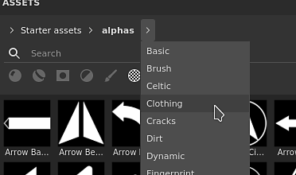

# Versione 7.2

**Substance 3D Painter 7.2** offre nuove funzionalità di rendering con il flusso di lavoro Adobe Standard Material, nuovi modi per condividere contenuti tra [applicazioni Substance 3D](https://www.adobe.com/products/substance3d/3d-augmented-reality.html) e una finestra Risorse revisionata.

Data di pubblicazione: *23 giugno 2021*

## Funzioni principali

### Finestra Nuove risorse

La vecchia finestra Scaffale è stata migliorata e rinominata come finestra Risorse. Questa riprogettazione è stata progettata per rendere i contenuti più rapidamente accessibili e più facili da filtrare con le nuove icone dedicate. Viene inoltre fornito con un sistema di navigazione più semplice con i breadcrumbs. Questa riprogettazione è stata progettata per rendere l&#39;esperienza simile a quella di altri software Substance 3D e semplificare la gestione dei contenuti tra le applicazioni.

>[!NOTE]
>
> Questa versione introduce modifiche nel modo in cui gestiamo le preferenze dell’applicazione e il contenuto Scaffale/Risorse. Per informazioni su come eseguire la migrazione dei dati, consulta [la pagina dedicata](../../pipeline-and-integration/resource-management/preferences-and-content-migration.md).

* **Nuovo design e layout**\
  Il nuovo design si concentra sulla semplicità, ma anche su una più semplice organizzazione della finestra. La finestra può ora essere ancorata verticalmente senza sprecare spazio. Una nuova modalità di visualizzazione &quot;elenco&quot; consente di cercare le risorse per nome molto più facilmente.

  

* **Nuova navigazione di breadcrumb**\
  La risorsa di navigazione può essere difficile a volte in una piccola interfaccia utente. Grazie a questo percorso non è più facile passare da una cartella all&#39;altra senza dover visualizzare l&#39;intera gerarchia delle cartelle.

  

* **Nuovi filtri di utilizzo**\
  La finestra Risorse contiene molti contenuti diversi e gli utilizzi sono utili per filtrare i contenuti e isolare risorse specifiche. Per selezionare un utilizzo specifico, è sufficiente fare clic sul pulsante dedicato. Per aggiungere o rimuovere più utilizzi, tenere premuto CTRL mentre si fa clic su un pulsante.

  

* **Rendering delle miniature migliorato**\
  Ci siamo presi il tempo di rielaborare il nostro sistema di generazione delle miniature per migliorarne la qualità e renderle più coerenti in tutto l&#39;ecosistema Substance 3D. Abbiamo anche aggiunto il supporto dello spostamento.

  {width="500px"}

* **Caricamento delle miniature dagli archivi Substance (sbsar)**\
  Le miniature personalizzate incorporate nei file di Substance non vengono caricate né visualizzate nella finestra Risorse. La condivisione delle risorse personalizzate è ora più semplice poiché non è necessario includere i metadati delle risorse per le icone personalizzate.

* **Prestazioni migliorate** Il tempo di caricamento e generazione delle miniature è stato migliorato su diversi aspetti e dovrebbe essere ora molto più veloce.

* **Aumentare il budget di memoria per l&#39;anteprima per caricare più miniature**\
  Per impostazione predefinita, viene allocata una quantità limitata di memoria alla visualizzazione delle miniature per risparmiare sulle prestazioni. Tuttavia, una libreria con molte risorse può comportare il caricamento e lo scaricamento costante di miniature, il che rende difficile la navigazione e la ricerca di risorse. È ora disponibile una nuova [variabile di ambiente](../../pipeline-and-integration/configuration/environment-variables.md) per sostituire il valore di budget predefinito.

### Nuovo flusso di lavoro Adobe Standard Material

È stato aggiunto un nuovo shader, denominato **Adobe Standard Material** (ASM), che supporta contemporaneamente diverse funzioni e consente di creare materiali più complessi e accurati all&#39;interno di un unico set di texture. Con questo nuovo shader abbiamo anche colto l&#39;opportunità di aggiungere nuovi canali per rendere più facile anche la creazione di materiali.

* **Nuovo shader di materiali Adobe Standard**\
  Il nuovo shader ASM è uno shader che raggruppa diverse funzionalità e rappresenta un&#39;evoluzione del rendering PBR. Esso sostiene al tempo stesso:
  * **Anisotropia**
  * **Cappotto trasparente**
  * **Brillantezza**
  * **Specular edge color**
  * **Metodi aggiuntivi di dispersione sottosuperficiale**
  * E naturalmente le altre caratteristiche esistenti come Occlusione Parralax, Spostamento, ecc.

* **Nuovi canali e canali utente**\
  Per supportare il nuovo shader ASM sono stati aggiunti nuovi canali. Abbiamo anche raddoppiato il numero di canali di utenti per ampliare le possibilità di informazioni personalizzate e shader personalizzati.
  * Colore rivestimento
  * Ruvidezza del rivestimento
  * Rivestimento normale
  * Opacità del rivestimento
  * Livello speculare del rivestimento
  * Colore di dispersione
  * Colore di lucentezza
  * Rugosità di lucentezza
  * Opacità di lucentezza
  * Colore speculare dei contorni
  * Canali utente da 8 a 15

* **Impostazioni del set di texture migliorate**\
  Il menu Elenco canali nelle impostazioni del set di texture ora raggruppa i canali in base alla loro compatibilità con lo shader corrente. Consente di identificare i canali che avranno un effetto nella finestra della vista.

  

* **Nuove funzionalità di API shader con if visibile e ricompilazione**\
  Con lo sviluppo dello shader ASM sono state apportate alcune modifiche all&#39;API, con due caratteristiche degne di nota:
  * **Visibile se**: i parametri dello shader possono essere visualizzati o nascosti in base alla condizione, rendendo più facile la lettura dell&#39;interfaccia utente dello shader.
  * **Ricompilazione**: dichiarando i parametri in un modo specifico, è ora possibile disabilitare parte di uno shader e ricompilarla per ottimizzarla quando il parametro cambia. Ciò consente di eliminare le funzionalità inutilizzate.

### Nuovo scambio di ecosistemi Substance 3D

Con questo nuovo flusso di lavoro, l’invio di risorse e servizi tra le applicazioni Substance 3D è diventato molto più semplice e accessibile con un solo clic. Ora è possibile ricevere file di Substance da Substance 3D Designer o Substance 3D Sampler o inviare un progetto a Substance 3D Stager molto facilmente per ripetere rapidamente i contenuti.

>[!WARNING]
>
> Queste funzionalità di invio e ricezione sono disponibili solo tramite la versione desktop Creative Cloud dell&#39;applicazione, poiché si basa su tecnologie specifiche per renderlo possibile. Ciò significa che la versione autonoma di Steam o Substance 3D non supporta queste funzionalità.

* **Da Painter a Stager**\
  Esporta da Painter a Stager con il predefinito di esportazione aggiornato o utilizza l&#39;azione **Invia a Substance 3D Stager** per esportare e importare automaticamente il progetto corrente in Stager. Nessuna configurazione manuale necessaria.

* **Stager in Painter**\
  Ricevi i modelli da Stager alla texture con un&#39;azione simile rapida direttamente da Stager.

* **Da Designer o Sampler a Painter**\
  Ricevi materiali Substance, filtri e altro ancora da Designer o Sampler direttamente nella finestra Risorse con un solo clic.

* **Substance 3D Assets a Painter**\
  Ricevi contenuti come materiale per Substance dal desktop Creative Cloud direttamente nella finestra Risorse di Painter.

* **Mostra in Bridge**\
  Le risorse nella finestra Risorse, che si trovano in una libreria gestita da Adobe Bridge, possono essere aperte direttamente in Bridge utilizzando il menu di scelta rapida su una risorsa specifica.

### Nuovo contenuto

In questa versione sono stati aggiunti nuovi contenuti:

* **Nuovi modelli di progetto per ASM (Adobe Stand Material)**\
  Per semplificare l&#39;utilizzo del nuovo shader ASM, sono stati creati nuovi modelli di progetto per velocizzare la creazione del progetto:
  * ASM - Rugosità metallica PBR
  * ASM - Angolo di Anisotropia rugosità metallica PBR
  * ASM - Rugosità metallica rivestita in PBR
  * ASM - Rugosità metallica PBR SSS
  * ASM - Rugosità metallica lucida PBR

* **Mappe nuovo ambiente**\
  Sono state aggiunte diverse nuove mappe dell’ambiente per illuminare i tuoi progetti, tra cui Studio 06 utilizzato per eseguire il rendering delle nuove miniature di Risorse:
  * Interno:
    * Laboratorio
  * Studio:
    * Studio 06
    * Studio 80s Horror Flick A
    * Luci soffuse scure da studio
    * Luci soffuse bianche da studio
    * Ombrello bianco da studio

### Miglioramento dello srotolamento UV automatico

È stato aggiunto un nuovo aggiornamento dello srotolamento UV automatico che porta il supporto dei riquadri UV e il controllo aggiuntivo sulla generazione UV:

* **Quantità porzione UV**\
  Quando si generano UV, è ora possibile specificare il numero massimo di porzioni UV che si desidera creare. Ciò consente di utilizzare la generazione UV anche con il flusso di lavoro delle porzioni UV.

* **Isola UV orientamento**\
  È stato aggiunto un nuovo parametro per aggiungere un vincolo all&#39;orientamento dell&#39;Isola UV quando viene imballato. Questo permette di rendere le Isole UV un po&#39; più allineate permettendo di strutturare alcuni oggetti più facilmente (ad esempio: una porta in legno per allineare il motivo in legno).

* **Prestazioni impacchettamenti migliorate**\
  Anche la funzione di impacchettamento è stata migliorata per offrire buone prestazioni con il nuovo supporto per le porzioni UV.

### Miglioramenti generali

Questa nuova versione aggiunge diversi miglioramenti a livello di qualità della vita:

* **Prestazioni dei cursori migliorate con la penna del tablet grafico**\
  Trascinare i cursori con una penna ora dovrebbe essere molto più reattivo. I cursori non devono più risultare appiccicosi.

* **Prestazioni migliorate con livelli già colorati**\
  Colorare su un livello con molti tratti di pennello esistenti ora dovrebbe essere molto più veloce e non dovrebbe più portare a rallentamenti.

* **Colorazione più veloce dopo l’apertura di un progetto**\
  È ora immediato disegnare su un livello nella parte superiore della pila di livelli subito dopo l’apertura di un progetto. Il calcolo della cache del motore è stato posticipato a un momento successivo, rendendo la riedizione dei vecchi progetti un po&#39; più veloce in questo contesto.

* **Metodo Sharp normal**\
  Nelle impostazioni del set di texture è disponibile un nuovo parametro del metodo Height a normale che consente di controllare il modo in cui il canale del Height viene convertito in una mappa normale. Questo nuovo parametro è utile per migliorare la qualità delle superfici con molti dettagli variabili, come i materiali di tessuto.

  {width="450px"}

* **Nuovo stile interfaccia**\
  L’interfaccia generale è stata leggermente regolata per allinearsi meglio all’ecosistema generale Substance 3D. In questo modo, passare da un&#39;applicazione all&#39;altra non è più sorprendente e risulta più facile.

* **Nuove traduzioni**\
  Sono state aggiunte tre nuove lingue per tradurre l&#39;interfaccia del programma:
  * Francese
  * Tedesco
  * Cinese semplificato

## Note sulla versione

### 7.2.0

*(Rilasciato Il 23 Giugno 2021)*\
Riepilogo: **Versione principale, fornisce un aggiornamento del pannello delle risorse, un nuovo shader con accesso a nuovi canali e parametri, un aggiornamento complessivo dell&#39;interfaccia utente, alcuni miglioramenti delle prestazioni molto richiesti, supporto linguistico esteso e altro ancora.**

**Aggiunto:**

* [Librerie] Nuovo pannello Risorse per sostituire lo scaffale
* [Libraries]&#x200B;[UI] Nuovo layout del pannello Risorse
* [Libraries]&#x200B;[UI] Modifica l&#39;orientamento e l&#39;interfaccia utente predefiniti del pannello Risorse
* [Libraries]&#x200B;[UI] Introduce un&#39;opzione di visualizzazione elenco alla libreria
* [Libraries]&#x200B;[UI] Nuovo percorso di navigazione nel pannello Risorse
* [Libraries]&#x200B;[UI] Seleziona &quot;Tutte le librerie&quot; quando selezioni una ricerca salvata
* [Libraries]&#x200B;[UI] Seleziona &quot;Tutte le librerie&quot; quando tutte le cartelle sono deselezionate
* [Libraries]&#x200B;[UI] Nuovo tag per i pennelli particelle
* [Libraries]&#x200B;[UI] Sostituito &quot;shelf&quot; da &quot;Tutte le librerie&quot; in tutta l&#39;app
* [Libraries]&#x200B;[UI] Consente di nascondere le cartelle vuote
* [Libraries]&#x200B;[UI] La libreria utente predefinita dovrebbe essere visibile anche se vuota
* [Libraries]&#x200B;[UI] Nuovo metodo di filtraggio tramite le icone del tipo di risorsa
* [Libraries] Scelta rapida &quot;CTRL&quot; per selezionare più tipi di risorse
* [Libraries] Nuova variabile di ambiente per controllare il budget della memoria di anteprima delle risorse
* [Libraries]&#x200B;[Content] Mappe del nuovo ambiente
* [Libraries]&#x200B;[Content]&#x200B;[UI] spostamento di rendering sui materiali predefiniti
* [Libraries]&#x200B;[Contenuto] Impostate lo shader Adobe Standard Material (ASM) come predefinito per la generazione delle anteprime
* [Libraries]&#x200B;[Content]&#x200B;[ASM] Nuovi modelli di progetto per il nuovo shader ASM
* [Libraries]&#x200B;[Thumbnail] Utilizza la nuova mappa dell&#39;ambiente Studio 6
* [Libraries]&#x200B;[Thumbnail] Leggi la miniatura nella risorsa invece di generarla
* [Libraries]&#x200B;[Thumbnail] Aggiungi spostamento alla generazione di miniature
* [Impostazioni set di texture]
* [Texture Set Settings]&#x200B;[UI] Esporta il nuovo height al metodo di conversione normale
* [Impostazioni set di texture]&#x200B;[UI] Rielaborazione dell&#39;organizzazione dell&#39;interfaccia utente dei canali
* [Impostazioni set texture] Limite canali utente aumentato a 16 canali
* [Texture Set Settings]&#x200B;[UI] Indica quali canali sono compatibili con lo shader attualmente selezionato
* [Shader]&#x200B;[ASM] Nuovo shader materiale standard Adobe
* [Shader]&#x200B;[ASM] Aggiunto il supporto per Anisotropia, Cancella rivestimento, Dispersione sottosuperficie, Specular edge color e Brillantezza
* [Shader]&#x200B;[ASM] Modifica i valori di colore dei canali predefiniti
* [Shader]&#x200B;[ASM]&#x200B;[Esporta] Modello di esportazione aggiornato da Adobe Dimension a Adobe Substance 3D Stager
* [Shader]&#x200B;[ASM] Etichette e descrizioni comandi aggiunte per i parametri shader e MDL
* [Shader]&#x200B;[ASM] Rendete visibile il colore della Dispersione nella vista 2D anche se SSS non è supportato
* [Shader]&#x200B;[ASM]&#x200B;[Iray] Supporta lo shader ASM in Iray con la nuova MDL
* [Shader]&#x200B;[ASM]&#x200B;[Iray] Scattering sottosuperficie aggiornato in lucido e patinato delle specifiche PBR legacy
* [Shader]&#x200B;[ASM]&#x200B;[Content] Ha modificato il tipo SSS predefinito per i campioni
* [Shader]&#x200B;[ASM] Documentazione aggiunta per l&#39;API ASM
* [Shader]&#x200B;[ASM] Ottimizzate gli shader per ignorare i canali non utilizzati
* [Shader] Esporre i nuovi canali del set di texture
* [Shader] Dispersione sottosuperficie migliorata
* [Shader] Nuovi parametri dello shader nascosti per alcuni shader
* [Shader] Visibile se per i parametri dello shader
* [Prestazioni]
* [Librerie] Anteprima risorse: miglioramenti a livello di tempo di caricamento e prestazioni di calcolo
* [Engine] Miglioramenti delle prestazioni di pittura
* [Annullamento automatico] Miglioramenti delle prestazioni di Impacchettamento
* [Annullamento automatico]
* [Rimozione automatica] Rimozione automatica dell’involucro compatibile con il flusso di lavoro Porzione UV
* [Auto-Unwrap] Nuova opzione per posizionare gli UV in base all&#39;orientamento della trama
* [Altro]
* [Impostazioni] Cambiata direzione zoom predefinita
* [UI] Aggiornamento complessivo dell’interfaccia utente
* [UI] Rielaborazione del menu Aiuto
* [UI] Sostituisci l&#39;icona Inverti
* [UI]&#x200B;[Plugin] Icona Sostituisci per il collegamento dcc del plug-in
* [UI]&#x200B;[AMD] Aggiorna la versione minima richiesta e il messaggio a comparsa
* [Serie di livelli] Crea un nuovo livello all’interno della cartella vuota selezionata
* Aggiornamento della documentazione Python
* Branding
* [Branding]&#x200B;[UI] Nome dell’applicazione aggiornato in Adobe Substance 3D Painter
* [Branding]&#x200B;[UI] Versione autonoma aggiornata a &quot;Substance edition&quot;
* [Branding]&#x200B;[UI] Nome eseguibile dell&#39;applicazione aggiornato, percorso di installazione, pacchetto e icone
* [Branding]&#x200B;[UI] Libreria e percorso predefiniti rinominati
* [Branding]&#x200B;[UI] Aggiornamento della finestra Informazioni su
* [Branding]&#x200B;[UI] Schermata introduttiva aggiornata
* [Branding]&#x200B;[UI] Rimosso il numero di versione basato sull&#39;anno
* [Localizzazione] Nuove traduzioni in tedesco, francese e cinese semplificato
* [Interoperabilità] Non disponibile per le edizioni Steam e Substance
* [Interoperabilità] Interoperabilità con l&#39;ecosistema Adobe: Designer, Sampler, Stager e Bridge
* [Interoperabilità]&#x200B;[UI] Ricevi e aggiorna la risorsa da Designer
* [Interoperabilità]&#x200B;[UI] Ricevi risorsa da Sampler
* [Interoperabilità]&#x200B;[UI] Invia risorsa a Stager
* [Interoperabilità]&#x200B;[UI] Mostra in Adobe Bridge
* [Interoperabilità]&#x200B;[UI] Consente di accedere rapidamente alle risorse 3D di Adobe
* [Interoperabilità] Nuovi tag di utilizzo di sbsar
* [Interoperabilità] Gestire i tipi di risorse ricevute
* [Interoperabilità] Le risorse ricevute da Adobe Substance 3D Designer o Adobe Substance 3D Sampler vengono archiviate nella libreria predefinita scelta dall&#39;utente
* [Interoperabilità]&#x200B;[UI] Nuova icona nella barra degli strumenti a sinistra da inviare a Stager o Photoshop

**Corretto:**

* [Tablet] Prestazioni ridotte quando si esegue il disegno a pressione
* [Tablet] Problema con i tablet con controlli del cursore
* [Arresto anomalo] Mancata corrispondenza del nome tra l’elenco Set di texture e il modulo di esportazione
* [Arresto anomalo]&#x200B;[Librerie] Fai doppio clic su una libreria secondaria
* [Libraries] Problema durante la ricerca per indicizzazione delle directory della libreria
* [Libraries] La riga di comando Forza generazione anteprima non funziona come previsto
* [Libraries]&#x200B;[Contenuto] Il filtro Baked Light Environment è nero per impostazione predefinita
* [Linux]&#x200B;[MacOS]&#x200B;[Esporta mesh] Impossibile importare glTF creato su Linux/MacOS
* [Linux] Il trascinamento di un file nel pannello Risorse può causare un arresto anomalo
* [Auto-Unwrap] L’opzione Auto-Unwrap è disponibile anche se una trama non è stata selezionata per il ricaricamento
* [Particelle] Comportamento errato delle particelle con gravità
* [Serie di livelli] L’istogramma a livelli può utilizzare la luminanza solo con alcuni canali
* [Maschera geometria] Il menu di scelta rapida di una cartella quando si modifica la maschera di geometria non funziona
* [Proiezione] Cucitura con proiezione sferica e filtro bilineare
* [Riquadri UV] Esporta maschera solo in file esporta solo il riquadro 0, 0
* [Trama di esportazione] L&#39;esportazione della trama FBX è vuota
* [Iray] La mappa normale non viene considerata nei nuovi progetti durante il rendering
* [Salva] Salva problemi su unità condivise
* [Baking] Se si esegue il rebaking di una trama con parametri modificati, viene visualizzato un avviso
* [Baking]&#x200B;[Regressione] Risultato errato quando il rettangolo di selezione globale di High Poly Meshes non include l&#39;origine della scena
* [Python] Le librerie utente personalizzate non sono considerate

**Problemi noti:**

* [Librerie] Ricerche salvate non salvate se non è aperto alcun progetto
* [NVIDIA] Messaggio per driver obsoleto anche se aggiornato
