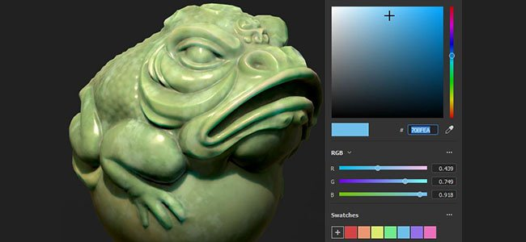
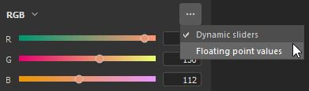
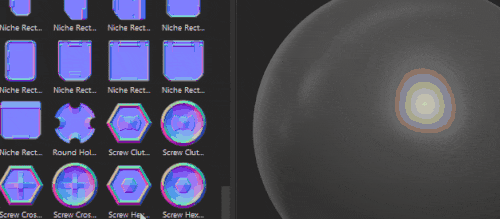

# Versione 7.3

**Substance 3D Painter 7.3** offre nuovi modi per strutturare le trame con le nuove proiezioni di alterazione e cilindro per i livelli di riempimento.

Data di pubblicazione: *13 ottobre 2021*

## Funzioni principali

### Nuova proiezione alterazione

Questa versione introduce la nuova proiezione di alterazione 3D per i livelli di riempimento e gli effetti di riempimento. Questa proiezione consente di distorcere una texture o un’immagine con l’aiuto di una griglia di deformazione e punti controllabili.

* **Configurazione rapida tramite trascinamento** Scegliere un materiale, un canale alfa, una texture o una procedura dalla libreria Risorse, quindi trascinare e rilasciare sulla parte desiderata della trama (scelta rapida **ALT** richiesta per Materiali). Se la risorsa non è un materiale, viene visualizzato un messaggio a comparsa con informazioni sul canale a cui desideri assegnarla.\
  Una volta creato il livello, vedrai che la nuova *Proiezione alterazione* viene selezionata automaticamente. Il livello dispone di controlli standard della modalità di proiezione 3D, ma anche di un nuovo parametro *Profondità proiezione* che consente di impostare la profondità della proiezione di alterazione (rappresentata da frecce verdi come coda visiva).\
  Potete anche selezionare manualmente questa modalità di proiezione su qualsiasi livello di riempimento o effetto senza dover trascinare una risorsa nella finestra della vista.

  

* **Posizionamento automatico con lo strumento superficie** Quando viene creato il nuovo livello di alterazione, lo strumento superficie viene selezionato automaticamente. Ciò consente di spostare l’immagine in modo che rimanga sempre sulla superficie della trama. Tuttavia, potete sempre passare a uno qualsiasi degli altri manipolatori e regolarne la traslazione (scelta rapida **W**), la rotazione (scelta rapida **E**) o la scala (scelta rapida **R**). Per tornare allo strumento superficie, utilizzate la scelta rapida **MAIUSC + W**. Quando si passa alla modalità *Modifica vertici*, lo strumento superficie è anche la selezione predefinita e aggancia il movimento dei vertici alla superficie della trama. È tuttavia possibile ignorare temporaneamente e rapidamente lo strumento Superficie **mantenendo premuto il tasto CTRL** che consente di spostare il punto selezionato in qualsiasi direzione, non solo sulla superficie.

* **Griglia di alterazione facilmente modificabile** Al termine del posizionamento globale dell&#39;immagine, è anche possibile modificare la griglia di alterazione stessa per maggiore precisione e flessibilità. Per passare alla modalità di modifica della griglia, potete utilizzare il menu di alterazione appena aggiunto o la scelta rapida **MAIUSC + V**. Ciò consentirà di modificare i vertici esistenti della griglia.\
  Potete suddividere uniformemente l’intera griglia, tenendo però presente che se in precedenza aveste spostato i vertici, questi verranno reimpostati nelle loro posizioni originali. La suddivisione della griglia può essere effettuata mediante il nuovo menu delle opzioni di alterazione.\
  In alternativa, è possibile aggiungere suddivisioni posizionate singolarmente, in modo da ottenere maggiori dettagli solo quando necessario. Per aggiungere delle suddivisioni, selezionate una delle tre opzioni nel menu Altera: in senso trasversale, orizzontale o verticale. Quando una di esse è selezionata, passate il cursore sulla proiezione di alterazione e fate clic in un punto qualsiasi al suo interno per aggiungere una nuova divisione. Ciò non modifica la posizione dei punti esistenti.

  
* **Regolazione automatica dell&#39;orientamento dei vertici** Per impostazione predefinita, le tangenti dei singoli vertici vengono regolate in base alla superficie della trama, il che significa che saranno sempre orientate correttamente in relazione alla trama indipendentemente dal punto in cui vengono trascinate. Questa opzione di tangenza automatica può essere disattivata tramite un nuovo pulsante nella barra degli strumenti contestuale, nel qual caso l&#39;orientamento rimarrà fisso in qualsiasi momento.

  

Per ulteriori informazioni sulle impostazioni e le proprietà della proiezione di alterazione, consultate la [pagina dedicata alla documentazione](../../painting/fill-projections/warp-projection.md).

### Nuova proiezione cilindro

Questa versione aggiunge un metodo di proiezione cilindrica per livelli di riempimento ed effetti di riempimento. La nuova proiezione consente di adattare un’immagine o una texture attorno a oggetti come colonne, pilastri o altre forme organiche come le braccia di un personaggio.

* **Contornare con un’immagine una trama**\
  Puoi facilmente avvolgere un’immagine attorno a una superficie cilindrica utilizzando un livello di riempimento o un effetto di riempimento e selezionando *Proiezione cilindrica* nel menu a discesa Proiezione. Se l&#39;immagine non deve essere ripetuta all&#39;esterno del gizmo di proiezione, è necessario selezionare *Nessuno* per *Disposizione UV* e *Ritagliata in forma* in *Ritaglio forma* per assicurarsi che l&#39;immagine non superi i limiti. Sarà quindi sufficiente utilizzare il manipolatore per regolare la proiezione nella posizione desiderata.

* **Regolare l&#39;angolo di proiezione**\
  Una volta che l’immagine è stata posizionata, è disponibile una nuova impostazione Angolo. Questa impostazione può essere utilizzata per regolare se l&#39;immagine è proiettata completamente intorno alla forma cilindrica o se è limitata a un determinato angolo. Non ritaglia l’immagine, ma ne riduce la larghezza.

  

Per ulteriori informazioni, consulta la [pagina dedicata alla documentazione](../../painting/fill-projections/cylindrical-projection.md).

### Selettore colore migliorato

Questa versione apporta diversi miglioramenti alla qualità della vita del selettore colore.

* **Nuovo layout finestra**\
  La finestra del selettore colore migliorata è stata rielaborata per contenere un layout più verticale, simile all’ultima versione di Sampler. È diviso in tre sezioni: il campo colore principale che include la selezione corrente e l’ultima selezione, il campo esadecimale, il contagocce e il cursore della tonalità; la sezione dei cursori manuali RGB/HSV e i campioni.\
  

* **Nuovi valori 0-255 RGB**\
  Oltre alle modalità esistenti di immissione del valore del colore, il selettore colore migliorato consente anche di lavorare con valori da 0 a 255 RGB. Questa opzione è disponibile quando *Valori a virgola mobile* è deselezionato nel menu a discesa della sezione Cursori.

  
* **Salvataggio dei campioni di colore**\
  I campioni di colore ora possono essere salvati in Painter! Una volta selezionato il colore desiderato, è possibile premere il pulsante più nella sezione Campioni del selettore colore e il colore verrà memorizzato tra sessioni e progetti. Un campione può essere cancellato facendo clic con il pulsante destro del mouse su di esso, o in alternativa è possibile eliminare in blocco tutti i campioni contemporaneamente tramite il menu a discesa di questa sezione. Non esiste alcun limite al numero di campioni che possono essere salvati.

  
* **La finestra del selettore colore rimane aperta**\
  La finestra del selettore colore può ora essere spostata e posizionata ovunque, anche su un altro schermo, e rimarrà aperta fintanto che non ci sarà un cambiamento di contesto. Ciò significa che quando passate da un livello di pittura all’altro durante la pittura a mano, potete tenere aperta la finestra del selettore colore per accedervi più facilmente.

  

* **Contagocce più accessibile**\
  Ora il contagocce per la selezione del colore si trova direttamente accanto al campo del colore, ma puoi trovarlo anche nel selettore colore. Il contagocce più accessibile mantiene tutte le funzionalità precedenti: potete comunque fare clic e tenere premuto per selezionare un colore in qualsiasi punto dello schermo. Questo contagocce visibile si trova accanto a tutti i campi colore in Painter, non solo ai canali dei livelli.

  

Per ulteriori informazioni, consulta la [pagina dedicata alla documentazione](../../interface/color-picker.md).

### Altre funzioni e miglioramenti

* **Miglioramenti relativi al trascinamento delle risorse**\
  Con l’introduzione di Altera, la funzione decalcomania che consente di trascinare e rilasciare le risorse dalla libreria alla finestra della vista mantenendo ALT ha rilevato alcune rielaborazioni. Quando una decalcomania viene creata in questo modo, non utilizza più la proiezione Planare, ma la proiezione Altera. La selezione automatica della proiezione Altera dovrebbe migliorare la velocità e l’efficienza delle regolazioni delle decalcomanie sulla trama.\
  Inoltre, è ora possibile trascinare nella finestra della vista non solo i materiali, ma anche le risorse di tipo immagine. Quando si seleziona un canale alfa, una texture o una procedura, non è necessario utilizzare il modificatore ALT. Può essere rilasciata sulla trama: questo comporterebbe un menu con l’opzione di selezionare se questa immagine deve essere utilizzata all’interno di una maschera o in uno dei canali del livello.

  

* **Miglioramento del plug-in di salvataggio automatico**\
  Il salvataggio automatico non viene più attivato durante operazioni più lunghe o più pesanti, come il ricaricamento della trama, la cottura al forno o l’esportazione.

* **Miglioramenti delle prestazioni**\
  Sono state effettuate alcune operazioni di manutenzione e ottimizzazione per la manipolazione del cursore e le prestazioni di pittura.

* **Nuove funzioni nell&#39;API python**\
  L&#39;API Python aveva visto alcune aggiunte recenti, che permettono di ricaricare la trama, aggiornare le risorse, nonché impostare e interrogare la risoluzione delle porzioni UV tramite script.

* **Aggiornamento motore di Substance 8.3.0**\
  Oltre ad alcune correzioni e a miglioramenti generali, questo aggiornamento del motore di Substance ora tiene conto dei nuovi tipi di grafici. È anche possibile verificare la versione del file .sbsar, che dovrebbe migliorare l&#39;utilizzo e il download delle versioni appropriate.

* **Ricezione di Substance 3D Assets da CC Desktop**\
  È ora possibile accedere a Substance 3D Assets, come Materiali, Atlanti e Decalcomanie, dall&#39;app CC Desktop. Inoltre, possono essere inviati direttamente alla libreria di Painter.

## Note sulla versione

### 7.3.0

*(Rilasciato Il 13 Agosto 2021)*\
Riepilogo: **Versione principale. Contiene una nuova proiezione di alterazione 3D, una nuova proiezione cilindrica, miglioramenti del selettore colore, nuove funzioni nell&#39;API Python e correzioni di bug**

**Aggiunto:**

* [Proiezione]&#x200B;[Altera] Esporre l’alterazione 3D come nuova modalità di proiezione
* [Proiezione]&#x200B;[Altera] Consente la modalità decalcomania per Alpha, texture e procedurali con trascinamento nella finestra della vista
* [Proiezione]&#x200B;[Altera] Usa proiezione alterazione con scelta rapida decalcomania (ALT)
* [Proiezione]&#x200B;[Altera]&#x200B;[Barra degli strumenti] Trasforma l’alterazione nel suo insieme o per vertici
* [Proiezione]&#x200B;[Altera]&#x200B;[Barra degli strumenti] Aggiungi punti della griglia con opzioni Dividi alterazione a croce, in orizzontale o verticale
* [Proiezione]&#x200B;[Altera]&#x200B;[Barra degli strumenti] Menu dedicato per le azioni di ripristino
* Opzione [Proiezione]&#x200B;[Altera]&#x200B;[Barra degli strumenti] per regolare automaticamente le tangenti quando si spostano i punti
* [Proiezione]&#x200B;[Altera]&#x200B;[Barra degli strumenti] Menu dedicato per l&#39;edizione della griglia (dimensioni, reimpostazione, colore e dimensione della maniglia)
* [Proiezione]&#x200B;[Altera] Nuova scelta rapida da tastiera per cambiare la modalità edizione alterazione vertici interi (MAIUSC+V)
* [Proiezione]&#x200B;[Altera] Fare clic + Ctrl per passare dallo strumento superficie ad altri strumenti
* [Proiezione]&#x200B;[Cilindrica] Esposizione della modalità di proiezione cilindrica
* [Proiezione]&#x200B;[Barra degli strumenti] Impostazioni manipolatore gruppo (dimensioni, passaggi griglia, passaggi angolo)
* [Selettore colore] Nuova interfaccia utente del selettore colore
* [Selettore colore] Usare i valori sRGB nei widget del selettore colore
* [Selettore colore] Consente di salvare ed eliminare i campioni di colore
* [Selettore colore] Contagocce accessibile da slot per colori e normali
* [Selettore colore] Consente di modificare il colore dinamico tra i valori 0 e 255
* [Selettore colore] Rendi lo stato HSV/RGB comune in tutta l’app
* [Selettore colore] La finestra del selettore colore è semi-persistente
* [Selettore colore] Premendo Esc si chiude la finestra del selettore colore
* Miglioramento delle prestazioni per l’interazione dell’interfaccia utente e durante la pittura
* [Engine] Aggiornamento alla nuova versione del motore di Substance (8.3.0)
* [Scripting]&#x200B;[Python] Consente di ricaricare la trama del progetto corrente
* [Scripting]&#x200B;[Python] Consente di aggiornare le risorse nei progetti
* [Scripting]&#x200B;[Python] Consenti di impostare ed eseguire query sulla risoluzione dei riquadri UV
* [Interoperabilità] Non disponibile per le edizioni Steam e Substance
* [Interoperabilità] Ricezione di più risorse da Bridge

**Corretto:**

* Il selettore colore non visualizza il colore corretto
* [Baking] L&#39;elenco dei set di texture non è ordinato correttamente
* [Importazione FBX] Le trasformazioni pivot del gruppo 3ds Max non vengono considerate
* [Substance Engine] Arresto anomalo con importazione di SBSAR danneggiati
* [MacOS] L’opzione di configurazione del progetto in lingue diverse non è presente
* I salvati automaticamente possono bloccare Painter durante processi lunghi

**Problemi noti:**

* [Proiezione]&#x200B;[Altera] L’opzione Dividi rimane selezionata al termine della divisione
* [Proiezione]&#x200B;[Altera] L’opzione Capovolgi non funziona quando la trasformazione è impostata sullo spazio mondo
* [Proiezione]&#x200B;[Altera] Linee di artefatto tra le patch in alcuni rari casi
* [Proiezione]&#x200B;[UV] Il punto pivot viene reimpostato quando si capovolge la proiezione
* [Mac M1] I materiali avanzati non vengono visualizzati correttamente
* [M1]&#x200B;[Regressione] Livelli di materiale non funzionanti
