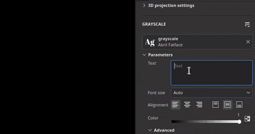

# Versione 10.0

<b>Substance 3D Painter 10.0</b> offre il supporto dei file Illustrator (.ai), integra i font tramite le risorse di testo, aggiunge le funzionalità Pila livelli nell&#39;API Python e offre diversi miglioramenti a livello di qualità della Substance 3D Assets.

Data di pubblicazione: *16 maggio 2024*

## Funzioni principali

### Nuova risorsa di testo

Questa nuova versione introduce la <b>risorsa Testo</b> che consente di caricare file di font per scrivere testo in contesti diversi (pennello, proiezione riempimento, Substance input immagine, ecc.) per abbellire le tue texture.

* <b>Sfoglia i tuoi font nella finestra Risorse</b>\
  I font sono ora elencati nella finestra Risorse sotto il proprio filtro. Vengono raccolti da posizioni diverse sul sistema operativo (e anche dalle librerie).

  
* <b>Trascina i font come qualsiasi altra risorsa</b>\
  I font possono essere utilizzati come risorse di testo come qualsiasi altro tipo di risorsa. Trascinali per creare automaticamente la proiezione di riempimento. Possono essere utilizzati anche nei pennelli o come input nei filtri Substance.

  
* <b>Parametri della risorsa di testo</b>\
  Quando create una risorsa di testo, potete modificare alcuni parametri per regolare l’aspetto del testo: allineamento verticale e orizzontale, dimensione automatica o manuale, spaziatura tra righe e caratteri, colore e così via.

  
* <b>Ampia gamma di caratteri e funzionalità supportate</b>\
  La risorsa Testo supporta la scrittura da destra a sinistra e [legature](https://en.wikipedia.org/wiki/Ligature_(writing)). Per poter scrivere caratteri non latini è necessario un font compatibile.

  
* <b>Importare font personalizzati come una risorsa normale</b>\
  Puoi importare i tuoi file di font direttamente nella tua libreria o progetto come qualsiasi altra risorsa. Alcuni tipi di font non sono tuttavia supportati. Per ulteriori informazioni, vedere questa [pagina della documentazione](../technical-support/workflow-issues/shelf-issues/font-import.md).

>[!NOTE]
>
> Per ulteriori informazioni sulla <b>risorsa di testo</b>, vedere la [pagina dedicata alla documentazione](../painting/text-resource.md).

### Nuova importazione di file Illustrator (.Ai)

In seguito al supporto per i file <b>.svg</b>, questa nuova versione aggiunge anche la possibilità di importare file Illustrator (<b>.ai</b>).

* <b>Supporto file Illustrator (.Ai)</b>\
  In questa nuova versione, i file .ai possono ora essere importati e sottoposti a rendering in Painter per essere utilizzati come risorse in pennelli, proiezioni di riempimento o come input di immagini Substance.
* <b>.i file svg e ai condividono le impostazioni comuni</b>\
  I documenti SVG e Illustrator condividono impostazioni simili, in particolare i parametri di risoluzione, area di ritaglio e selezione ambito. Ciò significa che le risorse vettoriali possono essere gestite in modo simile.

  
* <b>Selezione tavola da disegno</b>\
  I documenti di Illustrator supportano le tavole da disegno. Quando utilizzi un file .ai, puoi anche scegliere tra diverse tavole da disegno disponibili tramite l&#39;impostazione dedicata.

  
* <b>Selezione ambito migliorata</b>\
  La finestra di selezione dell’ambito è stata migliorata con il supporto di miniature, rendendo più facile sfogliare e selezionare solo elementi specifici.\
  Per motivi legati alle prestazioni, le miniature sono disattivate per impostazione predefinita e possono essere attivate con la casella di controllo <b>Mostra miniature</b>.

  

>[!NOTE]
>
> L&#39;importazione di file di Illustrator (<b>.ai</b>) è attualmente supportata solo in Windows e MacOS.

### Nuova integrazione Substance 3D Assets

È disponibile una nuova finestra che incorpora il sito Web Substance 3D Assets direttamente in Painter. Questa integrazione semplifica la ricerca e il download delle risorse direttamente nella tua libreria.

* <b>Nuova finestra di Substance 3D Assets</b>\
  Nell’interfaccia è disponibile un nuovo dock per sfogliare i Substance 3D Assets. Se l’ancoraggio non è visibile e chiuso, può essere nuovamente trovato nella barra degli strumenti ancoraggio a destra dell’interfaccia.

  
* <b>Gestione download</b>\
  Puoi visualizzare le risorse attualmente scaricate tramite il gestore dedicato utilizzando il pulsante in basso a sinistra della finestra. Da questo elenco è possibile riavviare le risorse che potrebbero non essere scaricate.

  
* <b>Trova facilmente le risorse scaricate</b>\
  Il pulsante in basso a destra della finestra apre un menu con alcune azioni per aiutare a navigare nel sito web, ma anche per mostrare dove sono state scaricate le risorse.

  

>[!NOTE]
>
> Al primo avvio, per scaricare le risorse sarà necessario accedere al tuo account. Questo accesso viene quindi memorizzato nella cache per gli utilizzi futuri.

>[!NOTE]
>
> Il dock del Substance 3D Assets non è disponibile nella versione Steam.

### Nuovo modulo Pila livelli nell’API Python

Con questa versione viene aggiunto il nuovo modulo Pila livelli all’API Python. Questa API consente di controllare la pila di livelli di un progetto, aprendo la porta alla creazione di plug-in avanzati per la pila di livelli e strumenti personalizzati.

* <b>Nuova API Pila livelli</b>\
  Il nuovo modulo <b>layerstack</b> consente di controllare la pila di livelli di un progetto in molti modi. È possibile:

  * Eseguire una query e impostare la selezione di livelli ed effetti.
  * Crea nuovi livelli, cartelle ed effetti (inclusi filtri, punti di ancoraggio, ecc.).
  * Create un’istanza dei livelli.
  * Ottieni e imposta i parametri di livelli ed effetti, carica le risorse in essi.
  * Recupera e imposta i parametri della Substance.
* <b>Modifiche con ambito e pausa del motore</b>\
  La manipolazione della pila di livelli potrebbe portare a lunghi calcoli, ecco perché abbiamo anche esposto la possibilità di mettere in pausa e rimettere in pausa il motore dall’API (come nell’interfaccia utente). Abbiamo inoltre reso possibile raggruppare le modifiche per entrambi i motivi di prestazioni, ma anche per annullare una singola operazione multipla.
* <b>Gestione colore di base</b>\
  Con l’esposizione della pila di livelli dovevamo introdurre il concetto di gestione del colore nella nostra API. È stato aggiunto un nuovo modulo <b>gestione dei colori</b> per creare, modificare i colori e scegliere lo spazio colore delle bitmap. (Questa parte dell’API non è ancora completa e verrà espansa nelle versioni future).
* <b>Query sulle informazioni sui predefiniti di esportazione</b>\
  I predefiniti di esportazione ora sono disponibili nell’API, e consentono di richiedere l’elenco dei predefiniti (sia predefiniti che personalizzati). Il loro contenuto può anche essere recuperato in un formato simile al nostro attuale API di esportazione della texture.
* <b>Nuove possibilità in futuro.\
  </b> Questa nuova parte dell&#39;API consente di eseguire molte nuove operazioni, ad esempio salvare e ripristinare una selezione di livelli o modificare il valore casuale di tutte le risorse di un progetto:

  

>[!NOTE]
>
> Per ulteriori informazioni sull’API, consulta la documentazione inclusa con l’applicazione (tramite <b>Aiuto > Documentazione script > API Python</b>) che include molti snippet di codice per iniziare facilmente.

>[!NOTE]
>
> Esempi di plug-in Pila livelli sono disponibili anche nella [documentazione online](https://adobedocs.github.io/painter-python-api/).

### Mappa normale migliorata

In questa versione è stato rielaborato il flusso di lavoro di pittura di mappa normale. Abbiamo notevolmente cambiato il modo in cui accumuliamo e fondiamo i normali timbri a pennello. Queste modifiche sono state apportate per risolvere problemi relativi alla colorazione delle mappe di flusso.

* <b>Problema di accumulo risolto</b>\
  Dipingere su un’area del canale normale non saturerà né mormorderà e creerà fori o artefatti. Inoltre, non è più necessario cambiare il canale normale in RGB32F.

  
* <b>È stato corretto l&#39;annullamento dell&#39;interruzione dei tratti colorati</b>\
  Annullando un tratto del pennello non si interrompono più altri tratti già disegnati.

  
* <b>Trasparenza su zero alfa</b>\
  I timbri a pennello creati con una texture con un valore alfa pari a zero ora disegnano come trasparenti. L’esempio seguente mostra un timbro pennello (a sinistra) e una proiezione planare (a destra).

  

>[!NOTE]
>
> Per ulteriori informazioni sulla colorazione della mappa di flusso, vedere la [pagina della documentazione](../painting/advanced-channel-painting/flow-map-painting.md).

### Manipolatori di Trasforma migliorati

Sono stati apportati diversi miglioramenti per migliorare l’utilizzo dei manipolatori di Trasforma.

* <b>Modalità Precisione con CTRL</b>\
  Premendo il controllo durante il trascinamento su un manipolatore ora si entra in una nuova modalità di precisione che consente operazioni più meticolose. Questa modifica è applicabile ai manipolatori di traslazione, rotazione e scala.\
  Di seguito è riportato un esempio prima e dopo aver premuto CTRL durante il trascinamento:

  
* <b>Nuovo comportamento di scala</b>\
  L’intensità della scala si basa ora sul valore di scala corrente e non più sulle dimensioni della scena. In questo modo è più semplice apportare modifiche relative, soprattutto a valori ridotti. Combinato con la modalità precisa rende il ridimensionamento molto più piacevole.\
  Un&#39;altra modifica consiste nel ridurre il valore fino a quando il valore 0 non diventerà più negativo. In questo modo si evita di dover ridurre una proiezione e capovolgerla accidentalmente.

  
* <b>Rotazione migliorata del manipolatore di superfici</b>\
  Il manipolatore decalcomanie superficie ora è molto più stabile quando si trascina intorno a una superficie. Non aumenta la sua rotazione quando si eseguono traduzioni avanti e indietro.\
  Ecco il <b>vecchio</b> comportamento rispetto a <b>nuovo</b>:

  

  
* <b>Proiezione allineata alla fotocamera al trascinamento</b>\
  Trascinando e rilasciando una risorsa nella finestra della vista è possibile creare una proiezione di alterazione direttamente sulla superficie della trama. La proiezione, che in precedenza veniva ruotata in modo errato, ora è allineata alla videocamera.

  

Sono stati aggiunti alcuni altri miglioramenti, in particolare:

* <b>Tile Generator aggiornato</b>\
  Il parametro del metodo di fusione <b>Tile Generator</b> può ora essere modificato e modificherà il risultato come previsto. La risorsa è stata inoltre aggiornata alla versione più recente disponibile in <b>Substance 3D Designer</b>.
* <b>Corretti problemi di banding/qualità in alcuni filtri</b>\
  Diversi filtri erano bloccati su una precisione di 8 bit invece di 16 bit, causando bande/artefatti quando venivano utilizzati (come la scansione dell’istogramma o la sfocatura direzionale). Questo problema è stato risolto.
* <b>Spazio colore nell&#39;output SBSAR</b>\
  Quando il flusso di lavoro per la gestione dei colori legacy o OCIO è abilitato, l’esportazione SBSAR ora fa riferimento ai nomi degli spazi colore utilizzati nel progetto nei rispettivi output.
* <b>Individuazione più rapida delle risorse</b>\
  Con l&#39;introduzione della <b>risorsa di testo</b> è stata aggiunta una nuova cache per velocizzare la ricerca per indicizzazione delle risorse sul disco al prossimo avvio. Ciò è particolarmente evidente quando le risorse sono installate su un disco rigido o quando una libreria ha gigabyte di risorse. Questa nuova cache può essere disabilitata con una riga di comando. Per ulteriori informazioni, vedere la [pagina della documentazione](../pipeline-and-integration/configuration/command-lines.md) dedicata.

Grazie al sito Web [è arabo ?](https://isthisarabic.com/) che è stato di grande aiuto durante lo sviluppo di questa versione.

Riferimento alla grafica utilizzata nei supporti qui sopra:

* [Uomo che indossa una camicia nera](https://unsplash.com/photos/man-wearing-black-shirt-aoEwuEH7YAs) di Lucas Gouvêa
* [Rosa e verde](https://unsplash.com/photos/pink-and-green-abstract-art-ruJm3dBXCqw) di Pawel Czerwinski
* [unDraw, illustrazioni](https://undraw.co/illustrations)
* Claude Monet

## Tutorial

## Note sulla versione

### 10.0.0

Data di pubblicazione: <b>2024/05/16</b>\
Riepilogo: <b>Versione principale, edizione della Pila livelli con API Python, lettura dei file nativi di Illustrator, integrazione di risorse 3D e nuova risorsa di testo</b>

<b>Aggiunto</b>:

* [Illustrator] Utilizzare i file Illustrator con le tavole da disegno in Painter
* [Illustrator][SVG] Aggiungere anteprime nella selezione dell’ambito
* [Substance 3D Assets] Sfoglia, seleziona e scarica Risorse 3D direttamente in Painter
* [Substance 3D Assets][UI] Nuovo pannello
* [Substance 3D Assets] Supporto di mappe e materiali ambientali
* [Substance 3D Assets] Consenti di ricaricare, navigare e aprire la cartella della posizione nel nuovo pannello di Substance 3D Assets
* [Substance 3D Assets] Aggiunta di un gestore di download
* [Risorsa testo] Consenti l&#39;utilizzo di font incorporabili
* [Risorsa testo] Consenti il rendering di un font o testo su una trama
* [Risorsa di testo] Visualizza i font dell&#39;utente e di altri tracciati condivisi nel pannello Risorse con una nuova categoria
* [Text Resource][Properties] Aggiungi il supporto per le proprietà avanzate dei font
* [Risorsa di testo] Consenti di cercare/visualizzare i font nei mini-scaffali
* [Risorsa testo] Aggiungi messaggio di errore/finestra di dialogo durante l’importazione di un font incompatibile
* Varie
* [Proiezione riempimento] Migliora il comportamento del manipolatore di scala quando si utilizzano valori piccoli
* [Manipolatori] Aggiungi una nuova modalità precisa quando si preme CTRL
* [Manipolatori] Miglioramento della stabilità del manipolatore di superficie durante la traslazione
* [Esporta] Aggiungi nome spazio colore negli output SBSAR
* [Prestazioni] Miglioramento dei tempi di individuazione delle librerie delle risorse su disco
* [Substance] Aggiornamento al motore di Substance versione 9.1.2
* [Drag and Drop] Allinea la rotazione della decalcomania alla videocamera quando viene rilasciata nella finestra della vista
* [Python] Edizione dello stack di livelli
* [Python] Consenti di selezionare livello, effetto, maschera e maschera geografica nell&#39;interfaccia utente
* [Python] Consenti di ottenere/impostare i metodi di fusione dei livelli
* [Python] Consenti di ottenere/impostare le impostazioni di proiezione del livello di riempimento
* [Python] Consente di interrogare il colore del materiale della Substance da un livello di riempimento
* [Python] Consenti di eseguire query e impostare colori e risorse uniformi nei livelli e negli effetti
* [Python] Consenti di creare e modificare risorse di testo in una pila di livelli
* [Python] Consente di modificare i canali attivi su livelli ed effetti
* [Python] Consenti alle azioni in batch di avere un singolo annullamento/ripristino
* [Python] Consente di caricare/modificare i parametri di origine vettoriale
* [Python] Consente di modificare le proprietà dei colori dei livelli e degli effetti con la gestione del colore
* [Python] Consenti di eseguire query e creare livelli istanziati
* [Python] Consenti di aggiungere un effetto di selezione colore
* [Python] Consente di controllare la gestione del colore dell&#39;immagine bitmap
* [Python] Consente di mettere in pausa/rimettere in pausa il motore
* [Python] Consenti di passare a nodi di pari livello e nodi padre
* [Python] Consente di creare un effetto filtro/generatore
* [Python] Consente di aggiungere un effetto livello
* [Python] Consenti di aggiungere una maschera avanzata a un livello
* [Python] Consenti di creare/modificare punti di ancoraggio
* [Python] Consenti di ottenere/impostare la maschera sui livelli
* [Python] Consente di creare un effetto maschera di confronto
* [Python] Consenti di eseguire query e utilizzare i predefiniti dalle risorse Substance
* [Python] Consenti di elencare i predefiniti e i relativi valori tramite la funzione internal\_properties per le risorse Substance
* [Python] Consenti di elencare i predefiniti di esportazione predefiniti
* [Python] Consenti di elencare i predefiniti di esportazione disponibili nella libreria
* [Python] Consenti di recuperare il contenuto dei predefiniti di esportazione

<b>Risolto</b>:

* [Arresto anomalo] Annullamento di &quot;Rimuovi istanza shader&quot; con Ctrl+Z
* [Arresto anomalo] Crea un livello su una pila vuota se l’ultima selezione era un effetto
* [SVG] Problema con il valore dell’area ritagliata personalizzato
* [Annullamento automatico] Il ricalcolo del solo impacchettamento senza alcuna modifica dell’orientamento UV provoca l’arresto anomalo
* [Drag and drop] Il ritardo dovuto alle risorse esterne viene precaricato più volte
* [UI] Trascinate la miniatura della risorsa per nascondere il messaggio di avviso nello stack di livelli
* [Prestazioni] I riquadri UV mascherati vengono ancora calcolati
* [USD] Evidenziazione errata per la selezione dell’ambito
* [Risorsa] L&#39;immagine bitmap viene danneggiata dopo aver colorato nel canale normale e salvato il progetto
* [USD] Supporta l’ordine dei vertici mancini
* [Substance] Ripristina predefiniti torna sempre a zero per il widget Angolo
* [Engine] Colorare con un SVG in uno stencil non funziona
* [Motore] I tratti del pennello mappa normale si interrompono dopo un annullamento
* [Contenuto] Il filtro Da grafica a materiale presenta una fusione alfa e uno spazio cromatico errati
* [Content] I metodi di fusione sul Tile Generator non funzionano
* [Contenuto] In alcuni casi, il filtro di scansione dell’istogramma genera bande
* [Contenuto] L’illuminazione al forno stilizzata non tiene conto del height dipinto
* [Python] Errore imprevisto durante il recupero delle informazioni sui livelli istanziati dopo la modifica dello shader

<b>Problemi noti</b>:

* [Gestione colore] Le conversioni dello spazio colore HDR con ACE su Linux producono colori bloccati
* [Crash][Linux][AMD] Trascinamento di risorse nello stack di livelli sul sistema operativo Wayland
* [Regressione][UI] Il menu di scelta rapida è troppo piccolo per gli schermi HD
* [Crash][Python] Esportazione USD attivata da TextureStateEvent
* [Salva] Il file di progetto Spp viene perso quando &quot;Salva con nome&quot; non riesce
* [MacOS Intel] Arresto anomalo durante l’importazione di alcuni predefiniti
* [Illustrator] Impossibile importare file Ai dopo l&#39;arresto del server senza riavviare Painter
* [Importa] Le risorse con lo stesso nome ma estensioni diverse vengono sostituite
