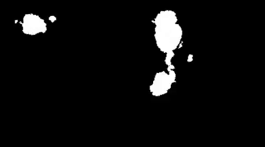

# Versione 10.1

<b>Substance 3D Painter 10.1</b> aggiunge nuovi potenti filtri, funzionalità USD migliorate e supporto aggiornato della piattaforma VFX e di Linux.

Data di pubblicazione: *17 settembre 2024*

>[!NOTE]
>
> Questa versione di Painter ora utilizza Qt versione 6 che influisce sul supporto dei plug-in Python e JavaScript. Vedi di seguito per maggiori dettagli.

## Funzioni principali

### Nuovi filtri predefiniti

In questa versione sono stati aggiunti diversi nuovi filtri per ampliare notevolmente il processo di creazione delle texture:

* <b>Nuovo materiale per decalcomanie per ricami</b>\
  All&#39;interno della sezione dei materiali della finestra Risorse puoi trovare un nuovo materiale per decalcomanie per ricami. Trascinalo in qualsiasi punto della trama, inserisci una risorsa (come una texture o un font) e potrai creare facilmente nuovi dettagli dell&#39;infrastruttura.

  
* <b>Nuovo filtro maschera/colore area di riempimento</b>\
  Questi due nuovi filtri consentono di riempire qualsiasi tracciato o contorno chiuso. Questo è utile ad esempio per riempire rapidamente i tracciati 3D. Trattandosi di filtri, possono essere utilizzati anche per tratti di pennello manuali o in altre situazioni.

  
* <b>Nuovo filtro FXAA</b>\
  Questo nuovo filtro può ridurre rapidamente l’effetto di alias, in particolare sui bordi netti che possono apparire dopo un livello, ad esempio, o sulle maschere create con l’effetto di selezione colore.

  
* <b>Nuovo filtro passa-alto</b>\
  Con questo filtro generico potete generare una texture in scala di grigio da usare per effetti più avanzati (come ammorbidire, sfocare o rendere più nitidi i dettagli).

  
* <b>Nuovo filtro con effetto pixel</b>\
  Il filtro Effetto pixel può simulare una riduzione della risoluzione, utile per stilizzare colori e pattern.

  
* <b>Nuovo filtro di posterizzazione</b>\
  Questo filtro può essere utile per ridurre il numero di colori in un’immagine, per creare contrasti nelle forme e creare effetti stilizzati.

  
* <b>Nuovo filtro soglia</b>\
  Il filtro soglia consente di creare rapidamente maschere binarie in bianco e nero da un input in scala di grigio.

  
* <b>Nuovo filtro smoothstep</b>\
  Il filtro Smoothstep consente inoltre di definire un livello o un contrasto per migliorare le informazioni in scala di grigi. Questo filtro applica al risultato anche una curva esponenziale, rendendo possibile la conversione di sfumature lineari in curve uniformi.

  
* <b>Filtri Trasforma e specularità migliorati</b>\
  Il filtro di Trasforma è stato aggiornato per supportare il ridimensionamento non uniforme, il capovolgimento in orizzontale o verticale e l’utilizzo dei parametri è più semplice. Il filtro a specchio è stato inoltre aggiornato con parametri più semplici.

  
* <b>Icone migliorate</b>\
  Per rendere i filtri standard più visibili e facili da trovare, le loro icone sono state ricreate. Le icone colorate in giallo devono essere usate per i contenuti di un livello, mentre le icone in scala di grigio sono generiche e possono essere usate sia nei contenuti dei livelli che nelle maschere.

  
* <b>Correzioni minori sui filtri</b>\
  Alcuni altri filtri sono stati regolati per risolvere alcuni problemi:

  * Il filtro di regolazione del height agiva sull’alfa di un livello, rendendone difficile l’utilizzo in alcuni casi.
  * Il filtro sfocatura non utilizzava uno spazio cromatico lineare nella modalità di gestione colore Legacy, creando colori errati durante la fusione/miscelazione del suo input.

### Aggiornamento del supporto delle piattaforme USD e VFX

In questa versione di Painter molti componenti di terze parti sono stati migliorati e aggiornati:

* <b>Esportare texture con Adobe Standard Material in USD\
  </b>Quando si esportano texture da Painter in un file USD, ora si ottengono le proprietà di Adobe Standard Material con tali file. Questo rende i file USD pronti per essere utilizzati nell&#39;applicazione che supporta anche quelle proprietà.
* <b>Importare texture da file USD</b>\
  Quando si importa un file USD, la sua texture viene ora importata anche nel progetto creato, semplificando il passaggio da un’applicazione all’altra. Se il file USD utilizza l&#39;Adobe Standard Material, verranno configurate anche le impostazioni di shader, in modo che il risultato nella finestra della vista corrisponda all&#39;altra applicazione di origine.
* <b>Modifiche Gltf\
  </b>In seguito all&#39;aggiornamento dell&#39;USD, è stato necessario modificare il comportamento del formato GLTF per garantire la parità. Quando si importa un file gltf, Painter presume che la mappa normale sia in formato OpenGL.\
  Alcuni file gltf possono utilizzare il formato DirectX. È stata quindi aggiunta una nuova impostazione nella finestra del nuovo progetto per tenerne conto (si noti che anche il formato normale può essere sostituito dalla Pila livelli).

  
* <b>Dipendenze aggiornate</b>\
  Diverse librerie utilizzate da Painter sono state aggiornate, in particolare per corrispondere al riferimento della piattaforma VFX. Ecco le nuove versioni utilizzate in Painter 10.1:

  * Qt 6.5.6 (e PySide6 6.5.6)
  * Substance Engine 9.1.3
  * OpenEXR 3.2
  * Python 3.11
  * OCIO 2.3.2.
  * OpenSubdiv 3.6.0
* <b>Supporto Linux aggiornato\
  </b>Questa nuova versione di Painter ora supporta come minimo Red Hat Enterprise Linux (RHEL) versione 8.6, ma deve essere compatibile anche con la versione 9.x.

### Prestazioni migliorate

Alcune aree dell&#39;applicazione hanno ricevuto alcuni miglioramenti delle prestazioni:

* <b>Tempo di apertura dei progetti migliorato\
  </b>Il progetto che ha utilizzato molti tratti di pennello ora dovrebbe essere più veloce da aprire in Painter. Anche il tempo risparmiato da questi progetti dovrebbe essere leggermente migliorato.\
  In alcuni dei nostri progetti di prova abbiamo osservato una riduzione del tempo di caricamento da 50 a soli 6 secondi all’apertura di un progetto. È stato inoltre migliorato il consumo di memoria durante l’apertura di vecchi progetti e la loro conversione alla versione più recente.
* <b>Prestazioni di tasselation migliorate\
  </b>Ora viene utilizzata un&#39;ottimizzazione automatica quando il tasselation è abilitato nelle impostazioni dello Shader. I triangoli più piccoli di un pixel sullo schermo non verranno più tassellati, con conseguente riduzione dei triangoli da disegnare e tempi di rendering più rapidi.\
  Questa modifica non produce differenze visive e non influisce sul processo di esportazione della trama.
* <b>Le miniature semplificate sono ora quelle predefinite</b>\
  Nella versione 6.2 abbiamo introdotto le miniature semplificate per i progetti di Porzione UV per migliorare le prestazioni, ma i progetti regolari potevano ancora utilizzare il vecchio modo di elaborare le miniature dei livelli. Questo comportamento è stato controllato tramite un’impostazione dell’applicazione.\
  Per impostazione predefinita, questa impostazione ora consente di impostare le miniature ottimizzate in modo da migliorare le prestazioni di tutti i progetti. Se necessario, può essere ripristinato nelle preferenze principali.

  

### Note sulla migrazione a Painter 10.1

>[!NOTE]
>
> * Potrebbe essere necessario aggiornare i plug-in Python in seguito all&#39;aggiornamento a Qt6. Per ulteriori dettagli, vedere [questa pagina](https://adobedocs.github.io/painter-python-api/guides/qt6-migration/).
> * <b>I plug-in JavaScript </b> sono stati spostati in una sottocartella all&#39;interno della directory Documenti utente. I plug-in esistenti non verranno più visualizzati nell&#39;applicazione, in quanto devono essere spostati manualmente in tale cartella.
> * Su Steam/Ubuntu, è necessaria una libreria di sistema per il corretto funzionamento di Painter. Assicurarsi che il cursore libxcb sia installato prima di avviare l&#39;applicazione.

## Note sulla versione

### 10.1.0

Data di pubblicazione: <b>2024/09/17</b>

Riepilogo: <b>Versione principale, nuovo contenuto: maschera area di riempimento/filtro colore, filtro decalcomania ricamo e sei filtri Substance generici, importazione di USD con proprietà di materiale e shader, miglioramento delle prestazioni, conformità alla piattaforma VFX 2024 e migrazione a Linux RedHat</b>

<b>Aggiunto</b>:

* [Contenuto] Aggiungi nuova maschera area di riempimento/filtro colore
* [Content] Aggiungi nuovo filtro Ricamo decalcomania
* [Content] Aggiungi 6 nuovi filtri Substance generici (FXAA, pixelate, highpass, posterize, smoothstep, threshold)
* [USD] Esporta il livello USD con un materiale ASM definito
* [USD] Importare USD con proprietà del materiale e dello shader
* [Prestazioni] Abilita le miniature di Pila livelli ottimizzate per impostazione predefinita
* [Prestazioni] Riduzione del tempo di apertura dei file di progetto e del consumo di memoria (decodifica dei dati)
* Conforme alla piattaforma VFX 2024
* [VFX Platform 2024] Aggiornamento a Python 3.11
* [Piattaforma VFX 2024] Aggiornamento all&#39;OpenEXR 3.2
* [VFX Platform 2024] [USD] Aggiornamento OpenSubdiv 3.6.0
* [VFX Platform 2024]&#x200B;[Color Management] Aggiornamento a OCIO 2.3.2
* [Linux] Migrazione a Linux RedHat
* [Linux] Aggiorna la versione min del driver Nvidia a 535.171.04
* [Import] Aggiungi un&#39;opzione per capovolgere la mappa normale durante l&#39;importazione di una trama GLTF
* [UI] Utilizza il valore predefinito del sistema operativo per la distanza di rilevamento degli eventi di trascinamento
* [Substance Engine] Aggiungi la funzione di striscia delle chiamate per rimuovere i simboli dall&#39;eseguibile
* [Schermata iniziale] Aggiornamento al nuovo formato della schermata iniziale
* Aggiornamento della Substance Engine alla versione 9.1.3
* [Python] Mostra collegamento agli esempi nel menu della documentazione dello stack di livelli
* [JavaScript] Spostare i plug-in Javascript nella sottocartella javascript/plugins

<b>Risolto</b>:

* [Illustrator] Arresto anomalo durante l&#39;esportazione di un riquadro UV con grafica .ai in casi specifici
* [Tratti dinamici]&#x200B;[Tracciato] Casuale per tratto non funziona su un tracciato
* [UI]&#x200B;[Proprietà] Il blocco è attivato quando la suddivisione in porzioni è non uniforme
* &#x200B;Il file TXT di debug viene creato quando si fa doppio clic su un progetto Painter
* [USD]&#x200B;[Esporta] Alcune texture potrebbero essere mancanti
* [ASM] La dispersione del canale del colore ignora l&#39;effetto metallizzato
* [Contenuto] Il filtro Sfocatura non funziona nello spazio colore &quot;di lavoro&quot;
* [Contenuto] Il filtro Regolazione Height modifica anche il canale alfa del livello

<b>Problemi noti</b>:

* [Gestione colore] Le conversioni dello spazio colore HDR con ACE su Linux producono colori bloccati
* [Win]&#x200B;[Arresto anomalo] [ACE] Non utilizza lo spazio colore ICE sRGB per la trasformazione dello schermo
* [Regressione]&#x200B;[UI] Il menu di scelta rapida è troppo piccolo sugli schermi HD
* [Crash]&#x200B;[Python] Esportazione USD attivata da TextureStateEvent
* [MacOS Intel] Arresto anomalo durante l’importazione di alcuni predefiniti
* [Arresto anomalo] Riposiziona risorsa e salva progetto
* [Engine] Colorare con lo strumento Clona in canali normali si sposta i colori in modo errato
* [Python] Il widget Ghost viene eliminato se lo script è ancora in funzione
* [RedHat] Problemi con il selettore colore
