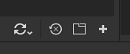
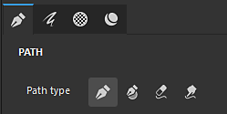
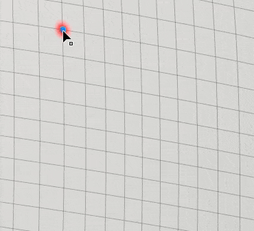
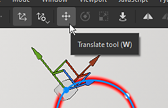
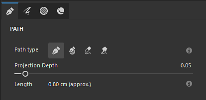
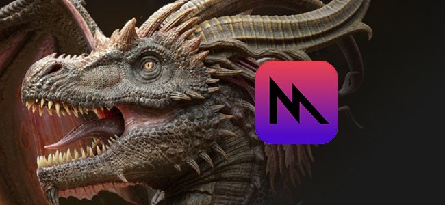

# Versione 11.0

<b>Substance 3D Painter 11.0</b> aggiunge un nuovo flusso di lavoro di aggiornamento automatico delle risorse, uno strumento per tracciati pieni e miglioramenti generali per i tracciati, una gabbia automatica per la esegue i baking e diversi nuovi filtri per la creazione di texture stilizzata.

Data di pubblicazione: <b>11 marzo 2025</b>

>[!NOTE]
>
> Questa versione di Painter rimuove il supporto delle configurazioni Mac Intel. Vedi di seguito per maggiori dettagli.
> 
> Questa versione aumenta anche la versione minima supportata di Windows 10 a 22H2.
> 
> Per ulteriori informazioni, consulta la [pagina dei requisiti di sistema](../getting-started/system-requirements.md).

## Funzioni principali

### Nuovo aggiornamento automatico delle risorse

Con il nuovo flusso di lavoro di aggiornamento automatico è ora possibile mantenere aggiornate le librerie e i progetti con le versioni più recenti delle risorse. Con questo nuovo processo Painter può monitorare le risorse su disco per cercare le modifiche e ricaricarle automaticamente e sostituirle con librerie e progetti.

* <b>Abilitazione dell&#39;aggiornamento automatico nella finestra Risorse</b>\
  Nella parte inferiore destra della finestra Risorse sono ora disponibili un pulsante e un menu per configurare il sistema di aggiornamento automatico (l&#39;icona della piccola doppia freccia). Abilita l&#39;opzione <b>Pannello Risorse</b> per monitorare le librerie e ricaricarle.

  
* <b>Aggiornamento delle risorse nei progetti</b>\
  Il ricaricamento di una risorsa non aggiorna automaticamente la versione utilizzata all&#39;interno di un progetto tramite Pila livelli, impostazioni di visualizzazione, impostazioni di ombreggiatura e così via. A tale scopo, attivare anche l&#39;opzione <b>Risorse utilizzate nel progetto</b>.

  
* <b>Frequenza aggiornamenti </b>\
  La frequenza con cui Painter deve cercare un aggiornamento delle risorse può essere definita in pochi minuti tramite un&#39;impostazione dedicata. Se si specifica 0 minuti, l&#39;applicazione verrà aggiornata a intervalli di alcuni secondi. Tuttavia, un valore così basso può causare problemi di prestazioni. L&#39;applicazione verrà aggiornata automaticamente anche quando si riacquisisce lo stato attivo.
* <b>Aggiornamento manuale delle risorse</b>\
  Il processo di aggiornamento può essere attivato manualmente utilizzando i pulsanti dedicati nella parte inferiore del menu di aggiornamento automatico. Questo può essere più comodo dell&#39;utilizzo e dell&#39;attesa del processo automatico per iniziare.

  
* <b>Mancata corrispondenza ed errori nella finestra del registro</b>\
  L’aggiornamento delle risorse, soprattutto se la differenza tra la vecchia e la nuova versione è importante, può causare problemi. I risultati della creazione di texture, ad esempio, possono subire notevoli modifiche o interruzioni a causa di parametri mancanti o variabili in una risorsa Substance. Per questo motivo <b>Ignora risorse quando i relativi parametri non corrispondono</b> è abilitato per impostazione predefinita. I problemi verranno segnalati nella finestra di registro.\
  Per forzare un aggiornamento, è sufficiente disabilitare questa impostazione.

  

  
* <b>Disponibile nell&#39;API Python per automatizzare la manutenzione del progetto </b>\
  Il flusso di lavoro di aggiornamento automatico è stato esposto anche in Python. Sono state aggiunte nuove funzioni per elencare le risorse obsolete e sostituirle.\
  Per ulteriori informazioni, consultate la documentazione dedicata tramite il menu Aiuto dell’applicazione.

>[!NOTE]
>
> Per ulteriori informazioni, consulta la [pagina dedicata alla documentazione](../features/auto-update.md).

### Nuovo strumento tracciato pieno

Lo strumento tracciato pieno è un nuovo tipo di strumento tracciato che consente di creare forme sulla superficie del modello 3D riempito con un colore uniforme. Rende possibile la creazione di pattern complessi.

* <b>Nuovo strumento per creare un tracciato con un colore pieno</b>\
  Nel menu Tracciato è disponibile un nuovo strumento denominato <b>Tracciato riempito</b>. Questo strumento può riempire l&#39;area interna di un tracciato quando viene chiuso. Il riempimento viene effettuato con un colore uniforme per ciascun canale dell’insieme di texture.

  
* <b>Adatta automaticamente alla superficie</b>\
  Lo strumento Tracciato pieno può adattarsi a qualsiasi tipo di superficie, non è limitato alle aree planari. Può attraversare gli spazi e i bordi degli oggetti.

  
* <b>Compatibile con mirror e simmetria radiale</b>\
  Questo nuovo strumento supporta anche le proprietà della simmetria, che aprono la possibilità di creare forme complesse.

  
* <b>Facile passaggio da uno strumento di tracciato all&#39;altro</b>\
  Nella finestra Proprietà è stato aggiunto un nuovo metodo per passare da uno strumento tracciato all’altro. Semplifica la prova degli strumenti e la duplicazione dei tracciati. Ad esempio, potete creare un contorno di tracciato e quindi duplicarlo per convertirlo in un tracciato pieno, in modo da ottenere rapidamente una forma con un contorno.

  

### Strumenti di tracciato migliorati con aggancio, linee rette e altro ancora

In questa nuova versione sono stati aggiunti molti miglioramenti a livello di comportamento e qualità della vita per semplificare l’utilizzo degli strumenti tracciato:

* <b>Anteprima tracciato (alternare con Maiusc+P)</b>\
  Quando si modifica un tracciato, appare una nuova linea punteggiata che indica come reagirà il tracciato quando si aggiunge un nuovo punto alla fine della curva. Ciò rende i cambiamenti più prevedibili. Questa anteprima può essere disattivata tramite il menu delle impostazioni dedicato o utilizzando la scelta rapida da tastiera della tastiera <b>Maiusc+P</b>.

  
* <b>Allineamento rettilineo e angolare</b>\
  Il modificatore <b>Maiusc </b> della tastiera ora può essere utilizzato per creare automaticamente linee rette tra i punti. La gestione di <b>Ctrl </b>può essere utilizzata anche per applicare l&#39;aggancio agli angoli che consente di creare forme geometriche.\
  Le impostazioni di aggancio dell&#39;angolo possono essere modificate tramite il menu Impostazioni tracciato nella barra degli strumenti contestuale.

  
* <b>Allineare i punti del tracciato ai poligoni della trama</b>\
  Per facilitare il posizionamento dei punti, è possibile attivare un nuovo aggancio (icona calamita). Questa opzione consente di posizionare punti sui vertici del modello 3D e di seguire una superficie o uno spigolo.\
  L’aggancio può essere effettuato in tre modi diversi:

  * Allineamento ai vertici
  * Allinea ai bordi
  * Aggancia al centro dei bordi

  Tutte queste modalità sono disponibili tramite il menu Impostazioni tracciato nella barra degli strumenti contestuale.

  

  
* <b>Chiusura automatica quando si fa clic sull&#39;ultimo vertice</b>\
  Per semplificare l&#39;utilizzo dello strumento <b>tracciato riempito </b>, facendo clic sul primo vertice mentre è selezionato l&#39;ultimo, il tracciato verrà chiuso automaticamente. Per selezionare un punto invece di chiudere il percorso, è possibile utilizzare il tasto <b>CTRL </b>. Questo comportamento è stato invertito nella versione precedente.

  
* <b>Copiare le posizioni dei vertici del tracciato dal contenuto alla maschera</b>\
  Ora è possibile <b>copiare</b> un tracciato in modalità materiale e quindi utilizzare <b>Incollare tutti i vertici</b> su un tracciato in una maschera. In questo modo è possibile sincronizzare diversi tracciati tra materiali e maschere.

  
* <b>Comportamento migliorato per mostrare/nascondere l’interfaccia utente</b>\
  Premendo le scelte rapide da tastiera per i manipolatori della finestra della vista (<b>W</b>, <b>S</b> o <b>D</b>), è possibile attivarle rapidamente. Possono anche essere attivati/disattivati dai pulsanti dedicati della barra degli strumenti contestuale. Questa modifica consente di mostrare o nascondere rapidamente gli elementi senza nascondere anche gli altri elementi visivi nella finestra della vista (come la curva del tracciato e i punti).

  
* <b>Ruota e ridimensiona ora accessibili sui vertici del tracciato</b>\
  In questa versione è ora possibile utilizzare lo strumento <b>Ruota </b> e <b>Ridimensiona </b> quando sono selezionati più vertici. Offre la possibilità di regolare e allineare i vertici insieme.

  
* <b>Mostra informazioni sul percorso nella finestra Proprietà</b>\
  La finestra delle proprietà ora presenta una nuova sezione quando è selezionato uno strumento tracciato. Questa nuova sezione raggruppa le informazioni e le azioni specifiche per i percorsi, quali la lunghezza di un percorso, la profondità di proiezione e le azioni per passare da un tipo all&#39;altro.

  
* <b>Edizione Tangent migliorata se visualizzata da un angolo</b>\
  La modifica di tangenti personalizzate potrebbe essere difficile a seconda dell&#39;angolo di visualizzazione. Questo è stato modificato in modo che le tangenti siano vincolate al loro piano.

  
* <b>Mantenere aperto l&#39;elenco dei percorsi tra i livelli</b>\
  Quando si passa da un livello di pittura a un altro ed effetti diversi, se il pannello Tracciato nella finestra della vista era chiuso, restava chiuso anche sugli altri livelli. Il pannello ora rimarrà aperto per rendere più comodo il passato.

  
* <b>Focus sul percorso attualmente selezionato </b>\
  Premendo la scelta rapida da tastiera da tastiera <b>F</b> ora verrà messo a fuoco un tracciato invece dell&#39;intero modello 3D quando si modifica un tracciato.
* <b>Elimina percorso con backspace </b>\
  È ora possibile eliminare rapidamente i tracciati premendo la scelta rapida da tastiera della tastiera <b>Backspace </b>.

### Nuovi filtri Substance e generatori di texture

La nuova versione introduce alcuni nuovi filtri e alcuni pattern procedurali.

<b>Filtri:</b>

* <b>Stilizzazione</b>\
  Questo nuovo filtro può essere utilizzato per convertire una texture esistente in una versione più stilizzata. Simula i tratti di pennello nello nello spazio 3D e può applicare alcuni altri effetti per ottenere un aspetto pittorico. Contiene diversi predefiniti per semplificare la riproduzione.

  
* <b>Quantizza</b>\
  Il filtro quantizza può essere utilizzato per ridurre il numero di colori in un’immagine e creare aree piatte con limiti netti. Può essere utilizzato anche per stilizzare le texture.

  
* <b>Kuwahara Anisotropo</b>\
  Questo filtro applica il [filtro Kuwahara](https://en.wikipedia.org/wiki/Kuwahara_filter "https://en.wikipedia.org/wiki/Kuwahara_filter") che può essere utilizzato anche per ridurre il disturbo e stilizzare le texture.

  
* <b>Distanza direzionale</b>\
  Si tratta di un semplice filtro che consente di allungamento i pixel in una determinata direzione in uno spazio 2D. Può essere utilizzato per sfumare tratti di pennello o creare facilmente perdite.

  
* <b>Smusso uniforme</b>\
  Lo smusso uniforme è una nuova versione del filtro smussato che offre risultati e controlli migliori. È disponibile in aggiunta al filtro esistente.

  
* <b>Conversione in scala di grigi </b>\
  Questo nuovo filtro può essere utilizzato per convertire comodamente le immagini o i canali in scala di grigio e fornisce il controllo sui canali Rosso, Verde e Blu, se necessario.

<b>Generatori di Texture e rumori</b>:

* <b>Generatore Scratches </b>\
  Un generatore di graffi migliorato che simula thread sottili con vari controlli per la casualità.
* <b>Triangle Grid </b>\
  Un disturbo creato dalle connessioni dei triangoli, con controlli per la casualità e lo smoothness.
* <b>Affianca casuale </b>\
  Un generatore di texture su misura per la creazione di pattern di riquadri.
* <b>Rumori frattali di Voronoi e Voronoi </b>\
  Già disponibili come rumori 3D, queste nuove versioni 2D possono essere utilizzate per lavorare e creare porzioni in uno spazio 2D o UV.
* <b>Sono stati aggiornati i rumori alla versione più recente di Designer </b>\
  La maggior parte dei rumori disponibili in Painter è stata aggiornata con la versione più recente di Substance 3D Designer. I parametri Disturbo non sono più nascosti in un gruppo per velocizzarne la modifica.

### Nuova gabbia automatica per la eseguita i baking (sperimentale)

Quando si esegue i baking una trama ad alto poli su una trama a basso poli, è ora possibile selezionare una nuova opzione <b>Automatica </b> quando si specifica la modalità gabbia. Questo nuovo metodo tenta di calcolare una trama a gabbia automatica che si adatta al meglio alle trame ad alto poli per evitare artefatti.

* <b>Nuova impostazione nei parametri di cottura comuni </b>\
  All’interno del parametro comune di cottura, il parametro della gabbia è stato sostituito da una selezione tra tre opzioni:\
  <b>In base alla distanza</b>: le impostazioni predefinite per la distanza frontale/posteriore.\
  <b>Automatico (sperimentale)</b>: la nuova gabbia automatica.\
  <b>File personalizzato</b>: il modo precedente di caricare un file di trama personalizzato come gabbia.

  

>[!NOTE]
>
> Questa funzione è considerata sperimentale. Prevediamo di migliorare l&#39;algoritmo nelle versioni future. Stiamo inoltre cercando feedback sulla qualità dei risultati e su eventuali bug.

### Rendering con Metal su sistema operativo Mac

In questa versione sono state apportate modifiche specifiche relative alla piattaforma Mac:

* <b>Metal Graphics API è ora utilizzato al posto di OpenGL in Mac </b>\
  A partire da questa versione, Painter ora utilizza l&#39;API grafica </b>Metal su Mac, sia per il rendering della finestra della vista che per l&#39;elaborazione delle texture. <b>Questo switch migliora notevolmente le prestazioni e la stabilità dell&#39;applicazione. Inoltre, renderà più facile l’integrazione di nuove funzionalità in futuro, poiché OpenGL è stato dichiarato obsoleto su MacOS.
* <b>Rimozione del supporto per l&#39;architettura Intel nel sistema operativo Mac </b>\
  Con questa versione, la compatibilità con le CPU Intel su MacOS è stata rimossa. Architettura ARM (M1, M2, ecc.) è ora l’unico supportato.

### Varie

In questa versione sono state aggiunte anche alcune altre funzioni:

* <b>Abilita canale di colore di base solo sul nuovo livello/effetto di riempimento</b>\
  Per impostazione predefinita, quando si crea un nuovo livello di riempimento o effetto, viene attivato solo il canale del Colore di base. (Questa modifica non si applica quando si trascina una risorsa che si creerebbe un livello di riempimento o un effetto.)\
  In base al feedback della community, abbiamo apportato questa modifica per migliorare le prestazioni evitando di attivare il calcolo dei canali che in seguito vengono disabilitati. Questo dovrebbe aiutare la reattività quando si lavora ad alta risoluzione o con i riquadri UV.\
  Tieni presente che puoi riattivare rapidamente tutti i canali facendo clic sul pulsante Colore di base mantenendo la scelta rapida da tastiera della tastiera <b>ALT </b>.

  
* <b>Rinominare le Porzioni UV per l&#39;esportazione delle texture</b>\
  Nella finestra dell&#39;elenco Set di texture non è possibile aggiungere un nome personalizzato alle Porzioni UV. Contrariamente alla descrizione, il nome personalizzato può essere recuperato nei predefiniti di esportazione tramite il tag dedicato <b>$uvTileName</b>.\
  Questa nuova funzionalità consente di sostituire i numeri UDIM in nomi specifici durante l’esportazione.

  
* <b>Nuovo pulsante di esportazione disponibile nella barra degli strumenti del Dock</b>\
  Le azioni <b>Invia a</b> che consentono di esportare verso altre applicazioni sono state spostate in una finestra dedicata, ora disponibile dalla barra degli strumenti Dock sul lato destro dell&#39;applicazione.

  
* <b>Miglioramento della denominazione di livelli e tracciati copiati/incollati</b>\
  Lo schema di denominazione dei livelli durante la duplicazione o la copia/incolla di livelli e tracciati è stato migliorato per essere più coerente e prevedibile.

  

## Tutorial

## Note sulla versione

### 11.0.0

Data di pubblicazione: <b>2025/03/11</b>\
Riepilogo: <b>Versione principale, nuova funzione Aggiornamento automatico, strumento Tracciato compilato e altri miglioramenti al percorso, nuovi filtri e una generazione sperimentale di gabbia automatica per eseguire i baking</b>

<b>Aggiunto</b>:

* Aggiornamento automatico
* [Aggiornamento automatico] Aggiornamento automatico delle risorse modificate nel pannello Risorse
* [Aggiornamento automatico] Aggiorna automaticamente le risorse modificate nel progetto
* [Aggiornamento automatico] Disattiva l&#39;aggiornamento automatico per impostazione predefinita
* [Aggiornamento automatico] Rendi facoltativo l&#39;aggiornamento se i parametri della risorsa non corrispondono (.sbsar, .glsl, .ai, .svg)
* [Aggiornamento automatico] Aggiungi variabile di ambiente per disabilitare la funzione di aggiornamento automatico
* [Aggiornamento automatico]&#x200B;[SBSAR] Rendi facoltativo l&#39;aggiornamento se i parametri della risorsa non corrispondono
* Tracciato pieno
* [Tracciato]&#x200B;[Riempimento] Aggiungi nuovo strumento per creare tracciati pieni
* Miglioramenti al tracciato
* [Path] Crea un tracciato che si aggancia ai poligoni
* [Path] Consente di cambiare i tipi di percorso
* [Path] Consente di copiare e incollare i dati dei vertici del tracciato tra contenuto e maschera
* [Path] Consente di vincolare l&#39;angolo durante la creazione di un nuovo punto
* [Path] Consenti di vincolare la creazione di punti a una linea
* [Tracciato] Chiudi la forma con un solo clic
* [Path] Visualizza informazioni sul percorso
* [Tracciato] Consente di ridimensionare e ruotare i vertici del tracciato
* [Path]&#x200B;[UX] Semplificare l&#39;accesso ai gizmo di trasformazione
* [Path] Aggiungi anteprima percorso
* [Tracciato] Disattiva l&#39;anteprima del tracciato con Maiusc + P
* [Path] Migliorare l&#39;edizione tangente dalla vista laterale
* [Tracciato] Consenti di concentrarsi su un tracciato 3D
* [Path] I vertici devono mantenere lo stato di selezione quando si attiva e disattiva l&#39;interfaccia utente
* [Path] Consente di eliminare il percorso utilizzando Backspace
* [Path] Mantieni l&#39;elenco dei percorsi aperto se l&#39;utente lo espande
* [Path]&#x200B;[Pila di livelli] Rinomina correttamente i duplicati quando si copia o incolla
* Miglioramenti all&#39;interfaccia utente di [Path] e alle descrizioni comandi
* Prestazioni
* [Prestazioni] Migliorare le prestazioni della finestra di visualizzazione quando si utilizza un livello di tassellatura elevato
* [Prestazioni] Abilita solo il primo canale su nuovi livelli di riempimento/effetti
* [Prestazioni] Calcolo del tratto del pennello in parallelo
* Baking
* [Baking] Aggiungi nuova opzione di generazione gabbie completamente automatica per la cottura al forno con trame ad alto poli (sperimentale)
* Contenuto
* [Content] Aggiungi 6 nuovi filtri: stilizzazione, quantizzazione, kuwahara anisotropo, smusso uniforme, distanza direzionale, conversione in scala di grigi
* [Content] Aggiornate Noises and Grunges alla versione più recente di Designer (con il nuovo Voronoi 2D)
* [Content] Aggiungi 3 nuovi generatori di texture (Tile Random, Triangle Grid, Generatore di Scratches)
* [Content] Rinomina il modello di motore originale ed esporta i predefiniti
* Python
* [Shelf]&#x200B;[Python] Salva materiale intelligente o maschera avanzata su disco da Python
* [Python] Aggiungi gabbia automatica di cottura all’API Python
* [Python] Consente di modificare i nomi e le descrizioni dei set di texture/porzioni UV
* [Python] Condivisione delle impostazioni di risoluzione su sorgenti vettoriali e di font
* [Auto-update]&#x200B;[Python] Esporre le funzionalità di aggiornamento automatico del progetto in Python
* Varie
* [Esporta] Semplificare l’accesso alle opzioni di invio con un nuovo pannello
* [Nvidia] Aggiungi un avviso sui driver Nvidia più recenti (572.16)
* L’aggancio dell’angolo deve essere influenzato dalla selezione dello spazio Oggetto/Mondo&#x200B;
* [Elenco set di texture] Consente di aggiungere un nome personalizzato ai riquadri UV e di utilizzarli al momento dell’esportazione
* Mac
* [Mac] Usare Metal invece di OpenGL per il rendering grafico
* [Mac] Elimina il supporto Mac Intel

<b>Risolto</b>:

* [Nvidia]&#x200B;[Baking] I risultati del fornaio a occlusione ambientale hanno artefatti
* [Arresto anomalo] Se si fa clic con il tasto Alt per attivare o disattivare la visibilità del set di texture, si verifica un arresto anomalo
* [Eseguente i baking] La gabbia è presa in considerazione con poly basso come param poly alto
* [Baking] Il colore del materiale per il fornaio di mappe ID non funziona con il formato di file USD
* [Prestazioni] Rendering lento nella finestra della vista con trame e molti oggetti sovrapposti
* [Qt] Il selettore colore personalizzato incorporato non dispone delle impostazioni di Gestione colore
* [Finestra vista] Sfarfallio dei Manipolatori 3D quando è attivato l’antialiasing
* Slot in scala di grigio della gomma nello stato del pennello per blocchi maschera
* [Log] Non vengono segnalati messaggi di errore molto lunghi durante l&#39;importazione delle trame
* [Content] Errore nell’elenco dei nomi predefiniti nel predefinito dello strumento Topstitch
* [Python] La sostituzione di un file SVG/Ai con un altro non aggiorna le sue proprietà
* [Python] L&#39;ID della tavola da disegno della risorsa vettoriale è vuoto in alcuni casi quando viene richiesto da Python
* [Python] L&#39;errore stampato nel registro a volte ha un sacco di righe restituite

<b>Problemi noti</b>:

* [Gestione colore] Le conversioni dello spazio colore HDR con ACE su Linux producono colori bloccati
* [Regressione]&#x200B;[UI] Il menu di scelta rapida è troppo piccolo sugli schermi HD
* [Crash]&#x200B;[Python] Esportazione USD attivata da TextureStateEvent
* [Engine] Colorare con lo strumento Clona in canali normali si sposta i colori in modo errato
* [Python] Il widget Ghost viene eliminato se lo script è ancora in funzione
* [RedHat] Problemi con il selettore colore
