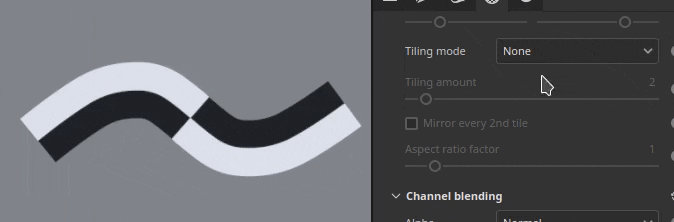
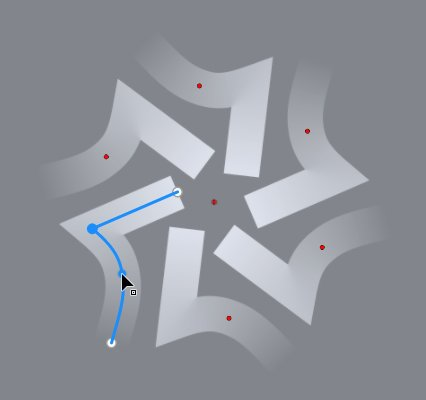
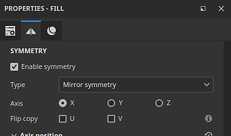

# Versione 11.1

<b>Substance 3D Painter 11.1 </b>offre il nuovo strumento Percorso dei nastri con contenuti dedicati, simmetria sui livelli di riempimento e sugli effetti, dimensioni fisiche per lo spostamento e supporto dell&#39;API grafica Vulkan.

Data di pubblicazione: <b>18 novembre 2025</b>

>[!NOTE]
>
> Con questa versione di Painter, l’API grafica passa da OpenGL a Vulkan. Questa modifica può influire sulle GPU supportate dall’applicazione, in particolare per il baking con ray tracing basato su GPU.
> 
> Per ulteriori informazioni, consulta la [pagina dei requisiti di sistema](../getting-started/system-requirements.md).

## Funzioni principali

### nuovo strumento barra multifunzione

Il <b>Percorso dei nastri</b> è un nuovo strumento della famiglia degli strumenti tracciato. Una barra multifunzione trasforma e ripete una texture lungo un tracciato senza tagli, con un controllo aggiuntivo per l’inizio e la fine e opzioni per angoli acuti.

Questo nuovo strumento apre le porte a nuovi comportamenti, come ad esempio inserire il testo lungo i tracciati, posizionare una sfumatura perfetta lungo un tracciato e creare facilmente i propri ritagli avanzati per contornare una trama.\
In breve, il nastro è uno strumento più pulito per un disegno più preciso con i tracciati.

* <b>Nuovo strumento barra multifunzione disponibile accanto agli altri strumenti simili al percorso</b>\
  Il nuovo strumento Barra multifunzione è disponibile accanto all&#39;altro tracciato, come gli strumenti nell&#39;interfaccia. Può essere selezionata dalla barra degli strumenti o dalle scelte rapide del tipo di tracciato.

  

  
* <b>La barra multifunzione è un percorso continuo che funziona su tutti i tipi di superfici</b>\
  La barra multifunzione è uno strumento che consente di ripetere o estendere una texture lungo un tracciato. Funziona su qualsiasi tipo di superficie e geometria, anche quando le parti mesh non sono collegate.

  
* <b>Creazione di pattern e sfumature ripetuti</b>\
  Questo nuovo strumento consente di ripetere le immagini in vari modi senza giunture o tagli, in modo da ottenere sfumature e pattern nitidi.

  
* <b>Allunga le immagini con inizio e fine personalizzati</b>\
  L&#39;impostazione <b>allunga tra gli scostamenti</b> consente di isolare parti di un&#39;immagine per utilizzarle come sezioni iniziali e finali su un tracciato, mentre la sezione centrale è allungata lungo il resto del tracciato. Questa funzione è utile per utilizzare rapidamente bitmap semplici e posizionarle lungo un tracciato senza distorsioni, come le frecce.

  
* <b>Tipi di angolo diversi disponibili</b>\
  Quando si interrompono le tangenti per creare angoli, sono disponibili diverse forme a seconda delle esigenze, dall&#39;interruzione classica alla rotazione uniforme.

  
* <b>Controlli di dilatazione e affiancamento</b>\
  Le immagini possono essere ripetute o dilatate facilmente lungo un Percorso dei nastri, sia in modo automatico che manuale.

  
* <b>Testo lungo il percorso</b>\
  Le risorse dei font possono essere utilizzate direttamente su un Percorso dei nastri. Il testo si adatta automaticamente al tracciato per deformarsi lungo le sue curve. Le impostazioni di allineamento possono essere utilizzate per adattare meglio il testo a qualsiasi situazione.

  
* <b>Proporzioni e risorse non quadrate</b>\
  Le risorse non quadrate vengono regolate automaticamente per adattarsi alla lunghezza del Percorso dei nastri, il che lo rende ideale per motivi allungati, come decorazioni e rifiniture ripetute.

  
* <b>Compatibile con il flusso di lavoro dei tratti dinamici Substance</b>\
  I percorsi del nastro sono inoltre compatibili con il sistema di tratti dinamici basato su Substance, che consente di ottenere risultati complessi. Un esempio degno di nota è la possibilità di avere angoli di inizio/fine personalizzati e di sinistra/destra.\
  Per rendere questa funzionalità facilmente accessibile, sono disponibili anche due nuovi strumenti predefiniti denominati <b>Scala di grigio nastro personalizzata</b> e <b>Materiale nastro personalizzato</b>.

  
* <b>Compatibile con la simmetria</b>\
  Come altri tipi di strumenti, il Percorso dei nastri è compatibile anche con la feature di simmetria.

  
* <b>Metodi di fusione in caso di sovrapposizione</b>\
  Quando un Percorso dei nastri si sovrappone a se stesso, può portare a risultati imprevisti. Il metodo di fusione dedicato per il canale di Alpha, Normale e Height può aiutare a ottenere risultati migliori.

  

Sono stati apportati ulteriori miglioramenti a tutti gli strumenti di tracciato:

* <b>Dimensioni e opacità separate per vertice sui tracciati</b>\
  Regolare la dimensione e l’opacità per vertice su un tracciato è ora possibile e non è più legato al parametro di pressione. Queste due proprietà ora vengono gestite separatamente con cursori dedicati nell’interfaccia.

  
* <b>Raggruppamento di parametri nella finestra Proprietà </b>\
  La maggior parte degli strumenti di Painter ora dispone di gruppi comprimibili per i propri parametri. Questa modifica consente di nascondere rapidamente i parametri e di ridurre la lunghezza della finestra.

  

>[!NOTE]
>
> Per ulteriori informazioni sullo <b>strumento Barra multifunzione</b>, consultate la [pagina dedicata alla documentazione](../painting/tool-list/ribbon-tool.md).
> 
> Per ulteriori informazioni sui <b>tratti dinamici</b>, consultate la [pagina dedicata alla documentazione](../painting/dynamic-strokes/dynamic-strokes.md).

### Nuovi contenuti e categorie per lo strumento Barra multifunzione

Questa versione include 75 nuovi strumenti predefiniti che sfruttano le nuove funzionalità della barra multifunzione. Per semplificare l&#39;individuazione dei predefiniti, nella finestra <b>Proprietà</b> sono state aggiunte nuove categorie predefinite.

* <b>Scelte rapide per nuove categorie predefinite nella finestra Proprietà</b>\
  Quando si utilizzano gli strumenti tracciato, nella parte superiore della finestra <b>Proprietà</b> ora viene visualizzata una serie di nuovi pulsanti. Ogni pulsante consente di accedere agli strumenti predefiniti, ordinati per categoria. La categoria Preferiti raggruppa i predefiniti scelti.

  

  Facendo clic su uno dei pulsanti è possibile accedere rapidamente ad alcuni predefiniti preselezionati. Facendo clic su <b>Mostra altro in Risorse</b> verranno visualizzati più strumenti predefiniti di tracciato nella finestra <b>Risorse</b>.

  
* <b>Passaggio rapido da un predefinito all&#39;altro</b>\
  Per passare da un predefinito all’altro in modo più semplice, facendo clic su un predefinito non si deseleziona più il tracciato modificato.

  
* <b>Nuovo contenuto</b>\
  In questa versione sono stati aggiunti 75 nuovi strumenti predefiniti dedicati allo strumento barra multifunzione come parte del contenuto predefinito. Questi predefiniti sono disponibili direttamente nella finestra <b>Risorse</b> nella sezione del pennello o tramite le nuove scelte rapide per le categorie nella finestra <b>Proprietà</b>.\
  Questi predefiniti includono:

  * <b>Abbigliamento</b>: Predefiniti migliorati per cuciture e punti di sutura, nonché cerniere e lacrime di tessuto.
  * <b>Base</b>: tratti semplici come linee e trattini, ma anche sfumature e <b>Nastro personalizzato</b> predefiniti basati sul sistema <b>Tratto dinamico</b>.
  * <b>Grungi</b>: 3 tipi di crepe per simulare danni su vari tipi di superfici.
  * <b>Superficie rigida</b>: motivi di presa, pannelli e linee di chiusura che descrivono in dettaglio, nastri e saldatura da utilizzare o oggetti meccanici.
  * <b>Biologico</b>: bende, pulite e sporche, da avvolgere intorno alla pelle e ad altre superfici.
  * <b>Disegno</b>: predefiniti sfumature e guazzi basati su pennello.
  * <b>Testo</b>: predefiniti rapidi per impostare il testo lungo un tracciato con la barra multifunzione con diverse modalità di allineamento e dilatazione.
* <b>Nuova parola chiave dello strumento per la ricerca nella finestra Risorse</b>\
  Ora è possibile digitare &quot;nastro&quot;, &quot;colore&quot;, &quot;tracciato&quot; o anche &quot;sfumino&quot; nella finestra <b>Risorse</b> e trovare i predefiniti che corrisponderanno allo strumento corrispondente.

  

### Nuova simmetria per livelli di riempimento ed effetti

I livelli di riempimento e gli effetti ora supportano la simmetria con le rispettive modalità di proiezione 3D. Può essere attivata tramite il menu simmetria nella barra degli strumenti contestuale o tramite la sezione simmetria appena aggiunta nella finestra <b>Proprietà</b>.

* <b>Simmetria nei livelli di riempimento </b>\
  Quando si utilizzano le modalità di proiezione basate su 3D negli effetti e nei livelli di riempimento, è ora possibile attivare la simmetria. Sono disponibili simmetria sia speculare che radiale.

  
* <b>Attivare la simmetria tramite la barra degli strumenti contestuale o la finestra Proprietà</b>\
  Simmetria può essere attivata tramite il menu della <b>barra degli strumenti contestuale</b>, in modo simile agli strumenti di disegno, oppure tramite la finestra <b>Proprietà</b> con la nuova sezione dedicata.

  

  
* <b>Capovolgere la risorsa di input per testi e loghi</b>\
  Anche il livello di riempimento e la simmetria degli effetti beneficiano di una nuova opzione che consente di riflettere le immagini di input o gli assi X/Y. In questo modo, ad esempio, è possibile creare un testo speculare, ma renderlo comunque leggibile su entrambi i lati.

  
* <b>Interfaccia delle impostazioni di simmetria migliorata</b>\
  L&#39;interfaccia delle impostazioni di simmetria è stata rielaborata per renderla più facile da leggere e più rapida da usare. Ad esempio, i cursori degli assi hanno una propria linea, per maggiore precisione. Il display radiale è stato anche ridimensionato per occupare meno spazio.

  

Per ulteriori informazioni sulla <b>simmetria</b>, vedere la [pagina dedicata alla documentazione](../painting/symmetry/symmetry.md).

### Dimensioni fisiche per spostamento

Lo Spostamento può ora essere definito con una specifica unità. Questa modifica semplifica l&#39;allineamento e la corrispondenza della geometria spostata tra altre applicazioni.

* <b>Nuova opzione per unità di scala nelle impostazioni di spostamento</b>\
  Nella finestra <b>Impostazioni shader</b>, quando si regola l&#39;intensità dello spostamento, sono disponibili nuove impostazioni dell&#39;unità di scala. Questa impostazione offre le seguenti opzioni:

  * <b>Normalizzato</b>: impostazione predefinita, corrisponde al comportamento precedente di Painter. Questa dimensione si basa sul rettangolo di selezione della trama all’interno del progetto corrente.
  * <b>Scena</b>: utilizza le unità memorizzate nel file mesh come punto di riferimento.
  * <b>Dimensioni fisiche (cm)</b>: utilizza l&#39;unità del progetto definita nella finestra <b>Configurazione del progetto</b>.

  

### Nuovo backend grafico Vulkan per Windows e Linux

In continuazione del lavoro iniziato nella versione precedente, che è passata da OpenGL a Metal su Mac OS, questa nuova versione ora utilizza <b>Vulkan</b> su piattaforme Windows e Linux.

* <b>L&#39;API grafica Vulkan è ora utilizzata al posto di OpenGL in Windows e Linux</b>\
  Painter ora utilizza l’API grafica Vulkan per il rendering nella finestra della vista e per l’elaborazione delle texture. Questo switch dovrebbe migliorare le prestazioni generali dell&#39;applicazione. Inoltre, renderà più facile l&#39;integrazione di nuove funzionalità in futuro.
* <b>Raytracing GPU per la cottura al forno tramite Vulkan</b>\
  DRX (DirectX Tracing) e Optix sono stati sostituiti in favore del raytracing tramite l&#39;API grafica Vulkan nei nostri forni. Questa modifica significa che il ray tracing basato su GPU è ora disponibile sulle GPU AMD e sul sistema operativo Linux.\
  Il passaggio a Vulkan migliora anche i tempi di rendering della cottura al forno, specialmente ad alta risoluzione.

### Varie

In questa versione sono state aggiunte funzioni e miglioramenti aggiuntivi:

* <b>Substance override risoluzione</b>\
  Quando si utilizzano le risorse Substance in Strumenti e Livelli/effetti di riempimento, è disponibile un nuovo gruppo di parametri <b>Risoluzione</b>. Queste impostazioni possono essere utilizzate per modificare la risoluzione predefinita selezionata dall’applicazione.\
  Ciò può essere utile per aumentare o ridurre la risoluzione a cui viene generata una Substance, per ragioni di qualità o prestazioni.

  Le impostazioni disponibili sono:

  * <b>Risoluzione</b>: definisci la modalità e il contesto utilizzati per calcolare la risoluzione. L&#39;impostazione predefinita è Automatico, ma può essere impostata su <b>Set di texture</b> o <b>Personalizzato</b>.
  * <b>Fattore</b>: controllo aggiuntivo sulla risoluzione, per creare differenze relative. Ad esempio: utilizzando metà della risoluzione di un determinato contesto.
  * <b>Dimensioni output</b>: la risoluzione finale calcolata in base alle impostazioni precedenti.

  
* <b>Miglioramenti delle prestazioni per singolo grande triangolo</b>\
  Fino ad ora, Painter lottava con trame poly molto basse o con triangoli molto grandi e/o lunghi. Non è più così. Lavorare con singole trame quadrate, ad esempio per creare texture in porzioni, non dovrebbe più essere un problema.
* <b>Forma pennello predefinita migliorata</b>\
  La forma predefinita del pennello è stata aggiornata con nuove impostazioni per controllarne dimensioni e rotondità, tenendo conto del comportamento durezza.

  

## Tutorial

Di seguito è riportato l’ultimo tutorial della nuova funzione:

## Note sulla versione

### 11.1.0

Data di pubblicazione: <b>2025/11/18</b>\
Riepilogo: <b>Questo aggiornamento è una versione principale e contiene il nuovo strumento barra multifunzione con nuovi contenuti dedicati, supporto di simmetria per i livelli di riempimento, parametri di dimensioni fisiche per lo spostamento, prestazioni migliorate tramite i forni aggiornati, supporto completo di Vulkan per Windows e Linux e altri miglioramenti.</b>

<b>Aggiunto</b>:

* Nuovo strumento barra multifunzione
* [Strumento] Aggiungi un nuovo strumento barra multifunzione per creare tracciati uniformi
* [Barra multifunzione] Aggiungi scelte rapide da tastiera per i predefiniti della barra multifunzione nella finestra Proprietà
* [Barra multifunzione] Consente di modificare l&#39;opacità della barra multifunzione per vertice sul tracciato
* [Barra multifunzione] Consente di modificare le dimensioni della barra multifunzione per vertice sul tracciato
* [Barra multifunzione] Rimuovi inizio/fine definiti in una Substance quando i percorsi vengono chiusi
* [Barra multifunzione] Rimuovi anteprima tracciato/materiale nella finestra delle proprietà per gli strumenti tracciato Disegno/Gomma/Sfumino
* [Barra multifunzione] Aggiungi metodi di fusione per l&#39;alfa e alcuni canali quando si sovrappongono automaticamente
* Simmetria riempimento
* [Riempimento] Aggiungi il supporto per la simmetria su livelli di riempimento ed effetti
* [Fill][UI] Mostra le impostazioni di simmetria nella finestra delle proprietà per il livello di riempimento e gli effetti
* [Fill] Rielaborare l&#39;interfaccia utente delle impostazioni di simmetria sia nel menu della finestra della vista che nella finestra delle proprietà
* [Riempimento] Riorientare correttamente le texture normali durante la proiezione in modalità di alterazione
* Dimensioni fisiche spostamento
* [Spostamento] Usa dimensioni fisiche come unità di spostamento
* Miglioramento delle prestazioni
* [Prestazioni] Migliorare il rendering dei tratti di pennello piccoli su triangoli grandi
* [Prestazioni] Miglioramento del tempo di compilazione dello shader
* [Prestazioni] Supporto Vulkan completo per Windows e Linux
* [Prestazioni] Pannelli aggiornati con rendering GPU più veloce e supporto del ray tracing AMD
* [UI] Riorganizza le proprietà degli strumenti in gruppi e comprimi alcuni per impostazione predefinita
* [Engine] Aggiorna Substance Engine alla versione 9.2.5
* [Substance] Esporre la sostituzione della risoluzione per le risorse Substance in Strumenti e riempimenti
* [Esporta] Aggiorna il predefinito di esportazione delle mappe trama per esportare le texture in scala di grigio
* Python
* [Baking][Python] Indicare in changelog le modifiche di interruzione dopo l&#39;aggiornamento di bakers
* [Python] Esposizione delle impostazioni di simmetria riempimento in Python
* Contenuto e nuovo contenuto
* [Content] Aggiungi 75 nuovi strumenti predefiniti per lo strumento Barra multifunzione
* [Contenuto] Aggiorna la risorsa di creazione sfumature per renderla compatibile con la barra multifunzione

<b>Risolto</b>:

* [Arresto anomalo] Il caricamento di un altro progetto mentre l’aggancio del percorso è abilitato può causare l’arresto anomalo
* [Arresto anomalo] Se si fa clic con il pulsante destro del mouse nel pannello Tracciato con le informazioni di un’altra sessione negli Appunti si può verificare un arresto anomalo
* [UI] L’interfaccia scorre verso l’alto nelle proprietà dello strumento quando si crea un tracciato
* [UI] Il cursore del mouse scompare quando la visualizzazione del riquadro di visualizzazione del percorso è nascosta
* [Tracciato] Copiare/incollare diverse proprietà dello strumento nel pannello Tracciato causa proprietà instabili
* I predefiniti dello strumento [Strumento] Gomma e Sfumino non aggiornano sempre la selezione del canale
* [Tool] Il valore Dipinto è grigio ma l’interfaccia utente viene visualizzata in bianco dopo il caricamento del predefinito dello strumento colorato nella maschera
* [Strumento] Il predefinito creato dalla maschera mantiene i valori dei canali caricati da un altro predefinito
* [Substance] L&#39;override dello spazio colore normale definito nel grafico non viene considerato
* [Content] La risorsa forma pennello predefinita utilizza una Substance obsoleta

<b>Problemi noti</b>:

* Cronologia dell&#39;istanza dello shader non rilevata correttamente
* [Barra multifunzione] Problema di prestazioni con i riquadri UV
* [Barra multifunzione] In alcuni casi, il percorso può sovrapporsi in modo imprevisto dopo un angolo
* [Barra multifunzione] Le tangenti creano un ciclo indesiderato quando il punto viene spostato vicino alle estremità del tracciato
* [Arresto anomalo][Barra multifunzione] La creazione di testi molto lunghi nella barra multifunzione può causare l&#39;arresto anomalo
* [Strumento] L’anteprima del materiale non funziona quando si utilizza la proiezione in una maschera
* [Baking] L’impostazione AO &quot;Occlusione autonoma&quot; viene ignorata con diversi set di texture e &quot;corrispondenza per nome&quot; abilitato
* [Baking] AO con normale presenta artefatti ai bordi a causa della mancanza di riempimento
* [Gestione colore] Le conversioni dello spazio colore HDR con ACE su Linux producono colori bloccati
* [Regressione][UI] Il menu di scelta rapida è troppo piccolo sugli schermi HD
* [Crash][Python] Esportazione USD attivata da TextureStateEvent
* [Engine] Colorare con lo strumento Clona in canali normali si sposta i colori in modo errato
* [Python] Il widget Ghost viene eliminato se lo script è ancora in funzione
