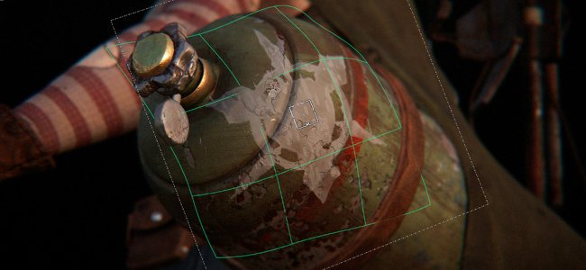
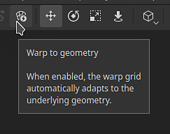
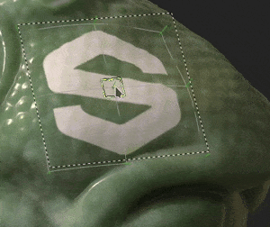

# Versione 12.0

<b>Substance 3D Painter 12.0</b> offre la conversione della texture direttamente nella pila di livelli, una nuova modalità automatica per la proiezione dell’alterazione, un set rinnovato di effetti di post-elaborazione e un flusso di lavoro migliorato per la creazione e le impostazioni del progetto.

Data di pubblicazione: <b>9 marzo 2026</b>

>[!NOTE]
>
> In questa versione è stato migliorato il supporto di <b>GPU integrate</b> con <b>memoria unificata/condivisa</b>. È possibile prevedere un migliore rilevamento della memoria video, che dovrebbe migliorare le prestazioni e ridurre i problemi grafici.

## Funzioni principali

### Nuova conversione dei livelli

Una nuova azione <b>Appiattisci</b> è ora disponibile nel menu di scelta rapida del pulsante destro del mouse dello stack di livelli. È possibile unire rapidamente più livelli raggruppandoli (<b>Ctrl/Cmd + G</b>) e creando una copia con unico livello (<b>Ctrl/Cmd + M</b>). Il gruppo di origine viene disattivato automaticamente, lasciando la scelta di eliminarlo o in alternativa salvarlo come <b>materiale avanzato</b> per la modifica successiva.

Gli elementi con unico livello dello stack di livelli possono anche essere esportati direttamente su disco per iterazioni rapide in altre applicazioni. Gruppi, livelli o maschere possono essere esportati singolarmente o in batch dal menu di scelta rapida del gruppo di livelli.

* <b>Appiattisci le texture direttamente nello stack di livelli</b>\
  È possibile convertire qualsiasi gruppo premendo <b>Ctrl/Cmd + M</b> o selezionando la voce <b>Appiattisci gruppo</b> nel menu di scelta rapida. In questo modo viene generata una copia unita del contenuto selezionato, mentre viene automaticamente disattivato il gruppo di origine, mantenendo intatti i livelli originali fino a quando non viene presa la decisione di rimuoverli o ripristinarli.

  
* <b>Appiattire ed esportare le texture sul disco</b>\
  Un’azione di esportazione dedicata nel menu di scelta rapida esegue il salvataggio del risultato appiattito di un livello, di una maschera o di un gruppo e lo salva direttamente su disco. Questo è utile per trasferire il contenuto cotto in altre applicazioni senza passare per la pipeline di esportazione completa delle texture.
* <b>Operazioni batch</b>\
  È possibile selezionare più livelli, gruppi o maschere contemporaneamente e appiattirli o esportarli singolarmente con una singola operazione, in modo da elaborare porzioni estese di un gruppo di livelli in un unico passaggio.

  

>[!NOTE]
>
> Ulteriori informazioni sulla conversione della trasparenza dei livelli sono disponibili nella [pagina dedicata alla documentazione](../interface/layer-stack/flatten-layers.md).

### Nuova modalità Altera a geometria per le proiezioni

Le decalcomanie possono ora adattarsi automaticamente a superfici complesse, riducendo la necessità di regolazioni manuali. L&#39;interruttore <b>Altera a geometria</b> è disponibile nella barra degli strumenti contestuale mentre la proiezione di alterazione è attiva.

* <b>Nuovo parametro nella barra degli strumenti contestuale</b>\
  Un nuovo interruttore <b>Altera a geometria</b> è disponibile nella barra degli strumenti contestuale ogni volta che è attiva la modalità di proiezione Altera. Può essere disattivata in qualsiasi momento senza bisogno di ripristinare le impostazioni di proiezione correnti.

  
* <b>Avvolgimento automatico sulla superficie della trama</b>\
  Quando questa opzione è attivata, la proiezione di alterazione segue automaticamente la curvatura e la topologia della trama sottostante. Trascinando la proiezione sulla superficie, questa si conformerà perfettamente alla geometria, riducendo notevolmente la quantità di regolazione manuale necessaria quando si posizionano decalcomanie su forme complesse o curve.

  
* <b>Conservazione delle deformazioni locali</b>\
  Quando modificate i vertici della griglia di proiezione dell’alterazione, la modalità Altera in geometria tenta di mantenere la deformazione predefinita per garantire che la stessa forma venga sempre proiettata.

  

>[!NOTE]
>
> Per ulteriori informazioni sulla proiezione di alterazione, consultate la [pagina dedicata alla documentazione](../painting/fill-projections/warp-projection.md).

### Nuovi effetti di post

I rendering in Painter ora possono essere migliorati con un nuovo set di effetti di post-elaborazione disponibili nella finestra <b>Impostazioni schermo</b>. Sono ora disponibili nuove aggiunte, come <b>Riflesso lente</b> e <b>Grana pellicola</b>, oltre a <b>Profondità di campo</b> migliorata e <b>Effetti riflesso</b> migliorati e molti altri.

Di seguito è riportato un esempio di ciò che è possibile ottenere con i nuovi effetti:

* <b>Nuovi effetti di post-elaborazione</b>\
  Tutti gli effetti di post-elaborazione possono essere attivati e configurati singolarmente dalla finestra <b>Impostazioni schermo</b>. Gli effetti vengono applicati in ordine di sovrapposizione e ciascuno può essere attivato o disattivato in modo indipendente, rendendo più facile combinare e sperimentare con risultati diversi.

  
* <b>Nuovo elenco di effetti:</b>

  * <b>Profondità di campo</b>: sfoca gli oggetti al di fuori dell&#39;intervallo focale per simulare la messa a fuoco dell&#39;obiettivo della fotocamera.
  * <b>Bloom</b>: aggiunge un bagliore morbido emanato dalle aree luminose dell’immagine.
  * <b>Luce</b>: crea striature di luce intorno alle sorgenti luminose.
  * <b>Riflesso lente</b>: simula i riflessi ottici dell&#39;obiettivo quando una luce intensa illumina la fotocamera.
  * <b>Aberrazione laterale</b>: simula le smarginature cromatiche ai bordi dell&#39;immagine causate dalle imperfezioni dell&#39;obiettivo.
  * <b>Vignettatura</b>: scurisce gli angoli e i bordi dell’inquadratura per attirare l’attenzione verso il centro.
  * <b>Contrasta</b>: aumenta il contrasto dei bordi per rendere l’immagine renderizzata più nitida.
  * <b>Grana pellicola</b>: sovrappone un leggero disturbo per riprodurre la texture di una pellicola analogica.
  * <b>Mappatura toni</b>: mappa i valori di luminanza HDR in un intervallo visualizzabile per un aspetto più cinematografico.
  * <b>Correzione colore</b>: regola il contrasto, la saturazione, la luminosità e la temperatura per perfezionare il bilanciamento del colore complessivo.

>[!NOTE]
>
> Per ulteriori informazioni sui nuovi effetti, consulta la [documentazione dedicata](../features/post-processing/post-processing.md).

### Finestra Impostazioni e nuovo progetto migliorata

La finestra del nuovo progetto e la finestra di dialogo delle impostazioni del progetto sono state riprogettate per facilitare la navigazione. I parametri sono stati riordinati e raggruppati per migliorarne la leggibilità e il flusso di lavoro di reimportazione della trama è stato migliorato per ridurre i passaggi ripetitivi durante l’iterazione di un progetto.

* <b>Finestra del nuovo progetto migliorata</b>\
  I parametri nella finestra del nuovo progetto sono stati riorganizzati e riordinati in modo da posizionare in modo più evidente le impostazioni più utilizzate. Il layout generale è ora più semplice da scansionare, riducendo il tempo necessario per configurare un nuovo progetto.
* <b>Nuovo flusso di lavoro per la reimportazione delle trame nelle impostazioni del progetto</b>\
  Una nuova casella di controllo <b>Reimporta trama</b> nelle impostazioni del progetto consente di reimportare la trama del progetto più facilmente grazie al percorso del file caricato in precedenza, ora salvato e precompilato automaticamente.

  

## Note sulla versione

## Versione 12

### 12.0.0

Data di pubblicazione: <b>2026/03/09</b>\
Riepilogo: <b>Versione principale. Questa versione contiene le funzioni per la conversione dei livelli, l&#39;alterazione della geometria, i nuovi effetti di postproduzione, i miglioramenti apportati alla nuova finestra del progetto e altri miglioramenti.</b>

<b>Aggiunto</b>:

* [Appiattisci livelli] Appiattisci i livelli all’interno del gruppo di livelli
* [Unico livello] Esportare su disco i livelli uniti
* [Altera a geometria] Aggiunge una nuova funzionalità di alterazione automatica alle proiezioni di alterazione
* [Post-effetti] Sostituisci i post-effetti con l’aggiunta di nuovi
* [Post-effects] Aggiornare la mappatura toni
* [Post-effetti] Aggiungi nuovo utilizzo per le risorse Post-effetti
* [Content]&#x200B;[Post-effects] Integra le risorse predefinite per i post-effetti nella libreria
* [Nuovo progetto] Miglioramento dell’interfaccia utente per la creazione di progetti
* [Nuovo progetto] Modifiche alla funzionalità di reimportazione della trama
* [Nuovo progetto] Consenti apertura file \*.geo.usd
* [Configurazione progetto] Miglioramento dell&#39;interfaccia utente per la configurazione del progetto
* Aggiornamento della libreria USD alla versione 25.05
* Aggiornamento della Substance Engine alla versione 9.3.4
* Aumenta i driver minimi a 25.3.1/25.Q2 per le GPU AMD
* Aggiornamento di Qt alla versione 6.8.6
* [Scripting] Aggiornamento dell’API JavaScript alla versione 1.1.20
* Aggiorna Python alla versione 3.13

<b>Corretto:</b>

* [Arresto anomalo] La modifica dell’output di un canale di materiale in una maschera può causare l’arresto anomalo
* [Import] Le texture EXR vengono forzate in sRGB invece che in lineare durante l’importazione di file USD
* [Porzioni UV] La sequenza di immagini con una singola immagine riempie anche altre porzioni UV
* [Baking] L&#39;AO è diverso tra il baking della CPU e quello della GPU
* [Color Management]&#x200B;[MacOS] La finestra di visualizzazione BaseColor non corrisponde al selettore colore
* [USD] In alcuni casi non vengono importati valori uniformi
