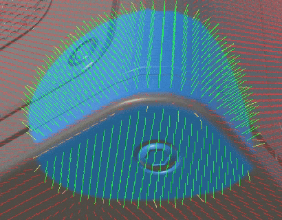
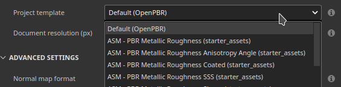
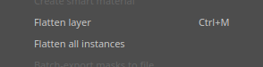

# Versione 12.1

<b>Substance 3D Painter 12.1</b> offre un flusso di lavoro di cottura migliorato con il rebaking automatico e la correzione dell&#39;inclinazione, il supporto per la definizione del materiale OpenPBR e una nuova modalità di superficie rigida per lo srotolamento automatico degli UV.

Data di pubblicazione: <b>22 giugno 2026</b>

>[!NOTE]
>
> Questa versione porta il numero minimo di versioni di macOS supportate a 13.0 (Ventura). Per ulteriori informazioni, consulta la [pagina dei requisiti di sistema](../getting-started/system-requirements.md).

## Funzioni principali

### Flusso di lavoro di esegue i baking migliorato con l’inclinazione

Il flusso di lavoro di cottura è stato rielaborato per supportare il rebaking continuo, la pittura di correzione dell’inclinazione sulla trama, la protezione dei bordi e un elenco di mappe di trama riprogettato.

* <b>Riattivazione automatica</b>

  Una mappa di trama può essere rimodellata in modo continuo quando i parametri di cottura vengono regolati, eliminando la necessità di attivare manualmente un forno dopo ogni modifica. Il rebake automatico viene attivato automaticamente per ogni mappa e viene applicato a una singola mappa alla volta. Ciò è particolarmente utile per il flusso di lavoro di inclinazione, ma anche quando si regolano le impostazioni generali della esegue i baking.

  

* <b>Colorazione correzione inclinazione</b>

  Quando la gabbia è impostata sulla modalità <b>Distanza</b>, le correzioni dell&#39;inclinazione possono essere dipinte direttamente sulla trama a basso poli per controllare la direzione di proiezione utilizzata durante la esegue i baking. Sono disponibili gli strumenti di riempimento pennello, gomma e poligono, con un selettore di valori in scala di grigi compatto, simmetria e i normali controlli del pennello (<b>Ctrl + clic con il pulsante destro del mouse</b> per ridimensionare il pennello, <b>X</b> per invertirne il valore). Le azioni di pittura con inclinazione possono essere annullate.

  

* <b>Protezione di Edge</b>

  Quando utilizzate la correzione dell’inclinazione, una nuova opzione di protezione dei bordi mantiene la morbidezza ad alto polio proiettata su bordi netti. Il risultato è controllato dai parametri <b>Distanza bordo</b> e <b>Contrasto bordo</b>.

  

* <b>Elenco mappa trama riprogettato</b>

  L&#39;elenco delle mappe trama fornisce i controlli per mappa: attiva/disattiva una mappa come finestra della vista <b>anteprima</b>, <b>infornare rapidamente</b> una singola mappa, attiva/disattiva il relativo <b>rebake automatico</b> e <b>sincronizza</b> le relative impostazioni tra gli insiemi di texture (disponibili quando il progetto include diversi insiemi di texture). Al passaggio del mouse su ogni controllo è disponibile una descrizione comandi.

  

* <b>Pulsante per la cottura al forno semplificato</b>

  Il pulsante di esegue i baking viewport è stato sostituito con un singolo pulsante <b>Esegue i baking</b> che visualizza il numero di mappe da eseguire i baking (set di texture x Porzioni UV x mappe mesh selezionate).

  

>[!NOTE]
>
> Per ulteriori informazioni sulla cottura al forno, consultate la [pagina dedicata alla documentazione](../baking/baking.md).

### Supporto OpenPBR

Il modello di ombreggiatura è ora supportato in Painter ed è utilizzato come flusso di lavoro predefinito, fornendo una definizione di materiale standardizzata che può essere trasportata tra le applicazioni.

* <b>Nuovo shader di OpenPBR e flusso di lavoro predefinito</b>

  Per impostazione predefinita è disponibile e utilizzato uno shader che attua la specifica di cui all&#39;OpenPBR 1.1. Un nuovo progetto creato senza un modello utilizza lo shader OpenPBR e la prima voce della finestra del nuovo progetto è ora denominata <b>OpenPBR</b> anziché <b>ASM</b>. Sono inclusi nuovi modelli di progetto per l&#39;OpenPBR e i progetti di esempio sono stati aggiornati per utilizzarli.

  

* <b>Shader selezionato dal modello di progetto durante l&#39;importazione</b>

  Quando si importa un file USD o GLTF, lo shader è ora impostato dal modello di progetto anziché dal contenuto del file. Un messaggio viene segnalato nel registro quando un materiale e un modello utilizzano flussi di lavoro non corrispondenti.

  

* <b>Convenzione di denominazione dell&#39;OpenPBR per l&#39;esportazione</b>

  Nella finestra <b>Esporta Texture</b> è disponibile un nuovo menu a discesa per scegliere la convenzione di denominazione. Il valore predefinito è OpenPBR quando viene utilizzato da almeno uno shader del progetto e lo schema selezionato viene visualizzato nell&#39;elenco delle mappe di ciascun set di texture.

  

* Supporto per <b>USD e MDL</b>

  Il materiale OpenPBR è supportato tramite il formato USD. È stata inoltre aggiunta una nuova MDL per consentire il rendering dei materiali di OpenPBR in Iray, fornendo rappresentazioni dei materiali più accurate.

>[!NOTE]
>
> Potrebbe essere necessario aggiornare gli shader personalizzati. L&#39;API shader è stata modificata per supportare l&#39;OpenPBR. Per ulteriori informazioni, consultare il registro delle modifiche disponibile nel menu Aiuto dell&#39;applicazione.

### Srotolamento automatico nuova superficie rigida

È stata aggiunta una nuova modalità di srotolamento automatico su misura per le risorse di superficie solida.

* <b>Modalità di annullamento dell&#39;avvolgimento della superficie rigida</b>

  Un&#39;opzione <b>Superficie rigida</b> è disponibile nelle impostazioni di annullamento automatico del contornamento. Riduce al minimo la distorsione UV e produce layout UV allineati ortograficamente, il che lo rende più adatto a trame meccaniche e di superficie dura.

  

>[!NOTE]
>
> Per ulteriori informazioni sullo srotolamento automatico, vedere la [pagina dedicata alla documentazione](../features/automatic-uv-unwrapping.md).

### Varie

In questa versione sono state aggiunte funzioni e miglioramenti aggiuntivi:

* <b>Aggiungere o rimuovere più canali contemporaneamente</b>

  In seguito all&#39;introduzione di OpenPBR, una nuova finestra accessibile dalle <b>impostazioni del set di texture</b> consente di selezionare più canali contemporaneamente, il che risulta utile quando si imposta l&#39;elenco di canali di grandi dimensioni utilizzato dal flusso di lavoro di OpenPBR.

  * La nuova finestra è accessibile nelle impostazioni del set di texture tramite il pulsante <b>Aggiungi o rimuovi canali</b>.

    

  * La finestra offre una panoramica di tutti i canali che possono essere utilizzati in Painter.

    

  * Il pulsante <b>Applica a tutti i set di texture</b> può essere utilizzato per modificare contemporaneamente la configurazione dei canali di tutti i set di texture.

    

* <b>Appiattisci tutte le istanze tra set di texture</b>

  Una nuova opzione <b>Appiattisci tutte le istanze</b> è disponibile per i livelli e i gruppi di istanze. Produce un risultato appiattito in ogni set di texture in cui viene visualizzata l’istanza, scendendo lungo l’intero albero delle istanze, e viene registrato come un singolo passaggio di annullamento.

  

* <b>Cronologia unificata di annullamento</b>

  Le modalità di esegue i baking e disegno condividono ora la stessa cronologia di annullamento. Il passaggio dalla modalità di Esegue i baking a quella di Pittura è registrato come un passaggio impossibile, quindi le azioni possono essere annullate solo nella modalità in cui si sono verificate.

## Tutorial

Guarda il nostro ultimo tutorial su Youtube:

## Note sulla versione

### 12.1.3

Data di pubblicazione: **2026/08/25**

Riepilogo: **Versione secondaria**

**Aggiunto:**

* Aggiornamento del motore di Substance alla versione 9.4.6v

**Corretto:**

* [Il selettore scala di grigi] rimane aperto dopo aver modificato lo strumento
* [Inclina Eseguita i baking] La correzione dell’inclinazione si interrompe quando si disegna e si annulla
* [L&#39;interazione dello strumento di proiezione] nella finestra della vista è bloccata dallo strumento di proiezione
* [Traccia dinamica] Parametri di traccia dinamica mancanti nelle proprietà del pennello
* L’esportazione in rete non funziona più

### 12.1.2

Data di pubblicazione: **2026/08/03**

Riepilogo: **Versione secondaria**

**Corretto:**

* \[Arresto anomalo\] Alcune Substance possono generare un arresto anomalo durante il rendering
* \[Arresto anomalo\] Reimporta trama in modalità di esegue i baking
* \[Arresto anomalo\] Un errore di inizializzazione della visualizzazione grafica può provocare un arresto anomalo
* \[Arresto anomalo\] L&#39;esportazione di texture può verificarsi in alcuni casi durante l&#39;arresto anomalo del registro
* \[Arresto anomalo\] Arresto anomalo in modalità di esegue i baking in alcuni casi durante il caricamento/aggiornamento della mappa dell&#39;ambiente
* \[Eseguo i baking\] Il riavvio del eseguo i baking dopo la modifica del file di criteri alti può provocare un blocco
* \[Invia a Photoshop\] Non riesce a esportare la maschera di livello
* Il risultato del punto di ancoraggio \[Motore\] non viene visualizzato tra una maschera e un canale di colore

### 12.1.1

Data di pubblicazione: <b>2026/07/09</b>

Riepilogo: versione secondaria

Aggiunto:

* [Inclina in Eseguita i baking] Esposizione inclina base modalità normale: trama o per triangolo
* [Proprietà] I colori uniformi vengono sempre ripristinati al valore predefinito del canale
* [OpenPBR] Raggruppare i canali in base alle categorie nella finestra Esporta Texture per la creazione di modelli di output
* Aggiornamento del motore di Substance alla versione 9.4.5

Fisso:

* [Il progetto] L&#39;apertura e il salvataggio di alcuni progetti può richiedere più tempo del solito
* [Arresto anomalo] Il ricaricamento di più trame può provocare un arresto anomalo
* [Arresto anomalo] L&#39;eliminazione di un canale in modalità di visualizzazione maschera genera un arresto anomalo
* [Arresto anomalo] Alcune Substance possono generare un arresto anomalo durante il rendering
* [Pittura inclinazione] Lo strumento selezionato in pittura inclinazione rimane selezionato dopo il passaggio alla modalità di disegno
* [Esegue i baking delle impostazioni comuni] Le impostazioni di distanza della gabbia non aggiornano la visualizzazione di wireframe e shader della gabbia
* La modalità &quot;Vicina spazio 3D&quot; del riempimento UV del [Motore] non funziona correttamente su triangoli sottili
* Il risultato del punto di ancoraggio [del motore] non viene visualizzato tra una maschera e un canale di colore

### 12.1.0

Data di pubblicazione: <b>2026/06/23</b>

Riepilogo: <b>Questo aggiornamento è una versione principale e contiene miglioramenti a livello di baker con il nuovo stato predefinito dell’interfaccia utente eseguito i baking, la mappa di inclinazione del colore, il rebake automatico, la nuova opzione per lo srotolamento UV automatico per trame e OpenPBR hardsurface. Per ulteriori dettagli, vedere le note sulla versione complete.</b>

<b>Aggiunto</b>:

* [Inclina al forno] Inclina strumenti di pittura
* [Inclina al forno] Aggiungete effetti visivi vettoriali dell&#39;ombreggiatura dell&#39;anteprima dell&#39;inclinazione e della direzione dell&#39;inclinazione quando colorate la mappa dell&#39;inclinazione
* [Skew Baking] Aggiungi opzione protezione bordi
* [Inclina al forno] Ripetizione automatica
* [Skew Baking] Rielaborare l&#39;interfaccia utente dell&#39;elenco mappa trama
* [Inclina in forno] Dividi mappa trama / Impostazioni comuni di cottura + Sposta impostazioni comuni fuori dall&#39;elenco mappa trama solo colore di base o maschera
* [Skew Baking] Cambiare i pulsanti della barra degli strumenti della finestra della vista
* [Skew Baking] Mostra/Nascondi simmetria per il pennello nella barra degli strumenti superiore
* [Skew Baking] Opzioni di ridenominazione nel menu di sincronizzazione della mappa mesh
* [Inclina baking] Aggiornare le finestre di dialogo Sincronizza e Stato controllato
* [Inclina cottura] Crea variante del selettore colore in scala di grigio
* [Skew Baking] Icona Aggiorna modalità di cottura
* [Auto Unwrap] Opzione Integra superficie dura (Integrate Hard Surface)
* [OpenPBR] Aggiungi il supporto per l’OpenPBR 1.1
* [OpenPBR] Rendi OpenPBR il flusso di lavoro e lo shader predefiniti
* [OpenPBR] Importa materiali e texture OpenPBR tramite USD
* [OpenPBR] Esportare materiali e texture di OpenPBR tramite USD
* [OpenPBR] Aggiornare la finestra Esporta texture per visualizzare la convenzione di denominazione dell&#39;OpenPBR
* [OpenPBR] Aggiungi documentazione sulle modifiche all’OpenPBR di supporto
* [OpenPBR][Iray] Aggiungi un nuovo MDL per supportare l&#39;OpenPBR 1.1 in Iray
* Diversi miglioramenti minori delle esportazioni in USD
* [UI] Aggiungete un avviso nella finestra della vista quando tentate di colorare su un altro set di texture
* [Appiattisci] Consenti di appiattire tutti i livelli istanziati tra set di texture
* [Impostazioni set texture] Consente di selezionare più canali contemporaneamente tramite una nuova finestra
* [History] Aggiornare il &quot;valore&quot; della voce Annulla per riflettere il nome del parametro
* [Pila livelli] Rendi gli effetti di riempimento nelle maschere predefiniti sul bianco (1,0)
* [Substance] Aggiungi nuovo input mappa motore &quot;mesh_hard_edges_triangle&quot;
* [Substance] Aggiungi nuovo input mappa motore &quot;mesh_hard_edges&quot;
* [Shader] Impedisci la condivisione degli stessi nomi da parte delle istanze shader
* [Shader] Utilizza lo shader del modello di progetto durante l&#39;importazione di un file USD o GLTF
* Aggiornamento dell&#39;Adobe Color Engine alla versione 7.0
* Aggiornamento della versione minima MacOSX alla versione 13.0 (Ventura)
* [Content] Nuovi modelli di progetto per l&#39;OpenPBR
* [Content] Aggiorna i progetti di esempio per utilizzare il nuovo shader di OpenPBR
* [Python] Espandi l’API maschera geometria per consentire le modalità di inclusione ed esclusione, come nell’interfaccia utente

<b>Risolto</b>:

* [Arresto anomalo][Impostazioni mappe trama] Applica le impostazioni ad altri set di texture
* [Arresto anomalo] Quando si esegue i baking la curvatura da una mappa senza spazio mondo normale
* [Arresto anomalo][Esegue i baking] Esegue i baking con gabbia personalizzata abilitata ma nessun file selezionato arresti anomali
* [Arresto anomalo] Annullamento della esegue i baking di AO
* [Auto-Cage] Caricamento infinito quando il percorso del file di tipo High Poly non è valido
* [Linux][Windows] Il selettore colore a volte può essere completamente nero o non apparire
* [Strumento Riempimento poligonale] Lo strumento non funziona con file non PBR
* [[Pittura] L’eliminazione del canale del colore di base non elimina il colore colorato in precedenza
* [USD] Le Istanze shader non vengono tutte rilevate correttamente
* [Substance] Viene preso in considerazione solo il primo utilizzo di un nodo di input/output
* L’Occlusione ambientale [Shader] viene applicata due volte con gli insiemi di texture, utilizzando diversi metodi di miscelazione
* [Engine] Una texture normale con canale blu vuoto (nero) può produrre risultati di fusione errati
* [Importazione GLTF] La fusione di Alpha è abilitata su ogni set di texture
* [Esportazione GLTF] La fusione di Alpha è sempre abilitata all&#39;esportazione
* [Esporta] La geometria a due lati è sempre disattivata durante l&#39;importazione di un file GLTF
* [Javascript] La modifica delle impostazioni degli shader non contribuisce alla cronologia di annullamento
* [Esempi] La dispersione sotto la superficie non è attivata in Impostazioni schermo per Riunione
