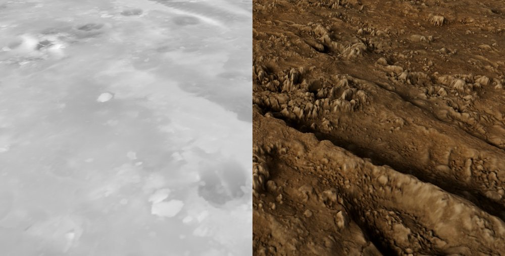
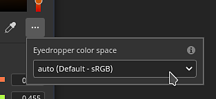

# Versione 8.1

**Substance 3D Painter 8.1** integra l&#39;Adobe Color Engine (ACE) con supporto per profili ICC, nuovi forni, nuovi rumori 3D e 20 mappe di grungi e un contagocce migliorato.

Data di pubblicazione: *7 giugno 2022*

## Funzioni principali

### Nuova gestione colore con Adobe Color Engine (supporto ICC)

In questa nuova versione, il sistema di gestione del colore è stato ampliato con il supporto dell&#39;Adobe Color Engine (ACE) che sblocca l&#39;uso dei profili ICC. Questo nuovo sistema permette di riprodurre i colori in un&#39;ampia gamma di applicazioni, tra cui Photoshop.

* **Nuove impostazioni progetto**\
  Durante la creazione di un nuovo progetto, è ora possibile specificare il motore di gestione del colore con il **Adobe Color Engine** (ACE) appena aggiunto.

  {width="400px"}

  ACE include il seguente spazio cromatico di lavoro:

  * **sRGB lineare**
  * **ACEScg**
  * **Adobe RGB lineare**
* **Monitoraggio del supporto del profilo ICC**\
  Puoi utilizzare il profilo ICC per regolare l’aspetto della finestra della vista e far corrispondere i colori al monitor.

  {width="400px"}

* **Importazione ed esportazione di immagini con profili ICC incorporati**\
  Durante l&#39;importazione delle bitmap, il profilo ICC può essere estratto automaticamente. È inoltre possibile ignorare tale profilo nelle proprietà del livello.\
  Durante l’esportazione è possibile specificare il profilo ICC desiderato che verrà incorporato nei file di texture.

  {width="400px"}

* **Nuove impostazioni del modello JSON** Per condividere e riutilizzare le impostazioni tra progetti, è possibile specificare un file di predefinito. Per ulteriori informazioni sulle specifiche dei predefiniti, consulta la [documentazione dedicata](../features/color-management/color-management-with-adobe-ace-icc.md).

>[!NOTE]
>
> Per ulteriori informazioni, consulta la documentazione sulla [gestione del colore](../features/color-management/color-management.md).

### Nuovo supporto dimensioni fisiche per i materiali Substance

Le dimensioni all’interno dei materiali delle Substance possono ora essere utilizzate per determinarne la scala e l’affiancamento nelle proiezioni degli strati di riempimento. Questo è uno strumento utile per abbinare correttamente i materiali sulle superfici in base alle loro dimensioni reali senza la necessità di indovinare.

* **Nuovi parametri del livello di riempimento**\
  Un livello di riempimento (o effetto) contiene nuovi parametri per controllare l’affiancatura/ripetizione di un materiale per il quale è stata definita una dimensioni fisiche. Questi nuovi parametri sono disponibili solo con proiezioni 3D.

  {width="400px"}

* **Nuova griglia della finestra della vista**\
  Per facilitare la comprensione e la visualizzazione della dimensioni fisiche, è ora possibile attivare una griglia nella finestra della vista 3D tramite la finestra [Impostazioni schermo](../interface/display-settings/display-settings.md).\
  Una volta abilitata, la griglia verrà automaticamente suddivisa in base al livello di zoom. L&#39;unità della griglia viene indicata in basso a sinistra nella finestra della vista.

  {width="400px"}

  {width="400px"}

>[!NOTE]
>
> Per ulteriori informazioni, consulta la [documentazione dedicata](../features/physical-size.md).

### Nuovi panettieri

Queste tre nuove aggiunte colmano il divario tra Designer e Painter per ampliare le possibilità di creazione e rendering delle texture.

Sono stati aggiunti all&#39;elenco dei forni, ma sono disattivati per impostazione predefinita:

I nuovi panettieri sono:

* **Baker Normali piegati** Il baker Normali piegati consente di cuocere una direzione di occlusione (come vettore, simile alle mappe normali). Questa texture può essere utilizzata per migliorare l&#39;ombreggiatura nella finestra della vista abilitando l&#39;impostazione **Normale piegato** nella finestra [Impostazioni shader](../interface/shader-settings/shader-settings.md). Normali piegati (Bent Normals) migliorano notevolmente la precisione dell&#39;ombreggiatura del viewport in tempo reale.\
  Per l&#39;**ombreggiatura diffusa**, fornisce un&#39;occlusione più precisa e può anche sembrare un&#39;illuminazione globale approssimativa (primo esempio di seguito).\
  Per **riflessi specular**, consente di simulare l&#39;ombreggiatura e ridurre la quantità di luce che perde, rendendo l&#39;oggetto molto più a terra soprattutto con superfici metalliche (secondo esempio di seguito).

  {width="350px"}

  {width="400px"}

* **Fornaio di Height**\
  Il fornaio di Height permette di cuocere la differenza tra la trama bassa e alta poly come una texture in scala di grigio che potrebbe quindi essere utilizzata per produrre spostamento su trame tessellate. Ad esempio, quando si eseguono le analisi delle informazioni su un piano.

  {width="400px"}

* **Panettiera opacità**\
  Il panificatore Opacità produce una mappa in bianco e nero che mostra i fori di una trama ad alto poli. Ad esempio può essere utilizzato per cuocere recinzioni o anche fori all&#39;interno di una superficie di tessuto.

### Nuovo contenuto

In questa versione sono stati aggiunti diversi nuovi contenuti, tra cui:

* **Rumori 3D nuovi e migliorati con più di 100 predefiniti**\
  I rumori 3D esistenti sono stati rielaborati e tre nuovi sono stati aggiunti. Ognuno di essi ora include impostazioni predefinite che portano un totale di 105 predefiniti su 7 rumori. Questi predefiniti possono essere utilizzati come punto di partenza per giocherellare con i loro parametri e ottenere un aspetto specifico. Come sempre con i rumori 3D, sono fluidi e possono essere ripetuti molto facilmente senza un pattern evidente.

  Per trovare i rumori 3D, accedete alla sezione delle procedure del pannello Risorse:

  {width="400px"}

  I rumori offrono un&#39;ampia gamma di possibilità, ad esempio i predefiniti disponibili con **3D voronoi fractal**:

  {width="300px"}

* **20 nuove bitmap di grunge e 2 pattern di tessuto**\
  È stato aggiunto un nuovo set di sfondi con il contenuto predefinito per espandere la gamma esistente di pattern. Sono disponibili in **Procedure > Grunges Bitmap**.\
  In **Procedure > Tessuto** sono disponibili anche due modelli di tessuto.

  {width="400px"}

>[!NOTE]
>
> Alcuni rumori 3D possono richiedere alcuni secondi per essere elaborati durante il primo utilizzo.

### Contagocce e selettore materiale migliorati

Sono stati apportati diversi miglioramenti al contagocce per facilitare l’estrazione e la gestione dei colori.

* **Nuova modalità di prelievo**\
  Quando si selezionano i colori, non è più necessario tenere premuto il pulsante del mouse mentre si sposta il mouse. Ora è possibile fare un solo clic sul contagocce, spostare il mouse nella posizione desiderata e fare di nuovo clic per acquisire un colore.

* **Nuovi pulsanti contagocce**\
  Accanto ai pulsanti colore è presente una nuova icona del contagocce che può essere utilizzata per acquisire i colori senza dover aprire prima il selettore colore.

  {width="400px"}

* **Nuova scelta rapida da tastiera per il contagocce**\
  Quando la finestra del selettore colore è aperta, puoi anche premere **I** per accedere alla modalità Contagocce senza dover fare clic sull&#39;icona dedicata, il che semplifica l&#39;iterazione tra il prelievo e il disegno.

* **Nuova anteprima durante il contorno**\
  Quando utilizzate il contagocce per selezionare un colore, accanto al mouse non è visibile una nuova anteprima. Anche questa anteprima è sottoposta alla gestione del colore.

  

* **Nuovo prelievo direttamente in un canale**\
  Con il nuovo comportamento contagocce è ora possibile selezionare direttamente in un canale sulla trama. Per farlo è sufficiente premere e mantenere MAIUSC per selezionare un colore direttamente dal canale. Il canale viene determinato da dove è stato avviato il contagocce. Questo metodo ignora qualsiasi trasformazione del colore importante per recuperare colori precisi nella gestione del colore. Viene visualizzata una descrizione che indica il canale da cui viene acquisito il colore.

  

* **Nuove impostazioni dello spazio colore durante l&#39;acquisizione di un colore**\
  Quando la gestione del colore è attivata, nel selettore colore è disponibile una nuova impostazione che consente di specificare lo spazio colore utilizzato per l’acquisizione dei colori. Questa impostazione è globale per la sessione di Painter e si applica anche al pulsante contagocce accanto ai pulsanti colore nella finestra delle proprietà.

  

* **Comportamento selettore materiali migliorato**\
  Il selettore di materiali dalla barra degli strumenti Strumenti (scelta rapida da tastiera P) ora rispetta la selezione del canale all’interno della finestra delle proprietà. Non verrà più attivato dai canali stessi.

  {width="400px"}

### Srotolamento automatico migliorato

Il processo di srotolamento automatico degli UV offre ora una segmentazione più naturale.

Ora le trame vengono tagliate in Isole UV separate utilizzando un metodo che si avvicina a quello che può essere fatto a mano, in particolare sulle trame organiche.

## Note sulla versione

### 8.1.0

*(Rilasciato il 7 giugno 2022)*

**Aggiunto:**

* [Gestione colore] Aggiungi il supporto per i profili ICC con Adobe Color Engine (ACE)
* [Gestione colore] Aggiungi il supporto per &quot;Adobe 98 RGB&quot; come spazio colore di lavoro per ICC
* [Gestione colore] Consente di configurare le impostazioni ACE/ICC tramite un file di configurazione
* [Gestione colore] Consente di inserire valori di colore lineari nel Selettore colore con la modalità Legacy
* [Gestione colore] Consente di specificare il profilo colore utilizzato per la selezione del colore al di fuori dell&#39;interfaccia utente
* [Gestione colore] Ricordare l&#39;ultimo valore di visualizzazione scelto nella finestra della vista
* [Gestione colore]&#x200B;[Substance] Fate funzionare correttamente i generatori/filtri con la Gestione colore
* [Gestione colore]&#x200B;[Substance] Aggiungi nuove parole chiave di esclusione dello spazio colore $working e $standardsrgb
* [Dimensioni fisiche]&#x200B;[Engine] Estrai informazioni dimensioni fisiche dalla trama
* Calcolo Dimensioni fisiche [Dimensioni fisiche]&#x200B;[Engine]
* [Dimensioni fisiche] Esporre le opzioni per utilizzare dimensioni fisiche nell&#39;interfaccia utente
* [Dimensioni fisiche] Aggiungere gli helper visivi nella finestra della vista
* [Baking] Aggiungere Height
* [Baking] Aggiungere il fornaio normale piegato
* [Baking] Aggiungi panettiere opacità
* [Contagocce] Anteprima nuovo selettore colore
* [Contagocce] Il pannello Selettore colore riappare nell&#39;ultima posizione quando viene riaperto
* [Contagocce] Una nuova icona per il Selettore materiale
* [Contagocce] Il colore gestisce l&#39;anteprima del canale del selettore colore
* [Contagocce] Aggiungete al contagocce la funzionalità clic per selezionare
* [Contagocce] Il selettore di materiali non attiva più i canali non attivi
* [Contagocce] Consenti di utilizzare il contagocce con una scelta rapida
* [Contagocce] Il contagocce preleva il canale pertinente, se applicabile
* [Contagocce] Quando si entra in modalità Selettore colore, tutte le scelte rapide vengono disattivate
* [Contagocce] Rimuovi la selezione automatica del campo esadecimale
* [Contagocce] Non chiudere il pannello quando si utilizza il selettore di materiale
* [Contagocce] Nuovo stato disabilitato quando il canale non è disponibile per la selezione
* [Esporta] Aggiungi attributo tangente all&#39;esportazione glTF
* Aggiorna Substance Engine alla versione 8.4
* Aggiorna Scorrimento automatico a 0.9.0
* Esegui l’aggiornamento a Qt 5.15.8
* Aggiornamento a Python 3.9
* [Shader] Aggiungere il supporto per l&#39;ombreggiatura Normali piegati
* [MacOS] Supporto di 3DConnection SpaceMouse
* [Python] Documentazione della versione Python utilizzata nell’API
* [Content] Aggiungi 6 nuovi rumori 3D con 105 predefiniti
* [Content] 20 nuove mappe di grunge e 2 modelli di pieghe di tessuto
* [Content] Aggiorna il predefinito di esportazione &quot;Mesh maps&quot; per utilizzare nuovi forni
* [Contenuto] I filtri Sfoca Pendenza e Altera dipendono dalla risoluzione del set di texture
* [Content] Aggiorna i progetti di esempio per utilizzare i tre nuovi panettieri

**Corretto:**

* [glTF] Impossibile aprire glTF con carattere speciale
* [Engine] Artefatti con anisotropia e SVT disattivati
* [MacOS]&#x200B;[M1] I materiali avanzati non vengono visualizzati correttamente
* [Elaborazione trama] Impossibile importare trame da Modeler
* [UI] Barra di scorrimento orizzontale nella nuova finestra del progetto con la Gestione colore attivata
* [Gestione colore] Valore dello spazio di lavoro mancante nel selettore colore con alcune configurazioni OCIO
* [Gestione colore] L’anteprima del pennello nella finestra della vista non è sottoposta alla gestione del colore
* [SpaceMouse] Il pivot non viene aggiornato immediatamente con la modifica dello stato attivo e a volte fuori dal modello
* [Export]&#x200B;[USD] I file USD esportati hanno una struttura errata
* [USD] Problema di Occlusione ambientale durante l’esportazione
* [Content] Aggiorna la trama della miniatura in modo che corrisponda al progetto di esempio Preview Sphere

**Problemi noti:**

* Esporta le texture utilizzando il riempimento di diffusione esegue il rendering delle mappe nere
* Il mixaggio delle Occlusioni normali/ambientali è interrotto
* [MacOS] Arresto anomalo all&#39;avvio di Iray in alcuni rari casi
* [Anteprima miniatura] Le miniature semplificate non vengono aggiornate quando si utilizza un ancoraggio
* [Gestione colore] Le conversioni dello spazio colore HDR con ACE su Linux producono colori bloccati
