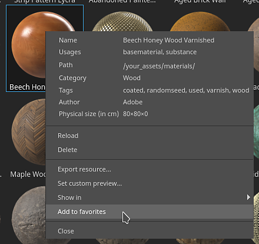

# Versione 8.2

**Substance 3D Painter 8.2** si concentra su molti miglioramenti della qualità della vita con funzionalità dedicate in diverse aree dell&#39;applicazione.

Data di pubblicazione: *6 ottobre 2022*

## Funzioni principali

### Nuove opzioni per applicare i metodi fusione e l’opacità

Sono state aggiunte diverse scelte rapide e azioni per semplificare e velocizzare la copia e l’applicazione dei metodi di fusione e dell’opacità su più canali nella pila di livelli.

* **Fare clic con il pulsante destro del mouse su un metodo di fusione o un controllo di opacità**\
  Facendo clic con il pulsante destro del mouse su un metodo di fusione o un&#39;opacità, selezionate l&#39;azione **Applica a tutti i canali** per utilizzare questo metodo di fusione su tutti gli altri canali del livello. Questa azione è disponibile anche per gli effetti che dispongono di controlli metodo fusione e opacità.

  

* **Fate clic con il pulsante destro del mouse su un livello e scegliete Opzioni di fusione**\
  È anche possibile fare clic con il pulsante destro del mouse su un livello (o effetto) e scegliere una delle seguenti azioni:

  * **Applica fusione a tutti i canali**: applica il metodo di fusione del canale corrente a tutti gli altri canali del livello/effetto corrente.
  * **Applica opacità a tutti i canali**: applica l’opacità del canale corrente a tutti gli altri canali del livello/effetto corrente.
  * **Applica entrambi a tutti i canali**: applica il metodo di fusione del canale corrente e l’opacità a tutti gli altri canali del livello/effetto corrente.
  * **Copia impostazioni di fusione canale**: copia negli Appunti tutti i metodi di fusione e i valori di opacità del livello/effetto corrente.
  * **Incolla impostazioni di fusione canale**: applica i metodi di fusione e i valori di opacità attualmente presenti negli Appunti al livello/effetto di destinazione.

  

### Nuovo metodo di fusione e opacità sugli effetti filtro e selezione colore

Gli effetti di filtro e selezione colore ora possono utilizzare i metodi fusione e i controlli di opacità.

* **Metodo di fusione e opacità sui filtri**\
  I filtri ora possono utilizzare i metodi di fusione e i valori di opacità. Il valore predefinito è **Sostituisci** per mantenere lo stesso comportamento di prima ed evitare di raddoppiare le informazioni sul componente alfa. I metodi di fusione sui filtri consentono di calcolare gli effetti e combinarne i risultati direttamente sui livelli, evitando la necessità di utilizzare punti di ancoraggio ed effetti di riempimento per ottenere lo stesso risultato. In questo modo si evita anche di dover implementare manualmente i metodi di fusione all’interno del filtro stesso.

  

* **Metodo di fusione e opacità nella selezione del colore**\
  L’effetto selezione colore è stato modificato per supportare i metodi di fusione e i controlli di opacità. In precedenza, questo effetto generava un risultato alfa e, per far funzionare i metodi di fusione come previsto, è stata aggiunta una nuova impostazione che specifica il colore di sfondo in fase di output. È impostata su nero invece di trasparente (questo è il comportamento precedente).

  

  

* **Stack di effetti semplificato**\
  In precedenza, quando era necessario combinare gli effetti in determinati modi (ad esempio con l’aiuto dei metodi di fusione), era necessario utilizzare punti di ancoraggio ed effetti di riempimento. Ora, con i metodi di fusione direttamente sui filtri, non è più necessariamente che può ridurre in modo significativo la complessità della serie di effetti.

  {width="400px"}

### Nuovi effetti sulle cartelle

Il contenuto delle cartelle (la parte colorata di un livello) può ora ricevere effetti di qualsiasi tipo. Prima che fosse necessario creare configurazioni di livello complesse (come livelli passthrough o punti di ancoraggio) per ottenere lo stesso risultato.

### Esportazione di un nuovo archivio Substance (SBSAR)

Il formato di file SBSAR (Substance Archive) è ora disponibile per l&#39;esportazione di texture. Un SBSAR è un contenitore che può essere aperto in molte applicazioni con l&#39;integrazione della Substance, che può rendere più veloce e facile &quot;plug-and-play&quot; texture personalizzata.

* **Esportazione di un archivio di Substance (SBSAR)**\
  È ora possibile specificare il formato di file SBSAR dall&#39;elenco dei formati di file nella finestra **Esporta Texture**. Questa operazione consente di esportare un singolo file SBSAR contenente tutte le texture specificate. La denominazione dei nodi di output e i relativi utilizzi sono definiti dal predefinito di esportazione selezionato e dai relativi tipi di canale.

  

* **Predefiniti di esportazione ibridi con formati di file PSD e SBSAR**\
  I predefiniti di esportazione ora possono specificare le mappe di output come PSD o SBSAR in aggiunta a tutti gli altri formati di immagine. I formati PSD e SBSAR sono considerati come &quot;contenitori&quot;, il che significa che è possibile memorizzare più texture all’interno. Quando un predefinito di esportazione specifica sia i formati contenitore che i formati immagine autonomi, ogni output nel modello destinato a un file SBSAR verrà raggruppato mentre gli altri output verranno esportati come singoli file.

  

### Nuova opzione di ambiente per illuminare sotto i modelli 3D

Una nuova impostazione in [Impostazioni schermo](../interface/display-settings/environment-settings.md) consente di allineare la mappa dell&#39;ambiente alla fotocamera, in modo da regolare l&#39;angolo di illuminazione e illuminare le parti sotto il modello 3D.

Per utilizzare questa nuova impostazione, vai a [Impostazioni schermo](../interface/display-settings/environment-settings.md) e modifica l&#39;impostazione **Allineamento ambiente**:

* **Mondo**: la mappa ambiente è allineata alla scena.
* **Locale**: la mappa dell&#39;ambiente è allineata alla fotocamera.

Le ombre vengono regolate automaticamente in base alla configurazione di questa impostazione.

### Nuovi preferiti ed eliminazione/ricaricamento nella finestra Risorse

Sono state aggiunte nuove azioni alla finestra [Risorse](../interface/assets/assets.md) per semplificare la gestione delle risorse.

* **Risorse preferite per trovarle rapidamente**\
  Fare clic con il pulsante destro del mouse su qualsiasi risorsa nella finestra Risorse per impostarla come risorsa preferita (o non preferita). Le risorse preferite vengono sempre visualizzate per prime nella riga delle query di ricerca con un piccolo tag a stella nell&#39;angolo, in modo da essere visibili e accessibili. È stata aggiunta anche una query di ricerca dedicata, che semplifica la visualizzazione di tutte le risorse preferite.

  {width="350px"}

* **Eliminare e ricaricare le risorse sul disco**\
  Le risorse che si trovano nelle librerie utente possono ora essere eliminate, ricaricate o rinominate (ad eccezione delle risorse che fanno parte di un pacchetto, come Substance grafici o pennelli ABR).

### Funzioni e miglioramenti vari

In questa nuova versione sono stati aggiunti numerosi piccoli miglioramenti e funzioni aggiuntive:

* **Nuova finestra Benvenuti e novità**\
  Per ricevere informazioni sulle nuove funzioni aggiunte all’applicazione, all’avvio dell’applicazione viene ora introdotta una nuova finestra Benvenuti e Novità. La finestra può essere chiusa facilmente e non verrà rivisualizzata al prossimo avvio. È sempre possibile riaprirle tramite il menu **Aiuto**.

  {width="400px"}

  {width="400px"}

* **Nuova azione per reimportare rapidamente un modello 3D**\
  È stata aggiunta una nuova scelta rapida da tastiera da tastiera (**CTRL+MAIUSC+R** per impostazione predefinita) che consente di reimportare rapidamente il modello 3D del progetto corrente. In questo modo l’iterazione di una risorsa è più semplice e veloce. Se non è possibile trovare il file di origine, nel registro verrà generato un messaggio di errore. È stata aggiunta un&#39;azione anche al menu **Modifica**.

  

* **Supporto HDPI migliorato**\
  Sono state apportate diverse correzioni alle schermate HDPI e al ridimensionamento del sistema. Ora sono supportati i valori di ridimensionamento intermedi (ad es. 125%) per evitare che l&#39;interfaccia risulti troppo grande o troppo piccola su determinati schermi. Anche lo spostamento di finestre tra schermi HDPI con valori di ridimensionamento diversi dovrebbe avvenire correttamente.

* **Ripristina i parametri predefiniti del grafico delle Substance**\
  Ovunque venga utilizzato un grafico a Substance (come canale alfa, materiali, filtro, ecc.) è ora possibile ripristinare i parametri predefiniti.

  * **Ripristina tutti i parametri**: utilizzare il pulsante Ripristina valori predefiniti sotto l&#39;elenco dei parametri per reimpostare l&#39;intera risorsa Substance.
  * **Fare clic con il pulsante destro del mouse**: fare clic con il pulsante destro del mouse su un parametro specifico per aprire un menu con un&#39;azione di ripristino specifica per il parametro.

   

* **Visualizzare singoli componenti RGBA nelle finestre delle viste**\
  Quando si guarda un canale nelle finestre di visualizzazione, è disponibile una nuova impostazione denominata **Canali di colore** in **Impostazioni di visualizzazione > Visualizzazione canale** che consente di esaminare singolarmente i componenti RGBA. Ciò può essere utile per analizzare la texture o isolare componenti specifici all’interno dei canali utente.

  

  {width="450px"}

* **Livelli di riempimento Affiancamento ed effetti oltre il 128**\
  Il parametro Affiancamento dei livelli di riempimento e degli effetti è stato modificato per ottenere un intervallo sfumato. In questo modo è ora possibile digitare qualsiasi valore di Affiancamento desiderato. Anche l’intervallo predefinito del cursore è stato ridotto da [-128,128] a [-32,32] per facilitare il trascinamento.

  

* **Nuova impostazione per l&#39;esportazione delle texture EXR 16f e 32f**\
  In precedenza, l’esportazione di texture EXR era forzata a 32f bit nell’interfaccia, ma all’interno del file effettivo avrebbe prodotto dati a 16f bit (mezzo float). È stato risolto e c&#39;è una possibilità esplicita di scegliere tra bit 16f e 32f. I vecchi progetti e i predefiniti di esportazione che utilizzano EXR come formato di file verranno impostati su 16 bit per rispettare il vecchio comportamento (soprattutto per evitare di produrre file più pesanti di prima).

  

* **Esportare e ricaricare i layout dell&#39;interfaccia utente**\
  Le nuove azioni per salvare e ricaricare il layout dell&#39;interfaccia utente sono disponibili nel menu **Windows**. In questo modo è più comodo passare da un layout all’altro o salvare e riutilizzare un’interfaccia utente su più computer. Le due modalità correnti di Painter, Rendering e Pittura, hanno layout propri. In Python sono disponibili anche alcune funzioni che consentono di salvare e reimportare il layout dell&#39;interfaccia utente (vedi di seguito).

  

* **Menu File riorganizzato**\
  Abbiamo rifiutato il menu dei file raggruppando diverse funzionalità di salvataggio avanzate. Alcune di queste azioni sono state rinominate per chiarire il loro comportamento.

  

* **Messaggio di errore migliorato durante l&#39;apertura di progetti troppo recenti.**\
  Viene visualizzato un messaggio più utile quando si aprono progetti realizzati con una versione più recente dell’applicazione. Il messaggio ora include sia la versione di progetto che quella dell’applicazione, che consente di essere meglio informati sulla versione richiesta.

  {width="400px"}

### Script Python migliorati

All’API Python sono state aggiunte diverse nuove funzionalità. Per informazioni dettagliate, consultate la documentazione disponibile nel menu Aiuto dell’applicazione.

* **substance\_painter.resource**\
  **substance\_painter.resource.Type** consente ora di identificare più tipi di risorse, in particolare i pacchetti di pennelli Substance e Photoshop.\
  Gli oggetti risorsa ora possono elencare il proprio elemento principale e i relativi elementi secondari, consentendo ad esempio di spostarsi tra i pacchetti di Substance e i grafici di Substance.

* **substance\_painter.textureset**\
  Sono state aggiunte due nuove funzioni (e un enum) per ottenere e impostare le mappe di trama nelle impostazioni del set di texture: **get\_mesh\_map\_resource()** e **set\_mesh\_map\_resource()**.

* **substance\_painter.ui**\
  Sono state aggiunte diverse funzioni per salvare e ricaricare il layout dell’interfaccia utente. Il layout dipende inoltre dalla modalità di applicazione corrente (Pittura o Rendering).

* **substance\_painter.event**\
  È stato aggiunto un nuovo **TextureStateEvent** per tenere traccia delle modifiche apportate alla Pila livelli dei set di texture e ad altri parametri. Questo evento viene attivato sulle tracce pittura o sull’aggiunta/rimozione di canali.

## Note sulla versione

### 8.2.0

*(Rilasciato il 6 ottobre 2022)*\
Riepilogo: **Versione principale con nuovi pannelli di onboarding (nuovo pannello di benvenuto e novità), esportazione in SBSAR, effetti per cartella, diversi miglioramenti per la qualità della vita e correzioni di bug.**

**Aggiunto:**

* [Onboarding] Pannello Onboarding per accogliere nuovi utenti

  È stata aggiunta una nuova schermata introduttiva quando i nuovi utenti CC aprono Painter per la prima volta.
* [Onboarding] Novità del pannello per migliorare la ricerca di nuove funzioni

  È stata aggiunta una nuova schermata Novità che mostra le principali nuove funzioni. Viene visualizzato automaticamente la prima volta che Painter viene aperto dopo un aggiornamento importante ed è nuovamente accessibile da Aiuto > Novità.
* [Onboarding] Rinomina il vecchio benvenuto in &quot;Schermata Home&quot;

  La vecchia schermata introduttiva è stata rinominata Schermata iniziale per evitare confusione con la nuova schermata introduttiva.
* [UI] Risoluzione dei problemi di ridimensionamento per schermi ad alto DPI

  È stato migliorato l’adattamento dell’interfaccia utente di Painter su schermi ad alta definizione con ridimensionamento personalizzato.
* [UI] Evitare messaggi di errore persistenti nell&#39;interfaccia utente

  I messaggi di errore dei progetti precedenti sono stati rimossi dalla barra di stato inferiore.
* [UI] Rielaborare il menu di salvataggio

  Le opzioni di salvataggio aggiuntive sono ora raggruppate in un sottomenu e alcune vengono rinominate per coerenza.
* [UI] Salvare ed esportare/condividere i layout dell’interfaccia utente

  Nel menu Finestra sono disponibili nuove azioni per salvare il layout dell&#39;interfaccia utente nei file e ricaricarli. I layout di disegno e rendering vengono salvati separatamente.\
  A &quot;substance\_painter.ui&quot; sono state aggiunte varie funzioni per salvare, reimpostare e caricare anche i layout dell&#39;interfaccia utente.
* Aggiungere azioni di copia/incolla per i metodi di fusione/opacità di un livello

  È stata aggiunta la nuova voce &quot;Opzioni di fusione&quot; al menu di scelta rapida dei livelli. Consente di copiare e incollare il metodo di fusione e l’opacità di tutti i canali da un livello all’altro.
* Applicare il metodo di fusione/opacità a tutti i canali di un livello

  È stata aggiunta una funzionalità di clic con il pulsante destro del mouse al metodo di fusione e all’opacità dei livelli che consente di applicare a tutti i canali l’impostazione su cui si fa clic.
* Ricarica trama con una scelta rapida da tastiera (CTRL+MAIUSC+R)

  È stata aggiunta una scelta rapida da tastiera modificabile per ricaricare il file mesh con le ultime impostazioni disponibili. È possibile accedere a questa opzione anche da Modifica > Reimporta trama.
* Ripristina i parametri predefiniti di Substance

  È stato aggiunto un nuovo pulsante nelle proprietà nella parte inferiore delle risorse .sbsar che consente di reimpostare la risorsa come predefinita.
* Ripristina pennello artistico ai valori predefiniti

  È stato aggiunto un nuovo menu nella sezione Pennello in Proprietà che consente di ripristinare il pennello di base predefinito.
* Fare clic con il pulsante destro del mouse per ripristinare i singoli parametri di Substance ai valori predefiniti

  È stata aggiunta la possibilità di reimpostare i singoli parametri all&#39;interno di una risorsa .sbsar facendo clic con il pulsante destro del mouse.
* [Pannello Risorse] &quot;Blocca&quot; le risorse preferite da visualizzare sopra il pannello Risorse

  È stata aggiunta una nuova opzione di clic con il pulsante destro del mouse sulle risorse della libreria che consente di bloccarle come preferite nella parte superiore del pannello. Puoi anche visualizzare tutte le tue risorse preferite tramite Ricerche salvate.
* [Pannello Risorse] Elimina, ricarica e rinomina le risorse

  Sono state aggiunte le opzioni del menu di scelta rapida per eliminare, ricaricare e rinominare le risorse nella libreria utente. Vengono eliminati direttamente dal percorso della libreria sul disco e ricaricati dal percorso originale. Le risorse che fanno parte di un pacchetto come .abr o .sbsar non possono essere modificate singolarmente.
* [Selezione colore] Aggiungere metodi di fusione all’effetto Selezione colore
* [Serie di livelli] Aggiungi metodo di fusione e opacità ai filtri
* [Serie di livelli] Consenti valori di suddivisione in porzioni superiori a 128 per livelli di riempimento/effetti
* [Serie di livelli] Estremità cilindriche per la proiezione cilindrica nel livello di riempimento/effetto

  La proiezione cilindrica nelle proprietà del livello Riempimento ora ha l&#39;opzione per rimuovere le estremità dei cilindri.
* [Log] Visualizza un messaggio di errore se la parte mesh si trova in uno spazio negativo quando si tenta di creare un progetto di porzione UV

  È stato aggiunto un messaggio di errore più chiaro quando non è possibile creare un progetto di porzioni UV perché le parti UV si trovano in spazi negativi.
* [Progetto] Indica la versione nel messaggio di errore &quot;dati troppo recenti&quot; quando si apre un progetto

  Quando si apre un progetto troppo recente per l’applicazione, il messaggio di errore indica ora la versione del progetto per facilitare l’identificazione della versione corretta dell’applicazione.
* [Finestra vista] Consente di illuminare la trama da sotto

  È stato aggiunto un nuovo parametro di Allineamento ambiente in Impostazioni visualizzazione > Fotocamera > Impostazioni ambiente per allineare l’illuminazione della mappa ambiente alla videocamera quando è impostata su &quot;Locale&quot;.
* [Finestra vista] Visualizza R, G, B e Alpha nella finestra vista (modalità di visualizzazione solo)

  In Impostazioni schermo > Impostazioni finestra vista > Visualizzazione canali è disponibile una nuova impostazione Canali colore che consente di visualizzare solo il componente R, G, B o Alpha di un canale quando è attiva la modalità di visualizzazione singola.
* [Shader] Consenti di impostare i canali utente come RGBA negli shader di livello materiale

  Quando si imposta la configurazione dei canali del Set di texture all’interno di uno shader per la creazione di livelli di materiale, è ora possibile specificare il formato del canale da deviare dal valore di default. Ciò consente in particolare di richiedere canali utente a colori invece che solo in scala di grigio.
* [Esporta] Consente di esportare le texture come SBSAR

  Quando si esporta una texture tramite la finestra File > Esporta Texture, si può scegliere il formato di file SBSAR (Substance Archivio) per raggrupparla. Il contenuto del SBSAR dipende dal modello di output utilizzato.\
  Il formato del file SBSAR può essere impostato anche nei predefiniti di esportazione. Quando si utilizza la configurazione ibrida (SBSAR + Altro formato), le texture che hanno come destinazione un SBSAR vengono raggruppate mentre le altre vengono esportate insieme.
* [Esporta] Opzione Esporta 16 bit per il formato di file EXR

  Quando si esportano file di texture EXR, ora è possibile scegliere tra 16f bit (Mezza Virgola mobile) o 32f bit (Virgola mobile) nella finestra Esporta Texture (sia per le impostazioni di esportazione che per i predefiniti di esportazione). I vecchi progetti e i vecchi predefiniti di esportazione verranno impostati per impostazione predefinita su 16 f bit per riflettere il vecchio comportamento.
* [Python] Aggiungi evento per sapere quando vengono modificati i set di texture

  Il nuovo &quot;substance\_painter.event.TextureStateEvent&quot; consente di sapere quando un insieme di texture è stato modificato a causa di un tratto di pittura, di un nuovo canale aggiunto o di un canale rimosso.
* [Python] Consenti di ottenere e impostare le risorse Mesh Map nelle impostazioni Texture Set

  Nel modulo &quot;substance\_painter.project&quot; sono state aggiunte nuove funzioni per ottenere e impostare le risorse per le mappe mesh. Queste funzioni possono essere utilizzate per aggiornare le mappe di trama a cui fanno riferimento le impostazioni del set di texture.
* [Plugin] Rimuovi l&#39;opzione per ottenere altri plug-in JS

  È stata rimossa l&#39;opzione per ottenere i plug-in Javascript poiché erano ospitati sul sito Web di condivisione che aveva subito una riduzione di prezzo.
* [Content] Aggiungi nuovo modello Roblox ed esporta predefinito

  Sono stati aggiunti un nuovo modello di progetto Roblox &quot;Material Variant&quot; e &quot;Surface Appearance&quot; e un predefinito di esportazione per facilitare l’esportazione di texture PBR in Roblox. È possibile accedere al modello dalla finestra File > Nuovo progetto.
* Aggiornamento della Substance Engine alla versione più recente (8.6.3)
* [Steam] Versione ottimizzata per chipset Apple Silicon (Apple M1 / M2)

**Corretto:**

* Arresto anomalo quando si utilizza exr 16k
* [Arresto anomalo] Ctrl Z Dopo l’eliminazione di un’istanza shader
* [Iray] IoR è bloccato su 1 per alcuni shader
* [Win]&#x200B;[Eseguita i baking] Alcuni poli alti non vengono caricati
* [Gestione colore] Nome dello spazio colore non corretto nell&#39;interfaccia utente con filtri
* [Python] Gli oggetti risorsa restituiti dalla funzione di importazione non hanno un tipo

  Durante l&#39;importazione del pacchetto Substance in Python, la funzione restituiva il pacchetto invece dei relativi grafici. Il modulo delle risorse ora fornisce funzioni e parametri per recuperare i grafici di un pacchetto di Substance.

**Problemi noti:**

* [Gestione colore] Le conversioni dello spazio colore HDR con ACE su Linux producono colori bloccati
* [Serie di livelli] Origine di input non salvata per livello
* [Pittura] L’anti-alias temporale provoca artefatti quando si dipinge in alcuni casi
* [Esporta] 2DView esporta in modo casuale la mappa uniforme
