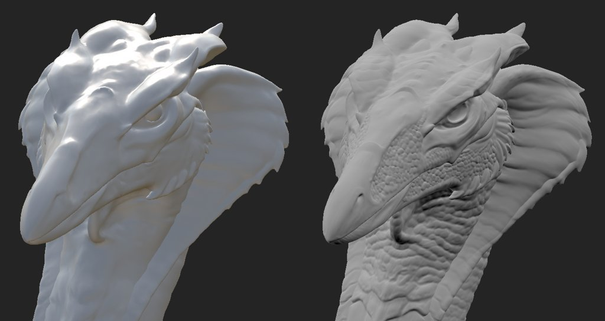

# Versione 8.3

**Substance 3D Painter 8.3** introduce una nuovissima modalità di cottura al forno, l&#39;importazione di file USD e il supporto per la dimensioni fisiche in modalità di Proiezione UV.

Data di pubblicazione: *10 gennaio 2023*

## Caratteristica principale

### Nuova modalità di cottura al forno

La vecchia finestra di cottura è stata sostituita da una modalità dedicata con diverse nuove funzioni, in particolare con la visualizzazione del viewport come la visualizzazione della gabbia e gli errori di abbinamento.

* **Accesso e passaggio da una modalità all&#39;altra**\
  Il baking è ora una modalità nuova e separata in aggiunta alle modalità di pittura e rendering già esistenti dell’applicazione. Per passare alla modalità cottura al forno, è sufficiente utilizzare l&#39;icona a forma di piccolo cornetto nella barra degli strumenti contestuale. Il passaggio da una modalità all’altra può essere eseguito in altro modo: utilizzando il menu della modalità o le scelte rapide da tastiera. Per tornare a un&#39;altra modalità, è sufficiente utilizzare l&#39;icona dedicata della modalità. Inoltre, è possibile utilizzare il pulsante **Mappe con intonaco** all&#39;interno delle [impostazioni del set di texture](../interface/texture-set/texture-set-settings.md) per passare alla nuova modalità.

  

  

* **Nuova interfaccia della modalità**\
  La tradizionale finestra di cottura è stata trasformata in una modalità con docks dedicati, in particolare:

  * È possibile utilizzare **l&#39;elenco di set di texture** per definire le parti del progetto da produrre.
  * **Mesh Map Bakers** consente di scegliere tra le impostazioni comuni di cottura al forno e quelle comuni. È inoltre possibile specificare quale processo di panificazione verrà avviato.
  * **Impostazioni mappa trama** è il punto in cui si trovano tutte le impostazioni comuni e di fornaio e può essere modificato, a seconda della selezione effettuata nelle due finestre precedenti.
  * **Registro cottura** raggruppa informazioni diverse sul processo di cottura, in particolare messaggi di errore.
  * **Visualizzazione cottura**: questo pannello si trova nella finestra della vista e controlla diverse opzioni relative alla visualizzazione delle trame poly bassa e alta.

  {width="500px"}

* **Avviare e annullare il processo di cottura direttamente dalla finestra della vista**\
  Il pulsante per avviare o annullare il processo di cottura al forno si trova ora nella parte inferiore della finestra della vista. Potete anche usare una piccola freccia per specificare la modalità di cottura in forno: in base alla selezione dell’elenco Set di texture o utilizzando l’insieme di texture attualmente attivo.

  

  

* **Visualizza trama ad alto poly nella finestra della vista**\
  Quando si specifica una trama ad alto poli nelle impostazioni di cottura al forno, questa viene caricata anche nella finestra della vista (a meno che l’impostazione di visualizzazione dedicata non sia disattivata). Ciò consente di verificare se la geometria della trama poly bassa e alta corrispondono correttamente.

  {width="400px"}

* **Visualizza mesh gabbia nella finestra della vista con aree mancanti come errore**\
  La trama della gabbia può essere visualizzata anche nella finestra della vista. Quando non si utilizza un file mesh dedicato, viene visualizzata una gabbia implicita che reagisce al parametro Distanza frontale massima. Quando si regola la dimensione della gabbia, qualsiasi parte della trama ad alto poli che si trova al di fuori della gabbia sarà mostrata come rossa per impostazione predefinita, consentendo di trovare facilmente parte della trama che sarà saltata dal processo di cottura.

  

* **Controllare la rete durante il caricamento e la cottura**\
  Caricando trame e baking non si blocca più l&#39;applicazione, il che significa che è possibile interagire con la finestra della vista durante tali operazioni. Questo può essere utile per analizzare la cottura in corso, identificare i problemi in anticipo e annullare la cottura, contribuendo a risparmiare tempo alla fine. Allo stesso modo, il set di texture più visibile nella finestra della vista verrà ora preparato per primo, per consentire di verificare in anticipo i risultati su aree specifiche.

  

* **Impostazioni neutre del materiale e del viewport**\
  Per mettere a fuoco i risultati della cottura al forno e cercare eventuali problemi, la modalità di cottura al forno non visualizza texture dipinte, ma utilizza un materiale neutro. Le impostazioni di questo materiale neutro possono essere regolate nel pannello di visualizzazione Baking all&#39;interno della finestra della vista.

  

* **Visualizzazione di bordi rigidi con cuciture UV mancanti**\
  Una fonte di artefatti durante la cottura è la presenza di bordi netti che non hanno cuciture UV. Questo può portare a linee visibili e interrompere lo smoothness di ombreggiatura. A questo scopo, sono state aggiunte delle impostazioni di visualizzazione per evidenziarle sia nella vista 3D che nella vista 2D, dato che possono essere ignorate con facilità.

  {width="450px"}

  {width="300px"}

* **Sincronizzare e annullare la sincronizzazione dei parametri**\
  La nuova azione di sincronizzazione consente di specificare quale parte delle impostazioni di cottura viene sincronizzata tra set di texture. In caso contrario, sarebbe noioso configurare le impostazioni più volte in modo identico. A volte è utile avere degli insiemi di texture con impostazioni dedicate e tenerli non sincronizzati. Ad esempio, mantenendo separate le impostazioni Comuni ora è possibile utilizzare una Distanza frontale massima, una Risoluzione e/o un elenco di trame ad alto poli che sarebbero diverse per Set di texture.

  {width="400px"}

  {width="400px"}

* **Corrispondenza per controllo nomi**\
  La scheda **Corrispondenza per nome** nel **Registro cottura** può aiutare a trovare gli errori nel processo di corrispondenza prima della cottura, rendendo più facile notare trame che non corrispondono. Le trame corrispondenti vengono raggruppate insieme, mentre le altre vengono isolate e visualizzate in rosso.

  {width="450px"}

>[!NOTE]
>
> In questa nuova modalità sono presenti molte altre nuove impostazioni. Per ulteriori informazioni, consulta la [pagina dedicata alla documentazione](../baking/baking.md).

### Nuova importazione ed esportazione di file USD

Questa nuova versione aggiunge il supporto del formato di file [Universal Scene Description (USD)](https://graphics.pixar.com/usd/release/intro.html). Ora è possibile avviare un progetto Painter, esportando trame e trame con il formato USD, per un flusso di lavoro più coerente tra le applicazioni.

* **Importa file USD con varianti, skin e in un frame specifico**\
  Un formato di file USD può essere utilizzato quando si crea un progetto o si reimporta una trama all’interno di un progetto. I file USD possono spesso essere scene complesse, pertanto un selettore ambito e variante è disponibile anche per importare solo un sottoinsieme del file.

  {width="400px"}

  {width="400px"}

* **Esporta USD come nuovo file o collegato all&#39;USD originale utilizzato nel progetto**\
  Quando la texture è pronta, potete utilizzare la finestra **File > Esporta texture** per esportare il file USD insieme ai file di texture. È sufficiente abilitare l&#39;impostazione **Esporta risorsa USD**. Questo genererà diversi file USD che possono essere facilmente integrati in una pipeline in seguito. Se avete utilizzato un file non USD o un file USD senza UV, oltre alle mappe di texture e al file di materiale USD verrà esportato un nuovo file di geometria USD.\
  È inoltre possibile utilizzare la trama **File > Esporta** per esportare la geometria del progetto come file USD.

  

  {width="400px"}

### Supporto migliorato della dimensioni fisiche in modalità UV

Il supporto dei materiali delle Substance con dimensioni fisiche incorporata è stato esteso alle proiezioni basate sui raggi UV.

* **Dimensioni fisiche in modalità UV**\
  Ora è possibile impostare il metodo Scala su Dimensioni fisiche invece di Divisione in porzioni nel livello di riempimento e gli effetti di riempimento utilizzando il metodo Proiezione UV. La dimensione dell&#39;UV viene calcolata automaticamente in base alla dimensione media dei triangoli dallo srotolamento UV.

  {width="400px"}

* **Passa automaticamente a dimensioni fisiche**&#x200B;È stata aggiunta una nuova impostazione di progetto per impostare automaticamente la scala su dimensioni fisiche durante la creazione di un materiale (ad esempio, durante il trascinamento di una risorsa per la finestra Risorsa). In questo modo è possibile usare il ridimensionamento uniforme in un progetto senza dover cambiare manualmente le impostazioni ogni volta che viene creato un nuovo livello di riempimento. Per abilitarla in un progetto esistente, vai a **Modifica > Configurazione progetto** e abilita **Dimensioni fisiche scala livelli di riempimento quando assegni i materiali**. Questa impostazione può essere attivata anche durante la creazione di un nuovo progetto.

  

## Informazioni sul supporto della piattaforma

Con questa versione è stata aumentata la versione minima supportata di Painter su Steam a Ubuntu 20.04.

## Tutorial

Per scoprire e scoprire il nuovo metodo di cottura al forno, seguite il nostro tutorial più recente:

## Note sulla versione

*(Rilasciato: 10 gennaio 2023)*\
Riepilogo: **Versione principale con nuova modalità di cottura, nuova importazione ed esportazione di file USD e supporto di dimensioni fisiche per Proiezione UV**

**Aggiunto:**

* [Modalità cottura] Nuova modalità di cottura dedicata al processo di cottura al forno
* [Modalità cottura] Imposta la scelta rapida per passare alla modalità di cottura su F8
* [Modalità cottura] Aggiungere i pulsanti Avvia e Annulla cottura nella finestra della vista
* [Modalità cottura] Aggiungete la selezione di cottura al forno nell&#39;elenco Set di texture
* [Modalità cottura] Aggiungere una nuova finestra Pannelli mappa trama per selezionare panettieri
* [Modalità cottura] Aggiungere una nuova finestra Impostazioni mappa trama per modificare le impostazioni di cottura
* [Modalità cottura] Aggiungere una nuova finestra Registro cottura per seguire il processo di cottura
* [Modalità cottura] Aggiungere parametri di cottura e annullare le azioni alla finestra della cronologia
* [Modalità cottura] Aggiungere breadcrumbs in Impostazioni mappa trama
* [Modalità cottura] Aggiungere miniature di mappe trama nella finestra Pannelli mappe trama
* [Modalità cottura] Aggiungere il menu comprimibile delle impostazioni di visualizzazione nella finestra della vista 3D
* [Modalità cottura] Aggiungi impostazione di visualizzazione per mostrare/nascondere la trama High-Poly
* [Modalità cottura] Aggiungi impostazione di visualizzazione per mostrare/nascondere la trama della gabbia e il wireframe
* [Modalità cottura] Aggiungi impostazione di visualizzazione per mostrare/nascondere la trama a basso poli
* [Modalità cottura] Aggiungi impostazione di visualizzazione per mostrare bordi netti senza giunture UV come errori
* [Modalità cottura] Informate nella finestra della vista sugli errori di mesh e di cottura se il registro di cottura non è visibile
* [Modalità cottura] Aggiungi azione per sincronizzare le impostazioni del fornaio tra tutti i set di texture

  Nella finestra Pannelli mappa trama, ogni panettiere (così come le impostazioni comuni) può essere sincronizzato tra set di texture facendo clic sull&#39;icona di collegamento accanto al nome. Questa azione consente di aprire una finestra che consente di selezionare quali set di texture condivideranno gli stessi parametri.
* [Modalità cottura] Aggiungere azioni per copiare e incollare le impostazioni del fornaio

  Nella finestra Pannelli mappa trama sono disponibili le azioni per copiare e superare le impostazioni di ogni panettiera tra i set di texture, tramite il menu dedicato nella parte superiore della finestra o il menu contestuale, accessibile facendo clic con il pulsante destro del mouse.
* [Modalità di cottura] Pulsante Aggiungi nel registro di cottura per passare da un errore alle impostazioni corrette

  Quando un fornaio non va a buon fine o una trama non viene caricata correttamente, nel Registro forni viene visualizzato un messaggio di errore. Un pulsante accanto al messaggio consente di modificare la finestra Impostazioni cassette e mappe trama per visualizzare le relative impostazioni. In questo modo è possibile isolare più facilmente la fonte di un problema per poterlo risolvere.
* [Modalità cottura] Aggiungete menu per gestire set di texture e selezioni di forni

  Nelle finestre &quot;Set di texture&quot; e &quot;Mesh Map Bakers&quot; è stato aggiunto un menu di azioni che permette di copiare e invertire le selezioni.
* [Modalità cottura] Dividi elenco di selezione forni per set di texture
* [Modalità cottura] Dividere le impostazioni comuni per set di texture
* [Modalità cottura] Carica maglie ad alto poligono e gabbia senza bloccare l&#39;interfaccia
* [Modalità cottura] Utilizzare la barra di avanzamento della finestra della vista per visualizzare il caricamento della trama
* [Modalità di cottura] Aggiungere lo stato di caricamento della trama nel registro di cottura
* [Modalità cottura] Consente di ruotare la trama nella finestra della vista durante la cottura
* [Modalità cottura] Imposta l&#39;ordine di cottura in base alla visibilità della finestra della trama corrente
* [Modalità cottura] Visualizza gabbia di cottura implicita nella finestra della vista

  Quando non si utilizza un file di mesh di gabbia personalizzato, viene generata e visualizzata una mesh di gabbia automatica nella finestra della vista. Le sue dimensioni saranno basate sul parametro Distanza frontale massima dalle impostazioni comuni di cottura al forno. La maglia della gabbia viene utilizzata per indicare la distanza di corrispondenza tra il poly basso e alto.
* [Modalità di cottura] Mostra elenco corrispondente di nomi di mesh per corrispondenza per nome nel registro di cottura
* [Modalità cottura] Usate materiale neutro per visualizzare il modello 3D nella finestra della vista
* [Modalità cottura] Disattiva il calcolo del motore in modalità cottura
* [Modalità cottura] Visualizza un avviso quando si esce dall’app mentre è in corso una cottura
* [Bakers] Aggiornamento delle etichette delle impostazioni di antialiasing

  I valori delle impostazioni di antialiasing sono stati rinominati &quot;Supersampling&quot; e con un numero moltiplicatore esplicito per chiarirne il comportamento.
* [Bakers] Aggiornate bakers alla versione 2.5.7.
* [USD] Importare ed esportare file Universal Scene Description (USD)
* [USD] Aggiungere le opzioni USD alla finestra Nuovo progetto quando si seleziona un file USD
* [USD] Aggiungi nuova finestra di selezione Ambito e Varianti

  Quando si importa un file USD, facendo clic sul pulsante Modifica nella finestra Nuovo progetto o Configurazione progetto è possibile selezionare la parte e le varianti di un file USD da importare.
* [USD] Opzione Aggiungi livelli di suddivisioni

  Quando create un nuovo progetto con un file di trama USD che contiene suddivisioni, è possibile selezionare il livello di suddivisioni utilizzando un cursore. Il progetto verrà creato con la trama suddivisa. Il livello può essere modificatore tramite Configurazione progetto.
* [USD] Importa mesh con skin USD in un fotogramma specifico

  Quando crei un nuovo progetto con un file di trama USD che contiene animazioni, è possibile selezionare il fotogramma utilizzando un cursore che riflette la sequenza temporale incorporata. Il fotogramma può essere modificatore tramite Configurazione progetto.
* [USD][Esporta] Aggiungi un’opzione per esportare i file USD

  Nuova casella di controllo Esporta USD aggiunta alla finestra Esporta texture. Quando è selezionato, consente di esportare file USD e mappe texture utilizzando qualsiasi modello.
* [USD][Esporta] Aggiungi il formato di file USD all’esportazione con trama
* [USD] Rinomina il predefinito di esportazione &quot;Rugosità metallo USD PBR&quot; esistente per renderlo più esplicito

  Il modello di esportazione USD precedentemente noto come &quot;Rugosità metallo USD PBR&quot; è ancora accessibile tramite Esporta texture > Modello di output > USDz (Apple AR).
* [Annullamento automatico] Aggiungi orientamento blocco per impacchettamento

  Nuova opzione per lo scorrimento automatico delle impostazioni che consente di mantenere l’orientamento delle Isole UV esistenti quando si utilizza la funzione di impacchettamento. È possibile accedervi da Nuovo progetto > Opzioni di annullamento automatico > Isola UV orientamento.
* [Dimensioni fisiche] Aggiungi impostazione per utilizzare automaticamente la Dimensioni fisiche nell’effetto/livello di riempimento

  È stata aggiunta una nuova opzione che consente di passare automaticamente alla scala dimensioni fisiche quando si utilizza un materiale con dimensioni fisiche incorporata. Può essere attivato per ogni progetto tramite Nuovo progetto o tramite Modifica > Configurazione progetto > Dimensioni fisiche > Converti il ridimensionamento del livello di riempimento in Dimensioni fisiche quando si assegnano i materiali.
* [Dimensioni fisiche] Esposizione dimensioni fisiche per Proiezione UV

  Il ridimensionamento delle dimensioni fisiche è ora disponibile per le Proiezioni UV: consente di ridimensionare automaticamente un materiale in base alla dimensioni fisiche di una trama. Può essere selezionata da Scala > Dimensioni fisiche nel livello di riempimento o nella finestra Proprietà effetti.
* [Scripting][Python] Consenti di eseguire query sulla versione dell’applicazione
* [Scripting][JavaScript] Aggiorna l’API in base ai nuovi parametri di baking
* [Scripting][Python] Modulo Baking: modificare i parametri di baking
* [Scripting][Python] Modulo Baking: avvia/annulla baking
* [Scripting][Python] Modulo Baking: selezionare il metodo di curvatura
* [Scripting][Python] Modulo Baking: selezione di panettieri/piastrelle uv
* [Scripting][Python] Modulo Baking: sincronizzare le impostazioni baker su tutti i set di texture
* [SVT] Abilitazione del supporto hardware di tipo sparse sulle GPU AMD

  L’accelerazione hardware per il sistema Sparse Virtual Textures può ora essere abilitata con le GPU AMD. Questa impostazione viene attivata automaticamente nelle preferenze generali.
* [Proiezione] Rinomina parametri proiezione cilindrica

  Il parametro &quot;Cylinder Culling&quot; è stato rinominato &quot;Backface Culling&quot; per rappresentarne meglio l’azione. La descrizione associata è stata modificata di conseguenza.
* [Project] Salva la versione dell&#39;applicazione nel progetto e recuperala tramite script

  A partire dalla versione 8.2, la versione dell’applicazione viene ora memorizzata nel file spp durante il salvataggio.\
  Questo numero di versione può essere recuperato con la funzione last\_saved\_substance\_painter\_version() nel modulo di progetto dell’API Python.\
  Per i progetti realizzati prima della versione 8.2, il valore restituito sarà null.
* [Import] Migliorare i tempi generali di importazione dei modelli 3D

  Abbiamo migliorato il tempo generale di importazione delle trame. Ad esempio, la riduzione del tempo di attesa durante il caricamento di trame ad alto poli per la cottura al forno. Questa ottimizzazione si applica in particolare al caricamento di file OBJ.

**Corretto:**

* [Arresto anomalo] Modifica dei canali su un filtro con uno stack specifico
* [Mac][M1] Arresto anomalo durante la creazione di un livello di riempimento e l&#39;uscita dal gruppo di livelli

  Questo problema può essere risolto eseguendo l’aggiornamento a Mac OS 13 (Ventura).
* [Scripting][Python] Arresto anomalo quando si utilizza ui.add\_dock\_widget() con tipo errato
* [Baking] Messaggio di errore incompleto nel registro quando un baking non riesce
* [Baking] La memoria non viene liberata al termine della cottura
* [Engine] La cache delle texture non si aggiorna quando si modifica la visibilità degli effetti
* [Esporta] 2DView esporta in modo casuale la mappa uniforme
* [Progetto] Errore di allocazione della memoria durante il salvataggio del progetto con trama grande
* [Riquadro di visualizzazione] In alcuni casi, l’accesso automatico al contenuto causa artefatti durante l’uso del colore

**Problemi noti:**

* [Gestione colore] Le conversioni dello spazio colore HDR con ACE su Linux producono colori bloccati
* [Serie di livelli] Origine di input non salvata per livello
* [Esporta] La vista 2D esporta una mappa casualmente uniforme
