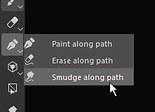
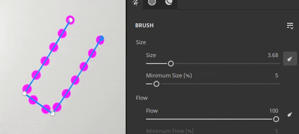

# Versione 9.0

<b>Substance 3D Painter 9.0</b> introduce un nuovo modo per colorare i tratti con un percorso rimodificabile nella finestra della vista 3D e con contenuti predefiniti aggiornati.

Data di pubblicazione: *20 giugno 2023*

## Funzioni principali

### Nuovo disegno lungo il tracciato nella finestra della vista 3D

Lo strumento <b>Disegna lungo il tracciato</b> è un nuovo modo per colorare i tratti nella finestra della vista 3D. Analogamente ad altre applicazioni, potete creare curve basate su Bezier guidate da punti sulla superficie dell’oggetto 3D per disegnare pattern. Combinato con materiali di Substance questo nuovo strumento può aprire un sacco di nuove possibilità.

* <b>Nuovo strumento per creare tratti pennello guidati da un tracciato con punti</b>\
  Nella barra degli strumenti dello strumento è presente una nuova icona dedicata allo strumento Tracciato. Questo nuovo strumento consente di disegnare curve sulla superficie del modello 3D per creare tratti pennello. Questi tratti possono sempre essere modificati nuovamente. Quando lo strumento è attivo, fate clic sulla superficie della trama per aggiungere un punto. Fai clic su un punto esistente e premi elimina per rimuoverlo.

  

  
* <b>Trascinare e spostare i punti sulla superficie della trama</b>\
  Per modificare la forma di un tracciato, è sufficiente fare clic e trascinare un punto per spostarlo lungo la superficie del modello 3D.

  
* <b>Chiudere il percorso per creare pattern senza interruzioni</b>\
  Il tracciato può anche essere chiuso per creare cicli, il che può essere utile sia per creare pattern ripetuti intorno ad aree specifiche, ad esempio.

  

  
* <b>Modificare nuovamente i tracciati (e le relative proprietà) con il pannello Tracciato</b>\
  Quando è selezionato lo strumento tracciato, il tracciato creato nel livello di disegno corrente viene elencato nel pannello Tracciato dedicato nella parte superiore della finestra della vista 3D. Questo pannello consente di selezionare, eliminare o rinominare il tracciato

  

  
* <b>Compatibile con altre caratteristiche di pittura come simmetria, maschera di geometria, tratti dinamici e così via</b>\
  Molte impostazioni dei tratti pennello normali possono essere utilizzate con lo strumento tracciato:

  * L&#39;attivazione della simmetria consente di disegnare un tracciato più volte, gestendone solo uno.
  * I tracciati che si trovano su un livello con una maschera di geometria abilitata possono colorare sotto la geometria nascosta

  
* <b>Dipingi con altri strumenti come Gomma o Sfumino</b>\
  Lo strumento tracciato è compatibile anche con lo strumento gomma e lo strumento sfumino, sbloccando modi più avanzati di colorare e combinare i tratti con il modo semplice e rimodificabile di manipolare i punti del tracciato.

  

* <b>Salvare e riutilizzare le proprietà del percorso con i predefiniti</b>\
  Quando usate lo strumento tracciato, potete anche salvare le proprietà del pennello come predefiniti. In questo modo è possibile salvare i predefiniti degli strumenti che passeranno automaticamente allo strumento Tracciato quando vengono selezionati dalla finestra Risorse.

>[!NOTE]
>
> Per ulteriori informazioni, consulta la [documentazione dedicata](../painting/tool-list/path.md).

### Nuovo contenuto da utilizzare con la funzione Pittura lungo tracciato

In questa versione sono stati inclusi alcuni nuovi strumenti predefiniti per sfruttare la nuova funzione dipingi lungo il tracciato:

* Sci-Fi rack di tubi
* Risucchio
* cucitura
* Topstiching
* Metallo per saldatura
* Nastro con cerniera

### Tratti dinamici migliorati per la funzione di disegno lungo il tracciato

Abbiamo colto l&#39;occasione del nuovo strumento tracciato per aggiungere nuove proprietà al sistema di traccia dinamico. Queste nuove proprietà sbloccano nuovi tipi di tratti che non erano possibili in precedenza, come la freccia sull&#39;immagine sopra la quale è presente un&#39;immagine iniziale e finale diversa.

* <b>Nuova proprietà Inizio/Centro/Fine</b>\
  È possibile definire una nuova proprietà da specificare nel grafico delle Substance se un timbro all’interno di un tratto è il primo, l’ultimo o qualsiasi timbro al centro. Questo consente di creare punti di inizio e fine, che possono essere molto utili ad esempio per creare cerniere. (<b>Nota</b>: lo stato finale è disponibile solo con lo strumento tracciato.)
* <b>Nuova proprietà Dimensioni e spaziatura</b>\
  La proprietà size and spacing consente di regolare l’output di un grafico a Substance in base allo stato corrente del timbro.
* <b>Nuove proprietà lunghezza tratto</b>\
  Avere la distanza lungo il tracciato e la distanza massima di un tracciato consente di controllare meglio quando alcuni effetti si ripetono, invece di fornire direttamente un valore normalizzato.\
  Consente di costruire sia un tratto in crescita, ad esempio, sia un tratto con un motivo ripetuto in base alla distanza tracciata (e non al numero totale di timbri disegnati).

>[!NOTE]
>
> Per ulteriori informazioni, consulta la [documentazione dedicata](../painting/dynamic-strokes/creating-custom-dynamic-strokes.md).

### Materiali predefiniti aggiornati

Con questa versione abbiamo deciso di fare un po’ di pulizia nella nostra libreria e quindi abbiamo cambiato i nostri materiali di base predefiniti per renderli più utili a tutti. Questi materiali sono stati creati dallo stesso team per la distribuzione di contenuti in [Substance 3D Assets](https://substance3d.adobe.com/assets).

>[!NOTE]
>
> Il contenuto rimosso è disponibile nelle [risorse della community di Substance 3D](https://substance3d.adobe.com/community-assets?q=painter23update&u=painter23update).

## Tutorial

Per scoprire e scoprire il nuovo strumento tracciato, guardate il nostro tutorial più recente:

## Note sulla versione

### 9.0.0

Data di pubblicazione: <b>2023/06/20</b>\
Riepilogo: <b>Versione principale con Pittura lungo il percorso che consente curve 3D, nuovi materiali di base e pulizia dei materiali legacy e nuovi predefiniti per curve 3D</b>

<b>Aggiunto:</b>

* [Tracciato] Strumento Aggiungi nuovo disegno lungo tracciato
* [Tracciato] Aggiungi una scelta rapida vuota per lo strumento tracciato
* [Path] Consente di aggiungere nuovi punti a un percorso esistente
* [Path] Aggiungi collegamento per uscire dalla creazione del percorso corrente
* [Tracciato] Consente di modificare le proprietà del pennello per i tracciati
* [Tracciato] Regolare automaticamente le tangenti durante il posizionamento di un punto
* [Path] Ricalcolare le tangenti quando si sposta un punto
* [Tracciato] Agganciare i punti appena creati alla superficie di una trama
* [Path] Consente di modificare la pressione per vertice
* [Path] Regola la pressione del punto appena creato dai punti vicini
* [Tracciato] Consenti di convertire i punti in punti morbidi/d&#39;angolo (interruzione tangente)
* [Path] Consente di spostare immediatamente un punto appena aggiunto
* [Path] Consente di rimuovere punti dal percorso esistente
* [Tracciato] Consente di invertire la direzione di un tracciato
* [Path] Consente di selezionare un percorso nella finestra della vista
* [Tracciato] Consente di selezionare punti di tracciato con selezione
* [Path] Introduci le scelte rapide da tastiera CTRL-A per selezionare tutti i punti di un tracciato
* [Path] Consenti di chiudere il percorso
* [Path] Consenti di specificare l&#39;asse del tracciato verso l&#39;alto in Proprietà
* [Path] Aggiungere un menu di controllo dei vertici alla barra degli strumenti contestuale
* [Tracciato] Introdurre le modalità di disegno/cancellazione/sfumino allo strumento tracciato
* [Path] Crea un feedback visivo per i tracciati nella finestra della vista
* [Path] Aggiungi un indicatore visivo per la direzione del tracciato
* [Path] Aggiungere un thickness di linee alle impostazioni di visualizzazione del percorso
* [Path] Consenti di nascondere l&#39;interfaccia utente dei percorsi
* [Tracciato] Aggiungi il pannello Tracciato per elencare i tracciati del livello attualmente selezionato
* [Tracciato] Aggiungi un feedback visivo quando si passa il cursore su un tracciato nel pannello Tracciato
* [Tracciato] Visualizza il pannello dei tracciati ogni volta che è selezionato lo strumento Tracciato
* [Tracciato] Consente di rinominare, eliminare, copiare, tagliare, duplicare il tracciato nel pannello Tracciato
* [Path] Visualizza un messaggio quando si tenta di interagire nella finestra della vista 2D con lo strumento Tracciato
* [Library] Integrazione di nuovi contenuti (strumenti e materiali di base di percorso)
* [Tratti dinamici] Aggiungi proprietà distanza per tratti dinamici
* [Tratti dinamici] Aggiungere dimensioni e proprietà di spaziatura ai tratti dinamici
* [Tratti dinamici] Aggiungi proprietà inizio/metà/fine per tratti dinamici
* [Python]&#x200B;[USD] Esporre i parametri di configurazione del progetto per il formato USD
* [Python]&#x200B;[USD] Esporre i parametri di creazione del progetto per il formato USD
* [Esporta]&#x200B;[USD] Aggiungi le informazioni sul percorso del progetto nel file USD esportato
* [GLTF] Aggiorna le texture nella libreria durante il ricaricamento di un file GLTF
* [Shader] Riduci gli artefatti di giuntura per Isole UV con orientamento diverso
* [Engine] Aggiornamento alla versione 9.0 del motore di Substance

<b>Corretto:</b>

* [Importa] Alcuni GLB con texture non ottengono texture in Painter
* [AMD] Artefatti sui bordi per tutti i riempimenti di proiezione 3D
* [Engine] Le texture si interrompono quando si attiva o disattiva la visibilità del livello
* [Engine] Le texture sono vuote in alcuni punti quando si cambia il metodo di fusione
* [Motore] In alcuni casi, Texture/Proiezione è la modalità di alterazione vuota
* [Iray] Iterazione reimpostata su 0 durante il salvataggio del rendering
* [Log] Messaggio di errore USD quando si esegue File > Nuovo

<b>Problemi noti:</b>

* [Gestione colore] Le conversioni dello spazio colore HDR con ACE su Linux producono colori bloccati
* [Serie di livelli] Origine di input non salvata per livello
