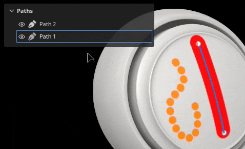
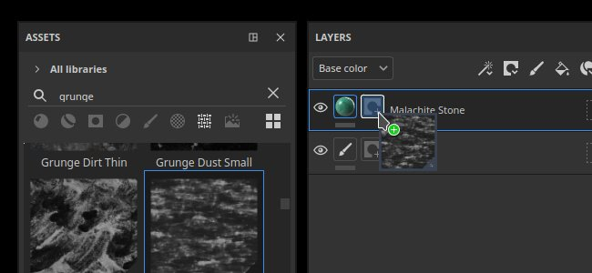

# Versione 9.1

<b>Substance 3D Painter 9.1</b> aggiunge il controllo della tangente per lo strumento tracciato, il supporto del formato di file SVG, la possibilità di importare e applicare risorse mediante trascinamento e il supporto della trasparenza nella finestra della vista.

Data di pubblicazione: *7 novembre 2023*

## Funzioni principali

### Nuovi controlli e miglioramenti per la tangente dello strumento tracciato

In questa nuova versione continuiamo lo sviluppo dello strumento Tracciato (introdotto nella versione 9.0) per aggiungere i bit mancanti e le funzioni richieste dalla community.

* <b>Controllare manualmente i punti del tracciato tangenti</b>

  Ora è possibile impostare manualmente le tangenti di un punto specifico su un tracciato. Questo consente di ignorare il comportamento automatico per creare nuove forme.

  
* <b>Modificare i punti del tracciato tramite i manipolatori</b>

  A volte, i soli punti di scorrimento sulla superficie dell’oggetto non sono sufficienti. I manipolatori consentono di spostare i punti oltre la superficie. Questo può essere molto utile per spostare più punti contemporaneamente, ad esempio nel caso in cui fossero troppo lontani da una superficie dopo una reimportazione di trama.

  
* <b>Attiva/disattiva la visibilità dei percorsi singolarmente</b>

  La visibilità dei tracciati può ora essere modificata per ciascun tracciato tramite il pannello della finestra della vista dedicato. Se si disabilita un tracciato, i suoi contributi verranno rimossi dalle texture finali senza doverlo eliminare.

  
* <b>Copiare e incollare posizioni e proprietà del percorso</b>

  Il copia e incolla dei tracciati è stato esteso in modo da poter copiare solo le posizioni dei punti di tracciato o le relative proprietà. Ora è possibile sincronizzare i tracciati in modi diversi, semplificando la creazione di effetti complessi (tramite le posizioni) o la condivisione di un aspetto specifico tra posizioni diverse (tramite le proprietà).

  

  

>[!NOTE]
>
> Per ulteriori informazioni sullo strumento Tracciato, [consulta la documentazione dedicata](../painting/tool-list/path.md).

### Nuovo supporto per la trasparenza e l&#39;assorbimento nella finestra della vista

Lo shader <b>Adobe Standard Material</b> (ASM), che è l&#39;impostazione predefinita durante la creazione di un nuovo progetto, è stato aggiornato per supportare le proprietà <b>Translucency</b>, <b>Transparency</b> e <b>Assorbimento</b>. Ciò significa che ora è possibile visualizzare il risultato di tali comportamenti di rendering nella finestra della vista in tempo reale (nonché all’interno del modulo di rendering Iray).

È ora possibile realizzare materiali di authoring come <b>vetro</b>, <b>fogliame</b> o <b>plastica</b> con un assorbimento di luce sottile, che può essere visualizzato direttamente nella finestra della vista. Anche l&#39;esportazione in altre applicazioni Substance 3D consente di ottenere un aspetto corrispondente grazie alla definizione ASM.

* <b>Nuove impostazioni dello shader ASM</b>

  Lo shader ASM è stato aggiornato per supportare nuove funzionalità che possono essere modificate tramite la finestra [Impostazioni shader](../interface/shader-settings/shader-settings.md):

  * <b>Trasparenza</b> (opacità): non è più necessario passare a un altro shader per ottenere superfici trasparenti, come il fogliame? Abilitate invece il parametro <b>alpha test</b> o <b>alpha blending</b> nel gruppo <b>Geometria > Opacità</b>. Sono disponibili anche le impostazioni standard, come il dithering.
  * <b>Traslucidità</b>: questa nuova proprietà consente di creare superfici come vetro, rendendo le forme trasparenti mantenendo i riflessi degli specular. Per utilizzarlo, aggiungi un canale di trasparenza nel progetto e abilita il parametro <b>Traslucenza</b> nel gruppo <b>Interior</b>.
  * <b>Assorbimento</b>: questa nuova proprietà consente di simulare la luce che passa attraverso un oggetto e che viene assorbita, il che può essere utile per simulare la plastica o i liquidi in modo migliore rispetto all&#39;utilizzo della dispersione sotto la superficie. Per utilizzarla, abilitare l&#39;impostazione <b>Assorbimento</b> nel gruppo <b>Interni</b>.
* <b>Interfaccia utente e descrizioni comandi migliorate per le impostazioni dello shader</b>

  Con la rielaborazione dello shader abbiamo colto l&#39;occasione per migliorare l&#39;interfaccia utente dei parametri, oltre ad aggiungere molte nuove descrizioni per scoprire più facilmente come attivarli.

  L’ordine dei parametri dovrebbe inoltre corrispondere meglio ad altri software Substance 3D, rendendo più facile eseguire operazioni avanti e indietro quando si provano le impostazioni.

  
* <b>Nuovo progetto di esempio per la dimostrazione del materiale standard Adobe</b>

  Inizialmente può essere difficile manipolare le nuove proprietà ASM, quindi è stato aggiunto un nuovo progetto di esempio che illustra diverse funzionalità dello shader per semplificarne l&#39;apprendimento.

  Questo progetto si chiama <b>French Restaurant Table</b> e si trova tramite il menu <b>File > Apri campione</b>. Utilizza anche molti piccoli trucchi, quindi può essere una grande risorsa di apprendimento per scoprire nuovi modi di strutturare.

  
* <b>Per impostazione predefinita, il canale di trasparenza è ora di colore nero</b>

  Per semplificare l&#39;utilizzo delle nuove proprietà dello shader ed evitare risultati imprevisti nella finestra della vista, il colore predefinito del canale Traslucidità è stato cambiato in nero (anziché in bianco).

  Se questo canale era già in uso nel progetto, puoi ottenere il comportamento precedente semplicemente aggiungendo un livello di riempimento nella parte inferiore della pila di livelli e impostando il valore del canale su bianco. È possibile abilitare l&#39;impostazione <b>Utilizza la trasparenza come maschera di dispersione</b> nel parametro shader per riapplicare il contributo del canale al risultato della dispersione sotto la superficie.

### Nuovo supporto per file di grafica vettoriale (SVG)

Questa versione aggiunge il supporto dei file SVG come risorse utilizzabili nei livelli, negli strumenti di disegno e così via.

I file SVG sono abbastanza utili per rappresentare con precisione loghi o forme, pur essendo molto leggeri. In Painter possono essere sottoposti a rendering alla risoluzione desiderata e facilmente aggiornati, rendendoli perfetti per il flusso di lavoro non distruttivo.

* <b>Importare file SVG</b>\
  I file SVG possono essere importati come qualsiasi altra risorsa, in progetti, librerie e così via. È possibile importare il SVG <b>fino alla versione 1.1</b>. Le funzionalità delle versioni più recenti non sono supportate.

  Anche in questa versione l’importazione è stata facilitata (vedi di seguito), in modo che i file SVG possano essere utilizzati semplicemente trascinando e rilasciando le risorse dall’esterno di Painter direttamente nella trama o nel gruppo di livelli.
* <b>Impostazioni SVG dedicate</b>\
  Quando si utilizza una risorsa SVG, sono disponibili alcune impostazioni per controllarne l’aspetto:

  * <b>Risoluzione</b>: per utilizzare un valore automatico, uno definito nel file o uno personalizzato.
  * <b>Area di ritaglio</b>: per definire l&#39;area specifica dell&#39;area di lavoro SVG da utilizzare.
  * <b>Ambito</b>: per selezionare l&#39;intero contenuto di SVG o solo alcuni elementi.

  
* <b>Nuovi materiali su misura per SVG</b>

  Sono state aggiunte 3 nuove risorse per facilitare l’utilizzo dei file SVG durante la creazione delle texture:

  * <b>Vernice spray personalizzata</b>: consente di simulare una decalcomania dipinta su una parete da una singola immagine di input.
  * <b>Adesivo personalizzato</b>: per creare un adesivo in plastica su una superficie. È dotato di diverse impostazioni per simulare danni e piegature.
  * <b>Da grafica a materiale</b>: consente di creare diverse proprietà del materiale da un singolo input di immagine. Questa risorsa viene inserita automaticamente quando si trascina un file SVG nella finestra della vista. Questa risorsa offre un modo semplice per condividere la trasparenza del suo input su più canali, rendendolo perfetto per decalcomanie semplici.

  

  

>[!NOTE]
>
> Per ulteriori informazioni sul formato e sulle impostazioni di SVG, [consultare la documentazione dedicata](../painting/vector-graphic-svg.md).

### Nuova importazione di risorse tramite trascinamento della selezione

Questa versione consente di trascinare un file esterno in contesti diversi dell&#39;applicazione per importare automaticamente una risorsa e utilizzarla. Questo nuovo processo consente di saltare i passaggi noiosi relativi all’importazione dei file.

* <b>Importa mediante trascinamento nella finestra della vista</b>

  Trascinate un file esterno nella finestra della vista per poterlo inserire direttamente sulla trama. Questa azione creerà automaticamente un nuovo livello. A seconda della natura della risorsa (immagine, materiale Substance, filtro Substance, ecc.) il risultato sarà adattato di conseguenza.
* <b>Importa mediante trascinamento nella pila di livelli</b>\
  Allo stesso modo è possibile rilasciare file di risorse esterne nella finestra della vista, rilasciando i file nella pila di livelli è possibile creare direttamente livelli o effetti con la risorsa in essa contenuta.
* <b>Importare tramite trascinamento in uno slot delle risorse</b>

  È anche possibile importare una risorsa direttamente in un livello o in uno strumento. Se esiste già un livello di riempimento o un effetto con la giusta impostazione, è sufficiente trascinare un file esterno in uno degli slot del canale della finestra Proprietà per importarlo e applicarlo.

>[!NOTE]
>
> Per ulteriori informazioni sull&#39;importazione delle risorse, [vedere la documentazione dedicata](../content/importing-assets/import-drag-and-drop.md).

### Comportamenti di trascinamento delle nuove risorse

I miglioramenti del trascinamento non si limitano all’importazione delle risorse. È ora possibile utilizzare il trascinamento di una risorsa dalla finestra Risorse per creare al volo nuovi livelli, effetti e persino maschere.

* <b>Trascina molti tipi di risorse</b>

  Ora è possibile trascinare i tipi di risorse direttamente nella finestra della vista o nel gruppo di livelli. Il seguente tipo di risorse può ora essere trascinato e rilasciato (quasi) ovunque:

  * Alfa
  * Texture
  * Procedurali
  * Materiali
  * Materiali avanzati
  * Maschere intelligenti
  * Generatori
  * Filtri
  * Mappe dell&#39;ambiente
* <b>Rilascia le risorse come nuovo livello o effetto</b>

  Scegliendo il punto in cui viene rilasciata una risorsa, Painter creerà automaticamente un nuovo livello o un nuovo effetto:

  
* <b>Scegli tra la serie di effetti Contenuto o Maschera durante il trascinamento\
  </b>

  Quando si trascina una risorsa su una miniatura, Painter passa automaticamente alle pile di effetti associate. Dopodiché diventa molto facile semplicemente rilasciare la risorsa in una posizione precisa all&#39;interno di quella pila. In questo modo si evita di dover passare prima allo stack corretto.

  
* <b>Crea una nuova maschera nera al volo</b>

  Quando si trascina una risorsa, su qualsiasi livello privo di maschera viene visualizzata una nuova icona. Quando una risorsa viene rilasciata su questa maschera fantasma, verrà creata automaticamente una nuova maschera e verrà aggiunta la nuova risorsa. È un modo rapido per impostare una nuova maschera ed evitare di annullare il trascinamento e aggiungerla manualmente.

  
* <b>Rilasciare nella finestra della vista per creare nuovi livelli</b>

  Nella finestra della vista è possibile anche trascinare e rilasciare le risorse per creare nuovi livelli. A seconda del tipo di risorsa, il risultato potrebbe cambiare. Un filtro crea un livello di disegno in modalità passthrough, mentre una maschera avanzata crea un livello di riempimento con una nuova maschera.

  

  
* <b>Usare i modificatori della tastiera per i comportamenti avanzati</b>

  Quando si rilascia una risorsa, mantenendo il modificatore della tastiera CTRL o ALT è possibile abilitare comportamenti aggiuntivi:

  * <b>CTRL</b> durante l&#39;inserimento nello <b>stack di livelli</b>: crea un nuovo livello con la risorsa in una maschera nera. Può essere utile ad esempio per forzare l&#39;inserimento di un materiale in una maschera. Oppure per saltare il menu a discesa con un canale alfa.
  * <b>ALT</b> durante l&#39;eliminazione nello <b>stack di livelli</b>: si applica solo quando si trascina su una miniatura di livello. ALT rimuoverà tutti gli effetti precedenti. Questo può essere utilizzato come metodo rapido per provare diverse risorse, in particolare le maschere intelligenti, senza doverle prima rimuovere manualmente.
  * <b>CTRL</b> durante l&#39;inserimento nella <b>finestra della vista</b>: crea un nuovo livello con la risorsa in una maschera nera. La risorsa verrà inserita in un effetto <b>Selezione ID colore</b> che verrà impostato in base alla selezione effettuata nella finestra della vista.
  * <b>ALT</b> durante l&#39;eliminazione nella <b>finestra della vista</b>: come prima, forzerà una risorsa a essere in modalità di proiezione decalcomania.

### Miglioramenti vari

In questa versione sono state aggiunte anche diverse funzioni minori e miglioramenti.

* <b>Compressione senza perdita di immagini a 16 bit</b>

  D&#39;ora in poi, qualsiasi immagine contenuta in un progetto con una profondità di bit di 16 verrà compressa con un algoritmo senza perdita di qualità, che consente di ridurne le dimensioni. Questo si aggiunge al file di progetto che comprime già i propri dati.

  Questa modifica riguarda principalmente <b>texture bake</b>, che in genere sono il motivo per cui i file di progetto possono essere molto pesanti sul disco. In media, abbiamo visto progetti di dimensioni <b>ridotte del 30% al 50% sul disco</b>.

  Questa compressione viene applicata automaticamente quando si salva un progetto (vecchio o nuovo) in risorse non già compresse. Ciò significa che per i vecchi progetti, il salvataggio per la prima volta in questa nuova versione potrebbe richiedere un po’ più di tempo del solito. Una volta completata questa operazione, il risparmio di tempo dovrebbe tornare alla normalità.
* <b>Nuovo set UV in modalità di proiezione riempimento con impostazione UV</b>

  È stata aggiunta una nuova modalità di proiezione per livelli/effetti di riempimento denominata <b>UV impostato su proiezione UV impostata</b>. Può essere utilizzata per proiettare una texture basata su diversi UV disponibili sulla trama all’interno del progetto. Può essere utilizzato per trasferire texture in modo più avanzato, senza dover ricorrere a strumenti esterni.

  <b>Il set UV 0</b> è l&#39;UV predefinito utilizzato per la pittura di Painter. Se sono disponibili altri set UV, questi saranno disponibili nel menu a discesa dall&#39;impostazione <b>Origine</b>:

  
* <b>Anti-alias temporale è abilitato per impostazione predefinita su qualsiasi nuovo progetto</b>

  Durante la creazione di un nuovo progetto, l&#39;impostazione <b>Anti-alias temporale</b> disponibile nella finestra Impostazioni di visualizzazione è ora attivata per impostazione predefinita al fine di migliorare la qualità del rendering nella finestra della vista.
* <b>Nuovi miglioramenti per l’API Python</b>

  L’API Python ha ricevuto alcune aggiunte in questa versione:

  * Painter può essere chiuso/arrestato tramite Python con la nuova funzione <b>substance\_painter.application.close() </b>.
  * La videocamera della finestra della vista principale può ora essere modificata tramite l’API. Questo include la sua posizione, rotazione, ma anche le sue altre proprietà come Campo di vista, apertura, ecc. Per facilitare il posizionamento della fotocamera in relazione alla trama, l’API ora espone anche il rettangolo di selezione della scena.
  * L’esportazione della trama del progetto, con o senza triangolazione e spostamento o meno, è ora possibile tramite il modulo Esporta.
  * Il percorso delle texture di esportazione del progetto ora può essere recuperato anche dall’API.
* <b>Nuovo invio ad After Effects (beta)</b>

  È disponibile una nuova azione Invia a per esportare una trama e la relativa texture in After Effects, rendendo più facile l’iterazione degli effetti visivi. Questa funzione richiede almeno l’accesso ad After Effects versione 24.1 beta.

## Tutorial

## Note sulla versione

### 9.1.0

(Rilasciato il 7 novembre 2023)\
Riepilogo: <b>Versione principale che introduce il supporto per SVG e trasparenza, oltre a miglioramenti dello strumento di trascinamento della selezione</b>

<b>Aggiunto:</b>

* [SVG] Consenti l’importazione di file vettoriali (SVG)
* [SVG]&#x200B;[UI] Aggiungi il supporto per le proprietà specifiche dei SVG
* [SVG] Aggiungete un’opzione per mantenere facilmente le proporzioni originali dell’immagine
* [SVG] Consenti l&#39;utilizzo automatico del canale alfa di SVG con trasparenza
* [Interoperabilità] Consente di inviare una trama con texture ad After Effects (Ae 24.1 beta)
* [Interoperabilità] Aggiungere impostazioni per Invia a After Effects
* [QoL]&#x200B;[Assets]&#x200B;[UI] Importa automaticamente risorsa durante il trascinamento nello slot dell&#39;interfaccia utente
* [QoL] Consente di trascinare e rilasciare risorse esterne nella pila di livelli
* [QoL]&#x200B;[Serie di livelli] Trascina le texture dal pannello Risorse alla serie di livelli
* [QoL]&#x200B;[Viewport] Consente di trascinare e rilasciare il generatore, filtri sulla trama
* [QoL]&#x200B;[Finestra vista] Consente di rilasciare risorse esterne sulla trama
* [QoL]&#x200B;[Proiezione] Aggiungi un nuovo set UV alla modalità di proiezione del set UV
* [QoL] Trascinate le maschere avanzate come nuovi livelli nella finestra della vista e nella pila di livelli
* [QoL] Aggiungi selettore per i generatori con più output quando utilizzati nella maschera
* [QoL] Consente di trascinare e rilasciare immagini a canale singolo su un effetto di riempimento
* [QoL]&#x200B;[Serie di livelli] Utilizzate i modificatori CTRL/ALT con il trascinamento per specificare dove/come creare effetti/livello
* [Tracciato] Attiva/disattiva la visibilità dei tracciati singolarmente nel pannello Tracciato
* [Tracciato] Consenti l&#39;utilizzo di manipolatori di trasformazione per i punti di tracciato
* [Path] Consente di controllare manualmente le tangenti per vertice
* [Path] Copiare/incollare le proprietà del percorso
* [Tracciato] Introduci una scelta rapida vuota per il pulsante Tangente di interruzione
* [Shader] Aggiungere il supporto per Opacità e Traslucenza nello shader ASM
* [Shader] Aggiungere il supporto per il canale di Colore di assorbimento con lo shader ASM
* [Shader] Suggerimenti per migliorare i parametri dello shader ASM
* [Shader] Imposta il colore predefinito del canale di trasparenza su nero
* [Impostazioni schermo] Abilita Anti-alias temporale per impostazione predefinita
* [Impostazioni schermo] Abilita impostazione di dispersione sotto la superficie per impostazione predefinita
* [Substance] Aggiungi il supporto per la proprietà ColorSpace dall’input/output del grafico
* [Substance] Aggiorna il motore di Substance alla versione 9.0.3
* [UI] Rendi accessibile il pulsante contestuale della barra degli strumenti anche se la finestra dell&#39;app è piccola
* [Annullamento automatico] Controlla il numero di porzioni UV con densità texel
* [Baking] Disattiva Raytracing GPU su GPU AMD per impostazione predefinita
* [Prestazioni] Applicate la compressione senza perdita di dati alle immagini a 16 bit per ridurre l’ingombro del progetto
* [Python] Consenti di manipolare la videocamera predefinita nella vista 3D
* [Python] Esporta la possibilità di esportare trama tramite scripting
* [Content]&#x200B;[Samples] Aggiungi un nuovo progetto di esempio &quot;French Restaurant Table&quot;
* [Content] Aggiorna Substance logo alpha alla nuova versione
* [Contenuto] Aggiungi tre filtri di materiale focalizzati sui SVG (Adesivo personalizzato, Spruzzo personalizzato e Grafica su materiale)

<b>Corretto:</b>

* [Arresto anomalo] Modifica delle dimensioni del manipolatore quando non si utilizza lo strumento di simmetria
* [Arresto anomalo] [Serie di livelli] Creazione di un livello quando non è selezionato nulla
* [Progetto] Le mappe trama possono essere danneggiate dopo la rimozione di risorse inutilizzate
* [Progetto] Danneggiamento delle risorse dopo la reimportazione o la rigenerazione dell&#39;immagine
* [Risorse] Quando si ricarica una risorsa, questa viene rimossa dai Preferiti
* [Importa] Impossibile importare risorse quando nel pannello delle risorse è presente l’indicazione &quot;Nessun risultato trovato&quot;
* [UI] In alcuni casi la freccia contestuale della barra degli strumenti non viene visualizzata
* [Substance] Il pulsante affiancato per i valori booleani non è supportato
* [Level] Etichetta del canale errata quando utilizzata nella maschera
* [Export]&#x200B;[glTF] i file glTF/GLB esportati da Painter non dispongono di un&#39;unità di dimensioni fisiche
* [Content] L’intensità del filtro Sfocatura è bloccata su 16
* [Content] L&#39;input dell&#39;immagine &quot;colore di destinazione&quot; del filtro Corrispondenza colori non è visibile

<b>Problemi noti:</b>

* [Gestione colore] Le conversioni dello spazio colore HDR con ACE su Linux producono colori bloccati
* [Crash]&#x200B;[Linux] con Linux Wayland su AMD quando si trascina e si rilascia una risorsa nello stack di livelli
* [Arresto anomalo]&#x200B;[Mac] Modifica del valore di filtro anisotropo nel sistema operativo Monterey
* [Arresto anomalo] Esr utilizzato come input dell’immagine
* [Arresto anomalo] Utilizzo di una mappa dell&#39;ambiente a 16 K
* [Annullamento automatico] Problema di interfaccia utente per il controllo della densità del testo
* [Regressione]&#x200B;[UI] Il menu di scelta rapida è troppo piccolo sullo schermo hd
* [Python] Arresto anomalo durante l’esportazione di USD attivato da TextureStateEvent
* [QoL] Se si trascina una risorsa Alpha in modalità decalcomania, viene creata una Proiezione UV nella maschera
