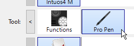
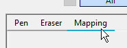
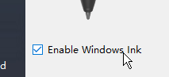

# Configurazione di penne e tablet

In questa pagina sono elencati più consigli per configurare una penna grafica su Windows per migliorarne la compatibilità con l&#39;applicazione.

## Che cos&#39;è Windows Ink?

Windows Ink è un software/servizio che gestisce Penne, ad esempio stilo o penne, da tablet grafici. Offre varie applicazioni come Sticky Notes e Sketchpad per interagire con una penna sul computer.

A partire dalla versione 2019.3, l’applicazione si basa su di essa per gestire le tavolette grafiche. Prima di questa versione era invece utilizzato Wintab (servizio precedente non supportato da tutti i modelli di tablet grafici).

## Attivazione di Windows Ink nelle impostazioni dei driver del Tablet PC

Per assicurarsi che la pressione della penna sia riconosciuta correttamente, è necessario attivare Windows Ink nelle impostazioni del driver della tavoletta grafica.

>[!NOTE]
>
> Windows Ink non è supportato sulle macchine virtuali, pertanto gli eventi della tavoletta grafica non verranno inoltrati all&#39;applicazione. La pressione della penna non è pertanto supportata in questa configurazione.

### Abilitazione di Windows Ink per le tavolette Wacom

1. Apri il menu **Inizio**.
1. Digitare **Proprietà tavoletta Wacom** e fare clic sul primo risultato della ricerca.
1. Nella finestra **Proprietà tavoletta Wacom**, fare clic sulla **Penna** nell&#39;elenco degli strumenti.\
   
1. Fai clic sul pulsante più **&quot;+&quot;** per aggiungere un profilo di applicazione.\
   
1. Fai clic sul pulsante **Sfoglia** nella nuova finestra per individuare l&#39;eseguibile di Substance 3D Painter.\
   
1. Fare clic su **OK** per convalidare e creare il profilo.\
   
1. Fare clic sulla scheda **Mappatura**.\
   
1. Nella parte inferiore sinistra della finestra, assicurati che **Usa Windows Ink** sia abilitato.\
   

>[!NOTE]
>
> Dopo aver attivato Windows Ink, riavviate l’applicazione per verificare che le modifiche siano correttamente prese in considerazione.

### Abilitazione di Windows Ink per tablet Huion

1. Apri il menu **Inizio**.
1. Digita **Huion Tablet** e fai clic sul primo risultato della ricerca.
1. Nella finestra **Huion Tablet**, fare clic su **Digital Pen**.\
   
1. Nella parte inferiore sinistra della finestra, assicurati che **Abilita Windows Ink** sia abilitato.\
   

## Come accedere alle impostazioni di Windows Ink

È possibile accedere alle impostazioni di Windows Ink dalle impostazioni generali di Windows:

1. Apri il menu **Inizio**.
1. Fare clic sull&#39;icona **Impostazioni**.\
   
1. Nella finestra Impostazioni, fare clic su **Dispositivi** .\
   
1. Nella finestra **Dispositivi**, fare clic su **Penna e Windows Ink** (disponibile solo se è collegata una tavoletta grafica).\
   

## Impostazioni consigliate di Windows Ink

Di seguito sono riportate le impostazioni di Windows Ink e la configurazione consigliata per ciascuna di esse.

>[!NOTE]
>
> Anche dopo aver seguito questa guida, alcuni elementi visivi relativi a Windows Ink saranno ancora visibili. Purtroppo Microsoft non offre le impostazioni per disattivarle in Windows.
> 
> Gli elementi visivi rimanenti sono:
> 
> * **Cerchio** quando si fa clic con il pulsante destro del mouse.
> * **Descrizione comando** sotto il mouse quando si preme un modificatore di tasto (Ctrl, Alt o Maiusc).

### Impostazioni penna

| ***Impostazione*** | ***Descrizione*** |
| --- | --- |
| **Scegliere la mano con cui scrivere** | Consigliati: **Mano destra** Queste impostazioni controllano il modo in cui viene riconosciuto l&#39;orientamento della penna. Se si imposta questa impostazione su Mano sinistra, l’interfaccia utente potrebbe bloccarsi durante l’elaborazione dei parametri. |
| **Mostra effetti visivi** | Consigliato: **Disabilitato** Questa impostazione controlla gli effetti visivi visualizzati durante varie interazioni con la penna. Disattivandolo, si può nascondere l’effetto cerchio increspato quando si fa clic: 

 |
| **Mostra cursori** | Consigliato: **Disabilitato** |
| **Consenti l&#39;utilizzo della penna come mouse in alcune app desktop** | Consigliato: **Abilitato** Queste impostazioni consentono alla penna grafica di inviare input regolari del mouse. Se è disabilitata, questa impostazione può causare problemi di interazione con i parametri dell&#39;interfaccia utente. |

### Impostazioni grafia

| ***Impostazione*** | ***Descrizione*** |
| --- | --- |
| **Dimensioni del carattere durante la scrittura direttamente nel campo di testo** | Consigliato: **Medio (predefinito)** |
| **Carattere durante l&#39;utilizzo della grafia** | Consigliato: **Segoe UI (impostazione predefinita)** |
| **Quando si tocca un campo di testo con la penna, utilizzare la grafia per immettere il testo** | Consigliati: **Solo in modalità tablet** Queste impostazioni controllano la modalità e la data di visualizzazione della finestra di immissione del testo scritto a mano. Se non impostata su &quot;solo in modalità tablet&quot;, la finestra verrà visualizzata ogni volta che viene selezionato un campo di testo nell&#39;interfaccia utente. Ad esempio quando si digita un valore specifico in un cursore. |
| **Consenti l&#39;utilizzo della penna come mouse in alcune app desktop** | Consigliato: **Abilitato** Queste impostazioni consentono alla penna grafica di inviare input regolari del mouse. Se è disabilitata, questa impostazione può causare problemi di interazione con i parametri dell&#39;interfaccia utente. |
| **Scrivi nel pannello della grafia con il dito** | Consigliato: **Disabilitato** |

### Impostazioni scelte rapide penna

| ***Impostazione*** | ***Descrizione*** |
| --- | --- |
| **Fai clic una volta** | Consigliato: **Niente** |
| **Doppio clic** | Consigliato: **Niente** |
| **Tenere premuto (supportato solo su alcune penne)** | Consigliato: **Niente** |
| **Consenti alle app di ignorare il comportamento del pulsante di scelta rapida** | Consigliato: **Abilitato** |
| **Se disponibile, mostra l&#39;area di lavoro inchiostri dopo la rimozione della penna dall&#39;archivio** | Consigliato: **Disabilitato** |

## Come accedere alle impostazioni Penna e Tocco

È possibile accedere alle impostazioni Penna e Tocco nel Pannello di controllo:

1. Apri il menu **Inizio**.
1. Digitare **Pannello di controllo** e fare clic sul primo risultato della ricerca.
1. Passare dalla **modalità di visualizzazione** del Pannello di controllo alla **icona piccola**.\
   
1. Fare clic sulle impostazioni **Penna e tocco**.\
   

## Impostazioni consigliate per penna e tocco

Per migliorare il comportamento di colorazione e la manipolazione della fotocamera, si consigliano le impostazioni seguenti.

Per accedere alle impostazioni, fare clic su una delle **azioni della penna** nella finestra, quindi fare clic sul pulsante **impostazioni**.

| ***Impostazione*** | ***Descrizione*** |
| --- | --- |
| **Tocco singolo** | Nessun parametro. |
| **Doppio tocco** | Consigliati: **Valori predefiniti.** |
| **Tenere premuto** | Consigliato: **Disattivare l&#39;impostazione &quot;Abilita pressione prolungata per clic con il pulsante destro del mouse&quot;** Se si disabilita questa impostazione, sarà possibile trascinare qualsiasi elemento normalmente senza attivare il cerchio di trascinamento di Windows: 

 |
| **Utilizzare il pulsante della penna come equivalente del clic con il pulsante destro del mouse** | Consigliato: **Abilitato** |
| **Utilizzare la parte superiore della penna per cancellare l&#39;input penna (se disponibile)** | Consigliato: **Abilitato** |
