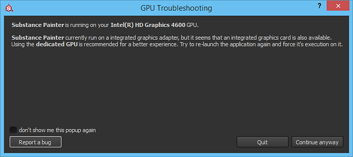

# Esecuzione su GPU integrata

{width="500px"}

Può accadere che alcuni computer siano configurati per impostazione predefinita per l&#39;esecuzione su un chipset integrato anziché su una GPU dedicata.\
Poiché le prestazioni sul chipset integrato sono molto basse, si consiglia di utilizzare una GPU dedicata. Viene visualizzata una finestra a comparsa in cui viene visualizzato un avviso.

Con una GPU NVIDIA, il passaggio alla GPU NVIDIA dipende dai profili dell’applicazione. Se un’applicazione non dispone di tale profilo, potete assegnare manualmente la scheda grafica:

1. Fai clic con il pulsante destro del mouse sul desktop e seleziona Pannello di controllo NVIDIA **o** Accedi al pannello di controllo e cerca il pannello di controllo NVIDIA
1. In **Impostazioni 3D** , accedi a **Gestisci impostazioni 3D**
1. Nella scheda **Impostazioni programma** aggiungi un nuovo profilo per **Substance 3D Painter**
1. Impostate come processore grafico preferito il processore NVIDIA ad alte prestazioni
