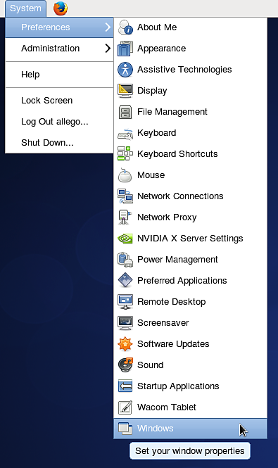

# Impossibile utilizzare la scelta rapida da tastiera ALT su Linux

Se si esegue una distribuzione Linux (**Ubuntu** o **CentOS**) che utilizza **Gnome** come interfaccia utente, è possibile disabilitare il comportamento predefinito del tasto **ALT** per poter navigare nella finestra della vista.

## CentOS

1 - Vai a **Sistema > Windows**

{width="250px"}

2 - Modificare l&#39;impostazione della &quot;chiave di movimento&quot; in un&#39;impostazione diversa da &quot; **Alt** &quot;. Ad esempio, usa &quot; **Super** &quot; (per scegliere il tasto &quot;Windows&quot; della tastiera).

{width="350px"}

## Ubuntu

1 - Apri un terminale ed esegui il comando seguente:

```
sudo apt-get install dconf-tools
```


In questo modo verrà installato uno strumento di configurazione avanzato, potrebbe essere necessario consentire l&#39;installazione di dipendenze aggiuntive per poterlo eseguire.

2 - Apri il menu Start e cerca &quot; **Dconf-tools** &quot;. Lancialo.

3 - Espandete il menu della struttura a sinistra passando alla seguente procedura: **org > gnome > desktop > wm > preferences**

4 - Modificare il &quot;mouse-button-modifier&quot; e modificarne il valore. Impostalo o non impostalo, ma *non lasciarlo vuoto*. Super equivale al tasto &quot;Windows&quot;.

{width="500px"}
