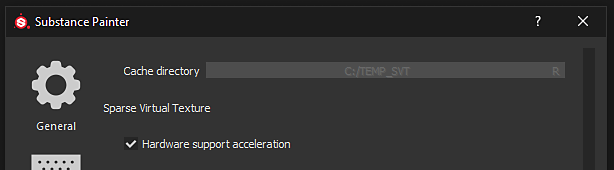

# Gli artefatti a blocchi vengono visualizzati sulle texture nella finestra della vista

A partire dalla versione 2018.3.0, nella finestra della vista possono essere visualizzati i seguenti tipi di artefatti:

{width="400px"}

Questi artefatti sono relativi a problemi con i driver GPU Nvidia.\
Per evitare gli artefatti, è necessario disattivare il supporto hardware Texture virtuali sparse.

I **driver 440.97** GeForce hanno ora **risolto il problema**. Si consiglia di eseguire l&#39;aggiornamento a questi driver e di mantenere l&#39;SVT abilitato per ottenere buone prestazioni.

Nuovi driver disponibili sul sito Web Nvidia: <https://www.nvidia.com/Download/index.aspx>

## Disabilitazione dell&#39;accelerazione hardware delle texture virtuali sparse

### 1 - Avviate Substance 3D Painter e aprite le impostazioni

Apri le Impostazioni principali da Modifica > Impostazioni.

### 2 - Trovate la sezione &quot;Texture virtuali sparse&quot;

Nella sezione &quot;Generale&quot;, scorri verso il basso e trova la sottosezione denominata &quot;Texture virtuali sparse&quot;

### 3 - Deselezionare l’impostazione

Deselezionare l&#39;impostazione &quot;Accelerazione supporto hardware&quot; per disattivarla.

### 4 - Convalidare e riavviare Substance 3D Painter

Per convalidare la modifica, fare clic sul pulsante &quot;OK&quot;.

Riavviate Substance 3D Painter facendo clic sul pulsante &quot;Sì&quot; per applicare la modifica.
