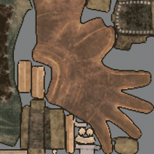
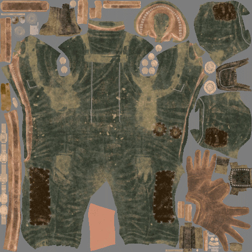

# Dilatazione o imbottitura della texture

Il **riempimento** (a volte chiamato anche **dilatazione**) è un processo che si verifica dopo la generazione di una texture. Il suo scopo è quello di dilatare i bordi delle Isole UV per riempire le aree vuote con pixel simili.

Generare un padding di buona qualità è importante per garantire una buona generazione di [mipmap](../../../getting-started/glossary.md) in seguito da parte dei motori di gioco o dei renderer offline.\
Substance 3D Painter può generare una spaziatura interna infinita: questo significa che un pixel verrà allungato finché non raggiunge un’altra Isola UV o i bordi della texture.

## Generazione di spaziatura interna infinita

Ecco un esempio di come funziona il riempimento infinito:

<table>
<tr style="border: 0;">
<td style="border: 0;" valign="top">

{width="512px"}

</td>
<td style="border: 0;" valign="top">

</td>
</tr>
</table>

## MipMaps

Nella computergrafica 3D, **mipmap** sono sequenze di texture precalcolate e ottimizzate, ognuna delle quali rappresenta la stessa immagine con una risoluzione progressivamente più bassa. che hanno lo scopo di aumentare la velocità di rendering e ridurre gli artefatti di aliasing. Un&#39;immagine mipmap ad alta risoluzione viene utilizzata per gli oggetti vicini alla fotocamera. Le immagini a bassa risoluzione vengono utilizzate quando l’oggetto appare più lontano. Si tratta di un modo efficiente di eseguire il rendering o di leggere tutti i pixel della texture originale. Le mipmap (ogni livello) sono incorporate nella texture stessa (se supportate dal formato di file).

Il riempimento è molto importante per le mipmap in quanto evita che i colori errati sanguinino all&#39;interno degli UV della trama quando si abbassano le risoluzioni della texture.

<table>
<tr style="border: 0;">
<td style="border: 0;" valign="top">

{width="400px"}

</td>
<td style="border: 0;" valign="top">

{width="400px"}

</td>
</tr>
</table>

Nell&#39;esempio sopra, lo sfondo grigio si dissolve negli UV (immagine a destra), mentre con l&#39;imbottitura il colore rimane pulito (immagine a sinistra).

All&#39;interno di un&#39;applicazione 3D questo è il risultato:

## Controlli di riempimento

Substance 3D Painter consente di modificare il comportamento della generazione di spaziatura interna (ad esempio, disattivandola) in diversi punti:

* **Durante la cottura**: per ulteriori informazioni, vedere la [documentazione sulla cottura](../../../baking/baking.md).
* **Durante la generazione di texture per un set di texture**: per ulteriori informazioni, consultate la documentazione relativa alle [impostazioni del set di texture](../../../interface/texture-set/texture-set-settings.md).
* **Durante l&#39;esportazione delle texture**: per ulteriori informazioni, consultate la sezione &quot;Impostazioni di riempimento&quot; della documentazione [Impostazioni di esportazione](../../../export/export-window/export-window.md).
