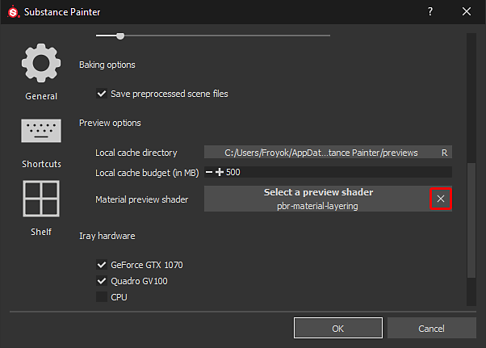

# Le miniature sullo scaffale sembrano errate

Se le miniature sullo scaffale sembrano essere diverse da quelle abituali, è possibile che il rendering delle anteprime venga eseguito con uno shader diverso.

| Miniature interrotte | Miniature normali |
| --- | --- |
| 

 | 

 |

## 1 - Aprire la finestra delle impostazioni principali

Vai a **Modifica** e fai clic su **Impostazioni**:

## 2 - Rimuovere lo shader di anteprima Ripiano

Nella vista **Generale** scorrete verso il basso fino a visualizzare la sezione &quot;Opzioni anteprima&quot;.\
Fare clic sul pulsante **croce** davanti a &quot; **Shader di anteprime materiali** &quot; per rimuovere lo shader corrente specificato.

{width="450px"}

## 3 - Riavviare Substance 3D Painter

Per rigenerare le miniature e renderle visibili correttamente, è necessario riavviare Substance 3D Painter.
